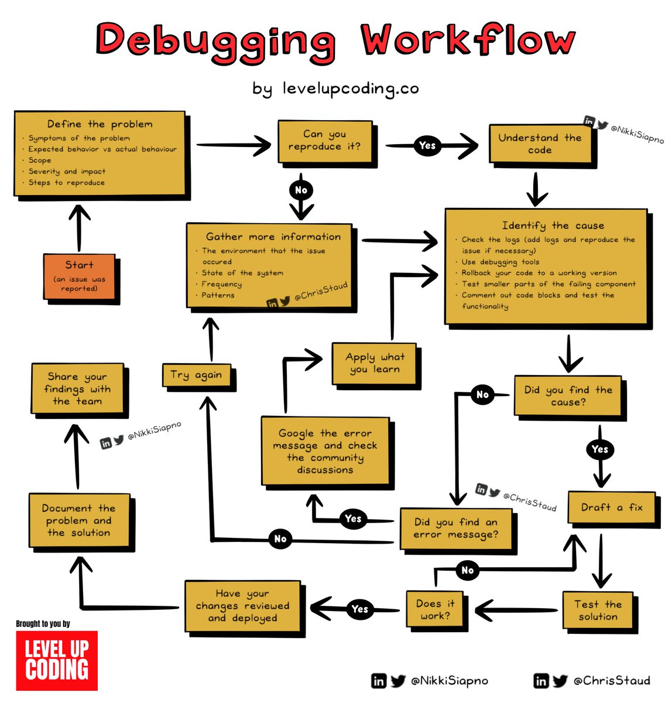
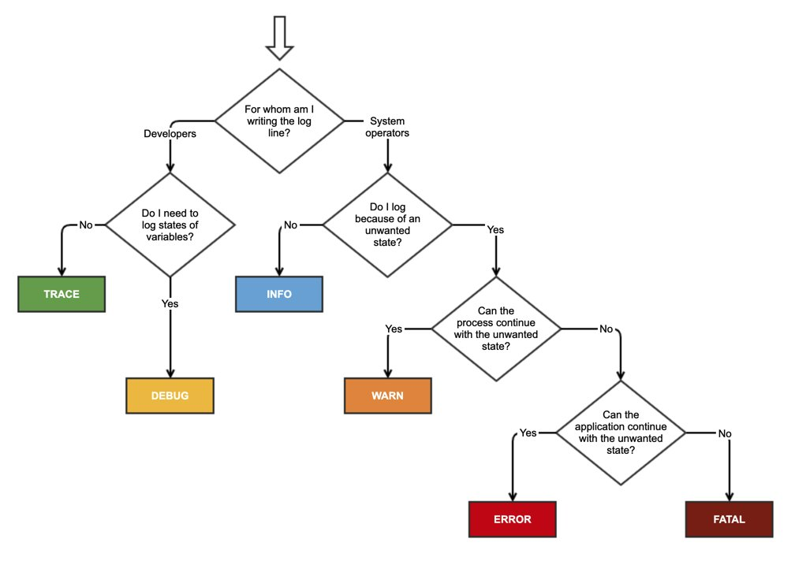

# Behavior Question
  
## BQ 概况
BQ 的重点不是技术能力（所以不要错误地堆砌技术细节或专挑高难度的项目），而是应该关注其真实考核目的：比如评判你在一个比较特殊的情况你会怎么处理事情、了解你的抗压性跟处理事情的能力。项目本身的难度以及技术是否高级不重要，更重要的是用什么态度、方式、技巧、跟沟通协调能力去把这件事情做好。  
BQ 问题来来去去就是那些，准备多了背熟就会越练越好，核心关注点就是：  
* 冲突管理
* 失败案例
* [时间管理](https://en.wikipedia.org/wiki/Time_management)
* 团队合作
  * 适应能力
  * 沟通能力
  * 协调能力

另外还需要注意 BQ 回答时的时间管理控制，不要超时或过短，否则会落下时间管理不善的印象。  

* [彻底击碎行为问题](https://docs.google.com/document/d/112HBiMNvu6TYbDUOfVRe_MS4A-fKaWYrpMlmnsiMNiA/edit#heading=h.bmwacy4ylksh)
* [Tech Interview Handbook](https://www.techinterviewhandbook.org/behavioral-interview/)
* [如何高效准备 BQ 面试](https://www.youtube.com/watch?v=-xUHMCXxu8w)
* [TOP 10 BEHAVIORAL Interview Questions with Answers](https://www.youtube.com/watch?v=khbR_qvOF5g)
* [充满陷阱的 Behavior Question：谈谈你没有按时完成项目的经历](https://zhuanlan.zhihu.com/p/65345319)  

  
  
以上参考：  
* https://www.youtube.com/watch?v=opTHQMqQcvc  
* https://www.youtube.com/watch?v=-xUHMCXxu8w  
* https://www.youtube.com/watch?v=hU6BVxtGd5g  
* https://www.youtube.com/watch?v=0xKLVJuBRCU  
  
## 回答策略
`STARL 结构/模版` - Situation, Task, Action, Results, Learn（通常正向问题及经验可以跳过 L，负面问题及经验要添加 L）  
Keep at least 3 project examples/stories which better to be large scale.  

* [如何描述 Work Experience 和 Project Experience](https://www.youtube.com/watch?v=WSoN8ZMiXTc)
* [项目介绍示例](https://interview-science.org/%E5%B8%B8%E8%A7%84%E5%86%85%E5%AE%B9/%E9%A1%B9%E7%9B%AE%E4%BB%8B%E7%BB%8D%E7%A4%BA%E4%BE%8B)
  
## 项目讨论的框架
* Context: 简要描述项目背景，为什么要做，意义和影响何在。让面试官快速了解。
* Action: 你在这个项目中做了什么，贡献是什么。
* Result: 项目的结果，失败的项目也可以讲，在这个项目中学到了什么，得到了什么样的成长。  
  
简历中提到的技术一定要熟悉。站在面试官的角度问自己会问自己什么问题。  
最近做的 / 最喜欢的 / 最具挑战性的项目是什么，不只是要把项目背景说出来，还要说出为什么喜欢，有哪些挑战，推理过程。  
  
## 各公司的特点
* Amazon
  * [Leadership Principles](https://www.amazon.jobs/en/principles)
  * 3 Main Product interest Amazon: AWS、Digital Product、Retailer
* Stripe
  * [Search and Quick Use, Trace and Real Problem Solve Skill](https://medium.com/@SantalTech/no-leetcode-the-stripe-interview-experience-cf1b29e6f55d)  

## ChatGPT 列出的 team leader 最重要的 leadership skills
* Technical expertise
* Communication
* Empathy and emotional intelligence
* Problem-solving
* Decision-making
* Delegation
* Collaboration and teamwork
* Adaptability and flexibility
* Coaching and mentorship and continuous self-improvement
* Vision and goal setting

  

# 思维工具
* [六西格玛](https://zh.wikipedia.org/zh-hans/%E5%85%AD%E6%A8%99%E6%BA%96%E5%B7%AE)
* [Untools: Tools for better thinking](./untools.md)
  * Systems Thinking
  * Decision Making
  * Problem Solving
  * Communication
* [SOP: Standard Operating Procedures 标准作业程序](https://wiki.mbalib.com/wiki/SOP)

# Best Practice 工作实践
* [软件复杂度](./软件复杂度.md)
* [降低软件复杂性一般原则和方法](./降低软件复杂性一般原则和方法.md)
* [后端复杂问题](./后端复杂问题.md)
* [框架](./框架.md)
* [架构](./架构.md)
* 问题解决软技能 [[1]](https://medium.com/@SantalTech/no-leetcode-the-stripe-interview-experience-cf1b29e6f55d),[[2]](https://plantegg.github.io/2018/05/24/%E5%A6%82%E4%BD%95%E5%9C%A8%E5%B7%A5%E4%BD%9C%E4%B8%AD%E5%AD%A6%E4%B9%A0V1.1/)
* [反面模式](./反面模式.md)

# 自我介绍
应该在 1 分钟之内完成，不超过 2 分钟。  

* [软件工程师的自我介绍](https://www.indeed.com/career-advice/interviewing/tell-me-about-yourself-software-engineer)
  * 在提问中围绕该职位讨论
  * 你的独特性
  * 从概述开始
  * 提及之前的职业亮点
  * 举例说明
  * 总结你未来的目标
* [软件工程师面试：打造完美的自我介绍](https://www.techinterviewhandbook.org/self-introduction/)

例子 1：  
你好，我是 XXX，我于 2015 年毕业于新加坡国立大学，获得计算机科学学位。我的兴趣是前端工程，我喜欢创造具有令人愉悦的用户体验的精美高性能产品。  
我之前在 XX 工作，领导了 XX 项目。XX 项目是为公司提供的一项服务，旨在方便公司的 XXX。公司可以创建员工群组、制定 XX 政策并与员工共享公司支付方式。在 X 个月的时间里，我与另一位工程师在 React/Redux 和 Golang 堆栈上构建了这个项目。  
我对 XXX 的前端工程师职位很感兴趣，因为我喜欢在这个 XX 领域工作并创造产品来改善用户的生活。  

例子 2：  
我在过去整个 xx 年的职业生涯中都从事软件工程工作，对批判性思维的承诺和对细节的关注使我走到了今天的位置：XXX 公司的高级软件工程师。我对流程充满热情，而且我是一位经验丰富的团队领导者，通常在任何给定时间管理 X 名开发人员。  
在担任高级职位之前，我曾担任 XXX 公司的软件工程师和 XXX 公司/项目的程序员。因为我已经担任过该领域的所有其他职位，所以我对成功开展项目的条件有着敏锐的洞察力。我的职业目标是作为 CTO 进入管理层，我知道这个角色会帮助我磨练我的领导技能。  

# [个人品牌](https://wiki.mbalib.com/wiki/%E4%B8%AA%E4%BA%BA%E5%93%81%E7%89%8C)

# 软技能
* [Improving Communication Skills](https://www.coursera.org/learn/wharton-communication-skills)
* [Creative Thinking: Techniques and Tools for Success](https://www.coursera.org/learn/creative-thinking-techniques-and-tools-for-success)
* [Communication For Everyone Specialization](https://www.coursera.org/specializations/communicationforeveryone)
* [Learning How to Learn: Powerful mental tools to help you master tough subjects](https://www.coursera.org/learn/learning-how-to-learn)
* [People and Soft Skills for Professional and Personal Success](https://www.coursera.org/specializations/people-and-soft-skills-for-professional-success)
* [Improve Your English Communication Skills Specialization](https://www.coursera.org/specializations/improve-english)
* [Teamwork Skills: Communicating Effectively in Groups](https://www.coursera.org/learn/teamwork-skills-effective-communication)
* [Developing Interpersonal Skills](https://www.coursera.org/learn/interpersonal-skills)

# Debugging Workflow
  

# Code Review
  

# 日志打印最佳实践
  

# 系统工程（系统科学内容之一）
* [What is systems engineering](https://www.freecodecamp.org/news/what-is-systems-engineering/)
* [系统工程 wiki](https://zh.wikipedia.org/zh-hans/%E7%B3%BB%E7%BB%9F%E5%B7%A5%E7%A8%8B)

# 例题

Behavioral Question Set

Ref: https://www.pramp.com/  

Tell me a bit about your professional experience in 2-3 minutes.  
* This question will allow you to get an initial sense of your peer’s experience.  
* Feel free to ask follow-up questions, for instance, can you elaborate a bit more on your experience with [specific technology] or your responsibilities at [company]? You can also use this opportunity to ask the candidate which of their experiences had the greatest impact on them.  

What are you looking for in your next role?  
* This is an opportunity to get insight into whether a candidate would be a good culture fit for your company. Is the candidate looking for a company of your size? Do their expectations match the role?

What’s an example of a difficult problem you solved? Be specific about how the problem was diagnosed and your process for approaching it.
* Owner vs participant: Many candidates will claim they led a big project or created significant impact, but if you dig deeper, you’ll find that the candidate only played a participatory role or was involved in just one facet of the project. As an interviewer, it’s your role to uncover the truth. Follow-up questions asking about who was involved, what the candidate personally did, and how they did it will help you make an informed decision about the candidate’s true impact.
* Good vs great achievements: Many candidates are good at quantifying their achievements, but you’ll want to know how big of an impact this achievement actually had. Was it a minor success or did it have a significant impact? Were the results due to the candidate’s impact, or would those results have likely occurred without their involvement? You may consider asking follow-up questions here too: try to drill down into the baseline metrics used, such as “What were the projected metrics had you not made this decision?”

What’s an example of when you demonstrated leadership or ownership?
* Owner vs participant: Many candidates will claim they led a big project or created significant impact, but if you dig deeper, you’ll find that the candidate only played a participatory role or was involved in just one facet of the project. As an interviewer, it’s your role to uncover the truth. Follow-up questions asking about who was involved, what the candidate personally did, and how they did it will help you make an informed decision about the candidate’s true impact.

Tell me about a challenging interaction with a team member. How do you handle disagreements with coworkers?
* This question is about teamwork and influence. You want to dig into the candidate’s ability to reason and listen to a fellow teammate, navigate a difference of opinion, and ultimately, show how they resolved the disagreement.

Apart from professional knowledge, what did you learn in your last role?
* This question is testing several things: (1) the candidate’s interest in learning outside their specific domain; (2) the candidate’s ability to explain a new subject to a lay audience; and (3) the candidate’s self-reflectiveness and growth mindset.

 

# 开源软件
* [知识共享许可协议](https://zh.wikipedia.org/zh-hans/%E7%9F%A5%E8%AF%86%E5%85%B1%E4%BA%AB%E8%AE%B8%E5%8F%AF%E5%8D%8F%E8%AE%AE)
