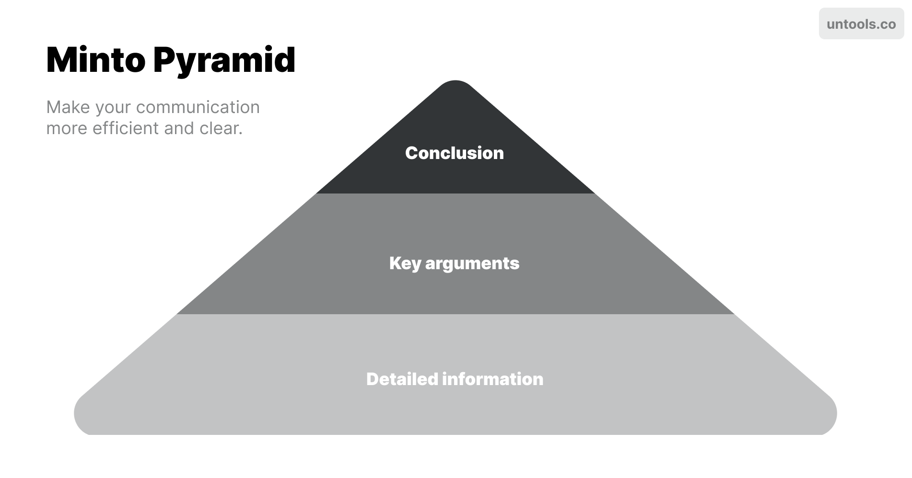

# Untool

## Minto Pyramid
使用 Minto Pyramid 为沟通提供自上而下的结构，并快速清晰地传达您的信息。以结论开头，然后提供关键论点，最后用详细信息支持它们。  
  
例子：  
  

https://untools.co/minto-pyramid  

## Situation-Behavior-Impact
当我们消极地看待某人的行为时，我们经常会草率地得出结论并假设某人为什么会这样做。在向那个人提供反馈时，很难保持客观。Situation-Behavior-Impact (SBI™) 是创意领导中心开发的一种工具，可帮助您从所提供的反馈中消除判断并使其更清晰。  

这个工具最适合提供负面反馈，因为它可以减少接受者对它的防御，但它也绝对可以用于正面反馈。  

How it works  
SBI™ 提供了几个简单的步骤，您可以沿着这些步骤构建您想要提供的反馈。  

1. 情况 - 从行为发生的情况开始。这有助于使反馈具体化，并且其他人可以更容易地与之联系起来。
2. 行为 - 描述您提供反馈的具体行为。告诉对方他们做了什么或你看到了什么，而不是你对它的解释。这对于将您的判断排除在反馈之外至关重要。
3. 影响 - 解释他们的行为产生了什么样的影响。这可以从您的想法和感受以及原因，到对他人或整个团队的更广泛影响。

Plus: 意图  
有时，您可能想问他们行为背后的意图是什么。他们可能有一个你不知道或与你的假设不同的合理理由。  

这可以极大地帮助解释他们的意图和实际影响之间的差距。  

鼓励反思  
反馈只有在考虑并采取行动时才有用。鼓励对方反思你所说的话，并思考他们将来会如何采取不同的行动。  

如果您询问他们的意图，这可能是讨论更改内容的一个很好的起点。  

