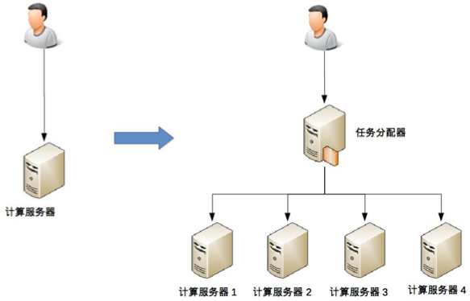
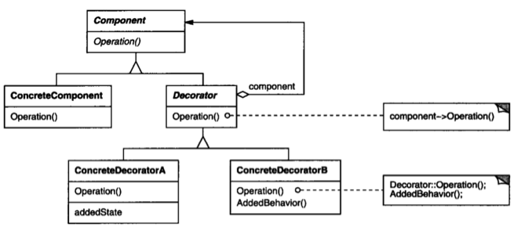

转载自：https://promacanthus.netlify.app/computer-science/architecture/01-%E6%9E%B6%E6%9E%84%E5%A4%8D%E6%9D%82%E5%BA%A6%E4%B8%8E%E4%B8%89%E5%8E%9F%E5%88%99/  

架构设计相关的特性：
* 架构设计的思维和程序设计的思维差异很大。架构设计的关键思维是判断和取舍，程序设计的关键思维是逻辑和实现。  
* 架构设计没有体系化的培训和训练机制。  
* 程序员对架构设计的理解存在很多误区。  

## 0.1. 架构定义
### 0.1.1. 系统与子系统
> 系统泛指由一群有关联的个体组成，根据某种规则运作，能完成个别元件不能单独完成的工作的群体。

* 关联：系统是由一群有关联的个体组成的，没有关联的个体堆在一起不能成为一个系统。  
* 规则：系统内的个体需要按照指定的规则运作，而不是单个个体各自为政。规则规定了系统内个体分工和协作的方式。  
* 能力：系统能力与个体能力有本质的差别，系统能力不是个体能力之和，而是产生了新的能力。  

> 子系统是由一群有关联的个体所组成的系统，多半会是更大系统中的一部分。  

### 0.1.2. 模块与组件
> 软件模块（Module）是一套一致而互相有紧密关连的软件组织。它分别包含了程序和数据结构两部分。现代软件开发往往利用模块作为合成的单位。

模块和组件都是系统的组成部分，只是从不同的角度拆分系统而已。
* 从逻辑的角度来拆分系统后，得到的单元就是“模块”；划分模块的主要目的是职责分离。  
* 从物理的角度来拆分系统后，得到的单元就是“组件”；划分组件的主要目的是单元复用，组件是独立可替换的。  

### 0.1.3. 框架与架构
> 软件框架（Software framework）通常指的是为了实现某个业界标准或完成特定基本任务的软件组件规范，也指为了实现某个软件组件规范时，提供规范所要求之基础功能的软件产品。

1. 框架是组件规范  
2. 框架是提供基础功能的产品  

> 软件架构指软件系统的“基础结构”，创造这些基础结构的准则，以及对这些结构的描述。  

框架（Framework）关注的是“规范”，架构（Architecture）关注的是“结构”。

### 0.1.4. 架构
软件架构指软件系统的顶层结构。
* 架构是顶层设计；  
* 框架是面向编程或配置的半成品；  
* 组件是从技术维度上的复用；  
* 模块是从业务维度上职责的划分；  
* 系统是相互协同可运行的实体。  

## 0.2. 架构的目的
### 0.2.1. 架构设计的误区
* 因为架构很重要，所以要做架构设计  
* 不是每个系统都要做架构设计吗  
* 公司流程要求系统开发过程中必须有架构设计  
* 为了高性能、高可用、可扩展，所以要做架构设计  

### 0.2.2. 架构设计的真正目的
整个软件技术发展的历史，其实就是一部与“复杂度”斗争的历史。架构也是为了应对软件系统复杂度而提出的一个解决方案，架构设计的主要目的是为了解决软件系统复杂度带来的问题。

架构过程：
1. 通过熟悉和理解需求，识别系统复杂性所在的地方，然后针对这些复杂点进行架构设计。  
2. 架构设计并不是要面面俱到，不需要每个架构都具备高性能、高可用、高扩展等特点，而是要识别出复杂点然后有针对性地解决问题。  
3. 理解每个架构方案背后所需要解决的复杂点，然后才能对比自己的业务复杂点，参考复杂点相似的方案。  

复杂度的六个来源：
* 高性能
* 高可用
* 可扩展性
* 低成本
* 安全
* 规模  

## 0.3. 高性能
软件系统中高性能带来的复杂度主要体现在两方面：

* 一方面是单台计算机内部为了高性能带来的复杂度；  
* 一方面是多台计算机集群为了高性能带来的复杂度。  

### 0.3.1. 单机复杂度
计算机内部复杂度最关键的地方就是操作系统，计算机性能的发展本质上是由硬件发展驱动的，尤其是 CPU 的性能发展。而将硬件性能充分发挥出来的关键就是操作系统，所以操作系统本身也是随硬件的发展而发展的，操作系统是软件系统的运行环境，操作系统的复杂度直接决定了软件系统的复杂度。

操作系统和性能最相关的就是进程和线程。
* 进程：用进程来对应一个操作系统执行的任务，每个任务都有自己独立的内存空间，进程间互不相关，由操作系统来进行调度。
* 多进程：为了达到多进程并行运行的目的，采取了分时的方式，即把 CPU 的时间分成很多片段，每个片段只能执行某个进程中的指令。
* 进程间通信：为了解决进程在运行时相互通信的问题，进程间通信的各种方式被设计出来了，包括管道、消息队列、信号量、共享存储等。
* 多线程：多进程让多任务能够并行处理任务，但本身还有缺点，单个进程内部只能串行处理，而实际上很多进程内部的子任务并不要求是严格按照时间顺序来执行的，也需要并行处理。为了解决这个问题发明了线程，线程是进程内部的子任务，但这些子任务都共享同一份进程数据。为了保证数据的正确性，又发明了互斥锁机制。有了多线程后，操作系统调度的最小单位就变成了线程，而进程变成了操作系统分配资源的最小单位。
* 多核处理器：多进程多线程虽然让多任务并行处理的性能大大提升，但本质上还是分时系统，并不能做到时间上真正的并行。解决这个问题的方式显而易见，就是让多个 CPU 能够同时执行计算任务，从而实现真正意义上的多任务并行。

> 目前这样的解决方案有 3 种：
> * SMP（Symmetric Multi-Processor，对称多处理器结构），最常见，主流的多核处理器方案
> * NUMA（Non-Uniform Memory Access，非一致存储访问结构）
> * MPP（Massive Parallel Processing，海量并行处理结构）

操作系统发展到现在，如果要完成一个高性能的软件系统，需要考虑如多进程、多线程、进程间通信、多线程并发等技术点，而且这些技术并不是最新的就是最好的，也不是非此即彼的选择。

在做架构设计的时候，需要花费很大的精力来结合业务进行分析、判断、选择、组合，这个过程同样很复杂。例如，下面的系统都实现了高性能，但是内部实现差异很大：
* Nginx 可以用多进程也可以用多线程
* JBoss 采用的是多线程
* Redis 采用的是单进程
* Memcache 采用的是多线程  

### 0.3.2. 集群复杂度
让多台机器配合起来达到高性能的目的，是一个复杂的任务，常见的方式有：
* 任务分配：每台机器都可以处理完整的业务任务，不同的任务分配到不同的机器上执行。  
* 任务分解：业务越来越复杂，单台机器处理的性能会越来越低。为了能够继续提升性能，采用任务分解。  

> 任务可以指完整的业务处理，也可以指某个具体的任务。  

#### 0.3.2.1. 任务分配
  
* 增加一个任务分配器，可以是硬件（F5、交换机）、软件（LVS）、负载均衡软件（Nginx、HAProxy）、自己开发的系统。  
* 任务分配器与业务服务器之间的连接和交互。  
* 任务分配器增加分配算法（轮询、权重、负载）。  

业务量继续提升，需要增加任务分配器的数量。  

  
* 任务分配器增加为多台，这样需要将不同的用户请求分配到不同的任务分配器上（DNS轮询、智能DNS、CDN、GSLB全局负载均衡）。  
* 任务分配器和业务服务器之间从一对多变成多对多的网状结构。  
* 业务服务器继续扩增，状态管理和故障处理复杂度更大。  

#### 0.3.2.2. 任务分解
微服务架构。  

通过任务分配的方式，能够突破单台机器处理性能的瓶颈，通过增加更多的机器来满足业务的性能需求，但如果业务本身也越来越复杂，单纯只通过任务分配的方式来扩展性能，收益会越来越低。  

  
通过这种任务分解的方式，能够把原来大一统但复杂的业务系统，拆分成小而简单但需要多个系统配合的业务系统。从业务的角度来看，任务分解既不会减少功能，也不会减少代码量（事实上代码量可能还会增加，因为从代码内部调用改为通过服务器之间的接口调用），任务分解能够提升性能的主要原因是：  
* 简单的系统更容易做到高性能：系统的功能越简单，影响性能的点就越少，就更加容易进行有针对性的优化。
* 可以针对单个任务进行扩展：当各个逻辑任务分解到独立的子系统后，整个系统的性能瓶颈更加容易发现，而且发现后只需要针对有瓶颈的子系统进行性能优化或者提升，不需要改动整个系统，风险会小很多。

**最终决定业务处理性能的还是业务逻辑本身，业务逻辑本身没有发生大的变化下，理论上的性能是有一个上限的，系统拆分能够让性能逼近这个极限，但无法突破这个极限**。因此，任务分解带来的性能收益是有一个度的，并不是任务分解越细越好，而对于架构设计来说，如何把握这个粒度就非常关键了。

## 0.4. 高可用
> 系统无中断地执行其功能的能力，代表系统的可用性程度，是进行系统设计时的准则之一。

本质上都是通过“冗余”来实现高可用。高可用的“冗余”解决方案，单纯从形式上来看，和高性能是一样的，都是通过增加更多机器来达到目的，但其实本质上是有根本区别的：**高性能增加机器目的在于“扩展”处理性能；高可用增加机器目的在于“冗余”处理单元**。  

通过冗余增强了可用性，但同时也带来了复杂性。

### 0.4.1. 计算高可用
计算的特点是无论从哪台机器上进行计算，同样的算法和输入数据，产出的结果都是一样的，所以将计算从一台机器迁移到另一台对业务没有影响。

  

* 需要增加一个任务分配器  
* 任务分配器和真正的业务服务器之间有连接和交互  
* 任务分配器需要增加分配算法（主备【冷备、温备、热备】、主主、多主多倍【2主2备、4主0备】）  

### 0.4.2. 存储高可用
对于需要存储数据的系统来说，整个系统的高可用设计关键点和难点就在于“存储高可用”。存储与计算相比，有一个本质上的区别：**将数据从一台机器搬到到另一台机器，需要经过线路进行传输**。

线路的传输是有延迟的，速度在毫秒级别，距离越长延迟越高，各种异常情况（传输中断、丢包、拥塞）会导致延迟更高，对于高可用系统来说，意味着整个系统在某个时间点撒谎嗯，数据肯定是不一致的。。按照“**数据 + 逻辑 = 业务**”这个公式来套的话，数据不一致，即使逻辑一致，最后的业务表现就不一样了。

如果完全不做冗余，系统的整体高可用又无法保证，所以**存储高可用的难点不在于如何备份数据，而在于如何减少或者规避数据不一致对业务造成的影响**。

> 分布式领域中著名的 CAP 定理，从理论上论证了存储高可用的复杂度。存储高可用不可能同时满足“一致性、可用性、分区容错性”，最多满足其中两个，这就要求我们在做架构设计时结合业务进行取舍。

### 0.4.3. 高可用状态决策
无论是计算高可用还是存储高可用，其基础都是“状态决策”，即系统需要能够判断当前的状态是正常还是异常，如果出现了异常就要采取行动来保证高可用。

如果状态决策本身都有错误或有偏差，那么后续的任何行动和处理都没有意义，**但是通过冗余来实现的高可用系统，状态决策本质上不可能做到完全正确**。

常见的几种决策方式包括：
* 独裁式
* 协商式
* 民主式

#### 0.4.3.1. 独裁式
存在一个独立的决策主体，称为“决策者”，负责收集信息然后进行决策；所有冗余的个体，称为“上报者”，都将状态信息发送给决策者。

独裁式的决策方式不会出现决策混乱的问题，因为只有一个决策者，但是当决策者本身故障时，整个系统就无法实现准确的状态决策。如果决策者本身又做一套状态决策，那就陷入一个递归的死循环了。

#### 0.4.3.2. 协商式
两个独立的个体通过交流信息，然后根据规则进行决策，最常用的协商式决策就是主备决策。这个架构的基本协商规则可以设计成：
1. 2 台服务器启动时都是备机。  
2. 2 台服务器建立连接。  
3. 2 台服务器交换状态信息。  
4. 某 1 台服务器做出决策，成为主机；  
5. 另一台服务器继续保持备机身份。  

协商式决策的架构不复杂，规则也不复杂，其难点在于，如果两者的信息交换出现问题（比如主备连接中断），此时状态决策应该怎么做。  
* 如果备机在连接中断的情况下认为主机故障，则备机需要升级为主机，但实际上此时主机并没有故障，那么系统就出现了两个主机  
* 如果备机在连接中断的情况下不认为主机故障，则此时如果主机真的发生故障，那么系统就没有主机了  
* 如果为了规避连接中断对状态决策带来的影响，可以增加更多的连接（双连接、三连接），这样可以降低连接中断带来的影响，但不能彻底解决，同时会引入多条连接信息（连接之间传递的信息不同）之间的取舍问题，这个问题无解  

**协商式状态决策在某些场景总是存在一些问题的。**  

#### 0.4.3.3. 民主式
多个独立的个体通过投票的方式来进行状态决策。

民主式决策和协商式决策比较类似，其基础都是独立的个体之间交换信息，每个个体做出自己的决策，然后按照“多数取胜”的规则来确定最终的状态。不同点在于民主式决策比协商式决策要复杂得多，ZooKeeper 的选举算法 Paxos，绝大部分人都看得云里雾里，更不用说用代码来实现这套算法了。除了算法复杂，民主式决策还有一个固有的缺陷：脑裂。

> 脑裂的根本原因是，原来统一的集群因为连接中断，造成了两个独立分隔的子集群，每个子集群单独进行选举，于是选出了 2 个主机。

为了解决脑裂问题，民主式决策的系统一般都采用“投票节点数必须超过系统总节点数一半”规则来处理。这种方式虽然解决了脑裂问题，但同时降低了系统整体的可用性，系统因为节点故障导致存活节点数少于一半，此时系统不会选出主节点，整个系统就相当于宕机了，尽管此时仍然有正常运行的节点。

## 0.5. 可扩展性
可扩展性指系统为了应对将来需求变化而提供的一种扩展能力，当有新的需求出现时，系统不需要或者仅需要少量修改就可以支持，无须整个系统重构或者重建。

在软件开发领域，面向对象思想的提出，就是为了解决可扩展性带来的问题；设计模式更是将可扩展性做到了极致。

设计具备良好可扩展性的系统，有两个基本条件：
* 正确预测变化
* 完美封装变化

### 0.5.1. 预测变化
“唯一不变的是变化”，按照这个标准衡量，架构师每个设计方案都要考虑可扩展性。预测变化的复杂性在于：
* 不能每个设计点都考虑可扩展性
* 不能完全不考虑扩展性
* 所有的预测都存在出错的可能性

如何把握预测的程度和提升预测结果的准确性，是一件很复杂的事情，而且没有通用的标准，更多是靠经验、直觉。

### 0.5.2. 应对变化
预测变化是一回事，采取什么方案来应对变化，又是另外一个复杂的事情。即使预测很准确，如果方案不合适，则系统扩展一样很麻烦。

> 微服务架构中的各层进行封装和隔离也是一种应对变化的解决方式。

#### 0.5.2.1. 变化层VS稳定层
第一种应对变化的常见方案是**将“变化”封装在一个“变化层”，将不变的部分封装在一个独立的“稳定层”**。

无论是变化层依赖稳定层，还是稳定层依赖变化层都是可以的，需要根据具体业务情况来设计。

无论采取哪种形式，通过剥离变化层和稳定层的方式应对变化，都会带来两个主要的复杂性相关的问题。

1. 系统需要拆分出变化层和稳定层（如何拆分）  
2. 需要设计变化层和稳定层之间的接口（稳定层接口越稳定越好，变化层接口从差异中找到共同点）  

#### 0.5.2.2. 抽象层VS实现层
第二种常见的应对变化的方案是**提炼出一个“抽象层”和一个“实现层”**。

抽象层是稳定的，实现层可以根据具体业务需要定制开发，当加入新的功能时，只需要增加新的实现，无须修改抽象层。这种方案典型的实践就是设计模式和规则引擎。

以设计模式的“装饰者”模式来分析，下面是装饰者模式的类关系图。

  

图中的 Component 和 Decorator 就是抽象出来的规则，这个规则包括几部分:
1. Component 和 Decorator 类。  
2. Decorator 类继承 Component 类。  
3. Decorator 类聚合了 Component 类。  

这个规则一旦抽象出来后就固定了，不能轻易修改。  

规则引擎和设计模式类似，都是通过灵活的设计来达到可扩展的目的，但“灵活的设计”本身就是一件复杂的事情。

## 0.6. 低成本、安全、规模
### 0.6.1. 低成本
* 当架构方案涉及几台或者十几台服务器时，一般情况下成本并不是重点关注的目标，  
* 当架构方案涉及几百上千甚至上万台服务器时，成本就会变成一个非常重要的架构设计考虑点。  

设计“高性能”“高可用”的架构时，通用的手段都是增加更多服务器；而低成本则需要减少服务器的数量才能达成低成本的目标。  

低成本本质上是与高性能和高可用冲突的，低成本很多时候不是架构设计的首要目标，而是架构设计的附加约束。  

1. 设定一个成本目标，  
2. 根据高性能、高可用的要求设计方案，  
3. 评估方案是否能满足成本目标，  
4. 如果不行，重新设计架构；  
5. 如果无论如何都无法设计出满足成本要求的方案，那只能找老板调整成本目标了。  

低成本给架构设计带来的主要复杂度体现在，**往往只有“创新”才能达到低成本目标**。  

> 这里的“创新”既包括开创一个全新的技术领域，也包括引入新技术，如果没有找到能够解决自己问题的新技术，那么就真的需要自己创造新技术了。  
> 
> 新技术的例子：
> * NoSQL（Memcache、Redis 等）为了解决关系型数据库无法应对高并发访问带来的访问压力。
> * 全文搜索引擎（Sphinx、Elasticsearch、Solr）为了解决关系型数据库 like 搜索的低效的问题。
> * Hadoop 为了解决传统文件系统无法应对海量数据存储和计算的问题。
> 
> 业界的例子：
> * Facebook解决PHP低效问题，研发HipHop PHP（将 PHP 语言翻译为 C++ 语言执行）、HHVM（将 PHP 翻译为字节码然后由虚拟机执行）。
> * 新浪微博将传统的 Redis/MC + MySQL 方式，扩展为 Redis/MC + SSD Cache + MySQL 方式，SSD Cache 作为 L2 缓存使用，既解决了 MC/Redis 成本过高，容量小的问题，也解决了穿透 DB 带来的数据库访问压力。
> * Linkedin 为了处理每天 5 千亿的事件，开发了高效的 Kafka 消息系统。
> * Ruby on Rails 改为 Java。
> * Lua + redis 改为 Go 语言实现。

* 引入新技术的主要复杂度在于需要去熟悉新技术，并且将新技术与已有技术结合起来（小公司引入新技术达到低成本）  
* 创造新技术的主要复杂度在于需要自己去创造全新的理念和技术，并且新技术跟旧技术相比，需要有质的飞跃（大公司创造新技术达到低成本）  

### 0.6.2. 安全
从技术的角度来讲，安全可以分为两类：
* 一类是功能上的安全，
* 一类是架构上的安全。

#### 0.6.2.1. 功能安全
常见的 XSS 攻击、CSRF 攻击、SQL 注入、Windows 漏洞、密码破解等，本质上是因为系统实现有漏洞，黑客有了可乘之机，功能安全其实就是“防小偷”。

从实现的角度来看，功能安全更多地是和具体的编码相关，与架构关系不大。开发框架会内嵌常见的安全功能，但是开发框架本身也可能存在安全漏洞和风险。

所以**功能安全是一个逐步完善的过程**，而且往往都是在问题出现后才能有针对性的提出解决方案，我们永远无法预测系统下一个漏洞在哪里，也不敢说自己的系统肯定没有任何问题。

换句话讲，功能安全其实也是一个“攻”与“防”的矛盾，只能在这种攻防大战中逐步完善，不可能在系统架构设计的时候一劳永逸地解决。

#### 0.6.2.2. 架构安全
如果说功能安全是“防小偷”，那么架构安全就是“防强盗”。

架构设计时需要特别关注架构安全，尤其是互联网时代，理论上来说系统部署在互联网上时，全球任何地方都可以发起攻击。

传统的架构安全主要依靠防火墙，防火墙最基本的功能就是隔离网络，通过将网络划分成不同的区域，制定出不同区域之间的访问控制策略来控制不同信任程度区域间传送的数据流。

> 防火墙的功能虽然强大，但性能一般，所以在传统的银行和企业应用领域应用较多。但在互联网领域，防火墙的应用场景并不多。

互联网系统的架构安全目前并没有太好的设计手段来实现，更多地是依靠运营商或者云服务商强大的带宽和流量清洗的能力，较少自己来设计和实现。

### 0.6.3. 规模
规模带来复杂度的主要原因就是“量变引起质变”，当数量超过一定的阈值后，复杂度会发生质的变化。常见的规模带来的复杂度有：
* 功能越来越多，系统复杂度指数级上升
* 数据越来越多，系统复杂度发生质变（以 MySQL 为例，单表的数据因不同的业务和应用场景有不同的最优值，但都有一定的限度，一般推荐在 5000 万行左右。）

## 0.7. 架构设计三原则
对于编程来说，本质上是确定的，对于架构来说，本质上是不确定的。相比编程来说，架构设计并没有像编程语言那样的语法来进行约束，更多的时候是面对多种可能性时进行选择。

**合适原则、简单原则、演化原则**，架构设计时遵循这几个原则，有助于做出最好的选择。

### 0.7.1. 合适原则
合适优于业界领先。

* 没那么多人，却想干那么多活，是失败的第一个主要原因。  
* 没有那么多积累，却想一步登天，是失败的第二个主要原因。  
* 没有那么卓越的业务场景，却幻想灵光一闪成为天才，是失败的第三个主要原因。  

真正优秀的架构都是在企业当前人力、条件、业务等各种约束下设计出来的，能够合理地将资源整合在一起并发挥出最大功效，并且能够快速落地。  

### 0.7.2. 简单原则
简单优于复杂。

“复杂”在制造领域代表先进，在建筑领域代表领先，但在软件领域，却恰恰相反，代表的是“问题”。软件领域的复杂性体现在两个方面：
* 结构的复杂性：组件数量更多，同时组件之间的关系更加复杂。组件越多，就越有可能其中某个组件出现故障，某个组件改动，会影响关联的所有组件，定位一个复杂系统中的问题总是比简单系统更加困难。  
* 逻辑的复杂性：组件虽少，但是单个组件承担了太多的功能，采用了复杂的算法，难以理解，进而导致难以实现、难以修改，并且出了问题难以快速解决。  

架构设计时如果简单的方案和复杂的方案都可以满足需求，最好选择简单的方案，遵循KISS（Keep It Simple，Stupid！）原则进行架构设计。  

### 0.7.3. 演化原则
演化优于一步到位。

从和目的、主题、材料和结构的联系上来说，软件架构可以和建筑物的架构相比拟。然而，字面意思上的相似性却掩盖了一个本质上的差异：建筑一旦完成（甚至一旦开建）就不可再变，而软件却需要根据业务的发展不断地变化！

对于建筑来说，永恒是主题；而对于软件来说，变化才是主题，软件架构需要根据业务发展不断变化。软件架构设计更类似于大自然“设计”一个生物，通过演化让生物适应环境，逐步变得更加强大：
1. 首先，生物要适应当时的环境。
2. 其次，生物需要不断地繁殖，将有利的基因传递下去，将不利的基因剔除或者修复。
3. 再次，当环境变化时，生物要能够快速改变以适应环境变化；如果生物无法调整就被自然淘汰；新的生物会保留一部分原来被淘汰生物的基因。

软件架构设计同样是类似的过程：
1. 首先，设计出来的架构满足当时的业务需要。
2. 其次，架构不断地在实际应用过程中迭代，保留优秀的设计，修复有缺陷的设计，改正错误的设计，去掉无用的设计，使得架构逐渐完善。
3. 再次，当业务发生变化时，架构要扩展、重构，甚至重写；代码也许会重写，但有价值的经验、教训、逻辑、设计等（类似生物体内的基因）却可以在新架构中延续。

在进行架构设计时应该：
* 认真分析当前业务的特点，
* 明确业务面临的主要问题，
* 设计合理的架构，
* 快速落地以满足业务需要，
* 在运行过程中不断完善架构，不断随着业务演化架构。
