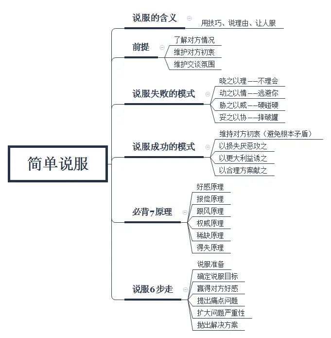
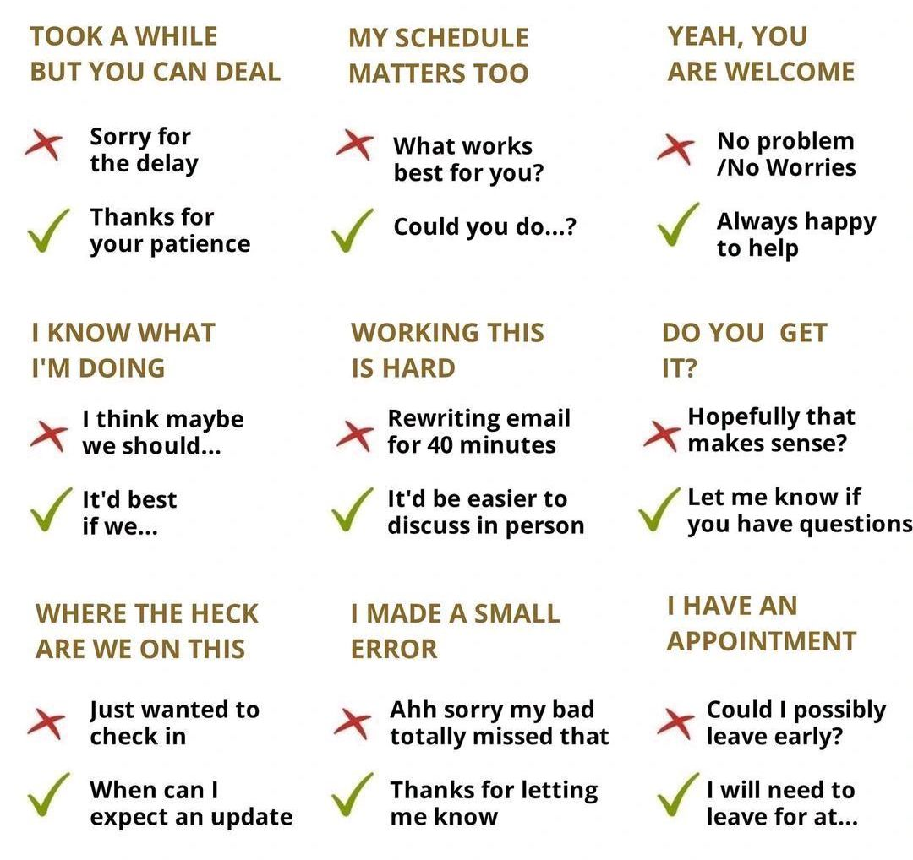

# Behavior Question
## [重点：通识工具小册](https://github.com/yihaoye/organon-fork)  
  
## BQ 概况
BQ 的重点不是技术能力（所以不要错误地堆砌技术细节或专挑高难度的项目），而是应该关注其真实考核目的：比如评判你在一个比较特殊的情况你会怎么处理事情、了解你的抗压性跟处理事情的能力。项目本身的难度以及技术是否高级不重要，更重要的是用什么态度、方式、技巧、跟沟通协调能力去把这件事情做好。  
BQ 问题来来去去就是那些，准备多了背熟就会越练越好，核心关注点就是：  
* 失败案例
* [时间管理](https://en.wikipedia.org/wiki/Time_management)
* 团队合作
  * 适应能力
  * 沟通能力
  * 协调能力
* 冲突管理、压力面试 ([Ref 1](https://36kr.com/p/2878457880564358)、[Ref 2](https://wiki.mbalib.com/wiki/%E5%8E%8B%E5%8A%9B%E9%9D%A2%E8%AF%95))
  * **保持情绪**（最重要，始终不往心里去并保持耐心与韧性，做到已超过 99%，本质是冷酷，牢记双向平等不卑不亢，同时明白情景不做无谓猜测 - 有时是故意设计或无意的压力因此当时气氛并不重要，明白并分割工作与自身评价、生活，不过度投入感情或联想，平时需要训练）
  * 框架方法（警觉并绕开陷阱，关注细节、采取追问等手段确定真实原因、找出重要信息，然后看情况提供折中方案或给予合理解释比如原则、合规、法律、常识，只需要专注于事情与利益本身 - 局部最优妥协、全局最优导向）
    * 加分项 - 找出对方语言或表现中的逻辑漏洞，在稍后的回应中附带指出，可以有效打乱对方阵脚同时为自己争取更好的主动权和士气

另外还需要注意 BQ 回答时的时间管理控制，不要超时或过短，否则会落下时间管理不善的印象。  

* [彻底击碎行为问题](https://docs.google.com/document/d/112HBiMNvu6TYbDUOfVRe_MS4A-fKaWYrpMlmnsiMNiA/edit#heading=h.bmwacy4ylksh)
* [Tech Interview Handbook](https://www.techinterviewhandbook.org/behavioral-interview/)
* [如何高效准备 BQ 面试](https://www.youtube.com/watch?v=-xUHMCXxu8w)
* [TOP 10 BEHAVIORAL Interview Questions with Answers](https://www.youtube.com/watch?v=khbR_qvOF5g)
* [充满陷阱的 Behavior Question：谈谈你没有按时完成项目的经历](https://zhuanlan.zhihu.com/p/65345319)  

  
  
以上参考：  
* https://www.youtube.com/watch?v=opTHQMqQcvc  
* https://www.youtube.com/watch?v=-xUHMCXxu8w  
* https://www.youtube.com/watch?v=hU6BVxtGd5g  
* https://www.youtube.com/watch?v=0xKLVJuBRCU  
  
## 回答策略
`STARL 结构/模版` - Situation, Task, Action, Results, Learn（通常正向问题及经验可以跳过 L，负面问题及经验要添加 L）  
Keep at least 3 project examples/stories which better to be large scale.  

* [如何描述 Work Experience 和 Project Experience](https://www.youtube.com/watch?v=WSoN8ZMiXTc)
* [项目介绍示例](https://interview-science.org/%E5%B8%B8%E8%A7%84%E5%86%85%E5%AE%B9/%E9%A1%B9%E7%9B%AE%E4%BB%8B%E7%BB%8D%E7%A4%BA%E4%BE%8B)
  
## 项目讨论的框架
* Context: 简要描述项目背景，为什么要做，意义和影响何在。让面试官快速了解。
* Action: 你在这个项目中做了什么，贡献是什么。
* Result: 项目的结果，失败的项目也可以讲，在这个项目中学到了什么，得到了什么样的成长。  
  
简历中提到的技术一定要熟悉。站在面试官的角度问自己会问自己什么问题。  
最近做的 / 最喜欢的 / 最具挑战性的项目是什么，不只是要把项目背景说出来，还要说出为什么喜欢，有哪些挑战，推理过程。  
  
## 各公司的特点
* Amazon
  * [Leadership Principles](https://www.amazon.jobs/en/principles)
* Stripe
  * [Search and Quick Use, Trace and Real Problem Solve Skill](https://medium.com/@SantalTech/no-leetcode-the-stripe-interview-experience-cf1b29e6f55d)
* Netflix
  * [Context, not Control](https://www.linkedin.com/pulse/netflixs-context-control-how-does-work-steve-urban/)

## ChatGPT 列出的 team leader 最重要的 leadership skills
* Technical expertise
* Communication
* Empathy and emotional intelligence
* Problem-solving
* Decision-making
* Delegation
* Collaboration and teamwork
* Adaptability and flexibility
* Coaching and mentorship and continuous self-improvement
* Vision and goal setting

Books:  
* 原子习惯
  * 建立系统，而非目标（[Ref 1](https://www.reddit.com/r/selfimprovement/comments/1c2azfs/systems_not_goals/?tl=zh-hans)、[Ref 2](https://36kr.com/p/1903166793541768)，其实也是 OKR 和 KPI 的区别）
* [Staff Engineer: Leadership Beyond the Management Track](https://staffeng.com/book)
  * 在真正重要（高回报）的事情上努力
    * 尽量少做简单的、低影响的事，也少做低影响、高能见度的工作
    * 停止追逐过去的经验
    * 在有发挥空间和获得注意的地方工作 - 最有效的工作场所是那些对公司重要，但仍有足够发挥空间的地方
    * 一些小的修正也很有用
    * 把一些项目收尾掉
    * 只有你能做到的事
  * 写工程策略 - 工程策略不是指战术层面的写代码方式，而是在较长时间维度（半年~数年）里，团队/组织的工程决策方向和优先级。常涉及的几个方面：技术选型和演进路线（框架、重构、基建演化）、架构蓝图（系统边界划分、解耦）、质量 & 风险控制（SLA、技术债）、工程效能（开发体验、CICD、流程）、资源与优先级平衡（比如短期业务需求 vs 长期技术投资）
  * 技术质量管理
    * 修复那些会立即导致问题的热点
    * 采用已知的提高质量的最佳实践 - 一个好的流程是渐进的，而不是强制的
    * 当代码发生变化时，优先考虑保持质量的支点/关键点 - 软件开发中，一小部分的针对质量的额外投资可以防止未来严重的质量问题和减少未来所需的对质量的投资，最具影响力的三个点是：`接口协议`（其中对外接口又更关键）、`有状态系统`（优先考虑无状态设计，必要时明确状态边界）和`数据模型`，它们都是影响面较广的基础设计，其他开发逻辑和后续扩展都会围绕它们，所以在设计初期或变更时就需要深思熟虑
      * 所以不必纠结（比如代码审核时）一些不重要的技术细节，因为总是有更价值的事情等你做
    * 当组织变动也影响到软件的时候，要匹配技术向量 - Conway 法则
    * 衡量技术质量来指导更深入的投资
    * 组建技术质量团队，为质量创建系统和工具
    * 运行一个质控项目来衡量，跟踪和建立问责制度
  * 与权威（明确的此刻的组织利益方向）保持一致 - 头衔会赋予一种组织上的权威，只不过这种权威是由一个更大的组织权威借给的。授予的东西也可以收回，而能否保持组织权威取决于与能否和授予权威的上级/提供者保持深度一致。（个人认为如果不认同组织利益方向比如出于道德等原因，更好的建议是应该考虑其他组织并重新慎重做出选择）
    * 保持一致，永远不要让上级、经理惊讶
    * 不要被上级惊讶 - 比如有的上级可能沟通偏弱，因此可以主动询问经理是否还有其他需要关注的领域，以及目前的优先事项与上司的优先事项是否一致等等
    * 提供 context
  * 除了主导，也要同时跟进其他人好的推动 - [to lead you have to follow](https://yucliu.gitbook.io/staff-engineer/operating-at-staff/to-lead-you-have-to-follow)
  * 学会永不犯错
    * 最高效的工程师在每次会议中都会以达成共识为目标，了解会议室中各方的需求和观点，并确定需要采取哪些措施才能达成一致。并且每个待办事项都有明确的负责人。
    * 找到了一种既不犯错又不占据主导地位的方法。坚持正确，同时为他人留出空间。
    * 倾听沟通练习的机会无处不在。文档上的每条评论都是一个机会。每次会议都是一个机会。每个 PR 都是一个机会。
    * 对付不合作的同事最有效的两种方法是：
      * 在会议中包括一些他们不能欺负的人（比如他们的经理或首席技术官）
      * 在会议之前投入大量精力与他们协调，这样他们就会觉得自己被倾听了，也不太可能破坏讨论
  * 为他人创造空间
    * 衡量作为一名 Staff-plus 工程师长期成功的最佳指标之一是，周围的组织是否越来越多地受益于其贡献（辅助人物），但并不完全依赖于其贡献（关键人物）。
      * 将贡献转向提问。提出正确的问题不仅有助于避免失误，还能让更多人更容易做出贡献。
      * 如果你在会议中看到有人没有参与，就把他们拉进来讨论。
      * 成为做笔记的人。
      * 把最难的部分委托给团队，让他们去拓展和发展。另一方面，将判断力转移给别人很困难，尤其是在复杂的决策方面。幸运的是，可以采取渐进式的方法，将日益复杂和重要的决策转移给更广泛的团队。
      * 尽早沟通，在最终形成决策之前就进行。大多数人很难改变既定的观点，而尽早收集反馈更容易融入意见，并让人们参与到决策过程中，这样他们就能看到思考的轨迹以及最终的结果。
      * 不要让他们参与你的工作，而要让他们参与工作。
      * 最后一步是赞助其他人完成那些可以让他们晋升为 Staff-plus 职位的工作。重要的是，当工作变成他们的工作时，必须让他们自己去做。提供咨询、建议、提供背景信息，但最终，支持意味着可能让他们采取不同的、非预定的方法。
  * 建立同行网络
* [The Starter Manager Guide](https://commoncog.com/g/starter-manager/)
* [Managing Humans - Biting and Humorous Tales of a Software Engineering Manager](https://link.springer.com/book/10.1007/978-1-4842-2158-7?source=post_page-----4594bfd4b9a--------------------------------)
* [The Manager's Path](https://www.oreilly.com/library/view/the-managers-path/9781491973882/?source=post_page-----4594bfd4b9a--------------------------------)
* [Peopleware: Productive Projects and Teams](https://www.goodreads.com/book/show/67825.Peopleware?source=post_page-----4594bfd4b9a--------------------------------)
* [Building Software Teams](https://www.amazon.com.au/Building-Software-Teams-Joost-Visser/dp/149195177X)

  

# 思维工具
* [六西格玛](https://zh.wikipedia.org/zh-hans/%E5%85%AD%E6%A8%99%E6%BA%96%E5%B7%AE)
* [Untools: Tools for better thinking](./untools.md)
  * Systems Thinking
  * Decision Making
  * Problem Solving
  * Communication
* [SOP: Standard Operating Procedures 标准作业程序](https://wiki.mbalib.com/wiki/SOP)

# 谈判与说服
* 说服框架 
  * 损失规避框架：提示对方不选择按你的推荐做有可能面临何种损失。
  * 机会成本框架：告知对方如果按照他的选择那就需要舍弃掉其他一些东西。
  * 体验框架：体验比商品更让人觉得珍贵，着重描绘让人有共鸣的体验而不是功能。
  * 少即是多框架：选择重要，但不是越多越好，注意不要给太多的选项；
  * 对比框架：巧妙地运用对比可以更加生动直观，凸显出优势或劣势；
  * 瑕疵框架：不要掩饰小问题。在展示众多优势后指出此选项的一些小问题常常会取得更好的推荐效果；
  * 潜力框架：人们往往会对新人、新事物或新概念潜在可能性有更乐观的预期。在你的话语中不仅要体现当前的情况，要注重描述未来的可能性；
  * 沉没成本框架：已付出的成本往往会影响人当下的决策，要将它为你所用；
  * 锚定框架：人的判断会受先前获得信息的影响，在价格不透明时，优先给出价格可以起到锚定作用。
* 框架效应
  * [利用框架效应，进行更好的营销说服](https://www.woshipm.com/marketing/2098840.html)
  * [如何避免框架效应，逃离思维受限](https://www.woshipm.com/it/1156569.html)
* [简单说服](https://www.woshipm.com/zhichang/845957.html)  
  * 好感原理，人们喜欢那些认同欣赏自己的人，也容易信任他们，被他们的言辞打动。
  * 报偿原理，得到对方的表示之后，人们通常会以同样的方式回报回去。
  * 跟风原理，人们总是倾向于效仿和其类似的人群的做法。
  * 权威原理，人们总是会听从行业专家的意见。
  * 稀缺原理，当一个东西数量变少的时候，想要它的情感会越浓。
  * 得失原理，人们对损失的关注要大于所得。

# 自我介绍
应该在 1 分钟之内完成，不超过 2 分钟。  

* [软件工程师的自我介绍](https://www.indeed.com/career-advice/interviewing/tell-me-about-yourself-software-engineer)
  * 在提问中围绕该职位讨论
  * 你的独特性
  * 从概述开始
  * 提及之前的职业亮点
  * 举例说明
  * 总结你未来的目标
* [软件工程师面试：打造完美的自我介绍](https://www.techinterviewhandbook.org/self-introduction/)

例子 1：  
你好，我是 XXX，我于 2015 年毕业于新加坡国立大学，获得计算机科学学位。我的兴趣是前端工程，我喜欢创造具有令人愉悦的用户体验的精美高性能产品。  
我之前在 XX 工作，领导了 XX 项目。XX 项目是为公司提供的一项服务，旨在方便公司的 XXX。公司可以创建员工群组、制定 XX 政策并与员工共享公司支付方式。在 X 个月的时间里，我与另一位工程师在 React/Redux 和 Golang 堆栈上构建了这个项目。  
我对 XXX 的前端工程师职位很感兴趣，因为我喜欢在这个 XX 领域工作并创造产品来改善用户的生活。  

例子 2：  
我在过去整个 xx 年的职业生涯中都从事软件工程工作，对批判性思维的承诺和对细节的关注使我走到了今天的位置：XXX 公司的高级软件工程师。我对流程充满热情，而且我是一位经验丰富的团队领导者，通常在任何给定时间管理 X 名开发人员。  
在担任高级职位之前，我曾担任 XXX 公司的软件工程师和 XXX 公司/项目的程序员。因为我已经担任过该领域的所有其他职位，所以我对成功开展项目的条件有着敏锐的洞察力。我的职业目标是作为 CTO 进入管理层，我知道这个角色会帮助我磨练我的领导技能。  

# [个人品牌](https://wiki.mbalib.com/wiki/%E4%B8%AA%E4%BA%BA%E5%93%81%E7%89%8C)

# 软技能
* 日常实践
  * 工作优先级
    * 从业务价值看
      * 直接影响核心指标、用户体验或营收的功能，业务趋势 -> 高优先级。
      * 能解决客户投诉或阻塞销售的 bug -> 高优先级。
    * 从风险和代价看
      * 如果不做会带来重大风险（如数据丢失、合规问题、系统安全）-> 优先。
      * 越晚改成本越高的（架构缺陷、扩展性问题）-> 要早些提上日程。
    * 从团队目标对齐 - 尤其是重要的利益相关方、实际拍板方
      * 和公司季度目标、团队 OKR 紧密相关的 -> 高优先级。
      * 上级或跨团队依赖你的部分（阻塞别人进度）-> 要先做。
    * 从投入产出比看
      * 小投入大产出的优化（例如减少 50% 的构建时间）通常优先。
      * 大投入小收益的需求可以后排。
  * 工作可见性
    * 选择任务时考虑可见性 - 与优先级结合，同样重要的事情，优先做可见性更高的，因为这能带来更直接的认可
      * 用户/业务直接感知的工作可见性最高（新功能上线、核心业务指标或性能提升明显）。
      * 团队依赖的工作次之（别人卡在你这里，完成后大家都看到，同时也为日后互相帮助良性循环）。
      * 隐性价值的工作（重构、技术债还清）需要主动包装成可见的成果。
    * 过程可见化
      * 在任务未完成前，通过小步提交、同步进展让大家知道你在推进。
      * 写设计文档或分享讨论，让思考过程也被看见。
    * 结果可见化
      * 功能完成后，不只是 commit code，要主动发 demo、截图、性能对比。
      * 如果是底层优化，说明它节省了多少时间、减少多少内存、提升多少稳定性。
      * 不可见但重要的事，要让它变得可见：比如写总结邮件、在 sprint review 展示。
  * 工作预备或总结（文档写作）- 也是跨团队协作和影响力的关键技能，写得好，方案更容易被采纳。另外写好文档能放大技术成果，别人能快速理解并认可所做的事
    * 结构清晰
      * 遵循先结论、后细节的结构（像写新闻一样）。
      * 常用的框架：背景 -> 问题 -> 方案 -> 影响/收益。
      * 让读的人能 5 分钟读懂核心，30 分钟读懂细节。
    * 深入浅出 - 把复杂问题讲简单、清楚
      * 面向不同读者调整重点或过滤信息：对产品经理说业务价值，对开发说实现细节，对领导说 ROI 等等。
      * 给出具体量化数据、善用图表、流程图、对比表格，降低理解门槛。
* [述职法](https://www.youtube.com/watch?v=b0kYEpjenL0) - 主要为年、季度述职，因为平常述职对实际 KPI 作用较低
  * SS 述职法：So What, Same Page
    * 强调效果而非任务流水账（其中效果应该与企业、组织当前关注方向匹配）
      * 提高增长、利润
      * 减少风险、成本
    * 解释达成原因，以及可否一般化泛用（类似方法论）
      * 为什么之前的量化指标不佳
      * 具体解决了什么问题？为什么新方法起作用？可否总结推广？
  * 具体 - 针对目标对象关注的主题
* [工作量管理](https://www.youtube.com/watch?v=9ooC7o-nGio) - 因为最重要的 2 个因素：时间与专注力是有限的
  * 日历可视化行程、工作安排，以更好地对额外的加塞工作重新进行优先级排序
    * 该步骤应和管理者/上级一起做，一是因为这是他们的工作，二是如此可以让他们更直观地看到你的工作内容（管理者希望了解但是又担心过度管理，因此员工主动展示会是最佳选择）
    * 如果不是你的管理者，与你并无上下游关系，可以基于此日历进行解释并说不，又或者可以让他/她去寻找合适的人或流程，来把相关的提案/加塞通过更合规的途径流入你的工作安排中（比如通过找产品经理或你的上级或例行的相关会议）
* [凤凰项目 3 步工作法](https://yummyisminer.xyz/blog/posts/d698d359/) (https://www.youtube.com/watch?v=_xxnVlg1uzQ)
  * 建立可视的工作流（可视化管理流程），如看板令工作可以被看见，严控半成品，使流量最大化
    * 列出工作任务清单，了解工作需求、优先级、工作进度、可用资源（如人员职责、所需时间），预估工作量，并合理调配资源。根据瓶颈资源所能完成的工作速度来安排工作
    * 冻结项目，根除计划外的工作（尽可能降低其影响和破坏，提供稳定的、可预期的、安全的服务）
  * 建立持续反馈流机制（对上游反馈、对下游改善，并避免重复性或类似的错误）
    * 规范流程，保护约束点（人或资源等等），具体措施比如委派
    * 围绕约束点改进，减少等待
  * 建立持续改善、学习文化
    * 营造一种勇于创新、敢于冒险（相对于畏惧或盲目服从命令），及高度信任（相对于低信任度和命令控制）的文化，把至少 20% 开发和运维周期划拨给非功能性需求，并不断鼓励进行改进
* 马斯克 5 步工作法 - 顺序很重要，因为步骤 1、2 没做好进行步骤 3 也只会事倍功半，进而导致基础流程不固定，此时贸然进行自动化可能会反复大改失去自动化的优势与意义
  1. 提问（Questioning），发现或定位真正的问题
    1. 挑战现状：通过提出尖锐的问题，挑战传统思维和既有假设
    2. 寻找根本原因：比如通过 5 Whys
    3. 收集数据和事实
    4. 限定问题边界
  2. 删除（Delete），去除不必要的部分，一旦明确了问题的核心，就需要删除一切不必要的部分（比如步骤和流程）。这一步强调简化和精简，通过去除冗余的步骤和元素，专注于真正重要的部分（那些对结果最有影响的因素）
    * 与提问的子步骤类似
  3. 优化（Optimize），在完成前面两步骤之后，才是提高效率和效果。删除不必要的部分后，需要对剩下的核心部分进行优化、创新和改进设计，提高产品性能
  4. 加速（Accelerate），在前三步的基础上加快迭代（注意是迭代而不是速度，迭代是一个循环，通过这个循环可以不停的验证当前推进的方向，并且持续的进行改进和优化）
  5. 自动化（Automate），最后一步是自动化，即通过技术手段，将系统中的重复性和标准化操作自动化。这不仅可以提高效率，还可以减少人为错误
    * 在期待自动化的优点前需先知道自动化的弊端有三个，分别是 1）高昂的成本；2）极高的出错几率；3）妨碍引入新特性
* 程度把握
   * 从零到一：反完美主义（包括工作中的一个新的子项目）
   * 从一到十：完美主义（从一到十本身可能包含了许多的子从零到一）
* 高效能人士的七个习惯
  * 积极主动、以始为终、要事第一：从依赖型人格转向独立型人格
  * 双赢思维、知己知彼、综合统效：从独立型人格转向互赖型人格，因为一个人可以走得很快，但一群人可以走得更远
  * 不断更新
* [搜索技术](https://www.youtube.com/watch?v=tiN6T1LewmQ)
* [Improving Communication Skills](https://www.coursera.org/learn/wharton-communication-skills)
* [Creative Thinking: Techniques and Tools for Success](https://www.coursera.org/learn/creative-thinking-techniques-and-tools-for-success)
* [Communication For Everyone Specialization](https://www.coursera.org/specializations/communicationforeveryone)
* [Learning How to Learn: Powerful mental tools to help you master tough subjects](https://www.coursera.org/learn/learning-how-to-learn)
* [People and Soft Skills for Professional and Personal Success](https://www.coursera.org/specializations/people-and-soft-skills-for-professional-success)
* [Improve Your English Communication Skills Specialization](https://www.coursera.org/specializations/improve-english)
  * [1 on 1](https://www.atlassian.com/software/confluence/templates/1-on-1-meeting)
* [Teamwork Skills: Communicating Effectively in Groups](https://www.coursera.org/learn/teamwork-skills-effective-communication)
* [Developing Interpersonal Skills](https://www.coursera.org/learn/interpersonal-skills)
* [工作中的技术深度](https://mp.weixin.qq.com/s/wImyzpbGHV_zO9FB3omooA)
* [关于晋升](https://www.reddit.com/r/ExperiencedDevs/comments/vwpj9a/promo_process_is_it_easier_to_be_hired_into_a/)，虽然要视具体情况，但统计显示，对于中高级工程师通常跳槽比内部晋升简单，而一些更高阶层的高级经理或专家工程师以及首席工程师等可能在企业内部会更容易获得待遇提升
  * 无论内部或外部晋升都需要运气和时机，**千里马常有而伯乐不常有**，晋升不顺利不必过多苛责自己、尽力就好
  * [向上管理](https://www.michaelpage.com.cn/advice/career-advice/productivity-and-performance/1024474)
* [职业倦怠过劳（Burnout）的原因及其应对方法](https://www.mayoclinic.org/zh-hans/healthy-lifestyle/adult-health/in-depth/burnout/art-20046642) ([Ref 1](https://www.1point3acres.com/bbs/thread-1110317-1-1.html)、[Ref 2](https://www.youtube.com/watch?v=4mhji8SxHHk)、[Ref 3](https://www.1point3acres.com/bbs/thread-897238-1-1.html))
  * 原因 - 参考[社会心理性危害（Psychosocial Hazards）](https://www.safeworkaustralia.gov.au/safety-topic/managing-health-and-safety/mental-health/psychosocial-hazards)
    * 缺乏控制。对自己完成工作的方式没有发言权，比如时间安排、工作分配或工作量，这些都可能导致职业倦怠。缺少完成工作所需的条件也会导致倦怠。
    * 未明确对您的期望。如果您不确定老板或他人对您的期望，您就不太可能感觉自己工作出色。
    * 与他人起冲突。您的共事者可能进行办公室霸凌。或者您感觉同事针对你。或者老板过度介入您的工作。这些冲突都会增加工作压力。
    * 事情太多或太少。可能您的工作枯燥乏味。或者工作太忙，导致您跟不上需求。在这些情况下，您需要大量精力来保持专注。这可能导致疲劳和职业倦怠。
    * 缺少支持。如果您在工作和日常生活中都感觉孤独，那么您的压力可能更大。
    * 难以平衡工作与生活。难以平衡工作与生活。可能工作占用了您太多时间和精力，导致您无暇顾及家人和朋友。这种失衡可能导致职业倦怠。
  * 应对方法
    * 重要：看看您有哪些选择
      * 设定优先级只做重要的事，学会拒绝，划清界限（下班不接电话）- 与上司讨论您的担忧。或许你们可以携手做出改变或解决问题。为必须完成的工作设定切实可行的目标。确定哪些工作可以先暂缓。须知[太用力的人走不远](https://www.zhihu.com/question/23819007/answer/71141181)。
      * 纠正工作的心态，不要随便归罪自己，另一个是无条件拒绝焦虑、避免 [FOMO 心态](https://zh.wikipedia.org/zh-hans/%E9%94%99%E5%A4%B1%E6%81%90%E6%83%A7%E7%97%87)，做自己。要意识到工作只是用时间换钱不要带入个人感情不要牺牲自己的健康，工作是为了获得好的生活而不是差的。
      * [换工作或者换组 - 如果这份工作不太可能会有任何改变，您可以寻找更适合自己的新工作。](https://www.youtube.com/watch?v=WMGhPIRlgbM) - 但是要避免再次落入有毒工作环境，以下是一些能避免落入有毒工作环境的面试反问问题（所以要注意面试是双向过程，反问十分重要，不要当作是可有可无的环节）
        * What’s fun about working here? - 在有毒工作环境下，员工不可能再感受到任何的工作内容乐趣，因此当面试官面面相觑或长时间无法给出有效回答时，就可能是一种告警（red flag）、信号
        * 申请和 team match 的组组长一对一聊一次，旁敲侧击组的 turnover 率，高 turnover 率一定是告警，但是直接询问可能不太合适，因此可以问问组的成员结构，以及对系统熟悉的成员有多少？又或者问是新系统还是旧系统，如果是新系统则没太必要问 turnover 率，如果是旧系统就可以问问学习曲线是否高，是否有对系统非常熟悉的经验成员
        * 直接和人资以及 hire manager 问 WLB，如果回复模糊不清则可视为告警
        * 另外就是申请职位时直接对公司做背景调查，如果名声整体不佳也应该尽量避免申请，或者询问企业文化、看企业所处阶段（startup 通常压力较大、scaling-up 或 established 企业、以至于业务属性如 ToB、创始团队国家文化等等）、以及企业最近新闻是否频繁 reorg 或业务方向频换
        * 包括但不限于这些概念全部可视为告警：个人崇拜企业领导或业界的有毒领导（如马斯克等）、Work hard play hard、We are family、Grateful for job、If need overwork etc。（生活的真相：得高位者很多时候不是能力决定而是运气及许多其他因素 [1](https://zh.wikipedia.org/zh-hans/%E7%AA%AE%E5%AF%8C%E7%BF%81%E5%A4%A7%E4%BD%9C%E6%88%B0)、[2](https://www.youtube.com/watch?v=DrBmH2EuswA)、）
    * 重要：补充睡眠和保持健康的生活饮食。睡眠可恢复身心健康，并有助于保护健康。在压力情况下可能暴饮暴食，或进食不健康的食物，这样会使得身体欠佳副作用于精神。
    * 重要：阅读（尤其是文科类）（或播客听书、看专业文科频道播主），推荐书本：《当下的力量》、《少有人走的路》、《道德情操论》、《论自由》、《工具论》等等。
    * 寻求支持。看心理医生，向同事、朋友或亲人寻求支持。与他人交谈对于应对压力可能有所帮助。如果您的工作提供员工援助项目，请了解具体提供哪些服务。
    * 尝试进行放松身心的活动。寻找能帮您缓解压力的活动。例如瑜伽、冥想或太极。像每天做几次深呼吸这样简单的事情也有助于缓解紧张。这里要注意，在放假期间进行旅游未必是一个好的解压方式，因为旅游本身有许多工作
    * 做一些运动。定期进行身体活动不仅有助于应对压力，也可以让您暂时摆脱工作。
    * 正念 Mindfulness - 就是全身心于当下最应专注的人或事而非心不在焉（比如陪伴家人却想着工作或反过来，又或者理应活在当下却经常思绪飘忽地悔恨过去或担忧焦虑未来），因此保持每时每刻平静的心态；又或者说正念就是觉知内在和外在正在发生的一切，但不做判断或反应。[正念需要多加练习，但是又不能急功近利于效果否则就与正念本身背道而驰，有点类似佛学修为劝诫欲速则不达，以发掘享受耕耘过程的乐趣不求收获的心态方能水到渠成](https://www.youtube.com/watch?v=KwTqRQAFvok)，对于不顺利不舒适的时刻也要明白不应该以虚假正向心态面对而是要更建设性系统性地处理（而且始终顺利在更高层面的全局视角上不一定是好事，比如人与自然常常是通过犯错、非预设路径来进步和获取更大的成就）。
    * 比较有趣的建议是，一定要在雇佣合同中写明，至少有一股股票在你入职第一天归属，但如果公司已经在证券交易所上市，那么在面试之前就买一股。这赋予你少数股东权利，包括你作为少数股东起诉公司的权利。“你糟糕的商业行为正在损害我的投资价值。”
  * 其他
    * [关于韧性的真相](https://www.youtube.com/watch?v=S2j_TDAfL8s)

## 工程师高阶与低阶的区别
* 低阶 - 建立的系统仅自己或小范围的使用
* 高阶 - 建立的系统供大部分人使用或行业标准方案

## 团队领导者/架构师技能
团队领导者的素质要求（并且技能上基本与下面架构师重叠）以及[工作内容](https://podcasts.apple.com/au/podcast/4-%E7%A8%8B%E5%BA%8F%E5%91%98%E7%BB%8F%E7%90%86-em-%E7%8E%B0%E8%BA%AB%E8%AF%B4%E6%B3%95-%E8%80%81%E6%9D%BF%E4%BB%AC%E5%88%B0%E5%BA%95%E5%9C%A8%E5%BF%99%E5%95%A5/id1777737220?i=1000699446616)：
* **[正常努力后的无条件的自信心与乐观主义](https://www.youtube.com/watch?v=CcGsTuLEs14)以及对事情成败自身节奏的坦然、对自己得失的全权负责**（意味着永远不要期望外界的帮助或抱大腿比如平台、他人、资源、凭证、运气等等 - 有帮扶支持固然最好但是时刻明白可遇不可求，不纠结计较眼前得失而是始终围绕重点初衷与长远目标），所以总是尝试自己想办法、探索、开拓、学习、构造、交换等等
* **创建、维护合理规则（最重要，组织规则本身就是一种系统）** 以达成本身该团队存在的使命（可以是创造收益、减少损失、维护或消除特定事物等等可量化任务）
  * 守信、明确、透明、公平
* 责任感、主人翁精神（权责 - 权力的基础）
  * 亲力亲为、身先士卒、揽责且解决问题，但不是和团队成员比能力（互信可信、亲和力、凝聚力更重要，和成员竞争只会降低凝聚力和成员的积极性），不需要也不可能是团队里技术最好的（不过可能是最全面的），而是为团队展示前景和方向，同时维持平衡与规则
  * 对业务、工程都做到细致入微、全面、敏锐洞察（如性能优化）
  * 产品设计、成本预算、市场研究（**对产品的理解以及询问产品背后设计的逻辑与原因是重要的，只考虑工程侧关心是不足的，兼备工程与产品的考虑方案才是企业主应有的态度**）
    * 产品基本功一：[学习、借鉴、抄竞品](https://www.woshipm.com/pmd/3621816.html)
* 主动寻求、引导新的发展、探索 - 参考 [Staff Engineer](https://yucliu.gitbook.io/staff-engineer)
  * 判断力、[找对战略方向](https://www.youtube.com/watch?v=PFpKJRdW0Kw)、[时机管理](https://www.sohu.com/a/290572401_100300347)
  * 不断发明和重新发明、优化
  * 对核心及次核心业务有高标准
* 执行力、策略
  * 为团队设定明确、可衡量的目标，以跟踪成果的进展 - 具体可通过 1-3-5 year plan 来保证长期策略。通过定期回顾结果来培养持续改进的文化
  * 留有余裕，70% 至 80% 的时间完成既定真正高优需求、剩下的时间用于优化、发散、支持他人等等
  * 使用简单方法应对复杂问题 [Ref](https://www.developing.dev/p/new-grad-to-staff-at-meta-in-3-years)
* [不纠结、往前看](https://www.youtube.com/watch?v=vV-Q7A7_NCE)、明白并接受没人知道所有答案（所以大胆尝试与讨论）
  * 适时放弃刨根问底或无意义的忧虑、反省（因为有时原因是非理性或有偶然性，又或者找到原因也没有实际意义或没有可做的事，除非事情发生 2 次或 2 次以上并且是有事情可做以避免重复犯错且值得做）。反面教材具体就是过分自责或责人，所以重要的是不内耗、不浪费时间、不争执（做到这点要非清楚事实与观点/主观判断）
  * 接受现状，专注并立刻采取行动应对、改变现状（哪怕再微小都比陷入情绪有意义）或采取局部、全局最优策略（包括蛰伏、**不急躁、保证日常休息整备**）
* 团队文化构建、健康沟通、情绪稳定（比如冷静）（对团队士气有影响）
  * **保养并保证团队处于长期持续性的高能量状态 - 意味着要注意负荷平衡、成就感、凝聚力**
  * 了解不埋没同事、成员的工作、成就（人们通常抱怨自己的工作不被 visiable，所以领导者应该尽量有能力主动发觉他们的亮点）
  * 促进团队磨合、共同利益与成长（熟悉了解每个组员，辅助释放潜力、发挥擅长与优势、补足短板 - **即会用人、把对的人用到对的事情和位置上去**）
  * 和组员保持良善的关系（足够透明密切的沟通、定时 Team Building 都是很重要的不是无关紧要的），保持恰当的距离（即友善也不互相侵占私人空间、以及不能让情感影响到工作）
    * 沟通方法 0 - [简洁沟通](https://www.youtube.com/watch?v=Br03ro98amM)
    * 沟通方法 1 - 提供背景、上下文以及建议选项，而非下结论（Provide Context and Suggestion instead of Conclusion/Opinion, even better if suggestion are options - there are always multiple solutions/practises）
    * 沟通方法 2 - 决策调解，如果两方无法达成一致，最终决策权应归于负责方，即一个问题的利害关联更偏向其中一方的责任领域、范围，则应该由该方决定，因为责任明确是基本原则、更具公平性和良好持续的长期最佳模式，所以不需要纠结当前决策优劣（短期）。
    * 沟通方法 3 - 不指责，而是构建规则规范
    * 沟通方法 4 - [不抬杠](https://www.youtube.com/watch?v=iL6bmviqaEc)
    * 沟通方式 5 - [逻辑清晰](https://www.youtube.com/watch?v=DDwS3IYX4sI)
  * 冲突管理
    * 只专注能力资源可及的事情、工作、任务、项目本身，而非与人争执或急于证明
    * 通过团队休整、避免加班（[工贼](https://en.wikipedia.org/wiki/Strikebreaker)）、合规断联等方法皆可使得同事之间保持合适距离，合适的距离有时可以很好地减少不必要的误会与怨言
    * 正念训练、非暴力沟通、认真严谨地讨论事情细节本身、钝感力等、不把自己太当回事（才能自信不需要外界认可，同时最好也不把他人眼光太当回事）

架构师需要具备一系列技能和能力（具体参考上面的 Best Practice 工作实践的架构部分），以下是其中几项重要的：
1. **技术深度和广度：** 架构师需要在多个技术领域有深入的理解和经验，涵盖软件开发、网络、数据库、安全性等方面，并且需要跟上技术的发展趋势。
2. **问题解决和分析能力：** 能够分析和解决复杂的问题，从整体上把握系统架构，并提出可行的解决方案。
3. **架构设计和规划：** 能够设计并规划系统架构，考虑可伸缩性、性能、可靠性、安全性等方面，以满足业务需求。
4. **沟通与协作能力：** 能够与不同背景和层次的人进行有效沟通，并协调团队合作，包括开发人员、项目经理、客户等。
5. **领导和决策能力：** 在面对各种技术选择和架构决策时，能够做出明智的决策并领导团队朝着正确的方向前进。
6. **业务理解：** 对业务需求有深入理解，能够将技术与业务需求结合，为业务提供有效的解决方案。
7. **持续学习：** 保持对新技术和行业发展的持续学习，并将新知识应用到实践中。

综上所述，团队领导者/架构师需要在技术、领导力和沟通等多个方面具备全面的能力，以便在复杂的项目中引领团队并设计出可持续、高效的系统架构。  

by ChatGPT  

### 创业家特质与思维
* 异于常人的旺盛精力与体力、韧性、毅力
* [为自己工作](https://www.youtube.com/watch?v=3TiNEVIuMhU)
* 客户、市场至上
  * 倾听需求、**先找买家**
  * 关注、学习对手
* 明确目标与重点、规划、坚持，[好的规划](https://wiki.mbalib.com/wiki/%E8%A7%84%E5%88%92)类似 OKR 如下：
  * 分清主次 - [最小可行产品（MVP）](https://www.woshipm.com/share/5911174.html)
  * [强自驱自激励的目标](https://book.douban.com/subject/1395123/)
  * 充足的前期调研、平衡开拓与踏实（可执行、灵活性）
  * 全局性考量、长期主义
  * 量化评价（以确定目标达成）
* 信心、觉察（专注于当下而不加评判，在一些语境下称为正念）
  * [稀缺心态](https://book.douban.com/subject/26178426/)（可以是生理心理上的，包括休闲时间、物质、被认可的需求等，是造成不理性、无法[延迟满足](https://zh.wikipedia.org/zh-hans/%E5%BB%B6%E9%81%B2%E6%BB%BF%E8%B6%B3)等行为的主因）
* OPT（别人的时间）与 OPM（别人的金钱）- 资源整合
  * 寻找专业人士合作、专家网络
    * **和有资源的人合作**
    * **和负责有能力的人合作**
  * 合理借贷杠杆与投入、现金流
* 信用（对外对内关系都通用）与本能管理
  * 说话不轻率，讲出口前深思熟虑。[思考，快与慢](https://book.douban.com/subject/10785583/)
  * 言之有物

其实是前面团队领导者素质、领导力的父集。  

  

## 会议
[如何防止开会走神](https://blog.csdn.net/weixin_39983427/article/details/111705625)：
* 自动驾驶状态 - 下意识地思绪飘离。平时好好休息、通过正念训练
* 蔡氏效应 - 有既定任务未完成，脑内总有声音提醒任务。按照艾森豪威尔四象法只专注于真正重要的事物
* 注意力目标方向不正确 - 会议前做好功课，明确注意力方向

另外重要的是减少不必要的会议，因为所有人的专注力都是有限的（资源）  

## 商业模式
* 直销模式 - 广义的制造和销售产品（农业、工业、服务业、金融业都可以是）
* 加盟/特许经营模式 - 麦当劳
* 订阅/按需服务模式 - SaaS
* 平台/双边市场模式 - 如苹果 App Store、谷歌 Play 商店、直播打赏、C2C 电商
* 广告模式 - 如谷歌、Facebook 等互联网公司
* 共享经济模式 - 云服务等
* 免费增值模式 - 如 Dropbox、Spotify 等提供基础免费版和付费高级版，开源软件增值版，互联网公司数据变现
* 定制化服务模式 - 咨询业等

## 产品思维
* [如何发现用户的真实需求](https://www.woshipm.com/operate/816018.html)
* [52 条设计原则](https://rpdc.xiaohongshu.com/52-design-principles)
* [产品经理必会的 30 个组件](https://www.woshipm.com/pd/5423893.html)
* 消息管理系统（站内信 / inbox message 等）

## 用语
  

# 例题

Behavioral Question Set

Ref: https://www.pramp.com/  

Tell me a bit about your professional experience in 2-3 minutes.  
* This question will allow you to get an initial sense of your peer’s experience.  
* Feel free to ask follow-up questions, for instance, can you elaborate a bit more on your experience with [specific technology] or your responsibilities at [company]? You can also use this opportunity to ask the candidate which of their experiences had the greatest impact on them.  

What are you looking for in your next role?  
* This is an opportunity to get insight into whether a candidate would be a good culture fit for your company. Is the candidate looking for a company of your size? Do their expectations match the role?

What’s an example of a difficult problem you solved? Be specific about how the problem was diagnosed and your process for approaching it.
* Owner vs participant: Many candidates will claim they led a big project or created significant impact, but if you dig deeper, you’ll find that the candidate only played a participatory role or was involved in just one facet of the project. As an interviewer, it’s your role to uncover the truth. Follow-up questions asking about who was involved, what the candidate personally did, and how they did it will help you make an informed decision about the candidate’s true impact.
* Good vs great achievements: Many candidates are good at quantifying their achievements, but you’ll want to know how big of an impact this achievement actually had. Was it a minor success or did it have a significant impact? Were the results due to the candidate’s impact, or would those results have likely occurred without their involvement? You may consider asking follow-up questions here too: try to drill down into the baseline metrics used, such as “What were the projected metrics had you not made this decision?”

What’s an example of when you demonstrated leadership or ownership?
* Owner vs participant: Many candidates will claim they led a big project or created significant impact, but if you dig deeper, you’ll find that the candidate only played a participatory role or was involved in just one facet of the project. As an interviewer, it’s your role to uncover the truth. Follow-up questions asking about who was involved, what the candidate personally did, and how they did it will help you make an informed decision about the candidate’s true impact.

Tell me about a challenging interaction with a team member. How do you handle disagreements with coworkers?
* This question is about teamwork and influence. You want to dig into the candidate’s ability to reason and listen to a fellow teammate, navigate a difference of opinion, and ultimately, show how they resolved the disagreement.

Apart from professional knowledge, what did you learn in your last role?
* This question is testing several things: (1) the candidate’s interest in learning outside their specific domain; (2) the candidate’s ability to explain a new subject to a lay audience; and (3) the candidate’s self-reflectiveness and growth mindset.

 

# 开源软件
* [知识共享许可协议](https://zh.wikipedia.org/zh-hans/%E7%9F%A5%E8%AF%86%E5%85%B1%E4%BA%AB%E8%AE%B8%E5%8F%AF%E5%8D%8F%E8%AE%AE)
