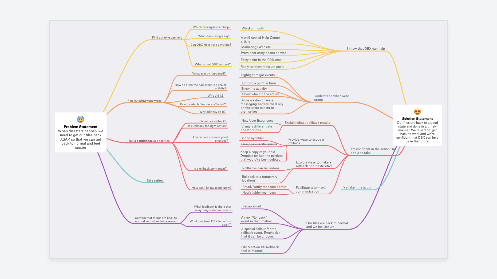

# Untools

## Communication

### Minto Pyramid
使用 Minto Pyramid 为沟通提供自上而下的结构，并快速清晰地传达您的信息。以结论开头，然后提供关键论点，最后用详细信息支持它们。  
  
例子：  
  

https://untools.co/minto-pyramid  

### Situation-Behavior-Impact
当我们对某人的行为持否定态度时，我们经常会草率地得出结论并假设某人为什么会这样做。在给那个人提供反馈时，很难保持客观。Situation-Behavior-Impact (SBI™) 是创意领导中心开发的一种工具，可帮助您从所提供的反馈中消除审判并使其更清晰。  

这个工具最适合提供负面反馈，因为它可以减少接受者对它的提防，但它也绝对可以用于正面反馈。  

How it works  
SBI™ 提供了几个简单的步骤，您可以沿着这些步骤构建您想要提供的反馈。  

1. 情况 - 从行为发生的情况开始。这有助于使反馈具体化，并且其他人可以更容易地与之联系起来。
2. 行为 - 描述您反馈针对的具体行为。告诉对方他们做了什么或你看到了什么，而不是你对它的解释。这对于将您的审判排除在反馈之外至关重要。
3. 影响 - 解释他们的行为产生了什么样的影响。这可以从您的想法和感受以及原因，到对他人或整个团队的更广泛影响。

Plus: 意图  
有时，您可能想问他们行为背后的意图是什么。他们可能有一个你不知道或与你的假设不同的合理理由。  

这可以极大地帮助解释他们的意图和实际影响之间的差距。  

鼓励反思  
反馈只有在考虑并采取行动时才有用。鼓励对方反思你所说的话，并思考他们将来会如何采取不同的行动。  

如果您询问他们的意图，这可能是讨论更改内容的一个很好的起点。  

## Problem Solving

### First principles
将复杂的问题分解为基本元素，并从那里创建创新的解决方案。  
有时也称为“从第一原则推理”，它是解决问题的有力工具。确定问题的基本原理将使您能够提出创新的解决方案。  

第一原则是不能进一步分解的基本原则或真理。第一性原理思考是要深入挖掘，直到找到问题的根本。  

如何使用它？  
从您的问题开始，并采取以下两个步骤：  
1. 将其分解为最基本的事实（第一原则）
2. 根据这些原则重新构建解决方案

这听起来很简单，但需要一些专注的思考才能真正深入研究问题并发现这些首要原则。  

有一些技巧可以帮助你：  

五个为什么  
这是用户研究中的一种流行技术，研究人员通过反复询问“为什么”问题来深入挖掘。它使您能够发现问题的根本原因。当然，你不必在五点就停下来，但一般来说，发现一个第一原理就足够了。  

苏格拉底式提问  
一种有纪律的提问形式，可以进行批判性思维。您可以提出六种类型的问题来深入挖掘基本事实：  
1. 澄清 —— “你说的……是什么意思？”
2. 探索假设 —— “我们可以假设什么？”
3. 探究原因/证据 —— “你为什么认为这是真的？”
4. 影响和后果 —— “那会有什么影响？”
5. 不同的观点 —— “什么是替代方案？”
6. 质疑最初的问题 —— “这个问题的意义是什么？”

实践中的第一原则  
让我们看看第一原则在行动中的思考。这是 Dropbox 设计师 Wes O'Haire 的一个很好的例子：  
  
问题图示例 —— 问题陈述被分解为第一原则，然后根据它们建立解决方案。  

“我去年在一个项目中做了这个，我们从问题陈述开始。从那里，我把它分解成它的基本部分，然后处理每个部分，并重新配置它以建立一个解决方案。”  

### Ishikawa Diagram
确定问题的根本原因。  
石川图是一个很好的工具，可以通过确定问题的根本原因来帮助您解决问题。有时也称为因果图或鱼骨图，它是由日本教授石川薰创建的。它对于解决复杂问题特别有效。  
  

如何使用它  
构建此图表包含几个简单的步骤。这可以在一个小组中作为一个研讨会完成，也可以由您自己完成。  

1. 定义问题 - 从定义问题开始，然后在它的左边或右边画一条线（这取决于你的喜好）。该行将用于在下一步中添加因子。
2. 确定促成因素或类别 - 列出可能导致您正在解决的问题的因素/类别。沿着主线绘制它们。您可以提出自己的因素，也可以使用通用类别：人员、设备、方法、测量、材料和环境。分类对于分解复杂的问题并从不同的角度看待它们非常有帮助。
3. 找出与每个因素相关的可能根本原因 - 问“为什么会这样？” 把每个想法写成一条线，写在它所涉及的因素下面。第一原则思维在这里很有用，包括“五个为什么”方法。请记住，问题可能不仅仅是一个根本原因，而是多个原因。因此，即使只是部分地捕获可能解释问题的所有内容，也很重要。此时，您应该有一个完整的图表，但还没有明确的答案。
4. 分析图表 - 最重要的一步是查看所有可能的根本原因并分析它们。该图现在为您最重要的思考和后续步骤提供了一个结构。此时您可以做的事情有很多。也许您可以为每个根本原因候选者收集更多数据/证据，或者立即确定最可能的原因并快速尝试解决它。这将取决于您的具体问题和确定的可能原因。 
