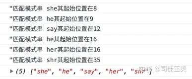

## 维基
Aho–Corasick algorithm 是一种字符串搜索算法，用于在输入的一串字符串中匹配有限组“字典”中的子串。它与普通字符串匹配的不同点在于同时与所有字典串进行匹配。算法均摊情况下具有近似于线性的时间复杂度，约为字符串的长度加所有匹配的数量。然而由于需要找到所有匹配数，如果每个子串互相匹配（如字典为 a，aa，aaa，aaaa，输入的字符串为 aaaa），算法的时间复杂度会近似于匹配的二次函数。  
该算法主要依靠构造一个有限状态机（类似于在一个 trie 树中添加失配指针）来实现。这些额外的失配指针允许在查找字符串失败时进行回退（例如设 Trie 树的单词 cat 匹配失败，但是在 Trie 树中存在另一个单词 cart，失配指针就会指向前缀 ca），转向某前缀的其他分支，免于重复匹配前缀，提高算法效率。  
  
## 概述
> 我们经常用的字符串方法 indexOf，都是判定两个字符串的包含关系，底层使用类似 KMP、BM、Sunday 这样的算法。如果我们要判断一个长字符串是否包含多个短字符串呢？比如在一篇文章找几个敏感词，在 DNA 串中找几个指定的基因对 pattern 进行预处理，如果我们的模式串存在多个，则不适合了，我们就需要用到一种多模式匹配算法。  
> 最著名的多模式匹配算法为 AC 自动机，它是由贝尔实验室的两位研究人员 Alfred V. Aho 和 Margaret J.Corasick 于 1975 年发明的，几乎与 KMP 算法同时问世，至今日仍然在模式匹配领域被广泛应用。  
> AC 自动机的核心算法仍然是寻找模式串内部规律，达到在每次失配时的高效跳转。这一点与单模式匹配 KMP 算法是一致的。不同的是，AC 算法寻找的是模式串之间的相同前缀关系。  
> 在 KMP 算法中，对于模式串 “abcabcacab”，我们知道非前缀子串 abc(abca)cab 是模式串的一个前缀 (abca)bcacab，而非前缀子串 ab(cabca)cab 不是模式串 abcabcacab 的前缀，根据此点，我们构造了 next 数组，实现在匹配失败时的跳转。  
> 而在多模式环境中，AC 自动机是使用前缀树来存放所有模式串的前缀，然后通过失配指针来处理失配的情况。它大概分为三个步骤：构建前缀树（生成 goto 表），添加失配指针（生成 fail 表），模式匹配（构造 output 表）。

```javascript
var ac = new Trie();
createGoto(ac, ["she", "shr", "say", "he", "her"]);
createFail(ac);
console.log(match(ac, "one day she say her has eaten many shrimps"));
```  
  

参考：https://zhuanlan.zhihu.com/p/80325757  
  
> AC 自动机是以 Trie（字典树）的结构为基础，结合 KMP 的思想建立的。  
> 简单来说，建立一个 AC 自动机有两个步骤：  
> 1. 基础的 Trie 结构：将所有的模式串构成一棵 Trie。
> 2. KMP 的思想：对 Trie 树上所有的结点构造失配指针。
> 
> 然后就可以利用它进行多模式匹配了。
>
> AC 自动机在初始时会将若干个模式串丢到一个 Trie 里，然后在 Trie 上建立 AC 自动机。这个 Trie 就是普通的 Trie，该怎么建怎么建。  
> Trie 中的结点表示的是某个模式串的前缀。一个结点表示一个状态，Trie 的边就是状态的转移。  
> 形式化地说，对于若干个模式串 s_1, s_2 ... s_n，将它们构建一棵字典树后的所有状态的集合记作 Q。  
>
> **失配指针**  
> AC 自动机利用一个 fail 指针来辅助多模式串的匹配。  
> 状态 u 的 fail 指针指向另一个状态 v，其中 v 属于 Q，且 v 是 u 的最长后缀（即在若干个后缀状态中取最长的一个作为 fail 指针）。这里简单对比一下这里的 fail 指针与 KMP 中的 next 指针：  
> * 共同点：两者同样是在失配的时候用于跳转的指针。
> * 不同点：next 指针求的是最长 Border（即最长的相同前后缀），而 fail 指针指向所有模式串的前缀中匹配当前状态的最长后缀。
> 
> 因为 KMP 只对一个模式串做匹配，而 AC 自动机要对多个模式串做匹配。有可能 fail 指针指向的结点对应着另一个模式串，两者前缀不同。  
> 简单来说，AC 自动机的失配指针指向当前状态的最长后缀状态即可。  
> AC 自动机在做匹配时，同一位上可匹配多个模式串。

参考：https://oi-wiki.org/string/ac-automaton/  
  
## [JS 代码实现](./ac_automaton.js)
