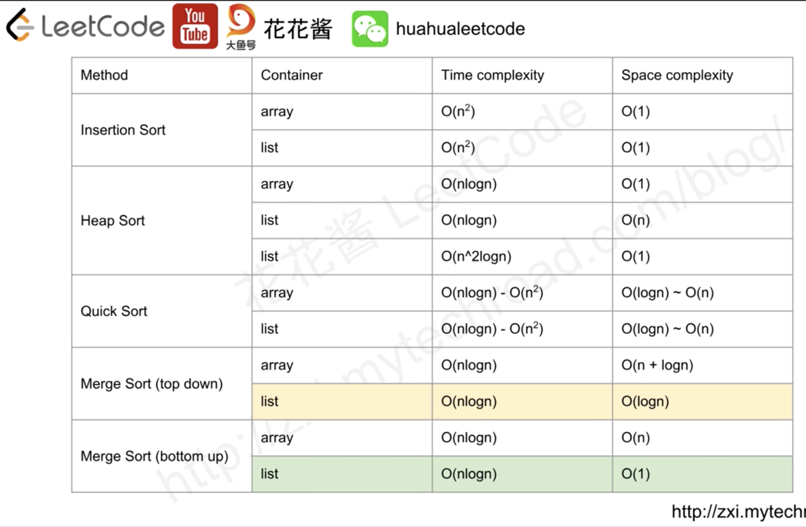

## 排序实现代码索引
  
* 基础排序
  * 归并排序
    * [顺序表](./Java/com/commonsorts/MergeSort.java)
    * [链表](./../../Leetcode%20Practices/algorithms/medium/148%20Sort%20List.java) 
  * 快速排序
    * [顺序表](./Java/com/commonsorts/QuickSort.java)
  * 插入排序
    * [顺序表](./Java/com/commonsorts/InsertSort.java)
  * 希尔排序
    * [顺序表](./Java/com/commonsorts/ShellSort.java)
  * 冒泡排序
    * [顺序表](./Java/com/commonsorts/BubbleSort.java)
  * 选择排序
    * [顺序表](./Java/com/commonsorts/SelectSort.java)
  * 基数排序
    * [顺序表](./Java/com/commonsorts/RadixSort.java)
  * 堆排序
    * [顺序表](./Java/com/commonsorts/HeapSort.java)
  * 桶排序
    * [顺序表](./Java/com/commonsorts/BucketSort.java)
* 混合排序
  * Tim 排序
    * 是一种混合稳定的排序算法，源自合并排序和插入排序，旨在较好地处理真实世界中各种各样的数据。它使用了 Peter Mcllroy 的 "乐观排序和信息理论上复杂性" 中的技术，由 Tim Peters 实现。该算法通过查找已经排好序的数据子序列，在此基础上对剩余部分更有效地排序。该算法通过不断地将特定子序列（称为一个 run ）与现有的 run 合并，直到满足某些条件为止来达成的更有效的排序。该算法广泛应用于业界如 JDK 集合里的内置排序方法。
    
  
  
## 各排序图解
  
### 归并排序  

  
### 快速排序  

  
### 插入排序  

  
  
  
## 排序算法性能对比
  
  
  
  
## 延伸阅读
[排序算法理论基础](./排序算法理论基础.md)  
[八大排序算法实战-思想与实现](./八大排序算法实战-思想与实现.md)  
  
