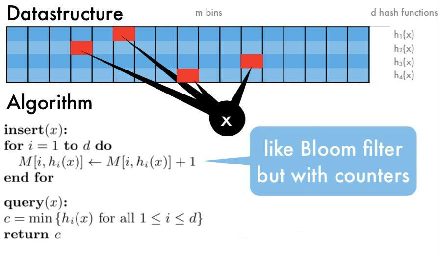

如何计算数据流中任意元素的频率？  
这个问题也是大数据场景下的一个经典问题，称为频率估计 (Frequency Estimation) 问题。  

方案 1: HashMap  
用一个 HashMap 记录每个元素的出现次数，每来一个元素，就把相应的计数器增 1。这个方法在大数据的场景下不可行，因为元素太多，单机内存无法存下这个巨大的 HashMap。  

方案 2: Count-Min Sketch  

# Count-Min Sketch
Count-Min Sketch 算法流程：  
1. 选定 d 个 hash 函数，开一个 `w * d` 的二维整数数组作为哈希表
2. 对于每个元素，分别使用 d 个 hash 函数计算相应的哈希值，并对 w 取余，然后在对应的位置上增 1，二维数组中的每个整数称为 sketch
3. 要查询某个元素的频率时，只需要取出 d 个 sketch, 返回最小的那一个（其实 d 个 sketch 都是该元素的近似频率，返回任意一个都可以，该算法选择最小的那个）

  

这个方法的思路和 Bloom Filter 比较类似，都是用多个 hash 函数来降低冲突。  
* 总空间复杂度 `O(W*D)`。Count-Min Sketch 需要开一个 `W * D` 大小的二位数组，所以空间复杂度是 `O(W*D)`，查询时间复杂度 `O(D)`
* 总时间复杂度 O(N)。Count-Min Sketch 只需要一遍扫描，W 和 D 通常是常数，所以总处理时间复杂度是 O(N)
* 频率越高的项（比如 Heavy Hitters 或 Top K，大流量对象），其准确度越高，但对于较少出现的对象准确度比较差 - Count-Min Sketch 算法的优点是省内存，缺点是对于出现次数比较少的元素，准确性很差，因为二维数组相比于原始数据来说还是太小，hash 冲突比较严重，导致结果偏差比较大。
  * 只会造成重复计算，但不会计算不足（即频率值不会偏低）
  
## [Java 实现](../Common%20Data%20Structure%20and%20Data%20Type/Data%20Structure%20Implementation/CountMinSketch/CountMinSketch.java)

## Count-Mean-Min Sketch
Count-Min Sketch 算法对于低频的元素，结果不太准确，主要是因为 hash 冲突比较严重，产生了噪音，例如当 w=20 时，有 1000 个数 hash 到这个 20 桶，平均每个桶会收到 50 个数，这 50 个数的频率重叠在一块了。Count-Mean-Min Sketch 算法做了如下改进：  
* 来了一个查询，按照 Count-Min Sketch 的正常流程，取出它的 d 个 sketch
* 对于每个 hash 函数，估算出一个噪音，噪音等于该行所有整数 (除了被查询的这个元素) 的平均值
* 用该行的 sketch 减去该行的噪音，作为真正的 sketch
* 返回 d 个 sketch 的中位数

```java
class CountMeanMinSketch {
    // initialization and addition procedures as in CountMinSketch
    // n is total number of added elements
    public int estimate(String item) {
        int[] tmp = new int[depth];
        for (int r = 0; r < depth; r++) {
            int c = funcs[r].hash(item);
            int sk = sketch[r][c];
            int noise = (n - sk) / (width - 1);
            tmp[r] = sk – noise;
        }
        return median(tmp);
    }
}
```  

Count-Mean-Min Sketch 算法能够显著的改善在长尾数据上的精确度。  

参考：  
https://soulmachine.gitbooks.io/system-design/content/cn/bigdata/frequency-estimation.html  


## 进阶使用场景
* [SketchVisor](https://www.cnblogs.com/vancasola/p/9457423.html)
