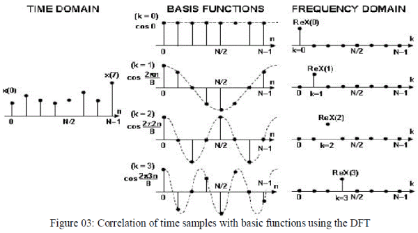
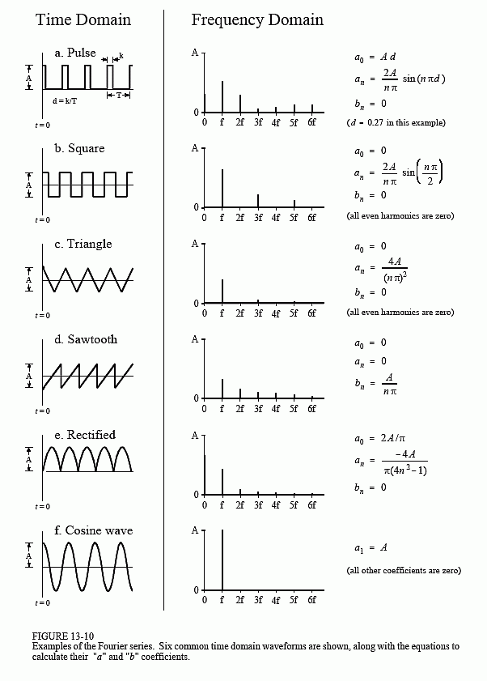

# [离散傅立叶变换](https://zh.wikipedia.org/wiki/%E7%A6%BB%E6%95%A3%E5%82%85%E9%87%8C%E5%8F%B6%E5%8F%98%E6%8D%A2)
离散傅里叶变换（Discrete Fourier Transform，缩写为 DFT），是傅里叶变换在时域和频域上都呈离散的形式，将信号的时域采样变换为其 DTFT 的频域采样。  
在形式上，变换两端（时域和频域上）的序列是有限长的，而实际上这两组序列都应当被认为是离散周期信号的主值序列。即使对有限长的离散信号作 DFT，也应当将其看作其周期延拓的变换。在实际应用中通常采用快速傅里叶变换计算 DFT。  
  
  
  
# 快速傅立叶变换
快速傅里叶变换（Fast Fourier Transform, FFT），是快速计算序列的离散傅里叶变换（DFT）或其逆变换的方法。傅里叶分析将信号从原始域（通常是时间或空间）转换到频域的表示或者逆过来转换。FFT 会通过把 DFT 矩阵分解为稀疏（大多为零）因子之积来快速计算此类变换。因此，它能够将计算 DFT 的复杂度从只用 DFT 定义计算需要的 O(n^2) 降低到 O(nlogn)，其中 n 为数据大小。  
FFT 支持在 O(nlogn) 的时间内计算两个 n 度的多项式的乘法，比朴素的 O(n^2) 算法更高效。由于两个整数的乘法也可以被当作多项式乘法，因此这个算法也可以用来加速大整数的乘法计算以及卷积计算之类。  

* [快速傅里叶变换详细讲解](https://www.youtube.com/watch?v=RlxT4Nmd45I&list=PLEUKC88yR4_al2oa2LF0SKS2RPpxmWg3n&index=9)
* [io wiki - 快速傅里叶变换应用](https://oi-wiki.org/math/poly/fft/)
* [从多项式乘法到快速傅里叶变换](https://itimetraveler.github.io/2017/09/08/%E3%80%90%E7%AE%97%E6%B3%95%E3%80%91%E4%BB%8E%E5%A4%9A%E9%A1%B9%E5%BC%8F%E4%B9%98%E6%B3%95%E5%88%B0%E5%BF%AB%E9%80%9F%E5%82%85%E9%87%8C%E5%8F%B6%E5%8F%98%E6%8D%A2/)

下面这个模板用于计算复数数组的离散傅立叶变换：
```java
// by ChatGPT
// 另外还可以参考：
// 华盛顿大学 C 语言模版 https://www.math.wustl.edu/~victor/mfmm/fourier/fft.c
// 普林斯顿大学 Java 模版 https://algs4.cs.princeton.edu/99scientific/FFT.java.html
import java.util.*;

public class FFT {

    // 计算 FFT
    public static Complex[] fft(Complex[] a) {
        int n = a.length;
        if (n <= 1) {
            return a;
        }

        // 将数组拆分为奇数和偶数部分
        Complex[] even = new Complex[n / 2];
        Complex[] odd = new Complex[n / 2];
        for (int i = 0; i < n / 2; i++) {
            even[i] = a[2 * i];
            odd[i] = a[2 * i + 1];
        }

        // 递归计算奇数和偶数部分的 FFT
        even = fft(even);
        odd = fft(odd);

        // 合并奇数和偶数部分的结果
        Complex[] result = new Complex[n];
        for (int i = 0; i < n / 2; i++) {
            double angle = -2 * Math.PI * i / n;
            Complex t = odd[i].multiply(Complex.fromPolar(1, angle));
            result[i] = even[i].add(t);
            result[i + n / 2] = even[i].subtract(t);
        }

        return result;
    }

    // 计算逆 FFT
    public static Complex[] ifft(Complex[] a) {
        int n = a.length;
        Complex[] conjugate = new Complex[n];
        for (int i = 0; i < n; i++) {
            conjugate[i] = a[i].conjugate();
        }

        conjugate = fft(conjugate);

        Complex[] result = new Complex[n];
        for (int i = 0; i < n; i++) {
            result[i] = conjugate[i].conjugate().divide(n);
        }

        return result;
    }

    public static void main(String[] args) {
        // 示例用法
        Complex[] a = { new Complex(1, 0), new Complex(2, 0), new Complex(3, 0), new Complex(4, 0) };

        Complex[] fftResult = fft(a);
        System.out.println("FFT 结果：" + Arrays.toString(fftResult));

        Complex[] ifftResult = ifft(fftResult);
        System.out.println("逆 FFT 结果：" + Arrays.toString(ifftResult));
    }
}

class Complex {
    double real, imag;

    public Complex(double real, double imag) {
        this.real = real;
        this.imag = imag;
    }

    public Complex multiply(Complex b) {
        double realPart = this.real * b.real - this.imag * b.imag;
        double imagPart = this.real * b.imag + this.imag * b.real;
        return new Complex(realPart, imagPart);
    }

    public Complex add(Complex b) {
        return new Complex(this.real + b.real, this.imag + b.imag);
    }

    public Complex subtract(Complex b) {
        return new Complex(this.real - b.real, this.imag - b.imag);
    }

    public Complex conjugate() { // 共轭
        return new Complex(this.real, -this.imag);
    }

    public Complex divide(double scalar) {
        return new Complex(this.real / scalar, this.imag / scalar);
    }

    public static Complex fromPolar(double r, double theta) { // 从极坐标转换
        return new Complex(r * Math.cos(theta), r * Math.sin(theta));
    }

    @Override
    public String toString() {
        return "(" + real + ", " + imag + ")";
    }
}
```

其他：[并行快速傅立叶变换](https://zh.wikipedia.org/zh-hans/%E5%B9%B6%E8%A1%8C%E5%BF%AB%E9%80%9F%E5%82%85%E9%87%8C%E5%8F%B6%E5%8F%98%E6%8D%A2)  

例题：  
* Leetcode Q43 可以被 FFT 优化
