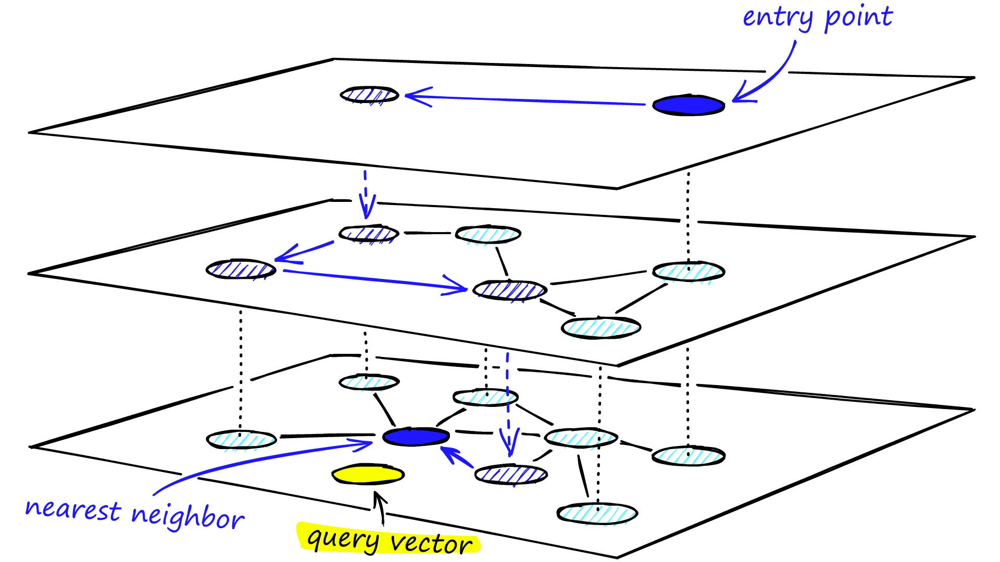
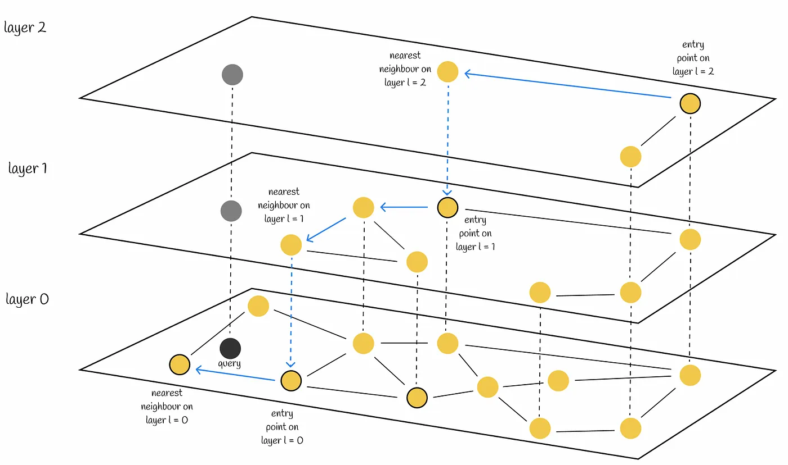

# 分层可导航小世界算法
是是目前推荐领域里面常用的 ANN（Approximate Nearest Neighbor）算法。也是向量数据库的基础数据结构及其算法，因为 KD 树和 R 树在维度较高的情况下通常会产生性能灾难，所以 HNSW 是目前最通用的多维近似搜索（多维索引）的方案。  
  
  

参考：
* https://www.pinecone.io/learn/series/faiss/hnsw/
* https://towardsdatascience.com/similarity-search-part-4-hierarchical-navigable-small-world-hnsw-2aad4fe87d37  
