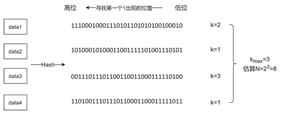

# HyperLogLog

如果要实现这么一个功能：  
统计 APP 或网页的一个页面，每天有多少用户点击进入的次数。同一个用户的反复点击进入记为 1 次。日活量（DAU）和月活量（MAU），日活（月活）是指在一个统计日（统计月）之内，登录或者使用产品的不同用户数量，它是产品运营情况的重要指标之一，反映了用户的活跃度，独立访客数需要对用户做去重，同一个用户多次访问只计算一次。。  
概括来说，这类需求就是去统计一个集合中不重复元素的个数。在数学上把一个集合不重复元素的个数称为集合的基数（cardinality，也有叫做势），这类问题可以称为基数统计问题。问题其实很简单，有很多常规的方法或数据结构去解决，例如：  
  
* 用 HashMap 这种数据结构，可以满足了去重。的确，这是一种解决方法，除此之外还有其它的解决方案。问题虽不难，但当参与问题中的变量达到一定数量级的时候，再简单的问题都会变成一个难题。假设 APP 中日活用户达到百万或千万以上级别的话，采用 HashMap 的做法，就会导致程序中占用大量的内存。下面尝试估算下 HashMap 的在应对上述问题时候的内存占用。假设定义 HashMap 中 Key 为 string 类型，value 为 bool。key 对应用户的 Id, value 是是否点击进入。明显地，当百万不同用户访问的时候。此 HashMap 的内存占用空间为：100万 * (string + bool)。
* 集合 Set 也一样，将所有元素存储在一个 Set（可以用哈希表或树实现）中，利用 Set 对元素进行去重。该方法可以精确的计算出不重复元素的数量，由于需要存储实际的数据，在数据量较少时可行，但是数据量达到百万、千万甚至上亿时，会占用大量的内存。假设有 1 亿个不重复的元素，每个数据大小是 4 字节，那么使用 Set 结构至少需要内存 100000000∗4B = 400MB。
* 位图 Bitmap，位图是一个大的 bit 数组，不需要去保存实际的元素，只需要用 1bit 来标识某个元素是否出现过，这样能够极大地节省内存。位图占用的内存和元素的值域有关，因为需要把值域映射到这个大的比特数组上。假设元素的值域是 `[1, 1亿]`，那么采用位图需要的内存就是 100000000∗1bit / 8 ≈ 12MB。该方法也能够精确的计算出不重复元素的数量，比起 Set 来说，内存占用确实减少很多，但是如果需要统计上千个模块或者业务的数据，那么内存消耗依然很大。
* 布隆过滤器 Bloom filter，布隆过滤器类似于位图，也是一个大的 bit 数组，存储的数据通过多个哈希函数计算，映射到比特数组的多个 bit 中，进而判断一个元素是否在集合中。布隆过滤器具有一定的误判率，占用的内存比位图略小，和误判率有关，误判率越低，需要的内存越大。  
  
上述这些方法在数据量较小的时候，都是可以有效的解决基数统计问题，但是当数据量较大的时候，这些方法占用的内存可能就无法接受了。  
那么在海量数据的场景下，有什么方法去解决基数统计的问题呢？  
  
## 大数据场景下的基数统计算法
基数统计是大数据场景中经常需要处理的问题，也有很多统计的算法，例如：  
```
Linear Counting（LC）

LogLog Counting（LLC）

HyperLogLog Counting（HLLC）

······
```  

Linear 算法和位图类似，但实际使用的不多，这里不多做介绍了，主要介绍 HyperLogLog 算法。"Hyper" 是 “超” 的意思，和 HTTP 中的 H 是一个意思，从名字中也可以看出，HyperLogLog 是 LogLog 算法的一个改进和优化。  
上述这些算法有个共同的特点，都不能精确计算集合的基数，而是概率计算，有一定的误差。因此在不追求绝对准确的情况下，可以考虑使用这些算法。下面就介绍一下 LLC 和 HLLC 算法的基本原理，以及如何一步一步的设计并优化的。  
  
### 伯努利试验
提到概率就不得不提伯努利，伯努利在概率论中有着重要的地位，有个著名的实验叫做伯努利试验。LLC 和 HLLC 算法底层的数学原理就是伯努利试验。所以需要去了解一下。

伯努利试验是指在同样的条件下重复地、相互独立地进行的一种随机试验，其特点是该随机试验只有两种可能结果：发生或者不发生。概念看起来比较复杂，其实很简单，就是抛硬币。假设抛硬币只会出现正面和反面两种情况，并且正反面的概率相等，都为 p=1/2，然后一直抛硬币，直到第一次出现正面为止，称为一次完整的伯努利试验。可能第一次抛就出现了正面，也可能连续抛了 4 次才出现正面，这都算作完整的伯努利试验。把一次完整的伯努利试验经历的抛硬币次数记为 k。  

用 0 表示抛到反面，用 1 表示抛到正面，假设做了 N 次伯努利试验，对于第 i 次伯努利试验，所经历的抛硬币次数为 k_i。在这 N 次伯努利试验中，最大的次数为 k_max。  
伯努利试验容易得出有以下结论：  
* n 次伯努利过程的投掷次数都不大于 k_max
* n 次伯努利过程，至少有一次投掷次数等于 k_max

最终结合极大似然估算的方法，发现在 n 和 k_max 中存在估算关联：**n = 2^(k_max)**。  
这种通过局部信息预估整体数据流特性的方法似乎有些超出人们的基本认知，需要用概率和统计的方法才能推导和验证这种关联关系。可以先考虑以下两个问题：
* 假设进行 N 次伯努利试验，所有投掷次数都不大于 k_max 的概率是多少？  
* 假设进行 N 次伯努利试验，至少有一次投掷次数大于或等于 k_max 的概率是多少？

对于第一个问题，一次完整的伯努利试验投掷次数大于 k_max 的概率等于 1/(2^k_max)，即连续 k_max 次反面的概率，因此一次投掷不大于 k_max  的概率为 1-1/(2^k_max)，所以 N 次伯努利试验都不大于 k_max 的概率是 P1(X <= k_max) = (1-1/(2^k_max))^N。  
第二个问题，答案显然是 P2(Ǝ X >= k_max) = 1 - P1(X <= (k_max-1)) = 1 - (1-1/(2^(k_max-1)))^N，当 N >> k_max 时，P1(X <= k_max) ~= 0 ，而当 N << k_max 时 P2(Ǝ X >= k_max) ~= 0。就是说如果 N 远大于 k_max，那么所有投掷次数都不大于 k_max 的概率是 0，这和 k_max 是所有 k 的最大值矛盾；同样如果 N 远小于 k_max，至少有一次投掷次数大于或等于 k_max 的概率是 0，也是矛盾的。因此可以考虑 k_max 为 N 的一个估计值。  

N = 2^(k_max) 只是一个估算，当试验次数 N 很小的时候，误差会很大。例如下面的样子：  
```
第一次试验: 抛了3次才出现正面，此时 k=3，n=1
第二次试验: 抛了2次才出现正面，此时 k=2，n=2
第三次试验: 抛了6次才出现正面，此时 k=6，n=3
```  
假设上面例子中实验组数共 3 组，那么 k_max = 6，最终 n = 3，放进估算公式中去，明显： 3 ≠ 2^6 。也即是说，当试验次数很小的时候，这种估算方法的误差是很大的。  

### 用伯努利试验类比
伯努利试验和基数统计到底有什么关系呢？其实可以通过把伯努利试验类比到基数统计上。  
一次抛硬币的伯努利试验，可以看作是一串二进制串 000...1。假设有一个哈希函数能够将集合的元素哈希成固定长度的二进制串，并且该哈希函数分布均匀，冲突较小，那么理论上来说，二进制串的每个比特是 0 还是 1 的概率应该是相同的，从该二进制串的低位向高位去寻找第一个 1 出现的位置 k，那么这个过程其实就是一个伯努利试验。既然这样，同样能够通过所有 k 的最大值 k_max 去估算集合的元素个数。如下图所示：  
  

在这个例子中集合中的每个元素经过一个哈希函数计算，得到 32 位的二进制串，然后每个二进制串从低位向高位去寻找第一个 1 出现的位置 k，最大的为 k_max = 3，则估算集合元素的个数是 N = 2^3 = 8。也就是说，理论上来说，有 8 个元素，才会出现一次二进制串末尾是 "100" 的情况。同样可以看出，这种估算的结果误差会很大。  

### 分桶思想减小误差
做过实验都知道，减小误差的方法之一是多次实验取平均。假设做多轮伯努利试验，每轮都是 N 次，然后对每轮试验的 k_max 求平均进行估算，是不是就能够有效的减小误差呢？答案是肯定的。但是和抛硬币不同，抛硬币每一轮的结果都是随机的，所以可以取平均减小误差，但是集合中的数据通过哈希计算得到的值是固定的，无论你计算多少轮，结果也都不会改变。那么对于集合基数的估计，如何去减小误差呢？  
只能够从数据本身入手。一种思路就是把数据平均分成多份，对每一份数据进行估算，然后多份数据来进行求平均减小误差。这其实就是分桶的思想，假设数据经过哈希函数计算，得到了一个 32bit 的二进制串，用低 10 位来表示分桶的位置（10 位最多有 1024 个桶），然后高 22 位用于模拟伯努利过程，每个桶只需要保存当前出现过的最大的 k_max。整个过程如下图所示：  
  
最后得到 1024 个桶的 k_max 值，可以进行取平均并估算集合的基数值。  

### LogLog Counting 算法
LogLog Counting 算法在分桶后，对这 m 个桶的 k_max 值做一个算数平均数：R = (k_max1 + k_max2 + ... + k_maxm) / m  
然后可以估算每个桶的基数值为 2^R，最后乘以桶数 m 和偏差修正因子 c，就得到了整个集合的基数值：DVLL = c * m * 2^R  
可以看出算法的计算并不复杂。那么 LLC 算法占用多少空间呢？回到上面分桶的例子，有 1024 个桶，高 22 位去模拟伯努利试验，k_max 的最大值也只能是 22，因此每个桶只需要 5bit 就能保存，总共占用空间只需要 1024 ∗ 5bit = 640B1024∗5bit = 640B。不难理解，这个空间复杂度是 O(m*LogLogN) 的，所以这也是该算法叫做 LogLog Counting 的原因。  

### HyperLogLog Counting 算法
前面说 HLLC 算法是对 LLC 算法的一个改进和优化，具体是在哪里呢？主要是在平均数的计算上。  
LLC 用的是算数平均数，求所有桶 k_max 的平均值。算数平均数有个缺点，它容易受到极值的影响。举个例子，“平均工资”，假设公司里小王的月薪是 10000，老板的月薪是100000，那么采用算数平均值计算平均工资为 1/2(10000+100000) = 55000，这个结果在小王看来，可能会很诧异，自己的工资什么时候这么高了？公司里大部分的人的薪资可能都和小王差不多，只有少数的人工资非常高，那么通过算数平均数得到的平均工资可能会因为这几个极大值而变得没有意义。同样，知道伯努利试验中 k 越大的概率越低，也就是说可能大部分桶的 k_max 值都比较低，如果有几个桶的 k_max 值非常大，那么算数平均数就会被拉高很多，起不到减小误差的效果了。  

更好的方法是采用调和平均数（倒数的平均数的倒数）。还是上面平均工资的例子，如果采用调和平均值计算，则平均工资为 2/（1/10000+1/10000）≈ 18181，这个结果相比于算数平均数会好很多。调和平均数的好处是，它比较偏袒较小值，受极大值的影响较小。所以调和平均数应该更适应于这个场景。这就是 HLLC 算法的主要改进点。  
首先它对每个桶的基数估计值来计算一个调和平均数，然后同样乘以桶数 m 和修正因子 c，最后得到整个集合的基数估计值如下：  
  

该算法的空间复杂度同样也是 O(m*LogLogN)。  

### 偏差修正
在估算的计算公式中，constant 变量 c 不是一个定值，它会根据实际情况而被分支设置，例如下面的样子。  
假设：m 为分桶数，p 是 m 的以 2 为底的对数。  
```
// m 为桶数
switch (p) {
   case 4:
       constant = 0.673 * m * m;
   case 5:
       constant = 0.697 * m * m;
   case 6:
       constant = 0.709 * m * m;
   default:
       constant = (0.7213 / (1 + 1.079 / m)) * m * m;
}
```  

## Redis 中的 HyperLogLog
Redis 在 2.8.9 版本中添加了 HyperLogLog 数据结构，常用的命令包括：  
* PFADD 命令将元素添加到 HLL 结构中
* PFCOUNT 命令会返回指定 HLL 的基数估算值
* PFMERGE 命令可以将多个 HLL 结构进行合并

会发现，HLL 结构的命令都是以 “PF” 为前缀，这是因为该算法的发明者叫做 Philippe Flajolet。  

在 Redis 中，添加到 HLL 中的 value 值会被 Hash 函数计算得到一个 64bit 的值，低 14 位用于分桶，所以桶数为 m = 2^14 = 16384 个，高 50 位用于伯努利试验，需要 6bit 来存储 2^6 = 64 > 50。所以在 Redis 中，HLL 仅用空间 16384∗6bit = 12KB，就可以统计多达 2^64 个数。  
算法的实现本身并不复杂，但是 Redis 还是对其内存占用作了一些优化。可以看出，无论基数多大，桶数都是 16384 个，所占用的内存都是 12KB，当基数比较小时，还是会造成一些空间浪费。所以 Redis 采用稀疏存储结构和密集存储结构两种方式。  

## 总结
HyperLogLog 是 LogLog 算法的升级版，作用是能够提供不精确的去重计数。存在以下的特点：  
* 代码实现较难。
* 能够使用极少的内存来统计巨量的数据，在 Redis 中实现的 HyperLogLog，只需要 12K 内存就能统计 2^64 个数据。
* 计数存在一定的误差，误差率整体较低。标准误差为 0.81%。
* 误差可以被设置辅助计算因子进行降低。

在一定条件允许下，如果允许统计在巨量数据面前的误差率在可接受的范围内，1000 万浏览量允许最终统计出少了一两万这样子，那么就可以采用 HyperLogLog 算法来解决上面的计数类似问题。  
在海量数据的场景下，HyperLogLog Counting 算法以损失一定准确性为代价，能够使用极少的内存统计集合的基数，常常被用于统计产品的日活、月活，独立访客数等等场景。在 Redis 中也支持 HyperLogLog 数据结构，并且对内存的使用做了一些优化。  
另外推荐一个[工具](http://content.research.neustar.biz/blog/hll.html)，可视化的演示了 HLLC 算法的详细过程，对学习 HLLC 算法很有帮助。  


  
## 参考
https://mp.weixin.qq.com/s/MVxmH5r0tP6sQ9WKVLoDbw  
https://juejin.cn/post/6844903785744056333  
https://cloud.tencent.com/developer/article/1479465  
