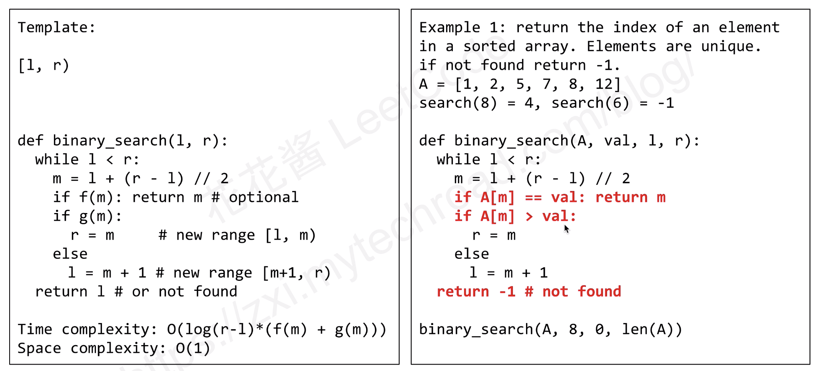
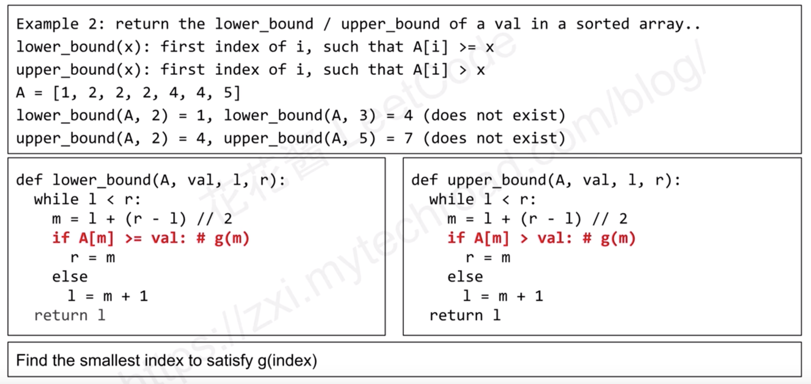

在计算机科学中，二分搜索（英语：binary search），也称折半搜索（英语：half-interval search）、对数搜索（英语：logarithmic search），
是一种在有序数组中查找某一特定元素的搜索演算法。搜索过程从数组的中间元素开始，如果中间元素正好是要查找的元素，则搜索过程结束；
如果某一特定元素大于或者小于中间元素，则在数组大于或小于中间元素的那一半中查找，而且跟开始一样从中间元素开始比较。
如果在某一步骤数组为空，则代表找不到。这种搜索算法每一次比较都使搜索范围缩小一半。  
  
  
  
相比于 Linear Search（即简单的 for loop）的时间复杂度（N），Binary Search 的时间复杂度是 log N，在 N 大于 100 时就已经开始十倍 Linear 的速度且随 N 继续增长而效率比更加爆炸性提高。  
参考：https://www.youtube.com/watch?v=v57lNF2mb_s&list=PLLuMmzMTgVK5Hy1qcWYZcd7wVQQ1v0AjX&index=13  
更多模版（来源于上面的参考资源）：  
  
其他（来源于上面的参考资源）：  
  
  
  
  
lower_bound(lst, x) # 找到有序数组 lst 中第一个大于等于 x 的元素的索引  
```java
class Solution {
	public int lowerBound(int[] lst, int x) {
		int start = 0, end = lst.length;
        while (start < end) {
            int mid = start + (end - start) / 2; // 直接平均可能會溢位，所以用此算法
            if (lst[mid] >= x) {
                end = mid;
            } else {
                start = mid + 1;
            }
        }
		if (start == lst.length) return -1;
        return start;
	}
}
```  

upper_bound(lst, x) # 找到有序数组 lst 中第一个严格大于 x 的元素的索引  
```java
class Solution {
	public int upperBound(int[] lst, int x) {
		int start = 0, end = lst.length;
        while (start < end) {
            int mid = start + (end - start) / 2;
            if (lst[mid] > x) {
                end = mid;
            } else {
                start = mid + 1;
            }
        }
		if (start == lst.length) return -1;
        return start;
	}
}
```  


如果求第一个小于(等于) x 的元素的索引时，只需要按上面稍改即可  
```java
class Solution {
    public int lowerBound2(int[] lst, int x) { // find first elem <= x
        int start = 0, end = lst.length;
        while (start < end) {
            int mid = start + (end - start) / 2;
            if (lst[mid] > x) {
                end = mid;
            } else {
                start = mid + 1;
            }
        }
		if (start == lst.length) return lst.length - 1;
        return start - 1;
    }
}
```  

```java
class Solution {
    public int upperBound2(int[] lst, int x) { // find first elem < x : 第一个严格小于 x 的元素的索引
        int start = 0, end = lst.length;
        while (start < end) {
            int mid = start + (end - start) / 2;
            if (lst[mid] >= x) {
                end = mid;
            } else {
                start = mid + 1;
            }
        }
		if (start == lst.length) return lst.length - 1;
        return start - 1;
    }
}
```  


## 经典题
[Leetcode 34](./../Leetcode%20Practices/algorithms/medium/34%20Find%20First%20and%20Last%20Position%20of%20Element%20in%20Sorted%20Array.java)  
[Leetcode 240](./../Leetcode%20Practices/algorithms/medium/240%20Search%20a%202D%20Matrix%20II.java)  
[Leetcode 162](./../Leetcode%20Practices/algorithms/medium/162%20Find%20Peak%20Element.java)  
[Leetcode 875](./../Leetcode%20Practices/algorithms/medium/875%20Koko%20Eating%20Bananas.java)  
[Leetcode 1539](./../Leetcode%20Practices/algorithms/easy/1539%20Kth%20Missing%20Positive%20Number.java)  
[Leetcode 2517](./../Leetcode%20Practices/algorithms/medium/2517%20Maximum%20Tastiness%20of%20Candy%20Basket.java) (注意有的时候二分搜索不一定是用在数组上，而是相关题目求值的范围)  
