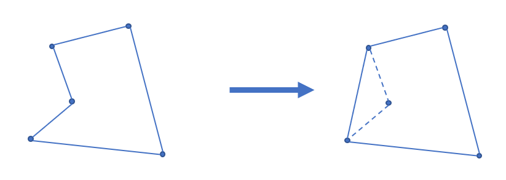

# 凸包
凸包是 ACM 中常见的几何问题，[凸包 wiki](https://zh.wikipedia.org/wiki/%E5%87%B8%E5%8C%85)。  

## 定义
**凸多边形**  
凸多边形是指所有内角大小都在 `[0, pi]` 范围内的简单多边形。  

**凸包**  
在平面上能包含所有给定点的最小凸多边形叫做凸包。  
其定义为：对于给定集合 X，所有包含 X 的凸集的交集 S 被称为 X 的凸包。  
实际上可以理解为用一个橡皮筋刚好包住所有给定点的形态。  
凸包用最小的周长围住了给定的所有点。如果一个凹多边形围住了所有的点，它的周长一定不是最小，如下图。根据三角不等式，凸多边形在周长上一定是最优的。  
  
以上参考：https://oi-wiki.org/geometry/convex-hull/  

## 相关算法
常用的求法有：
* 增量式算法 O(N^2)
* Graham 扫描法（仅适用于二维）O(N*logN)
* Andrew（Monotone Chain）算法 O(N*logN)
* Jarvis 算法 O(k*N)
* etc

二维凸包（Andrew 算法）例题：
* [LC Q587](./../Leetcode%20Practices/algorithms/hard/587%20Erect%20the%20Fence.java)

上面的 Andrew 算法简要来说就是 `贪心 + 几何（向量）计算 + 栈`。  

## 应用
* 图像处理
* 模式识别
* GIS（地理信息系统）

另外凸包在数学、统计学、组合优化、经济学、几何建模和物理学中也有着广泛的应用。  

## 其他
除了二维凸包外还有三维凸包、多维凸包。  
