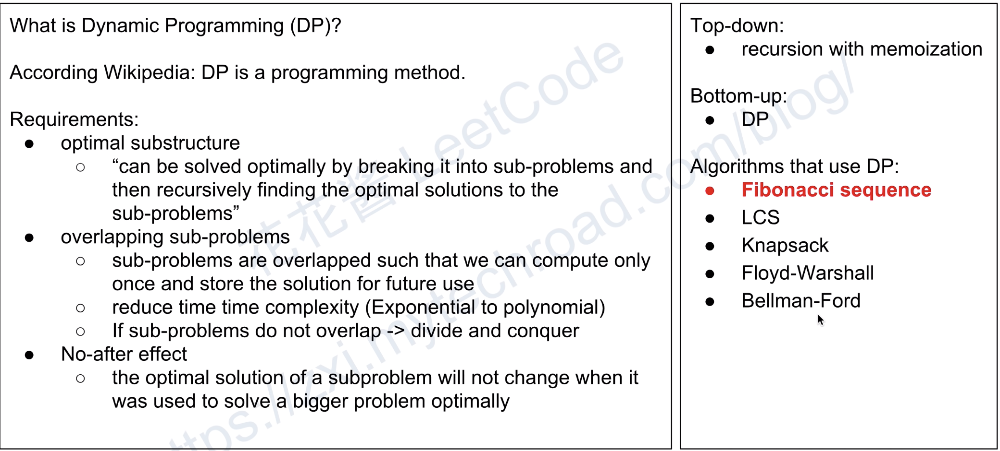
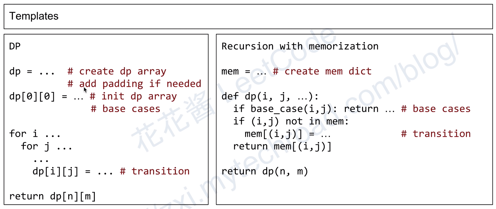
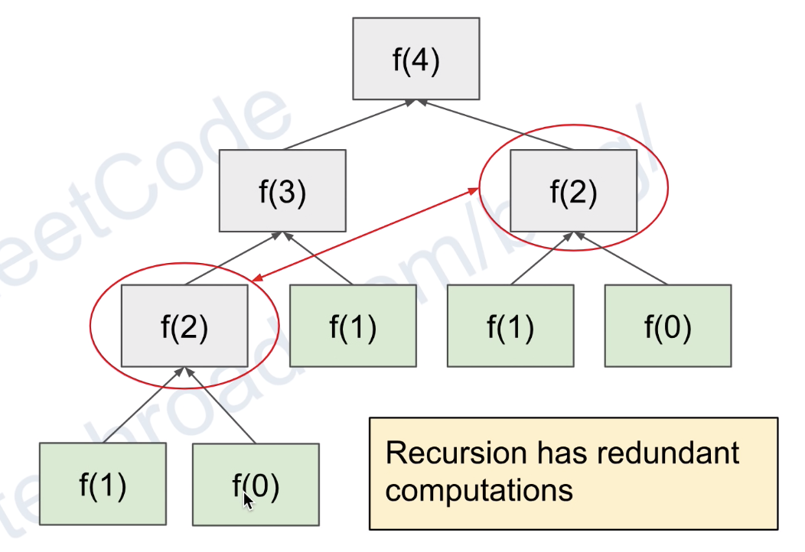

动态规划（Dynamic programming，简称 DP）是一种在数学、管理科学、计算机科学、经济学和生物信息学中使用的，通过把原问题分解为相对简单的子问题的方式求解复杂问题的方法。  
动态规划常常适用于有重叠子问题和最优子结构性质的问题，动态规划方法所耗时间往往远少于朴素解法。  
  
Reference: https://www.geeksforgeeks.org/dynamic-programming/  
> Dynamic Programming is mainly an optimization over plain recursion. Wherever we see a recursive solution that has repeated calls for same inputs, we can optimize it using Dynamic Programming.   
> The idea is to simply store the results of subproblems, so that we do not have to re-comupute them when needed later. This simple optimization reduces time complexities from exponential to polynomial.   
> For example, if we write simple recursive solution for Fibonacci Numbers, we get exponential time complexity and if we optimize it by storing solutions of subproblems, time complexity reduces to linear.  
  
动态规划背后的基本思想非常简单。大致上，若要解一个给定问题，我们需要解其不同部分（即子问题），再根据子问题的解以得出原问题的解。  
通常许多子问题非常相似，为此动态规划法试图仅仅解决每个子问题一次，从而减少计算量：一旦某个给定子问题的解已经算出，则将其记忆化存储，以便下次需要同一个子问题解之时直接查表。这种做法在重复子问题的数目关于输入的规模呈指數增長时特别有用。  
  
Recursion:
```java
int fib(int n) {
    if (n <= 1) return n;
    return fib(n − 1) + fib(n − 2);
}
```
  
Dynamic Programming:
```java
f[0] = 0;
f[1] = 1;

for (int i=2; i <= n; i++) {
    f[i] = f[i-1] + f[i-2];
}

return f[n];
```
  
图解：  
  
  
动态规划可减少递归里的一些重复计算，因为递归是从上至下而 DP 是从下往上（或称为递推），比如下面的斐波那契（其树结构会让递归的重复计算呈现多项式级别的时间复杂度，但如果通过 DP 减少重复计算，则最终时间复杂度为单项式即 O(n)）。（存储重复计算的递归类似是 DP 的某种变体，其效率与 DP 相若，比如上面解题模版里的 Recursion with memory，存储的数据结构可以是数组、哈希表或其他等等，这种方式比纯递推 DP 易设计因为递推 DP 需要保证子问题已被求解过所以设计时要更小心，但这种方式不好降维且因为本质是递归所以要注意如果问题深度过深或维度很高则可能出现 Stack Overflow 比如 Java 只支持到 1024）。  
  
  
补充：  
严格意义上，动态规划只能用来解决最优化问题，但在 OI 中，计数等非最优化问题的递推解法也常被不规范地称作 DP。事实上，动态规划与其它类型的递推的确有很多相似之处，学习时可以注意它们之间的异同。  
  
更多参考：  
https://www.youtube.com/watch?v=3mY5W0yojtA  
https://www.youtube.com/watch?v=eLlZEYzZVyQ  
https://oi-wiki.org/dp/  
