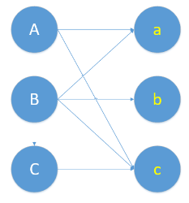
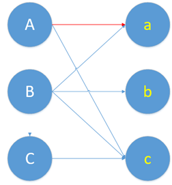
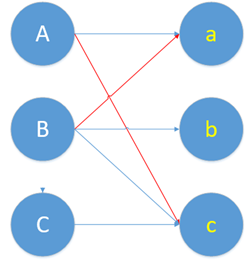
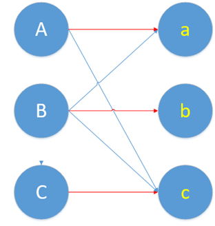

# 图匹配
以下转载自：https://oi-wiki.org/graph/graph-matching/graph-match/  

**匹配** 或是 **独立边集** 是一张图中没有公共边的集合。在二分图中求匹配等价于网路流问题。

图匹配算法是信息学竞赛中常用的算法，总体分为最大匹配以及最大权匹配，先从二分图开始介绍，在进一步提出一般图的作法。

前置知识：[二分图](./../Common%20Data%20Structure%20and%20Data%20Type/Data%20Structure%20Implementation/Bipartite%20Graph/README.md)

## 图的匹配
在图论中，假设图 G=(V, E)，其中 V 是点集，E 是边集。

一组两两没有公共点的边集 (M(M∈E)) 称为这张图的 **匹配**。

定义匹配的大小为其中边的数量 |M|，其中边数最大的 M 为 **最大匹配**。

当图中的边带权的时候，边权和最大的为 **最大权匹配**。

匹配中的边称为 **匹配边**，反之称为 **未匹配边**。

一个点如果属于 M 且为至多一条边的端点，称为 **匹配点**，反之称为 **未匹配点**。

* maximal matching: 无法再增加匹配边的匹配。不见得是最大匹配。
* 最大匹配（maximum matching): 匹配数最多的匹配。
* 完美匹配（perfect matching): 所有点都属于匹配，同时也符合最大匹配。
* 近完美匹配（near-perfect matching): 发生在图的点数为奇数，刚好只有一个点不在匹配中，扣掉此点以后的图称为 factor-critical graph。

### 二分图匹配
  
一张二分图上的匹配称作二分匹配

设 G 为二分图，若在 G 的子图 M 中，任意两条边都没有公共节点，那么称 M 为二分图 G 的一个匹配，且 M 的边数为匹配数。

**完美匹配**  
设 `G=<V1,V2,E>` 为二分图，|V1|<=|V2|，M 为 G 中一个最大匹配，且 |M|=|V1|，则称 M 为 V1 到 V2 的完美匹配。

**[霍尔定理](https://www.youtube.com/watch?v=hJtyb6G160M)**  
设二分图 `G=<V1,V2,E>`，|V1|<=|V2|，则 G 中存在 V1 到 V2 的完美匹配当且仅当对于任意的 S⊂V1，均有 |S|<=|NG(S)|。  
* 该条件表示任意子集 S 都有足够多的相邻顶点

**最大匹配**  
寻找二分图边数最大的匹配称为最大匹配问题。

### 算法
组合优化中的一个基本问题是求 **最大匹配（maximum matching)**。

**二分图最大匹配**  
在无权二分图中，Hopcroft-Karp 算法可在 `O(V^(1/2)*E)` 解决。

**二分图最大权匹配**  
在带权二分图中，可用 Hungarian 算法解决。 如果在最短路搜寻中用 Bellman–Ford 算法，时间复杂度为 `O(V^2*E)`， 如果用 Dijkstra 算法或 Fibonacci heap，可用 `O(V^2*logV+V*E)` 解决。

**一般图最大匹配**  
无权一般图中，Edmonds' blossom 算法可在 `O(V^2*E)` 解决。  

**一般图最大权匹配**  
带权一般图中，Edmonds' blossom 算法可在 `O(V^2*E)` 解决。

## 增广路定理 Berge's lemma
这是最大匹配的一个重要理论。  
* 交错路（alternating path) 始于非匹配点且由匹配边与非匹配边交错而成。
* 增广路（augmenting path）是始于非匹配点且终于非匹配点的交错路。

### 交替路和增广路
交替路和增广路是用来解决新配对的时候发生冲突的问题。这里要结合具体问题解释才能更清楚。那么来结合具体问题，看看这个交替路和增广路有啥用处。  
考虑一个下面这个二分图，怎么找到最大的匹配呢？  
  

一个自然的思路是，一个一个的配对。首先给 A 配对。一看 A 和 a 有意向，那就先把他俩撮合到一起。  
现在效果就变成这样了。  
  

蓝色的是他们本身有意向的情况，就是原始二分图，要记得蓝线连一块并不叫“匹配边”，而是“非匹配边”。红色的是已经给他们配对了，红线才叫“匹配边”。  

好了，A 的问题暂时性解决了，轮到 B 了。结果 b 也想和 a 配对。  
这时候，谁才能和 a 在一起呢？交替路和增广路就是解决这个冲突的。  
这时候，要找一条交替路，就是依次经过非匹配边（蓝线）、匹配边（红线）。那么从B出发，开始找交替路了。找到了  

B----(非匹配边)-----a-------(匹配边)------A-------(非匹配边)-------c  

B 和 c 都是没有被匹配过的点，而它又是这条交替路的起点和终点。这条交替路就是增广路。  
现在要做一个取反操作，怎么取呢，就是将上面这条增广路的匹配边变成不匹配边，不匹配边变成匹配边。  

B-----(匹配边)------a-------(非匹配边)------A-------(匹配边)-------c  

还是用红色表示匹配边，蓝色表示非匹配边。画在图上，现在的匹配变成这样。  
  

然后发现，刚刚的冲突问题解决了。由 B 和 a 在一起，A 和 c 在一块。  

回过头来，再想一下增广路是怎么解决冲突问题的。增广路的核心特点就是“起点终点都是非匹配点”，这样就导致非匹配边比匹配边多了一条。增广路建立连接时，必须建立在两者有意向的基础上。此时进行取反，也就是交换匹配和非匹配边的身份。这样就多得到了一条匹配边。这个取反的过程，就是把原本匹配上的两个人拆散，给第三个人腾位置。就是那篇很火的博客里所说的，核心思想就是“腾位置”。  
最后，把上图的配对问题彻底解决完。  

A B 的问题都解决了，轮到 C 了。C 要和 c 配对，又发生冲突了。于是，又要使用增广路来增加一个匹配了。  

C---(非)---c-----(匹)----A----(非)----a----(匹)----B----(非)---b  

取个反得到：  

C----(匹)----c-----(非)----A----(匹)----a----(非)----B----(匹)----b  

画成图长这样  
  

现在，A B C 的配对都解决了。已经找到了最大匹配。由于A\B\C\a\b\c都找到了自己的心仪对象。因此，这个最大匹配也是完美匹配。  

下面这个链接里的二分图，就没能找到完美匹配。  
https://www.cnblogs.com/shenben/p/5573788.html  

### 匈牙利算法
上述利用增广路找最大匹配的算法，就叫做匈牙利算法。  
[匈牙利算法](./匈牙利算法.md)  

### 增广路核心思路
增广路上非匹配边比匹配边数量多一，如果将匹配边改为未匹配边，反之亦然，则匹配大小会增加一且依然是交错路。  
  

如图 匹配数从 2 增加为 3，称此过程为 **增广**。

根据 Berge's lemma 当找不到增广路的时候，得到最大匹配。

由此定理可知求最大匹配的核心思路。

核心思路  
枚举所有未匹配点，找增广路径，直到找不到增广路径。

事实上，对于每个点只要枚举一次就好，证明如下：  
  
假设某一轮沿着增广路 a-b 增广后，新增了以未匹配点 x 为起点的增广路 Px，则 Px 必与 a-b 有公共边（否则 Px 不可能是因此次增广而新增的）。 在 Px 与 a-b 取得公共边时，由于 a-b 是交错路，意味着相交点在 a-b 内的两邻边是不同类型的（图中以红和蓝表示）；因而增广前 x 就能走到 a-b 中的某个未匹配点，说明此前已存在从 x 出发的增广路，即已枚举过的未匹配点不再可能作为增广路起点。
