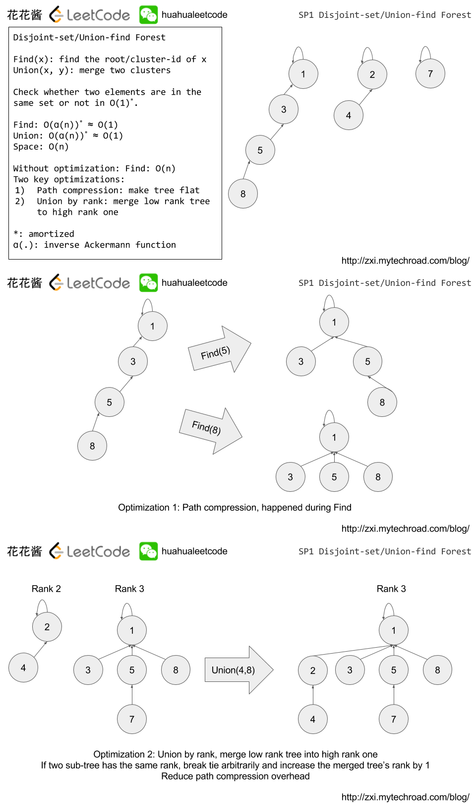

## 并查集与联合查找算法
  
`并查集（Disjoint-Set/Union-Find Forest）是一种树形的数据结构，主要用于解决一些元素分组的问题。`它管理一系列不相交的集合，并支持两种操作：合并与查找。它可以处理一维关系也可以处理多维关系，处理多维关系时将多维关系转化成一维关系即可，如[示例](./../Leetcode%20Practices/algorithms/medium/200%20Number%20of%20Islands.java)。  

**`简单来说其实就是尝试建立一个多叉树（如果处理的数据本身不连通则会建立多个多叉树，每棵树均有一根节点)`(因为并查集通常用于研究连通性、合并集合之类问题，而不能维护有向边的方向，所以输入/处理的数据通常也就是无向图（但注意输出/并查集本身是树是有向的），如果使用在有向图数据上也仅能用于检查是否有连通环（注意不是头尾环，因为原数据的边的方向信息会被 Union 方法覆盖/丢失，通常处理有向图的更复杂的问题建议采用 DFS、拓扑排序等其他算法）。路径压缩即：对于 C -> B -> A 而 B -> A 这种忽略因为 C 会被路径压缩为 C -> A；无论输入有无环，则理论上同一集合内的结点/元素经过足够多次合并操作/或称路径压缩后，原本较深的多叉树会最终简化为一个只有两层（使用递归 Find 方法的话）的多叉树 -- 只有一个根结点和一层叶子结点（即使原数据有环也一样，不会形成图或死循环，详情可看下面的递归 Find 注释）。**  
  
联合查找算法是基于并查集这一数据结构来执行、使用的，其原理与功能如下：  
  
  
  
### 时间复杂度
查询动作的时间复杂度为 O(1)：同时使用路径压缩、按秩（rank）合并优化的程序每个操作的平均时间仅为 O(α(n))，其中 α(n) 是 n=f(x)=A(x,x) 的反函数，A 是急速增加的阿克曼函数。因为 α(n) 是其反函数，故 α(n) 在 n 十分巨大时还是小于 5。因此，平均运行时间是一个极小的常数。实际上，这是渐近最优算法：Fredman 和 Saks 在 1989 年解释了 Ω(α(n)) 的平均时间内可以获得任何并查集。查看[详细证明](https://oi-wiki.org/ds/dsu-complexity/)。  
  
### 实现 1（推荐）:  
引用自: https://zxi.mytechroad.com/blog/data-structure/sp1-union-find-set/  
```java
// Author: Huahua
class UnionFindSet {
  private int[] parents_; // 可以换成 Map<TypeA, TypeA>，对稀疏的数据更加空间友好，另外 ranks_ 也要换成 Map<TypeA, Integer>
  // ranks[] 嫌麻烦可以完全省略不影响正确性，只影响一些情况下的性能
  private int[] ranks_; // 数组 ranks_[] 记录每个根节点对应的树的深度（如果不是根节点，其 rank 相当于以它作为根节点的子树的深度）。一开始，把所有元素的 rank（秩）设为 1。合并时比较两个根节点，把 rank 较小者往较大者上合并（即把简单的树往复杂的树上合并，而不是相反。因为这样合并后，到根节点距离变长的节点个数比较少）。实际上 ranks_[x] 并不实时准确表示该节点所属树的深度（因为发生 path compression 时并不对 ranks_[i] 自减，应该可以针对此进行优化使其准确反应深度并提高效率但是实现此优化可能很复杂），但这不影响做题时题解的正确性，只是可能在某些输入情况中性能有些影响。另外 ranks_ 可以被下面 Size(u) 函数用于获取 u 所在并集的元素总数。
 
  public UnionFindSet(int n) {
      parents_ = new int[n + 1];
      ranks_ = new int[n + 1];
      for (int i = 0; i < parents_.length; ++i) {
          parents_[i] = i;
          ranks_[i] = 1;
      }
  }
 
  public boolean Union(int u, int v) { // 合并（Union）：把两个不相交的集合合并为一个集合。
      int pu = Find(u);
      int pv = Find(v);
      if (pu == pv) return false; // 有环
 
      if (ranks_[pv] > ranks_[pu])
          parents_[pu] = pv;  // 多数情况下题目给出的关系都是无向，所以 union 函数里 u、v 先后顺序其实没关系，因为假设如 LC Q261 里 Example 1 的 1 为根结点的话也没关系，因为只是把 0 换成 1 而已，如果加上 ranks_ 路径压缩的话最后还是以一个结点为根（可以是 0..n 任意一个，换谁实际都没有区别）的 2 层无向多叉树
      else if (ranks_[pu] > ranks_[pv])
          parents_[pv] = pu;
      else {
          parents_[pv] = pu;
          ranks_[pu] += 1;
      }
 
      return true; // 无环
  }
 
  public int Find(int u) { // 查询（Find）- 迭代写法：用于后续判断两个元素 u、v 是否在同一个集合中。一次 Find 调用不会将该节点所属树的全部节点都 path compression，甚至可能本次不会将输入节点的 parents_[x] 完成赋值为根父节点（可能只赋值为中途的某个节点）。
      while (parents_[u] != u) { // 一层一层访问父节点，直至根节点（根节点的标志就是父节点是本身）。（要判断两个元素是否属于同一个集合，只需要看它们的根节点是否相同即可）
          parents_[u] = parents_[parents_[u]];
          u = parents_[u];
      }
      return u;
  }

  public int Find(int u) { // 查询（Find）- 递归写法：与上面写法不同的是一次 Find 调用会将该节点所属树/路径的全部节点都 path compression，且会将输入节点的 parents_[x] 完成赋值为根父节点。（另外，这里的递归写法在即使有环的情况下也不会死循环，因为对第一次循环的 Union 里，会有其中一个点的 parents_ 总是被设置为它自己，所以下次再在该环里穷极父节点时就会终结在该点）
      if (u != parents_[u]) parents_[u] = Find(parents_[u]);
      return parents_[u];
  }

  // 以上的迭代和递归写法都有其各自更适用的场景，比如如果不想过多递归则可以使用迭代法，如果想尽量路径压缩则可以使用递归法

  public int Size(int u) { // 查询 u 所在的并集的元素总数，非必需，但在有些场景中有用
    return ranks_[Find(u)]; // 注意 ranks_[u] 不一定是其并集的元素总数，必须是根父节点才行
  }
}
```
  
### 实现 2：  
引用自普林斯顿  
```java
/******************************************************************************
 *  Compilation:  javac UF.java
 *  Execution:    java UF < input.txt
 *  Dependencies: StdIn.java StdOut.java
 *  Data files:   https://algs4.cs.princeton.edu/15uf/tinyUF.txt
 *                https://algs4.cs.princeton.edu/15uf/mediumUF.txt
 *                https://algs4.cs.princeton.edu/15uf/largeUF.txt
 *
 *  Weighted quick-union by rank with path compression by halving.
 *
 *  % java UF < tinyUF.txt
 *  4 3
 *  3 8
 *  6 5
 *  9 4
 *  2 1
 *  5 0
 *  7 2
 *  6 1
 *  2 components
 *
 ******************************************************************************/


/**
 *  The {@code UF} class represents a <em>union–find data type</em>
 *  (also known as the <em>disjoint-sets data type</em>).
 *  It supports the classic <em>union</em> and <em>find</em> operations,
 *  along with a <em>count</em> operation that returns the total number
 *  of sets.
 *  <p>
 *  The union-find data type models a collection of sets containing
 *  <em>n</em> elements, with each element in exactly one set.
 *  The elements are named 0 through <em>n</em>–1.
 *  Initially, there are <em>n</em> sets, with each element in its
 *  own set. The <em>canonical element</em> of a set
 *  (also known as the <em>root</em>, <em>identifier</em>,
 *  <em>leader</em>, or <em>set representative</em>)
 *  is one distinguished element in the set. Here is a summary of
 *  the operations:
 *  <ul>
 *  <li><em>find</em>(<em>p</em>) returns the canonical element
 *      of the set containing <em>p</em>. The <em>find</em> operation
 *      returns the same value for two elements if and only if
 *      they are in the same set.
 *  <li><em>union</em>(<em>p</em>, <em>q</em>) merges the set
 *      containing element <em>p</em> with the set containing
 *      element <em>q</em>. That is, if <em>p</em> and <em>q</em>
 *      are in different sets, replace these two sets
 *      with a new set that is the union of the two.
 *  <li><em>count</em>() returns the number of sets.
 *  </ul>
 *  <p>
 *  The canonical element of a set can change only when the set
 *  itself changes during a call to <em>union</em>&mdash;it cannot
 *  change during a call to either <em>find</em> or <em>count</em>.
 *  <p>
 *  This implementation uses <em>weighted quick union by rank</em>
 *  with <em>path compression by halving</em>.
 *  The constructor takes &Theta;(<em>n</em>) time, where
 *  <em>n</em> is the number of elements.
 *  The <em>union</em> and <em>find</em> operations take
 *  &Theta;(log <em>n</em>) time in the worst case.
 *  The <em>count</em> operation takes &Theta;(1) time.
 *  Moreover, starting from an empty data structure with <em>n</em> sites,
 *  any intermixed sequence of <em>m</em> <em>union</em> and <em>find</em>
 *  operations takes <em>O</em>(<em>m</em> &alpha;(<em>n</em>)) time,
 *  where &alpha;(<em>n</em>) is the inverse of
 *  <a href = "https://en.wikipedia.org/wiki/Ackermann_function#Inverse">Ackermann's function</a>.
 *  <p>
 *  For alternative implementations of the same API, see
 *  {@link QuickUnionUF}, {@link QuickFindUF}, and {@link WeightedQuickUnionUF}.
 *  For additional documentation, see
 *  <a href="https://algs4.cs.princeton.edu/15uf">Section 1.5</a> of
 *  <i>Algorithms, 4th Edition</i> by Robert Sedgewick and Kevin Wayne.
 *
 *  @author Robert Sedgewick
 *  @author Kevin Wayne
 */

public class UF {

    private int[] parent;  // parent[i] = parent of i
    private byte[] rank;   // rank[i] = rank of subtree rooted at i (never more than 31)
    private int count;     // number of components

    /**
     * Initializes an empty union-find data structure with
     * {@code n} elements {@code 0} through {@code n-1}.
     * Initially, each elements is in its own set.
     *
     * @param  n the number of elements
     * @throws IllegalArgumentException if {@code n < 0}
     */
    public UF(int n) {
        if (n < 0) throw new IllegalArgumentException();
        count = n;
        parent = new int[n];
        rank = new byte[n];
        for (int i = 0; i < n; i++) {
            parent[i] = i;
            rank[i] = 0;
        }
    }

    /**
     * Returns the canonical element of the set containing element {@code p}.
     *
     * @param  p an element
     * @return the canonical element of the set containing {@code p}
     * @throws IllegalArgumentException unless {@code 0 <= p < n}
     */
    public int find(int p) {
        validate(p);
        while (p != parent[p]) {
            parent[p] = parent[parent[p]];    // path compression by halving
            p = parent[p];
        }
        return p;
    }

    /**
     * Returns the number of sets.
     *
     * @return the number of sets (between {@code 1} and {@code n})
     */
    public int count() {
        return count;
    }
  
    /**
     * Returns true if the two elements are in the same set.
     *
     * @param  p one element
     * @param  q the other element
     * @return {@code true} if {@code p} and {@code q} are in the same set;
     *         {@code false} otherwise
     * @throws IllegalArgumentException unless
     *         both {@code 0 <= p < n} and {@code 0 <= q < n}
     * @deprecated Replace with two calls to {@link #find(int)}.
     */
    @Deprecated
    public boolean connected(int p, int q) {
        return find(p) == find(q);
    }
  
    /**
     * Merges the set containing element {@code p} with the 
     * the set containing element {@code q}.
     *
     * @param  p one element
     * @param  q the other element
     * @throws IllegalArgumentException unless
     *         both {@code 0 <= p < n} and {@code 0 <= q < n}
     */
    public void union(int p, int q) {
        int rootP = find(p);
        int rootQ = find(q);
        if (rootP == rootQ) return;

        // make root of smaller rank point to root of larger rank
        if      (rank[rootP] < rank[rootQ]) parent[rootP] = rootQ;
        else if (rank[rootP] > rank[rootQ]) parent[rootQ] = rootP;
        else {
            parent[rootQ] = rootP;
            rank[rootP]++;
        }
        count--;
    }

    // validate that p is a valid index
    private void validate(int p) {
        int n = parent.length;
        if (p < 0 || p >= n) {
            throw new IllegalArgumentException("index " + p + " is not between 0 and " + (n-1));  
        }
    }

    /**
     * Reads an integer {@code n} and a sequence of pairs of integers
     * (between {@code 0} and {@code n-1}) from standard input, where each integer
     * in the pair represents some element;
     * if the elements are in different sets, merge the two sets
     * and print the pair to standard output.
     *
     * @param args the command-line arguments
     */
    public static void main(String[] args) {
        int n = StdIn.readInt();
        UF uf = new UF(n);
        while (!StdIn.isEmpty()) {
            int p = StdIn.readInt();
            int q = StdIn.readInt();
            if (uf.find(p) == uf.find(q)) continue;
            uf.union(p, q);
            StdOut.println(p + " " + q);
        }
        StdOut.println(uf.count() + " components");
    }
}
```
  
### 实现 3：  
HashMap 实现，适合迅速定位需求，代码实现 - [Leetcode Q721 Accounts Merge](./../Leetcode%20Practices/algorithms/medium/721%20Accounts%20Merge.java)  
  
  
  
## 更多阅读
https://oi-wiki.org/ds/dsu/  
https://zhuanlan.zhihu.com/p/93647900  
https://www.cnblogs.com/morui/p/10791044.html  
  
## 其他
并查集的应用还有很多，例如最小生成树的 Kruskal 算法等。  

## 进阶
### [动态图连通性](https://www.luogu.com.cn/blog/command-block/dong-tai-tu-lian-tong-xing-wen-ti)
即并查集如何删除边？  
#### 离线问题
对于只有加边和询问连通性的问题，通常可以只用并查集。而当问题需要支持删除边的操作时，使用[线段树](../Common%20Data%20Structure%20and%20Data%20Type/Data%20Structure%20Implementation/SegmentTree/SegmentTree4.java)作为分治法辅助是一个可行的选择。  

具体：  
假设有一张图，初始时每个图节点都是一个单独的集合，没有边相连。用线段树来维护这些集合，其中每个线段树节点代表一个区间，这个区间的起始和结束位置分别对应着图中的一条边。
当需要删除一条边时，可以通过线段树上的查询找到包含该边的叶子节点，然后在叶子节点对应的并查集中删除该边，然后更新父节点，如果一个节点的两个子节点的并查集相同，那么这个父节点的并查集也可以合并为相同的集合。  

如果子节点并查集不一样，单个父节点合并过程如下 - 时间复杂度 O(N1+N2)：
1. 从两个子节点中挑一个的并查集复制（假设 N2 个元素）得 dsu2
2. 将另一个元素的并查集 dsu1 里的全部 N1 个元素遍历添加进这个 dsu2 即可（dsu2 即当前父节点的并查集），每个的处理过程：
   1. dsu1.Find(_node) 找到相关 _root1（Find 用递归实现因为需要完全路径压缩）
      * 如果 _root2 = dsu2.Find(_node) 则 dsu2.Union(_root1, _root2)，注意如果 _root1 在 dsu2 未存在则先添加进去
      * 如果 dsu2 没有 _node 则可以直接把 <_node, _root1> 加进去 dsu2
   2. 其他？ 

* 根据上面可以发现，其实使用一个 `HashMap<node, root>` 来代表一个节点的并查集比较适合，因为去重比较方便，而且前面对比两个子节点并查集是否相同时可以直接使用 HashMap 的 equals 方法（此处要求 dsu 是递归实现 Find，否则有可能并查集应该相等却因为处理顺序不一样且路径压缩不完全而判定不相等）

#### 在线问题
应用 Link-Cut Tree（LCT）树。  

Support by ChatGPT  
  
## 并查集与联合查找算法应用例子：  
- [Leetcode Q200](./../Leetcode%20Practices/algorithms/medium/200%20Number%20of%20Islands.java)
- [Leetcode Q261](./../Leetcode%20Practices/algorithms/medium/261%20Graph%20Valid%20Tree.java)
- [Leetcode Q684](./../Leetcode%20Practices/algorithms/medium/684%20Redundant%20Connection.java)  
- [Leetcode Q547](./../Leetcode%20Practices/algorithms/medium/547%20Friend%20Circles.java)  
- [Leetcode Q737](./../Leetcode%20Practices/algorithms/medium/737%20Sentence%20Similarity%20II.java)  
- [Leetcode Q399](./../Leetcode%20Practices/algorithms/medium/399%20Evaluate%20Division.java)  
- [Leetcode Q721](./../Leetcode%20Practices/algorithms/medium/721%20Accounts%20Merge.java)
- [Leetcode Q305](./../Leetcode%20Practices/algorithms/hard/305%20Number%20of%20Islands%20II.java)
- [Leetcode Q2421](./../Leetcode%20Practices/algorithms/hard/2421%20Number%20of%20Good%20Paths.java)
- [Leetcode Q1101](./../Leetcode%20Practices/algorithms/medium/1101%20The%20Earliest%20Moment%20When%20Everyone%20Become%20Friends.java)
- [Leetcode Q990 simple uf](./../Leetcode%20Practices/algorithms/medium/990%20Satisfiability%20of%20Equality%20Equations.java)
- [Leetcode Q2867](./../Leetcode%20Practices/algorithms/hard/2867%20Count%20Valid%20Paths%20in%20a%20Tree.java)
