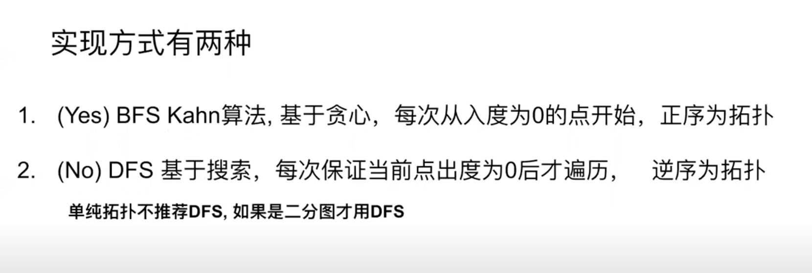
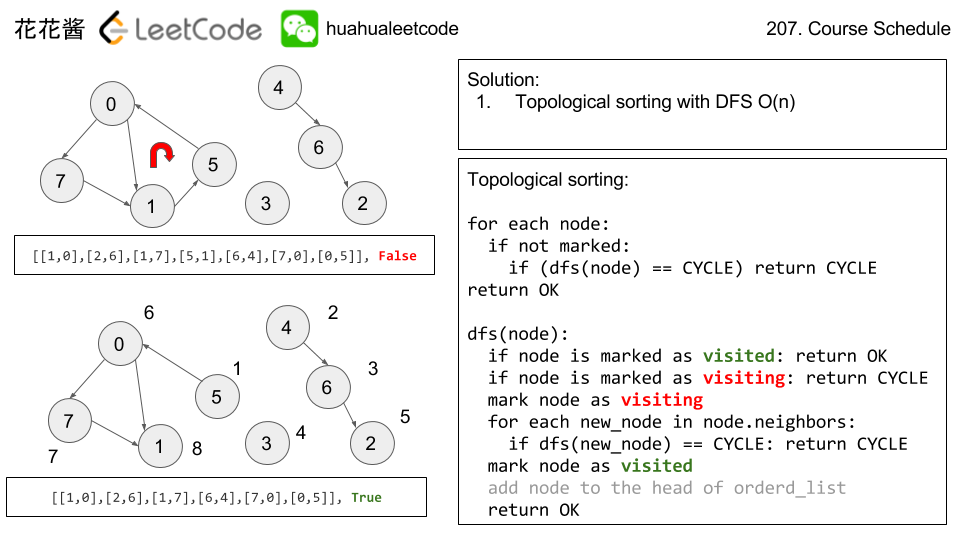
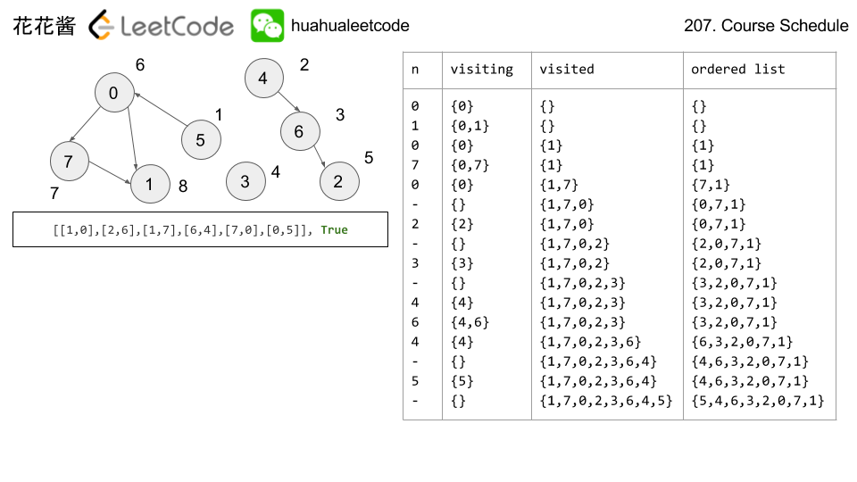

## 拓扑排序
  
[图的基础算法 -- 图的表示和拓扑排序](https://www.youtube.com/watch?v=B5hxqxBL2d)  
  
`在图论中，拓扑排序（Topological Sorting）是一个有向无环图（DAG, Directed Acyclic Graph）的所有顶点的线性序列。`  
  
有向图的拓扑排序是其顶点（节点）的线性排序，使得对于从顶点（节点） u 到顶点（节点）v 的每个有向边 uv，u 在排序中都在 v 之前。  
例如，图形的顶点（节点）可以表示要执行的任务，并且边可以表示一个任务必须在另一个任务之前执行的约束；在这个应用中，拓扑排序只是一个有效的任务顺序。  
`当且仅当图中没有定向环时（即有向无环图 DAG），才有可能进行拓扑排序，非 DAG 图没有拓扑排序一说。`  
任何有向无环图至少有一个拓扑排序。已知有算法可以在线性时间内，构建任何有向无环图的拓扑排序。  
在图论中，由一个有向无环图的顶点（节点）组成的序列，当且仅当满足下列条件时，才能称为该图的一个拓扑排序（英语：Topological sorting）：  
1. 序列中包含每个顶点（节点），且每个顶点（节点）只出现一次；
2. 若A在序列中排在B的前面，则在图中不存在从B到A的路径。  
  
拓扑排序有两种实现方式：卡恩算法、DFS。  
  
  
### 卡恩算法（推荐）
简单来说，假设 L 是存放结果的列表，先找到那些入度为零的节点，把这些节点放到 L 中，因为这些节点没有任何的父节点。然后把与这些节点相连的边从图中去掉，再寻找图中的入度为零的节点。对于新找到的这些入度为零的节点来说，他们的父节点已经都在 L 中了，所以也可以放入 L。重复上述操作，直到找不到入度为零的节点。如果此时 L 中的元素个数和节点总数相同，说明排序完成；如果 L 中的元素个数和节点总数不同，说明原图中存在环，无法进行拓扑排序。  
  
  
代码实现：
```java
class Solution {
	Map<Integer, Set<Integer>> indegree; // <itemA, <pre-requestA-of-itemA, pre-requestB-of-itemA, ...>>
	Map<Integer, Set<Integer>> outdegree; // <pre-requestA, <itemA-relys-pre-requestA, itemB-relys-pre-requestA, ...>>

	public List<Integer> main(int[][] edges) {
		init(edges);
		return topoSort();
	}

	private void init(int[][] edges) { // [[i, j], ...] means j depends on i -> i is pre-request of j, 且假设不同的 item/node 数字不重复且 >= 0（后面在找不到无依赖项的 item 时会返回 -1）
		indegree = new HashMap<>();
		outdegree = new HashMap<>();

		for (int[] edge : edges) {
			indegree.computeIfAbsent(edge[1], x -> new HashSet<>()).add(edge[0]);
			indegree.computeIfAbsent(edge[0], x -> new HashSet<>());

			outdegree.computeIfAbsent(edge[0], x -> new HashSet<>()).add(edge[1]);
			outdegree.computeIfAbsent(edge[1], x -> new HashSet<>());
		}
	}

	private int findAvailableNode() { // available node means node has no pre-request
		for (Map.Entry<Integer, Set<Integer>> entry : indegree.entrySet()) {
			if (entry.getValue().size() == 0) return entry.getKey();
		}
		return -1;
	}

	private boolean removeNode(int node) { // normally this is used for remove pre-request
		if (!outdegree.containsKey(node)) return false;
		Set<Integer> relyers = outdegree.get(node);
		for (int relyer : relyers) {
			indegree.get(relyer).remove(node);
		}
		outdegree.remove(node);
		indegree.remove(node);
		return true;
	}

	private List<Integer> topoSort() {
		List<Integer> sortedList = new ArrayList<>();
		while (indegree.size() > 0) {
			int nextAvailable = findAvailableNode();
			if (nextAvailable == -1) return new ArrayList<>(); // Graph has at least one cycle. Topological sorting is not possible
			sortedList.add(nextAvailable);
			removeNode(nextAvailable);
		}

		return sortedList;
	}
}
```
  
### DFS
另一种拓扑排序的方法运用了深度优先搜索。深度优先搜索以任意顺序循环遍历图中的每个节点。若搜索进行中碰到之前已经遇到的节点，或碰到叶节点，则中止算法。  
```
L ← 包含已排序的元素的列表，目前为空
当图中存在未永久标记的节点时：
    选出任何未永久标记的节点n
    visit(n)

function visit(节点 n)
    如n已有永久标记：
        return
    如n已有临时标记：
        stop   (不是定向无环图)
    将n临时标记
    选出以n为起点的边(n,m)，visit(m)
    重复上一步
    去掉n的临时标记
    将n永久标记
    将n加到L的起始
```
  
  
  
  
代码实现：  
```java
class Solution {    
    public List<Integer> TopoSort(int numOfNodes, int[][] dependencies) {        
        ArrayList<ArrayList<Integer>> graph = new ArrayList<>();
        ArrayList<Integer> sortedList = new ArrayList<>();

        for (int i = 0; i < numOfNodes; ++i)
            graph.add(new ArrayList<Integer>());

        for (int i = 0; i < dependencies.length; ++i) {
            int curNode = dependencies[i][0];
            int dependencyNode = dependencies[i][1];            
            graph.get(curNode).add(dependencyNode);
        }

        // int[] visited -- states: 0 == unkonwn, 1 == visiting, 2 == visited
        int[] visited = new int[numOfNodes];
        for (int i = 0; i < numOfNodes; ++i)
            if (dfs(i, graph, visited, sortedList)) return new ArrayList<>(); // empty list means fail with circle

        return sortedList;
    }
    
    private boolean dfs(int curNode, ArrayList<ArrayList<Integer>> graph, int[] visited, ArrayList<Integer> sortedList) {
        if (visited[curNode] == 1) return true; // 有环，返回 true
        if (visited[curNode] == 2) return false; // 以前已访问处理过，返回 false 剪枝

        visited[curNode] = 1; // 1 == visiting

		// dependencyNode 即 nextNode（下一个递归访问的节点）或者叫 parentNode, dfs 在第一次递归中会一直溯源到 rootNode（所有节点的最顶的同一个的根节点，该节点再无父节点）为止
        for (int dependencyNode : graph.get(curNode))
            if (dfs(dependencyNode, graph, visited, sortedList)) return true;

        sortedList.add(curNode);
        visited[curNode] = 2; // 2 == visited
        return false;
    }
}
```
  
相关例题  
[Leetcode Q207](./../Leetcode%20Practices/algorithms/medium/207%20Course%20Schedule.java)  
[Leetcode Q210](./../Leetcode%20Practices/algorithms/medium/210%20Course%20Schedule%20II.java)  
  
参考：  
http://zxi.mytechroad.com/blog/graph/leetcode-207-course-schedule/  
https://zh.wikipedia.org/wiki/%E6%8B%93%E6%92%B2%E6%8E%92%E5%BA%8F/  
https://oi-wiki.org/graph/topo/  
https://oi-wiki.org/graph/dag/  
