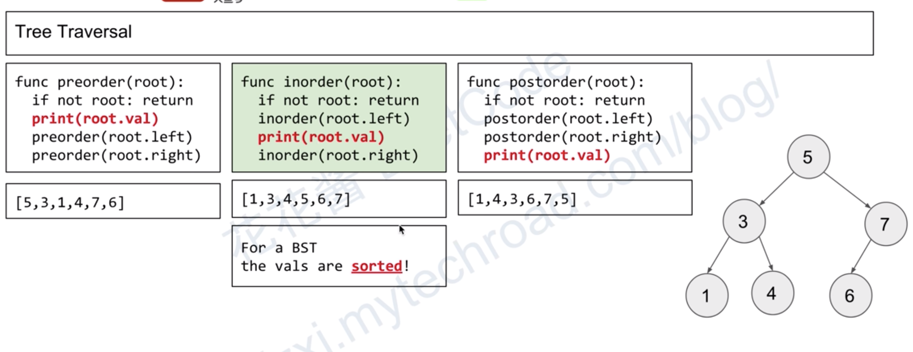

遍历既可以应用在树上也可以应用在图上，无论是树还是图，遍历都可以大致分为两类：1. 深度优先，2. 广度优先。  
  
# 树的遍历
1. 深度优先：深度优先又可以分为三类：即前序遍历、中序遍历和后序遍历。（以下是树遍历的图解，例子中的树为二叉搜索树 BST，遍历也适合其他的树数据结构）
   
2. 广度优先：（无论图还是树，一般常用 Queue 来实现广度优先搜索）。
  
二叉树的前序、中序、后序这三种遍历用递归实现非常简单：  
* 前序遍历：打印根节点、遍历左子树、遍历右子树
* 中序遍历：遍历左子树、打印根节点、遍历右子树
* 后序遍历：遍历左子树、遍历右子树、打印根节点

## 莫里斯遍历
以下转载自：https://code0xff.cn/post/2021/10/%E8%8E%AB%E9%87%8C%E6%96%AF%E9%81%8D%E5%8E%86/  

递归版本很简单，用栈模拟递归也不难，本文主要说说莫里斯遍历，顺带补充迭代版本。  
莫里斯遍历是由 J. H. Morris 在 1979 年的论文「Traversing Binary Trees Simply and Cheaply」中首次提出，因此被称为 Morris 遍历。  
Morris 遍历的核心是利用树中的空闲指针，将空间缩减为常数。  

前序、中序、后序遍历的时间复杂度都是 O(N)，其中 N 为二叉搜索树的节点数。Morris 遍历中每个节点会被访问两次，因此总时间复杂度为 O(2*N) = O(N)。  

前序、中序、后序遍历的递归和栈模拟递归版本空间复杂度是 O(h)，这里的 h 是树的高度。  
前序、中序、后序遍历的莫里斯版本空间复杂度是 O(1)。  
```java
public void morrisPreOrder(TreeNode root) {
   // Morris 前序遍历模版
   // Time: O(2*N) = O(N), Space: O(1)
   TreeNode tmp = null;

   while (root != null) {
      if (root.left != null) {
            tmp = root.left; // tmp 节点就是当前 root 节点向左走一步，然后一直向右走至无法走为止（后面的 while 要找到以 root.left 为根节点的左子树的最右节点）
            while (tmp.right != null && tmp.right != root) {
               tmp = tmp.right;
            }
            
            if (tmp.right == null) { // 为空说明是第一次访问，让 tmp 的右指针指向 root，继续遍历左子树
               tmp.right = root;
               root = root.left;
            } else { // 最右节点不空，说明访问过了（且以 root.left 为根节点的左子树已经访问完了），要断开，并 process 当前 root 节点
               process(root);
               tmp.right = null;
               root = root.right;
            }
      } else { // 如果没有左孩子，则直接访问右孩子
            process(root);
            root = root.right;
      }
   }
}
```

### 例题
[Leetcode 99 - Morris 中序遍历解决方案](./../Leetcode%20Practices/algorithms/medium/99%20Recover%20Binary%20Search%20Tree.java)  

## 其他套路
### 中序遍历（root 后继节点、root 前驱节点 - 只适用于根节点）
```java
public TreeNode inOrderNext(TreeNode root) { // 找 root 节点的后继节点
   root = root.right;
   while (root.left != null) root = root.left;
   return root;
}

public TreeNode inOrderLast(TreeNode root) { // 找 root 节点的前驱节点
   root = root.left;
   while (root.right != null) root = root.right;
   return root;
}
```


# 图遍历
图遍历模版：  
使用 BFS 与 DFS 遍历图  
使用 BFS 与 DFS 判断图是否有环  
```java
class Edge { // data structure to store graph edges
	int source, dest;

	public Edge(int source, int dest) {
		this.source = source;
		this.dest = dest;
	}
}

class Graph { // class to represent a graph object
	Map<Integer, List<Integer>> adjMap = new HashMap<>(); // A map represent each node and its adjacency nodes
   boolean undirected = true;
   Map<Integer, Integer> indegree = null; // 用于拓扑排序卡恩算法 - BFS 检测有向图是否有环

	Graph (List<Edge> edges, boolean undirected = true) {
      this.undirected = undirected;
      if (!this.undirected) indegree = new HashMap<>();
		for (Edge edge : edges) { // add edges to the undirected graph
			int source = edge.source;
			int dest = edge.dest;
         adjMap.computeIfAbsent(source, k -> new ArrayList<Integer>() {{ add(dest); }});
         if (this.undirected) {
            adjMap.computeIfAbsent(dest, k -> new ArrayList<Integer>() {{ add(source); }});
         } else {
            indegree.put(source, indegree.getOrDefault(source, 0)); // 保证 0 入度节点也在 indegree 哈希表
            indegree.put(dest, indegree.getOrDefault(dest, 0) + 1); // increment in-degree of destination vertex by 1
         }
		}
	}

   public void dfs(Integer start) { // Time: O(V+E), Space: O(V)
      recurse(start, new HashSet<>());
   }

   private void recurse(Integer cur, Set<Integer> visited) {
      if (visited.add(cur)) {
         System.out.println(cur);
         for (int next : adjMap.getOrDefault(cur, new ArrayList<>())) {
            recurse(next, visited);
         }
      }
   }

   public void bfs(Integer start) { // Time: O(V+E), Space: O(V)
      Set<Integer> visited = new HashSet<Integer>() {{ add(start); }};
      Queue<Integer> queue = new LinkedList<Integer>() {{ add(start); }};
      while (!queue.isEmpty()) {
         int cur = queue.poll();
         System.out.println(cur);
         for (int next : adjMap.getOrDefault(cur, new ArrayList<>())) {
            if (visited.add(next)) queue.add(next);
         }
      }
   }

   public boolean dfsDetectCycle(Integer start) {
      Set<Integer> visited = new HashSet<>();
      if (this.undirected) { // 无向图 Time: O(V), Space: O(V); https://www.baeldung.com/cs/cycles-undirected-graph
         return dfsDetectUndirectedGraphCycle(Integer.MIN, start, visited); // 应该用 null，为了 recurse 代码简洁直观用 MIN 特殊代替
      } else { // 有向图
         // [拓扑排序 DFS 算法](./拓扑排序.md)
      }
   }

   private boolean dfsDetectUndirectedGraphCycle(Integer parent, Integer cur, Set<Integer> visited) {
      visited.add(cur);
      for (int next : adjMap.get(cur)) { // 无向图，所有节点在哈希表均有 dest/to 节点，无需 getOrDefault
         if (visited.contains(next)) {
            if (cur == next || next != parent) return true;
         } else if (dfsDetectUndirectedGraphCycle(cur, next, visited)) {
            return true;
         }
      }
      return false;
   }

   public boolean bfsDetectCycle(Integer start) {
      if (this.undirected) { // 无向图 Time: O(V), Space: O(V)
         Set<Integer> visited = new HashSet<>();
         Queue<int[]> queue = new LinkedList<>() {{ add(new int[]{Integer.MIN, start}); }};
         while (!queue.isEmpty()) {
            int[] parentAndCur = queue.poll();
            int parent = parentAndCur[0], cur = parentAndCur[1];
            visited.add(cur);
            for (int next : adjMap.get(cur)) { // 无向图，所有节点在哈希表均有 dest/to 节点，无需 getOrDefault
               if (visited.contains(next)) {
                  if (cur == next || next != parent) return true;
               } else {
                  queue.add(new int[]{cur, next});
               }
            }
         }
         return false;
      } else { // 有向图
         // [拓扑排序卡恩算法](./拓扑排序.md)
      }
   }
}
```
上面的模版中，无向图与有向图都使用对象表示，实际上也都可以[使用更简单的 2 维数组表示](./../Common%20Data%20Structure%20and%20Data%20Type/Data%20Structure%20Implementation/Graph)。  
