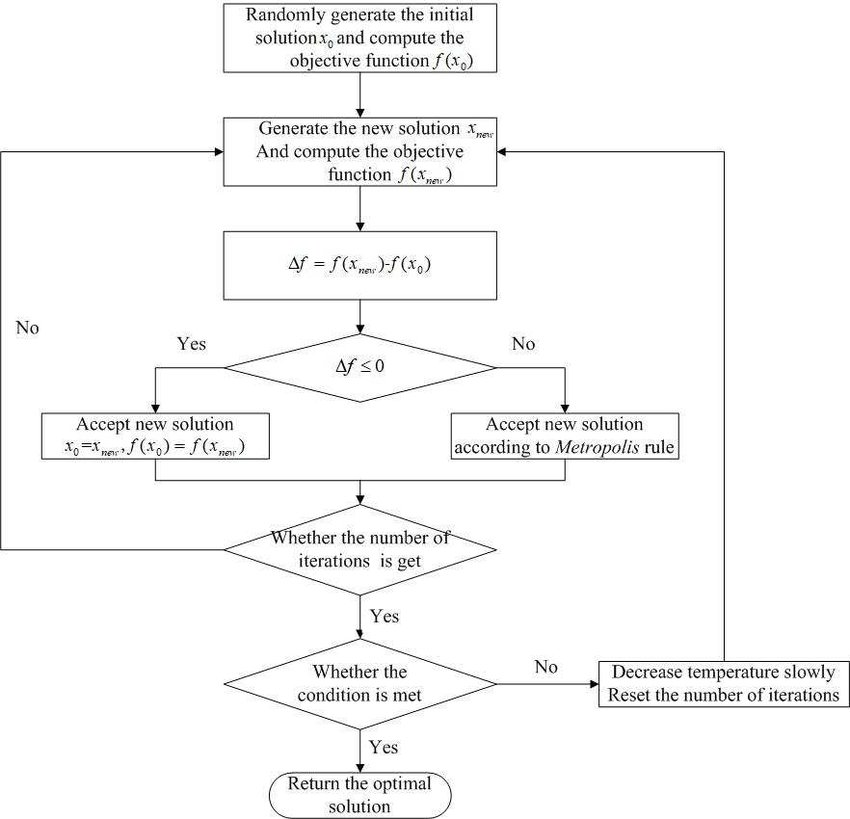

# 模拟退火
模拟退火（英语：Simulated annealing，缩写作 SA）是一种通用随机化算法，常用来在一定时间内寻找在一个很大搜寻空间中的近似最优解（比如组合问题等等）。  

参考：
* https://zhuanlan.zhihu.com/p/266874840
* https://www.cnblogs.com/heaad/archive/2010/12/20/1911614.html
* https://imonce.github.io/2019/11/06/%E5%90%AF%E5%8F%91%E5%BC%8F%E7%AE%97%E6%B3%95%E5%AD%A6%E4%B9%A0%EF%BC%88%E4%BA%8C%EF%BC%89%EF%BC%9A%E6%A8%A1%E6%8B%9F%E9%80%80%E7%81%AB%E7%AE%97%E6%B3%95/

## Metropolis 准则
Metropolis 准则，也称为 Metropolis-Hastings 算法，是一种用于蒙特卡洛模拟中的概率采样方法，广泛应用于统计物理学、贝叶斯推断等领域。该准则用于在随机搜索和优化问题中决定是否接受一个新的样本或解。  
Metropolis 准则基于概率，它的核心思想是在搜索过程中，接受一个更差的解的概率是随着时间的推移逐渐减小的。  

## 准确性
模拟退火算法是一种随机算法，并不一定能找到全局的最优解，可以比较快的找到问题的近似最优解。如果参数设置得当，模拟退火算法搜索效率比穷举法要高。  

模拟退火算法在搜索全局最优解时存在一定的概率得出错误的结果，这是由于其随机性质以及在一些情况下可能陷入局部最优解。模拟退火算法的核心思想是通过接受一定概率的差解来跳出局部最优解，但这也可能导致在全局搜索中错过真正的全局最优解。  
虽然模拟退火算法通常能够在大多数情况下在全局最优解附近找到很好的解，但并不能保证始终找到全局最优解。搜索的结果可能受到算法的参数设置、初始解的选择以及温度退火策略的影响。  

为了减小错误的概率，可以采取以下措施：
1. 调整参数：调整模拟退火算法的参数，如初始温度、温度衰减率等，以寻找更合适的参数配置，提高找到全局最优解的概率。
2. 多次运行：多次运行模拟退火算法，每次使用不同的初始解和随机数种子，然后选择其中的最优解。这样可以增加搜索空间的覆盖率，减小漏掉全局最优解的风险。
3. 结合其他方法：将模拟退火算法与其他优化算法结合，例如遗传算法、粒子群算法等，从不同的角度进行搜索，提高找到全局最优解的可能性。

尽管模拟退火算法可能不保证找到全局最优解，但它在解决各种优化问题时仍然是一种有效的工具，特别是在问题的搜索空间较大或复杂时。  

By ChatGPT  

## 例题
* [Leetcode Q1879](../Leetcode%20Practices/algorithms/hard/1879%20Minimum%20XOR%20Sum%20of%20Two%20Arrays.java)
* 旅行商问题 (TSP - Traveling Salesman Problem) 

