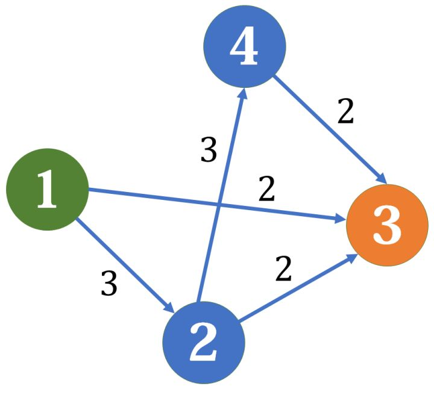

# 网络流
转载自：https://zhuanlan.zhihu.com/p/122375531  

网络流是算法中的一个重要的模型，它分为两部分：网络和流。  
网络，其实就是一张有向图，其上的边权称为容量。额外地，它拥有一个源点和汇点。  

  

流，顾名思义，就像水流或电流，也具有它们的性质。如果把网络想象成一个自来水管道网络，那流就是其中流动的水。每条边上的流不能超过它的容量，并且对于除了源点和汇点外的所有点（即中继点），流入的流量都等于流出的流量。  
网络流中最常见的问题就是网络最大流。假定从源点流出的流量足够多，求能够流入汇点的最大流量。例如对上面那张网络而言，最大流是5，其中1->3提供2流量，1->2->3提供2流量（这有点像木桶原理，某条路径的容量是由最窄的一根水管决定的），1->2->4->3提供1流量（注意这里不是2，因为上条路径已经占用了1->2的2单位容量，只剩1单位容量可用）。  

解决这个问题最常用的是 Ford-Fulkerson 算法及其优化。  

## 应用
网络流算法在计算机科学和工程中有广泛的应用，特别是在解决涉及流量分配、资源优化和图论的问题时。以下是一些常见的应用场景：

1. 最大流问题
交通流量优化：在交通网络中，最大流算法可以用于优化交通流量，减少拥堵。
通信网络：在计算机网络中，用于优化数据包的路由，确保网络带宽的最优利用。
供水网络：在城市供水系统中，用于最大化从水源到用户的供水量。
2. 最小割问题
图像分割：在计算机视觉中，用于图像分割，将图像分割成前景和背景部分。
社区检测：在社交网络分析中，用于检测社区或群体，通过最小割来找到社交网络中的紧密子集。
3. 匹配问题
二分图最大匹配：在任务分配、婚配问题中，用于找到最大匹配，例如，在公司员工和任务之间分配任务。
稳定婚姻问题：在稳定婚姻问题中，使用网络流算法可以找到一种稳定的婚配方式。
4. 可行流问题
物流和供应链管理：在物流网络中，用于确定从多个供应商到多个需求点的最优货物流动。
电力网络：在电力传输网络中，用于优化电力从发电站到各个地区的传输。
5. 最小费用最大流问题
运输问题：在运输网络中，确定最小成本的货物运输方案。
任务调度：在任务调度问题中，确定在最小成本下完成所有任务的方案。
6. 其他应用
项目选择和投资：在项目管理中，用于选择一组项目，使得总收益最大化。
信息流分析：在信息传播模型中，用于分析信息在社交网络中的传播路径和效率。
医疗资源分配：在医疗系统中，用于优化医疗资源（如医生、设备）的分配，以满足患者需求。

## Ford-Fulkerson 算法
FF 算法的核心在于找增广路。  
ToDo...  
