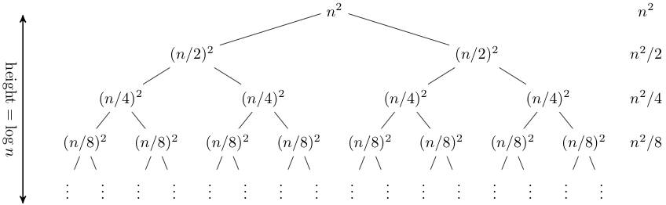
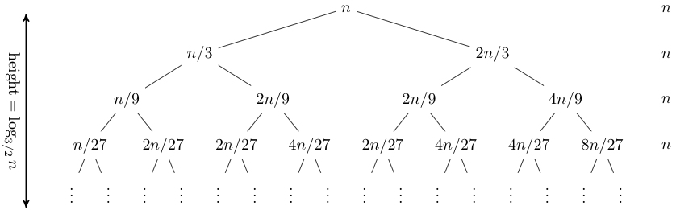

https://www.cs.cornell.edu/courses/cs3110/2012sp/lectures/lec20-master/lec20.html  
https://www.cnblogs.com/liang24/p/13277431.html  

排序时，利用递推公式推导时间复杂度来求解归并排序、快速排序的时间复杂度，但有些情况，例如快速排序的平均时间复杂度，利用递推公式，会涉及很复杂的数据推导。这时可以一种特殊的树来分析递归算法的时间复杂度，那就是递归树。  

递归树与时间复杂度  
递归算法的思路是把大问题分成小问题来解决，一层一层的分解，直到问题规模足够小，不需要再递归为止。  
把这个一层一层的分解过程画成图，它其实是一颗树。给它起个名字叫递归树。  

# 分析
假设递归方程为 T(n) = 2T(n/2) + n^2  
  
从图可以看出总和为 O(n^2)  

递归树有助于获取递归的 closed form 的直观，但它们不是证明（事实上，递归树很容易得到错误的答案，就像任何包含 '...' 推理的方法）。为递归建立 closed form 的一个好方法是进行有根据的猜测，然后通过归纳证明你的猜测确实是一个解。递归树是一种很好的猜测方法。  

假设另一个递归方程为 T(n) = T(n/3) + T(2n/3) + n  
  
从图看出树是不平衡的，右侧树是最长路径且长度为 log(3/2)n，所以该递归的 closed form 的猜测是 O(N*logN)。  

## 主方法（The Master Method）
主方法是一种用于解决递归问题的 cookbook 方法。虽然它不能解决所有的递归情况，但在许多递归实践中的处理还是很方便的。  
假设递归的方程 T(n) = aT(n/b) + f(n)  

We can visualize this as a recurrence tree, where the nodes in the tree have a branching factor of a. The top node has work f(n) associated with it, the next level has work f(n/b) associated with each of a nodes, the next level has work f(n/b^2) associated with each of a^2 nodes, and so on. At the leaves are the base case corresponding to some 1 ≤ n < b. The tree has logbn levels, so the total number of leaves is a^logbn = n^logba.  

The total time taken is just the sum of the time taken at each level. The time taken at the i-th level is a^i*f(n/b^i), and the total time is the sum of this quantity as i ranges from 0 to logb(n−1), plus the time taken at the leaves, which is constant for each leaf times the number of leaves, or O(n^logba). Thus  

T(n) = (Σ0≤i<logbn)a^i*f(n/b^i) + O(n^logba).  

What this sum looks like depends on how the asymptotic growth of f(n) compares to the asymptotic growth of the number of leaves. There are three cases:  
* Case 1: f(n) is O(n^logb(a−ε)). Since the leaves grow faster than f, asymptotically all of the work is done at the leaves, so T(n) is Θ(n^logba).
* Case 2: f(n) is Θ(n^logba). The leaves grow at the same rate as f, so the same order of work is done at every level of the tree. The tree has O(log n) levels, times the work done on one level, yielding T(n) is Θ(n^logba*logn).
* Case 3: f(n) is Ω(n^logb(a+ε)). In this case f grows faster than the number of leaves, which means that asymptotically the total amount of work is dominated by the work done at the root node. For the upper bound, we also need an extra smoothness condition on f in this case, namely that a*f(n/b) ≤ c*f(n) for some constant c < 1 and large n. In this case T(n) is Θ(f(n)).
