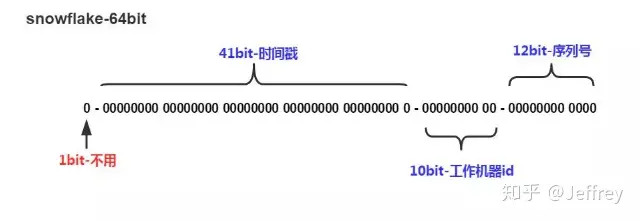

# 雪花算法
转载自：  
https://zh.wikipedia.org/wiki/%E9%9B%AA%E8%8A%B1%E7%AE%97%E6%B3%95  
https://en.wikipedia.org/wiki/Snowflake_ID  
  
雪花算法（Snowflake）是一种生成分布式全局唯一 ID 的算法，生成的 ID 称为 Snowflake IDs 或 snowflakes。这种算法由 Twitter 创建，并用于推文的 ID。Discord 和 Instagram 等其他公司采用了修改后的版本。  
  
一个 Snowflake ID 有 64 位元。前 41 位是时间戳，表示了自选定的时期以来的毫秒数。接下来的 10 位代表计算机 ID，防止冲突。其余 12 位代表每台机器上生成 ID 的序列号，这允许在同一毫秒内创建多个 Snowflake ID。SnowflakeID 基于时间生成，故可以按时间排序。此外，一个 ID 的生成时间可以由其自身推断出来，反之亦然。该特性可以用于按时间筛选 ID，以及与之联系的对象。  
  
示例：  
1358666646167748608  
Snowflake ID  
别名	Twitter Snowflake  

数据中心 ID 和机器 ID 是在启动时选择的，通常一旦系统运行起来就会固定。对数据中心 ID 和机器 ID 的任何更改都需要仔细审查，因为这些值的意外更改可能导致 ID 冲突。  

## 其他
https://zhuanlan.zhihu.com/p/85837641  

UUID 是 Java 自带的生成一串唯一随机 36 位字符串（32 个字符串 + 4 个 “-”）的算法。它可以保证唯一性，且据说够用 N 亿年，但是其业务可读性差，无法有序递增。所以需要其他方案。  

Snowflake 是 Twitter 公司采用的一种算法，目的是在分布式系统中产生全局唯一且趋势递增的 ID，且性能较高。  
雪花算法的实现主要依赖于数据中心 ID 和数据节点 ID 这两个参数：  
  
