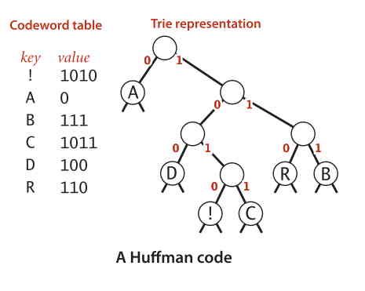
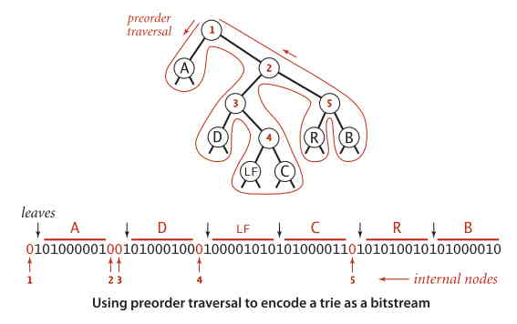

霍夫曼压缩算法是一种能够大幅压缩自然语言文件空间（以及许多其他类型文件）的数据压缩算法。其主要思想：放弃文本文件的普通保存方式，不再使用 7 位或 8 位二进制数表示每一个字符，而是用较少的比特表示出现频率最高的字符，用较多的比特表示出现频率低的字符，简而言之，不再用 ASCII 编码表示，而是用较短的前缀码表示。  
  
使用变长编码来表示字符串，势必会导致编解码时码字的唯一性问题，因此需要一种编解码方式唯一的前缀码。  
  
**前缀码**  
什么是前缀码？如果所有字符编码都不会成为其他字符编码的前缀，符合这种规则的叫前缀码。比如，如果 A 的编码为 0，R 的编码为 00，那么 A 的编码是 R 的前缀，这不属于前缀码。  
  
那么前缀码的例子是什么样的呢？如下：  
```
例如，若将 A 编码为 0、B 为 1111、C 为 110、D 为 100、R 为 1110、! 为 101，那么将以下长为 30 的比特字符串解码的方式就只有 ABRACADABRA! 一种了：
011111110011001000111111100101
```  
所有的前缀码的解码方式都和它一样，是唯一的。因此前缀码被广泛应用于实际生产中。注意，像 7 位 ASCII 编码这样的定长编码也是前缀码。  
  
而表示前缀码的一种简单方式就是使用单词查找树，其中最优前缀码即为 Huffman 首创。  
  
对各符号进行霍夫曼编码的动态基本步骤是将出现频率由小到大排列，组成子树后频率相加作为整体再和其他未加入二叉树中的节点频率比较。加权路径长为节点的频率乘以树的深度。  
  
霍夫曼单词查找树：  
  
  
根据字符串出现的字符，将 ASCII 替换成更短的表示形式 -- 霍夫曼压缩码。  
首先，树的结点包含 left 和 right，和一个字符频率变量 freq，以及字符 ch。以下为构造一颗霍夫曼单词查找树的过程（根据字符串出现频率，构建 Trie 树）：  
1. 将需要被编码的字符放在叶子结点中并在每个结点中维护了一个名为 freq 的实例变量来表示以它为根结点的子树种的所有字符出现的频率。
2. 创建一片由许多只有一个结点（即叶子结点）的树所组成的森林。每棵树都表示输入流的一个字符，每个结点中的 freq 表示它在输入流中的出现频率。
3. 找到两个频率最小的结点，然后创建一个以二者为子结点的新结点（新结点的频率为它的两个子结点的频率之和）。
4. 不断重复第 3 过程，最终所有的结点会被合并为一颗单独的单词查找树。  
  
特点：  
* 树的叶子结点包含 freq 和字符。
* 频率高的离根结点最近，频率低的在树的底层（算法实现过程中可以通过 PriorityQueue 来达成预处理的排序）。
* 根结点频率值等于输入中的字符数量。
* 该树表示的编码压缩比其他树更多，是一种最优的前缀码  
  
### 压缩  
对于任意单词查找树，都能产生一张将树中的字符和比特字符串（用由 0 和 1 组成的 String 字符串表示）相对应的编译表。其实就是字符和它的比特字符串的符号表。在这里用 st[] 数字表示。在构造符号表时 buildCode() 递归遍历整棵树，并为每个结点维护一条从根结点到它的路径所对应的二进制字符串（左链接表示 0，右链接表示 1）。到达一个叶子结点后，就将结点的编码设为该二进制字符串。  
  
### 解压
首先 readTrie() 将霍夫曼单词查找树编码为的比特流构造为霍夫曼查找树。然后读取霍夫曼压缩码，根据该编码从根结点向下移动（读取一个比特，为 0 移动到左结点，为 1 移动到右结点）。当遇到叶子结点后，输出该结点的字符并重新回到根结点。  
例如压缩 ABRACADABRA! 后的编码为：0111110010110100011111001010，其单词查找树的比特流为：01010000010010100010001001000011010000110101010010101000010（使用前序遍历将霍夫曼单词查找树编码为比特流）。  
  
首先由树的比特流构造霍夫曼查找树（图1），然后解码编码。第一个为 0，所以移动到左子结点，输出 A；回到根，然后连续三个 1，即向右移动 3 次，输出 B；回到根，然后两个 1，一个 0，即向右移动两次，向左移动一次，输出 R。如此重复，最后得到 ABRACADABRA!。  
  
  
### 参考
https://algorithm.yuanbin.me/zh-hans/basics_data_structure/huffman_compression.html  
https://github.com/tclxspy/Articles/blob/master/algorithm/MD/%E7%AE%97%E6%B3%95%2319--%E9%9C%8D%E5%A4%AB%E6%9B%BC%E5%8E%8B%E7%BC%A9%EF%BC%88%E6%95%B0%E6%8D%AE%E5%8E%8B%E7%BC%A9%EF%BC%89.md  
https://coolshell.cn/articles/7459.html  
https://zh.wikipedia.org/wiki/%E9%9C%8D%E5%A4%AB%E6%9B%BC%E7%BC%96%E7%A0%81  
