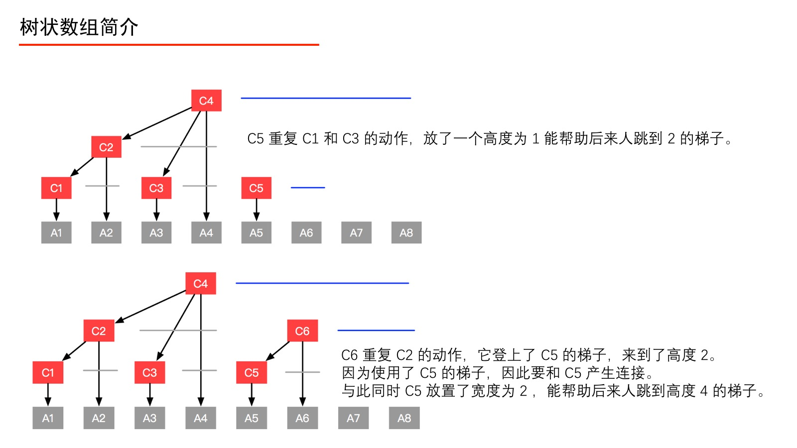
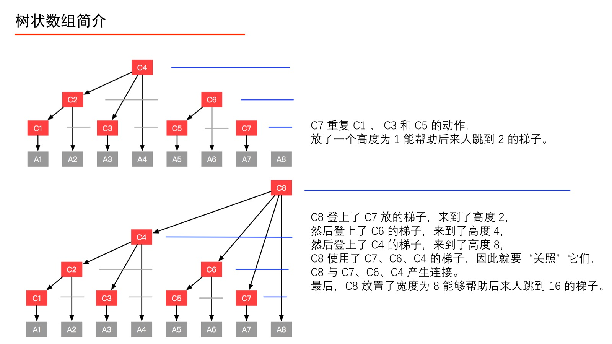

## 前置知识
[前缀和与差分](../../../Common%20Algorithm%20and%20Theory/前缀和与差分.md)  
  
## 树状数组
如果要执行“单点更新”，就得更新前缀和数组，又得计算一次前缀和，时间复杂度为 O(N)。那如果在一次业务场景中“前缀和”和“单点更新”的次数都很多，前缀和数组就不高效了。而 Fenwick 树（树状数组）就是“高效的”实现“前缀和”和“单点更新”这两个操作的数据结构。  
树状数组插入和查询都可以优化到 O(logN)。差分和前缀和适合用在查询或修改次数十分巨大的时候，当修改和查询在同一复杂度时适合用树状数组。  
*树状数组或二元索引树（英语：Binary Indexed Tree），简称 BIT，又以其发明者命名为 Fenwick 树，最早由 Peter M. Fenwick 于1994年以 A New Data Structure for Cumulative Frequency Tables 为题发表在 SOFTWARE PRACTICE AND EXPERIENCE。其初衷是解决数据压缩里的累积频率（Cumulative Frequency）的计算问题，现多用于高效计算数列的前缀和，区间和。它可以以 $\displaystyle O(\log n)$ 的时间得到任意前缀和 $\displaystyle \sum _{i=1}^{j}A[i],1<=j<=N$，并同时支持在 $\displaystyle O(\log n)$ 时间内支持动态单点值的修改。空间复杂度 $\displaystyle O(n)$。*  
  
根据数组 `[1, 2, 3, 4, 5]` 来创建对应的树状数组：  
  
  
树状数组长什么样子  
  

例：以一个有 8 个元素的数组 A 为例（如上图），在数组 A 之上建立一个数组 C，使得数组 C 的形成如上的一个多叉树形状，数组 C 就是一个树状数组。此时有以下疑问：  
1、树状数组要建成动态的树形结构吗？  
分析：不。学习过堆、线段树的一定知道，使用数组就能方便地索引左右孩子结点、双亲结点（因为规律特别容易找到），这样的树就不必创建成结点、指针那样的动态树形结构。  
2、如何解释“前缀和查询”、“单点更新”？  
分析：例如当要查询“前缀和(4)”，本来应该问 A1、A2、A3、A4，有了数组 C 之后，只要问 C4 即可。再如，要更新结点 A1 的值，只要自底向上更新 C1、C2、C4、C8 的值即可。  
  
理解数组 C 的定义  
首先强调一下，树状数组的下标从 1 开始计数，这一点看到后面就会很清晰了。先了解如下的定义，请一定先记住这些记号所代表的含义：  
1、数组 C 是一个对原始数组 A 的预处理数组。  
2、还要熟悉几个记号。为了方便说明，避免后面行文啰嗦，将固定使用记号 i、j、k，它们的定义如下：
记号 i：表示预处理数组 C 的索引（十进制表示）。
记号 j：表示原始数组 A 的索引（十进制表示）。
通过以下的图，来看看 C1、C2、C3、C4、C5、C6、C7、C8 分别是如何定义的。  
  
  
  
  
  
  
  
树状数组和线段树相似，但还有一些区别：树状数组能有的操作，线段树一定有；线段树有的操作，树状数组不一定有。  
  
### 参考
https://zh.wikipedia.org/wiki/%E6%A0%91%E7%8A%B6%E6%95%B0%E7%BB%84  
https://www.acwing.com/blog/content/80/  
https://zhuanlan.zhihu.com/p/93795692  
