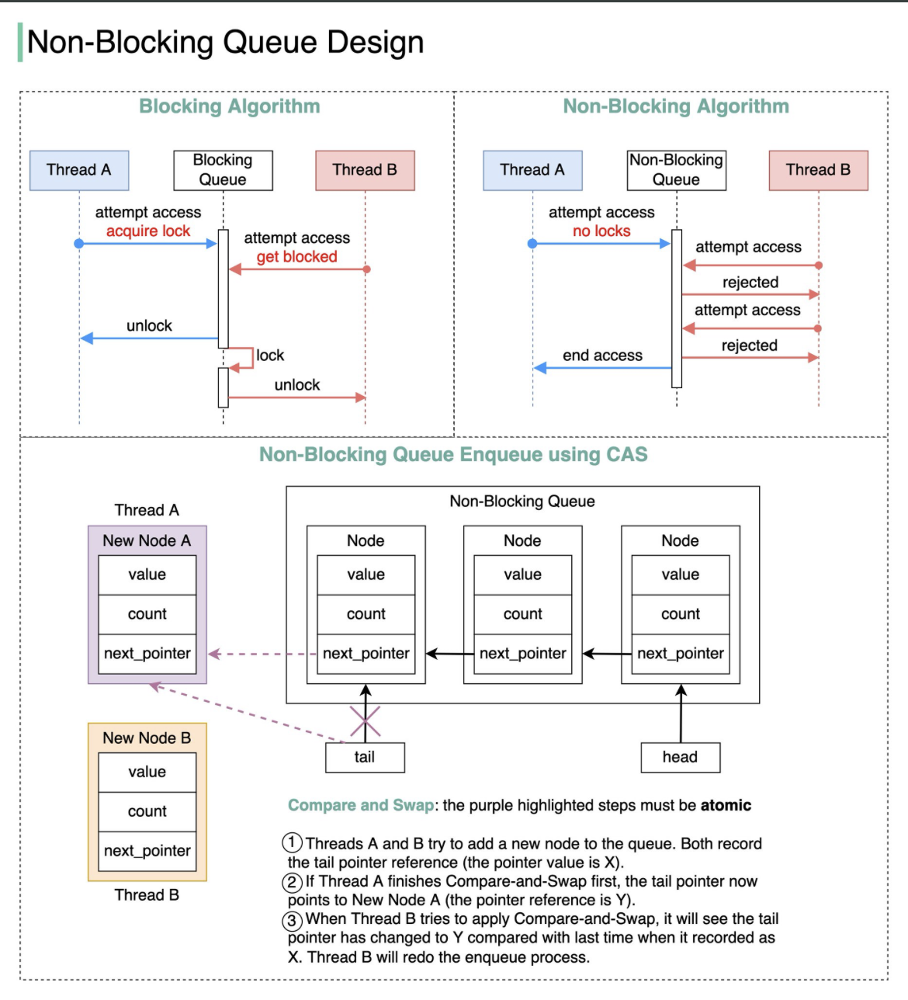

## 阻塞队列
阻塞队列 (BlockingQueue) 是 java.util.concurrent 包下重要的数据结构，也是用于解决并发生产者/消费者问题的最有用的类，BlockingQueue 提供了线程安全的队列访问方式：当阻塞队列进行插入数据时，如果队列已满，线程将会阻塞等待直到队列非满；从阻塞队列取数据时，如果队列已空，线程将会阻塞等待直到队列非空。  
阻塞队列与普通队列的区别在于，当队列是空的时，从队列中获取元素的操作将会被阻塞；或者当队列是满时，往队列里添加元素的操作会被阻塞，此时等待队列，直到有空位置，然后插入。（普通队列，要么直接扩容，要么直接无法插入，不阻塞）。试图从空的阻塞队列中获取元素的线程将会被阻塞，直到其他的线程往空的队列插入新的元素；同样，试图往已满的阻塞队列中添加新元素的线程同样也会被阻塞，直到其他的线程使队列重新变得空闲起来，比如从队列中移除一个或者多个元素，或者完全清空队列。  

除了阻塞队列外，也可以通过 CAS 保证非阻塞队列线程安全：  

  
### BlockingQueue 应用场景
通常是[多线程生产者消费者模式/场景](../../../Tool%20Sets/Queue.java)下使用。  

### 实现 BlockingQueue 接口
[示例代码 1](MyBlockingQueue.java)  
[示例代码 2](../../../Leetcode%20Practices/algorithms/medium/1188%20Design%20Bounded%20Blocking%20Queue.java)  
  
### 为什么阻塞？
**多线程环境中，通过队列可以很容易实现数据共享，比如经典的“生产者”和“消费者”模型中，通过队列可以很便利地实现两者之间的数据共享。假设我们有若干生产者线程，另外又有若干个消费者线程。如果生产者线程需要把准备好的数据共享给消费者线程，利用队列的方式来传递数据，就可以很方便地解决他们之间的数据共享问题。但如果生产者和消费者在某个时间段内，万一发生数据处理速度不匹配的情况呢？理想情况下，如果生产者产出数据的速度大于消费者消费的速度，并且当生产出来的数据累积到一定程度的时候，那么生产者必须暂停等待一下（阻塞生产者线程），以便等待消费者线程把累积的数据处理完毕，反之亦然。然而，在 concurrent 包发布以前，在多线程环境下，每个程序员都必须去自己控制这些细节，尤其还要兼顾效率和线程安全，而这会给开发者的程序带来不小的复杂度。好在此时，强大的 concurrent 包横空出世了，而他也给开发者带来了强大的 BlockingQueue。（在多线程领域：所谓阻塞，在某些情况下会挂起线程 - 即阻塞，一旦条件满足，被挂起的线程又会自动被唤醒），下面是 BlockingQueue 的两个常见阻塞场景：**  
* **当队列中没有数据的情况下，消费者端的所有线程都会被自动阻塞（挂起），直到有数据放入队列。**
* **当队列中填满数据的情况下，生产者端的所有线程都会被自动阻塞（挂起），直到队列中有空的位置，线程被自动唤醒。**  
  
**这也是在多线程环境下为什么需要 BlockingQueue 的原因。作为 BlockingQueue 的使用者，开发者再也不需要关心什么时候需要阻塞线程，什么时候需要唤醒线程，因为这一切都由 BlockingQueue 给一手包办了。**  
[更多参考](https://www.cnblogs.com/tjudzj/p/4454490.html)  
  
## 无限队列 vs 有限队列
以下将介绍 BlockingQueue 接口的 API 以及如何使用该接口的方法使编写并发程序更容易。  
java.util.concurrent 提供了两种类型的 BlockingQueue：  
* 无限（无界）队列 （ unbounded queue ） - 几乎可以无限增长
* 有限（有界）队列 （ bounded queue ） - 定义了最大容量  
  
### 无限队列
创建一个无限队列的方法很简单  
```java
BlockingQueue<String> blockingQueue = new LinkedBlockingDeque<>();
```
上面这段代码中，blockingQueue 的容量将设置为 Integer.MAX_VALUE。  
向无限队列添加元素的所有操作都将永远不会阻塞，因此它可以增长到非常大的容量。  
使用无限 BlockingQueue 设计生产者 - 消费者模型时最重要的是 消费者应该能够像生产者向队列添加消息一样快地消费消息。否则，内存可能会填满，然后就会得到一个 OutOfMemory 异常。  
  
### 有限队列
第二种类型的队列是有限队列。可以通过将容量作为参数传递给构造函数来创建这样的队列  
```java
BlockingQueue<String> blockingQueue = new LinkedBlockingDeque<>(10);
```
上面这句代码中，设置了 blockingQueue 的容量为 10。这意味着当消费者尝试将元素添加到已经满了的队列时，结果取决于添加元素的方法（offer() 、add() 、put()），它将阻塞，直到有足够的空间可以插入元素。否则，添加操作将会失败。  
使用有限队列是设计并发程序的好方法，因为当将元素插入到已经满了的队列时，这些操作需要等到消费者赶上并在队列中提供一些空间。这种机制可以让那个我们不做任何其它更改就可以实现节流。  
  
### BlockingQueue API
BlockingQueue 接口的所有方法可以分为两大类：负责向队列添加元素的方法和检索这些元素的方法。  
在队列满/空的情况下，来自这两个组的每个方法的行为都不同。  

#### 添加元素
BlockingQueue 提供了以下方法用于添加元素:  
* add()	如果插入成功则返回 true，否则抛出 IllegalStateException 异常
* put()	将指定的元素插入队列，如果队列满了，那么会阻塞直到有空间插入
* offer() 如果插入成功则返回 true，否则返回 false
* offer(E e, long timeout, TimeUnit unit) 尝试将元素插入队列，如果队列已满，那么会阻塞直到有空间插入  

#### 检索元素
BlockingQueue 提供了以下方法用于检索元素:  
* take() 获取队列的头部元素并将其删除，如果队列为空，则阻塞并等待元素变为可用
* poll(long timeout, TimeUnit unit)	检索并删除队列的头部，如有必要，等待指定的等待时间以使元素可用，如果超时，则返回 null  
  
## 阻塞队列所有类型及其对比

|队列	|有界性	|锁	|数据结构  |
|--    |--    |-- |--       |
|ArrayBlockingQueue	|bounded(有界)	|加锁（公平锁/非公平锁、全局锁）	|数组   |
|LinkedBlockingQueue	|optionally-bounded	|加锁（添加和获取独立的锁）	|单链表 |
|PriorityBlockingQueue	|unbounded	|加锁（只有一个锁，入队永远成功，出队会阻塞）	|数组（默认长度11，可扩容），底层采用的堆结构实现（二叉堆） |
|DelayQueue	|unbounded	|加锁	|数组（可扩容） |
|SynchronousQueue	|bounded	|无锁（CAS）	|队列（公平策略）、栈（非公平策略） |
|LinkedTransferQueue	|unbounded	|无锁（自旋+CAS）	|双重数据结构或双重队列 |
|LinkedBlockingDeque	|unbounded	|加锁	|双向链表   |
|DelayWorkQueue	|unbounded	|加锁	|数组（初始长度16，可扩容），底层采用的堆结构实现（二叉堆） |

参考材料：https://www.modb.pro/db/221852  
