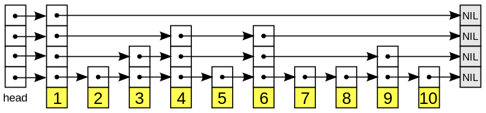
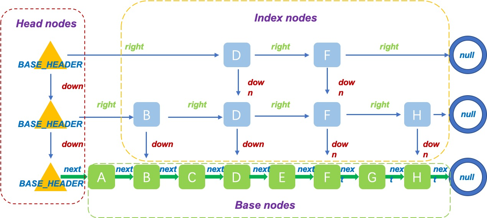
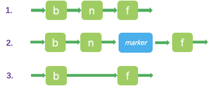

# ConcurrentSkipListMap 分析和使用
以下转载自：https://www.cnblogs.com/java-zzl/p/9767255.html  

ConcurrentSkipListMap是线程安全的有序的哈希表，适用于高并发的场景。  
ConcurrentSkipListMap和TreeMap，它们虽然都是有序的哈希表。但是，第一，它们的线程安全机制不同，TreeMap是非线程安全的，而ConcurrentSkipListMap是线程安全的。第二，ConcurrentSkipListMap是通过跳表实现的，而TreeMap是通过红黑树实现的。  

在4线程1.6万数据的条件下，ConcurrentHashMap 存取速度是ConcurrentSkipListMap 的4倍左右。  
但ConcurrentSkipListMap有几个ConcurrentHashMap 不能比拟的优点：  
1. ConcurrentSkipListMap 的key是有序的。
2. ConcurrentSkipListMap 支持更高的并发。ConcurrentSkipListMap 的存取时间是log（N），和线程数几乎无关。也就是说在数据量一定的情况下，并发的线程越多，ConcurrentSkipListMap越能体现出他的优势。

在非多线程的情况下，应当尽量使用TreeMap。此外对于并发性相对较低的并行程序可以使用Collections.synchronizedSortedMap将TreeMap进行包装，也可以提供较好的效率。对于高并发程序，应当使用ConcurrentSkipListMap，能够提供更高的并发度。  
所以在多线程程序中，如果需要对Map的键值进行排序时，请尽量使用ConcurrentSkipListMap，可能得到更好的并发度。  
注意，调用ConcurrentSkipListMap的size时，由于多个线程可以同时对映射表进行操作，所以映射表需要遍历整个链表才能返回元素个数，这个操作是个O(log(n))的操作。  
  
## ConcurrentSkipListMap 使用
使用方式与 TreeMap 非常类似，具体可看[上文原链接](https://www.cnblogs.com/java-zzl/p/9767255.html)。  
<br />


# SkipList 和 java 中 ConcurrentSkipListMap 的实现
以下转载自：https://www.cnblogs.com/flydean/p/skiplist-concurrentskiplistmap.html  

## 目录
* 简介
* SkipList
* ConcurrentSkipListMap
  * SkipList的实现
  * concurrent的实现
* 总结

## 简介
一开始听说 SkipList 我是一脸懵逼的，啥？还有SkipList？这个是什么玩意。  

后面经过我的不断搜索和学习，终于明白了SkipList原来是一种数据结构，而java中的ConcurrentSkipListMap和ConcurrentSkipListSet就是这种结构的实现。  

接下来就让我们一步一步的揭开SkipList和ConcurrentSkipListMap的面纱吧。  

## SkipList
先看下维基百科中SkipList的定义：  
  

SkipList是一种层级结构。最底层的是排序过的最原始的linked list。

往上是一层一层的层级结构，每个底层节点按照一定的概率出现在上一层list中。这个概率叫做p，通常p取1/2或者1/4。

先设定一个函数f，可以随机产生0和1这两个数，并且这两个数出现的几率是一样的，那么这时候的p就是1/2。

对每个节点，我们这样操作：

我们运行一次f，当f=1时，我们将该节点插入到上层layer的list中去。当f=0时，不插入。

举个例子，上图中的list中有10个排序过的节点，第一个节点默认每层都有。对于第二个节点，运行f=0，不插入。对于第三个节点，运行f=1,将第三个节点插入layer 1，以此类推，最后得到的layer 1 list中的节点有：1，3，4，6，9。

然后我们再继续往上构建layer。 最终得到上图的SkipList。

通过使用SkipList，我们构建了多个List，包含不同的排序过的节点，从而提升List的查找效率。

我们通过下图能有一个更清晰的认识：  
  

每次的查找都是从最顶层开始，因为最顶层的节点数最少，如果要查找的节点在list中的两个节点中间，则向下移一层继续查找，最终找到最底层要插入的位置，插入节点，然后再次调用概率函数f，决定是否向上复制节点。

其本质上相当于二分法查找，其查找的时间复杂度是O(logn)。

## ConcurrentSkipListMap
ConcurrentSkipListMap是一个并发的SkipList，那么它具有两个特点，SkipList和concurrent。我们分别来讲解。

### SkipList的实现
上面讲解了SkipList的数据结构，接下来看下ConcurrentSkipListMap是怎么实现这个skipList的：
  

ConcurrentSkipListMap中有三种结构，base nodes,Head nodes和index nodes。

base nodes组成了有序的链表结构，是ConcurrentSkipListMap的最底层实现。
```java
    static final class Node<K,V> {
        final K key;
        volatile Object value;
        volatile Node<K,V> next;

        /**
         * Creates a new regular node.
         */
        Node(K key, Object value, Node<K,V> next) {
            this.key = key;
            this.value = value;
            this.next = next;
        }
    }
```  

上面可以看到每个Node都是一个k，v的entry，并且其有一个next指向下一个节点。

index nodes是构建SkipList上层结构的基本节点：
```java
    static class Index<K,V> {
        final Node<K,V> node;
        final Index<K,V> down;
        volatile Index<K,V> right;

        /**
         * Creates index node with given values.
         */
        Index(Node<K,V> node, Index<K,V> down, Index<K,V> right) {
            this.node = node;
            this.down = down;
            this.right = right;
        }
    }
```  

从上面的构造我们可以看到，Index节点包含了Node节点，除此之外，Index还有两个指针，一个指向同一个layer的下一个节点，一个指向下一层layer的节点。

这样的结构可以方便遍历的实现。

最后看一下HeadIndex，HeadIndex代表的是Head节点：
```java
    static final class HeadIndex<K,V> extends Index<K,V> {
        final int level;
        HeadIndex(Node<K,V> node, Index<K,V> down, Index<K,V> right, int level) {
            super(node, down, right);
            this.level = level;
        }
    }
```  

HeadIndex和Index很类似，只不过多了一个level字段，表示所在的层级。

在ConcurrentSkipListMap初始化的时候，会初始化HeadIndex：
```java
head = new HeadIndex<K,V>(new Node<K,V>(null, BASE_HEADER, null),null, null, 1);
```  

我们可以看到HeadIndex中的Node是key=null，value=BASE_HEADER的虚拟节点。初始的level=1。

### concurrent的实现
接下来，我们再看一下并发是怎么实现的：  
  

基本上并发类都是通过UNSAFE.compareAndSwapObject来实现的，ConcurrentSkipListMap也不例外。

假如我们有三个节点，b-n-f。现在需要删除节点n。

第一步，使用CAS将n的valu的值从non-null设置为null。这个时候，任何外部的操作都会认为这个节点是不存在的。但是那些内部的插入或者删除操作还是会继续修改n的next指针。

第二步，使用CAS将n的next指针指向一个新的marker节点，从这个时候开始，n的next指针将不会指向任何其他的节点。

我们看下marker节点的定义：
```java
        Node(Node<K,V> next) {
            this.key = null;
            this.value = this;
            this.next = next;
        }
```  

我们可以看到marker节点实际上是一个key为null，value是自己的节点。

第三步，使用CAS将b的next指针指向f。从这一步起，n节点不会再被其他的程序访问，这意味着n可以被垃圾回收了。

我们思考一下为什么要插入一个marker节点，这是因为我们在删除的时候，需要告诉所有的线程，节点n准备被删除了，因为n本来就指向f节点，这个时候需要一个中间节点来表示这个准备删除的状态。

## 总结
本文从SkipList数据结构开始，讲解了ConcurrentSkipListMap的实现。