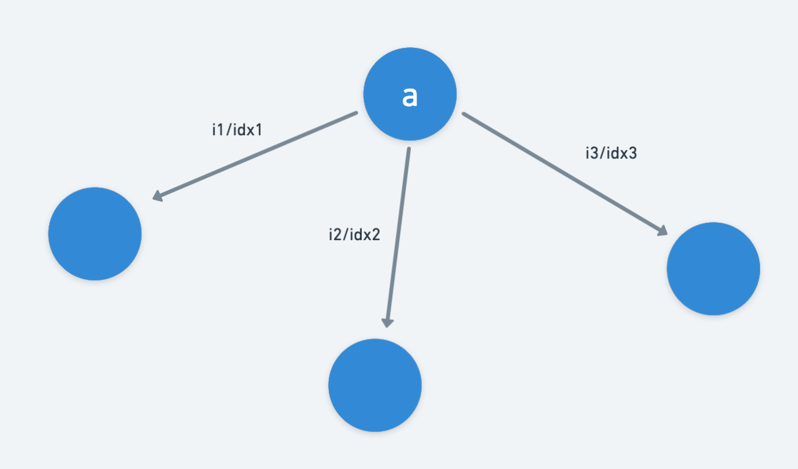

# 图的二维数组（或嵌套顺序表）表示法（讲解一）

借助一个二维数组表示图，该二维数组的第 i 行，第 j 列的值表示从 `Node[i]` 到 `Node[j]`：  

无向图(网)：是否有边 / 权值，`arr[i][j] == arr[j][i]`，无向图(网)的特性，矩阵关于对角线对称。  

有向图(网)：是否有弧 / 权值。  

https://www.cnblogs.com/cuish/p/3760041.html  
  
或者也可以采用嵌套顺序表（两层） `ArrayList<ArrayList<Integer>>` 的形式表示：[拓扑排序代码示例](./../../../Common%20Algorithm%20and%20Theory/拓扑排序.md#dfs)  
  
或者采用对象的形式表示：[树图遍历代码示例](./../../../Common%20Algorithm%20and%20Theory/树图遍历.md#图遍历)  
  
如需要快速定位起始点，比如 burning tree 问题，也可以使用哈希表 `HashMap<Node, Collection<Adjacent_Node>>`，然后 BFS 过程中可以使用哈希集记录访问过的点 `HashSet<Node>` 以去重复访问：[例题 2385](./../../../Leetcode%20Practices/algorithms/medium/2385%20Amount%20of%20Time%20for%20Binary%20Tree%20to%20Be%20Infected.java)  
  
# 存图方式（讲解二）
三种常见「存图」方式。  

## 邻接矩阵
这是一种使用二维矩阵来进行存图的方式。  

适用于边数较多的稠密图使用，当边数量接近点的数量的平方，即 m≈n^2 时，可定义为稠密图。  
```java
// 邻接矩阵数组：w[a][b] = c 代表从 a 到 b 有权重为 c 的边
int[][] w = new int[N][N];

// 加边操作
void add(int a, int b, int c) {
    w[a][b] = c;
}
```

缺点  
邻接矩阵存图虽然简单优雅，但是它的一些缺点却几乎是致命的。  

* 过高的空间复杂度 - 对于顶点数 V，邻接矩阵存图的空间复杂度高达 O(V^2)，顶点数上了一万可以不用考虑这种存图方式了。对于稀疏图来说，邻接矩阵存图内存浪费太严重，这也是邻接矩阵存图在 ACM 题目中十分罕见的根本原因。
* 对于不确定边的查询效率一般 - 比如，找个编号为1出发的第一条边还要一条条边判断是否存在（权值是否为 0）。
  
## 邻接表
邻接表在三种常用的存图方式中属于较为中庸和普遍的存图方式了，缺点不致命，优点不明显。  

存图思想  
邻接矩阵对于每个顶点使用定长的数组来存储以该点出发的边的情况。第i个数组的第j个值存储的是从顶点i到顶点j的边的权值。  
而邻接表则是对于每个顶点使用不定长的链表来存储以该点出发的边的情况。因此对于第i个链表的第j个值实际上存储的是从编号为i的顶点出发的第j条边的情况。  

一般来说，如果有边权的话，邻接表的链表存储的是一个结构体，这个结构体存储该边的终点以及边权。  

下面给个邻接表与邻接矩阵存图的示例比较（其实邻接表就是类似哈希表。把图中每个点标号，用一个数组的下标来存图中的每一个点，然后用一个链表来存每个点与其他点的边，大致如下图所示）。  
  

## 链式前向星
这也是一种在图论中十分常见的存图方式，与数组存储单链表的实现一致（头插法）。  
适用于边数较少的稀疏图使用，当边数量接近点的数量，即 M ≈ N 时，可定义为稀疏图。  

存图思想  
这种存图方式的数据结构主要是边集数组，顾名思义，图的边是用数组来存储的。  
当然想要完美表示图结构，光有一个边集数组还不够，还要有一个数组存储指向每一个点的第一条边的“指针”。  
而每一条边都需要存储接下来一条边的“指针”，这样就能够像类似邻接表一样方便遍历每一个点的所有边了。  
```java
int[] head = new int[N], edge = new int[M], nextEdge = new int[M], weight = new int[M];
int idx;

void add(int a, int b, int c) {
    edge[idx] = b;
    nextEdge[idx] = head[a];
    head[a] = idx;
    weight[idx] = c;
    idx++;
}
```
首先 idx 是用来对边进行编号的，然后对存图用到的几个数组作简单解释：  
* head 数组：存储是某个节点所对应的边的集合（链表）的头结点；
* edge 数组：由于访问某一条边指向的节点；
* nextEdge 数组：由于是以链表的形式进行存边，该数组就是用于找到下一条边；
* weight 数组：用于记录某条边的权重为多少。

因此当想要遍历所有由 a 点发出的边时，可以使用如下方式：
```java
for (int i = head[a]; i != -1; i = nextEdge[i]) { // i 为边的编号 idx，用于遍历以节点 a 为中心出发的所有边，所以顾名思义叫“前向星”
    int b = edge[i], c = weight[i]; // 存在由 a 指向 b 的边，权重为 c
}
```  
  

优点  
* 内存利用率高
* 对不确定边的操作方便效率也不错

缺点  
* 难于理解，代码较复杂
* 重边不好处理
* 对确定边的操作效率不高

## 类
这是一种最简单，但是相比上述三种存图方式，使用得较少的存图方式。  

只有当需要确保某个操作复杂度严格为 O(m) 时，才会考虑使用。  

具体的，建立一个类来记录有向边信息：  
```java
class Edge {
    // 代表从 a 到 b 有一条权重为 c 的边
    int a, b, c;
    Edge(int _a, int _b, int _c) {
        a = _a; b = _b; c = _c;
    }
}
```
通常会使用 List 存起所有的边对象，并在需要遍历所有边的时候，进行遍历：  
```java
List<Edge> es = new ArrayList<>();

// ...

for (Edge e : es) {
    // ...
}
```


总结  
对于邻接矩阵存图来说，由于内存消耗的局限性，它的适用范围比较狭窄，几乎只能在简单图论题目中见到。  

邻接表存图是最为常见的一种，绝大部分采用 C++ STL 中的 vector 实现，一般情况下大部分图论题目都能使用该存图方式。  

但是链式前向星其实是一种较好替代邻接表来存图的数据结构，在邻接表存图不能使用时可以使用，几乎可以用于全部图论题目。  


摘录自：  
https://leetcode.cn/problems/network-delay-time/solution/gong-shui-san-xie-yi-ti-wu-jie-wu-chong-oghpz/  
https://jzqt.github.io/2015/07/21/ACM%E5%9B%BE%E8%AE%BA%E4%B9%8B%E5%AD%98%E5%9B%BE%E6%96%B9%E5%BC%8F/  
https://zhuanlan.zhihu.com/p/43069713  
