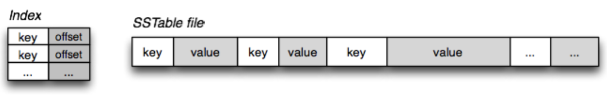

# LSM 树
LSM 树（Log-Structured Merge Tree）存储引擎介绍  
日志结构的合并树（LSM-tree）是一种基于硬盘的数据结构，与 B-tree 相比，能显著地减少硬盘磁盘臂的开销，并能在较长的时间提供对文件的高速插入（删除）。然而 LSM-tree 在某些情况下，特别是在查询需要快速响应时性能不佳。通常 LSM-tree 适用于索引插入比检索更频繁的应用系统。Bigtable 在提供 Tablet 服务时，使用 GFS 来存储日志和 SSTable，而 GFS 的设计初衷就是希望通过添加新数据的方式而不是通过重写旧数据的方式来修改文件。而 LSM-tree 通过滚动合并和多页块的方法推迟和批量进行索引更新，充分利用内存来存储近期或常用数据以降低查找代价，利用硬盘来存储不常用数据以减少存储代价。  
  
LSM 树 (Log-Structured-Merge-Tree) 的名字往往会给初识者一个错误的印象，事实上，LSM 树并不像 B+ 树、红黑树一样是一颗严格的树状数据结构，它其实是一种存储结构，目前 HBase, LevelDB, RocksDB 这些 NoSQL 存储都是采用的 LSM 树。  
  
LSM 树的核心特点是利用顺序写来提高写性能，但因为分层 (此处分层是指的分为内存和文件两部分) 的设计会稍微降低读性能，但是通过牺牲小部分读性能换来高性能写，使得 LSM 树成为非常流行的存储结构。核心思路就是假定内存足够大，因此不需要每次有数据更新就必须将数据写入到磁盘中，而可以先将最新的数据驻留在内存中，等到积累到最后多之后，再使用归并排序的方式将内存内的数据合并追加到磁盘队尾（因为所有待排序的树都是有序的，可以通过合并排序的方式快速合并到一起）。  
  
## LSM 树的核心思想
  
如上图所示，LSM 树有以下三个重要组成部分：  
* MemTable - MemTable 是在内存中的数据结构，用于保存最近更新的数据，会按照 Key 有序地组织这些数据，LSM 树对于具体如何组织有序地组织数据并没有明确的数据结构定义，例如 Hbase 使跳跃表来保证内存中 key 的有序。因为数据暂时保存在内存中，内存并不是可靠存储，如果断电会丢失数据，因此通常会通过 WAL (Write-ahead logging，预写式日志) 的方式来保证数据的可靠性。
* Immutable MemTable - 当 MemTable 达到一定大小后，会转化成 Immutable MemTable。Immutable MemTable 是将转 MemTable 变为 SSTable 的一种中间状态。写操作由新的 MemTable 处理，在转存过程中不阻塞数据更新操作。
* SSTable (Sorted String Table) - 有序键值对集合，是 LSM 树组在磁盘中的数据结构。为了加快 SSTable 的读取，可以通过建立 key 的索引以及布隆过滤器来加快 key 的查找。
  
这里需要关注一个重点，LSM 树 (Log-Structured-Merge-Tree) 正如它的名字一样，LSM 树会将所有的数据插入、修改、删除等操作记录 (注意是操作记录) 保存在内存之中，当此类操作达到一定的数据量后，再批量地顺序写入到磁盘当中。这与 B+树不同，B+树数据的更新会直接在原数据所在处修改对应的值，但是 LSM 树的数据更新是日志式的，当一条数据更新是直接 append 一条更新记录完成的。这样设计的目的就是为了顺序写，不断地将 Immutable MemTable flush 到持久化存储即可，而不用去修改之前的 SSTable 中的 key，保证了顺序写。  
因此当 MemTable 达到一定大小 flush 到持久化存储变成 SSTable 后，在不同的 SSTable 中，可能存在相同 Key 的记录，当然最新的那条记录才是准确的。这样设计的虽然大大提高了写性能，但同时也会带来一些问题：  
1. 冗余存储，对于某个 key，实际上除了最新的那条记录外，其他的记录都是冗余无用的，但是仍然占用了存储空间。因此需要进行 Compact 操作 (合并多个 SSTable) 来清除冗余的记录。
2. 读取时需要从最新的倒着查询，直到找到某个 key 的记录。最坏情况需要查询完所有的 SSTable，这里可以通过前面提到的索引/布隆过滤器来优化查找速度。
  
## LSM 树的 Compact 策略
Compact 操作是十分关键的操作，否则 SSTable 数量会不断膨胀。在 Compact 策略上，主要介绍 2 种基本策略：**size-tiered** 和 **leveled**。  
在介绍这 2 种策略之前，先介绍 3 个比较重要的概念，事实上不同的策略就是围绕这 3 个概念之间做出权衡和取舍：  
1. 读放大：读取数据时实际读取的数据量大于真正的数据量。例如在 LSM 树中需要先在 MemTable 查看当前 key 是否存在，不存在继续从 SSTable 中寻找。
2. 写放大：写入数据时实际写入的数据量大于真正的数据量。例如在 LSM 树中写入时可能触发 Compact 操作，导致实际写入的数据量远大于该 key 的数据量。
3. 空间放大：数据实际占用的磁盘空间比数据的真正大小更多。上面提到的冗余存储，对于一个 key 来说，只有最新的那条记录是有效的，而之前的记录都是可以被清理回收的。  
  
To Be Continue...  
  
## 参考
* https://zhuanlan.zhihu.com/p/181498475
* https://www.modb.pro/db/379790
