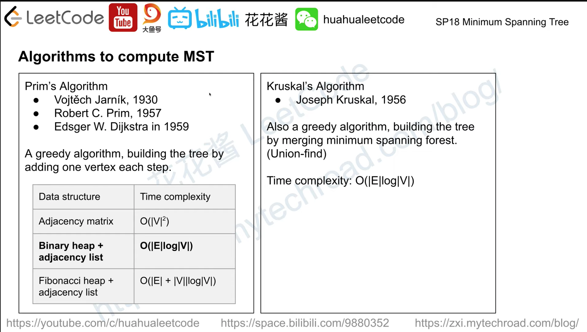
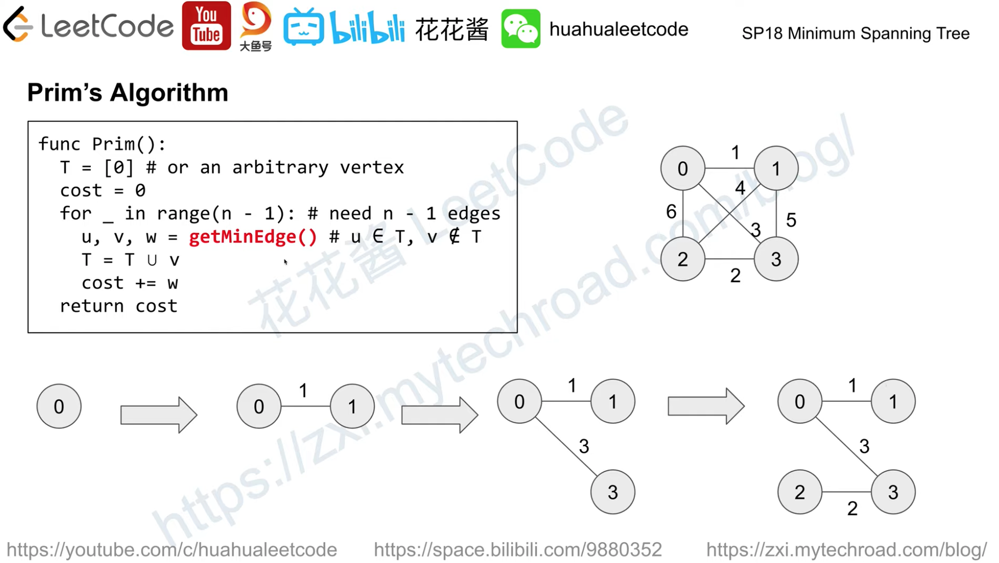
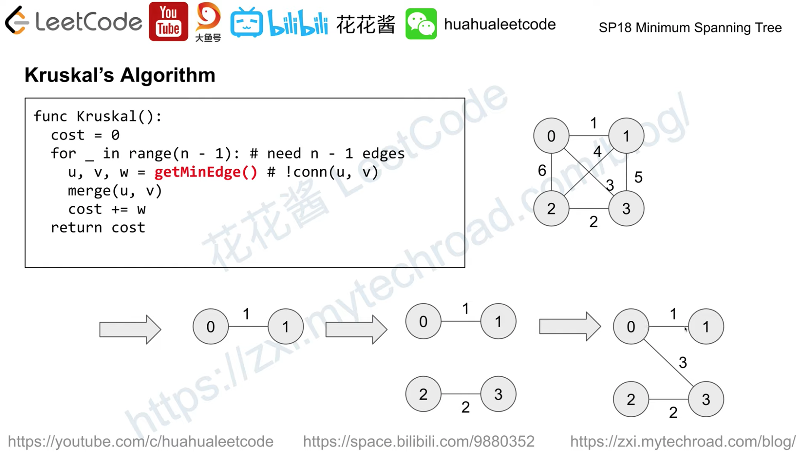

# 最小生成树
[什么是生成树](./../SpanningTree/README.md)  

最小生成树是一副连通加权无向图中一棵权值最小的生成树。  
在一给定的无向图 G = (V, E) 中，(u, v) 代表连接顶点 u 与顶点 v 的边，而 w(u, v) 代表此边的权重，若存在 T 为 E 的子集且 (V, T) 为树，使得的 w(T) - 即该树的所有边的权重和最小，则此 T 为 G 的最小生成树。  
最小生成树其实是最小权重生成树的简称。  

https://www.youtube.com/watch?v=wmW8G8SrXDs  

  

## Prim 算法
原理：贪心 + 优先队列  
Time: O(ElogV), Space: O(V+E)  

  

```java
class Solution {
    public int mst(int n, int[][] edges) {
        Map<Integer, List<int[]>> graph = new HashMap<>();
        for (int[] edge : edges) {
            graph.computeIfAbsent(edge[0], x -> new ArrayList<>()).add(new int[]{edge[1], edge[2]});
            graph.computeIfAbsent(edge[1], x -> new ArrayList<>()).add(new int[]{edge[0], edge[2]});
        }
        PriorityQueue<int[]> pq = new PriorityQueue<>((a, b) -> a[1] - b[1]);
        int res = 0;
        Set<Integer> visited = new HashSet<>();
        pq.offer(new int[]{1, 0});
        while (!pq.isEmpty()) {
            int[] edge = pq.poll();
            int curNode = edge[0]; int curWeight = edge[1];
            if (visited.contains(curNode)) continue;
            res += curWeight;
            visited.add(curNode);
            for (int[] nxtEdge : graph.get(curNode)) {
                if (visited.contains(nxtEdge[0])) continue;
                pq.offer(nxtEdge);
            }
        }
        if (visited.size() != n) return -1;
        return res;
    }
}
```

## Kruskal 算法
原理：并查集  
Time: O(ElogV), Space: O(V+E)  

  

```java
class Solution {
    public int mst(int n, int[][] edges) {
        Arrays.sort(edges, (a, b) -> a[2] - b[2]);        
        UnionFindSet ufs = new UnionFindSet(n);
        int res = 0, unionCnt = 0;
        for (int[] edge : edges) {
            int u = edge[0] - 1; int v = edge[1] - 1; int w = edge[2];
            int ru = ufs.find(u); int rv = ufs.find(v);
            if (ru == rv) continue;
            ufs.union(ru, rv);
            unionCnt++;
            res += w;
        }
        if (unionCnt != n-1) return -1;
        
        return res;
    }
    
    /* 并查集 */
    class UnionFindSet {
        private int[] parents_;
        private int[] ranks_;

        public UnionFindSet(int n) {
            parents_ = new int[n + 1];
            ranks_ = new int[n + 1];
            for (int i = 0; i < parents_.length; ++i) {
                parents_[i] = i;
                ranks_[i] = 1;
            }
        }

        public boolean union(int u, int v) {
            int pu = find(u);
            int pv = find(v);
            if (pu == pv) return false;

            if (ranks_[pv] > ranks_[pu])
                parents_[pu] = pv;
            else if (ranks_[pu] > ranks_[pv])
                parents_[pv] = pu;
            else {
                parents_[pv] = pu;
                ranks_[pu] += 1;
            }

            return true;
        }

        public int find(int u) {
            while (parents_[u] != u) {
                parents_[u] = parents_[parents_[u]];
                u = parents_[u];
            }
            return u;
        }
    }
}
```

## 例题
* [Leetcode Q1135](./../../../Leetcode%20Practices/algorithms/medium/1135%20Edgeecting%20Cities%20With%20Minimum%20Cost.java)
* [Leetcode Q1168]()
