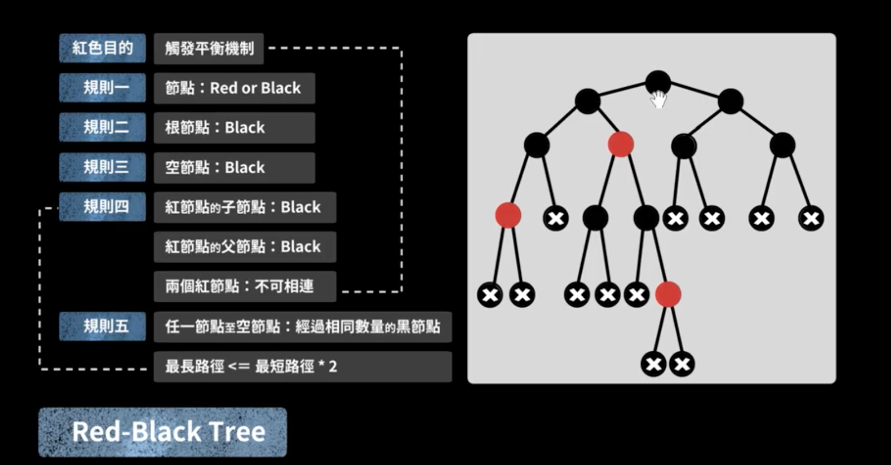

# 红黑树
  

名为 red-black，用同极互斥来看可能更容易从名字理解该树的规则与调整算法（红色互斥）。  

## 原理及实现
[红黑树之原理和算法详细介绍](https://www.cnblogs.com/skywang12345/p/3245399.html) (似乎增添部分图例稍不准确，以下面的 Java 实现代码为准)  
[Java 实现](./RBTree.java) (重要)  

### 难点核心：删除节点的 RB-DELETE-FIXUP 部分
参考自：https://www.cnblogs.com/skywang12345/p/3245399.html  
下面对删除函数进行分析。在分析之前，我们再次温习一下红黑树的几个特性：  
(1) 每个节点或者是黑色，或者是红色。  
(2) 根节点是黑色。  
(3) 每个叶子节点是黑色。 [ 注意：这里叶子节点，是指为空的叶子节点！]  
(4) 如果一个节点是红色的，则它的子节点必须是黑色的。  
(5) 从一个节点到该节点的子孙节点的所有路径上包含相同数目的黑节点。  

前面我们将"删除红黑树中的节点"大致分为两步，在第一步中"将红黑树当作一颗二叉查找树，将节点删除"后，可能违反"特性(2)、(4)、(5)"三个特性。第二步需要解决上面的三个问题，进而保持红黑树的全部特性。  
为了便于分析，我们假设"x包含一个额外的黑色"(x原本的颜色还存在)，这样就不会违反"特性(5)"。为什么呢？  
通过RB-DELETE算法，我们知道：删除节点y之后，x占据了原来节点y的位置。 既然删除y(y是黑色)，意味着减少一个黑色节点；那么，再在该位置上增加一个黑色即可。这样，当我们假设"x包含一个额外的黑色"，就正好弥补了"删除y所丢失的黑色节点"，也就不会违反"特性(5)"。 因此，假设"x包含一个额外的黑色"(x原本的颜色还存在)，这样就不会违反"特性(5)"。  
现在，x不仅包含它原本的颜色属性，x还包含一个额外的黑色。即x的颜色属性是"红+黑"或"黑+黑"，它违反了"特性(1)"。  

现在，我们面临的问题，由解决"违反了特性(2)、(4)、(5)三个特性"转换成了"解决违反特性(1)、(2)、(4)三个特性"。RB-DELETE-FIXUP需要做的就是通过算法恢复红黑树的特性(1)、(2)、(4)。RB-DELETE-FIXUP的思想是：将x所包含的额外的黑色不断沿树上移(向根方向移动)，直到出现下面的姿态：  
a) x指向一个"红+黑"节点。此时，将x设为一个"黑"节点即可。  
b) x指向根。此时，将x设为一个"黑"节点即可。  
c) 非前面两种姿态。  

将上面的姿态，可以概括为3种情况。  
① 情况说明：x是“红+黑”节点。  
    处理方法：直接把x设为黑色，结束。此时红黑树性质全部恢复。  
② 情况说明：x是“黑+黑”节点，且x是根。  
    处理方法：什么都不做，结束。此时红黑树性质全部恢复。  
③ 情况说明：x是“黑+黑”节点，且x不是根。  
    处理方法：这种情况又可以划分为4种子情况。这4种子情况如下所示：  

 
1.(Case 1)x是"黑+黑"节点，x的兄弟节点是红色

1.1 现象说明  
x是"黑+黑"节点，x的兄弟节点是红色。(此时x的父节点和x的兄弟节点的子节点都是黑节点)。  

1.2 处理策略  
(01) 将x的兄弟节点设为“黑色”。  
(02) 将x的父节点设为“红色”。  
(03) 对x的父节点进行左旋。  
(04) 左旋后，重新设置x的兄弟节点。  

下面谈谈为什么要这样处理。(建议理解的时候，通过下面的图进行对比)  
这样做的目的是将“Case 1”转换为“Case 2”、“Case 3”或“Case 4”，从而进行进一步的处理。对x的父节点进行左旋；左旋后，为了保持红黑树特性，就需要在左旋前“将x的兄弟节点设为黑色”，同时“将x的父节点设为红色”；左旋后，由于x的兄弟节点发生了变化，需要更新x的兄弟节点，从而进行后续处理。  

1.3 示意图
  

 

2.(Case 2) x是"黑+黑"节点，x的兄弟节点是黑色，x的兄弟节点的两个孩子都是黑色  

2.1 现象说明  
x是“黑+黑”节点，x的兄弟节点是黑色，x的兄弟节点的两个孩子都是黑色。  

2.2 处理策略  
(01) 将x的兄弟节点设为“红色”。  
(02) 设置“x的父节点”为“新的x节点”。  

下面谈谈为什么要这样处理。(建议理解的时候，通过下面的图进行对比)  
这个情况的处理思想：是将“x中多余的一个黑色属性上移(往根方向移动)”。 x是“黑+黑”节点，我们将x由“黑+黑”节点 变成 “黑”节点，多余的一个“黑”属性移到x的父节点中，即x的父节点多出了一个黑属性(若x的父节点原先是“黑”，则此时变成了“黑+黑”；若x的父节点原先时“红”，则此时变成了“红+黑”)。 此时，需要注意的是：所有经过x的分支中黑节点个数没变化；但是，所有经过x的兄弟节点的分支中黑色节点的个数增加了1(因为x的父节点多了一个黑色属性)！为了解决这个问题，我们需要将“所有经过x的兄弟节点的分支中黑色节点的个数减1”即可，那么就可以通过“将x的兄弟节点由黑色变成红色”来实现。  
经过上面的步骤(将x的兄弟节点设为红色)，多余的一个颜色属性(黑色)已经跑到x的父节点中。我们需要将x的父节点设为“新的x节点”进行处理。若“新的x节点”是“黑+红”，直接将“新的x节点”设为黑色，即可完全解决该问题；若“新的x节点”是“黑+黑”，则需要对“新的x节点”进行进一步处理。  

2.3 示意图  
  

 

3.(Case 3)x是“黑+黑”节点，x的兄弟节点是黑色；x的兄弟节点的左孩子是红色，右孩子是黑色的  

3.1 现象说明  
x是“黑+黑”节点，x的兄弟节点是黑色；x的兄弟节点的左孩子是红色，右孩子是黑色的。  

3.2 处理策略  
(01) 将x兄弟节点的左孩子设为“黑色”。  
(02) 将x兄弟节点设为“红色”。  
(03) 对x的兄弟节点进行右旋。  
(04) 右旋后，重新设置x的兄弟节点。  

下面谈谈为什么要这样处理。(建议理解的时候，通过下面的图进行对比)  
我们处理“Case 3”的目的是为了将“Case 3”进行转换，转换成“Case 4”,从而进行进一步的处理。转换的方式是对x的兄弟节点进行右旋；为了保证右旋后，它仍然是红黑树，就需要在右旋前“将x的兄弟节点的左孩子设为黑色”，同时“将x的兄弟节点设为红色”；右旋后，由于x的兄弟节点发生了变化，需要更新x的兄弟节点，从而进行后续处理。  

3.3 示意图  
  

 

4.(Case 4)x是“黑+黑”节点，x的兄弟节点是黑色；x的兄弟节点的右孩子是红色的，x的兄弟节点的左孩子任意颜色  

4.1 现象说明  
x是“黑+黑”节点，x的兄弟节点是黑色；x的兄弟节点的右孩子是红色的，x的兄弟节点的左孩子任意颜色。  

4.2 处理策略  
(01) 将x父节点颜色 赋值给 x的兄弟节点。  
(02) 将x父节点设为“黑色”。  
(03) 将x兄弟节点的右子节设为“黑色”。  
(04) 对x的父节点进行左旋。  
(05) 设置“x”为“根节点”。  

下面谈谈为什么要这样处理。(建议理解的时候，通过下面的图进行对比)  
我们处理“Case 4”的目的是：去掉x中额外的黑色，将x变成单独的黑色。处理的方式是“：进行颜色修改，然后对x的父节点进行左旋。下面，我们来分析是如何实现的。  
为了便于说明，我们设置“当前节点”为S(Original Son)，“兄弟节点”为B(Brother)，“兄弟节点的左孩子”为BLS(Brother's Left Son)，“兄弟节点的右孩子”为BRS(Brother's Right Son)，“父节点”为F(Father)。  
我们要对F进行左旋。但在左旋前，我们需要调换F和B的颜色，并设置BRS为黑色。为什么需要这里处理呢？因为左旋后，F和BLS是父子关系，而我们已知BL是红色，如果F是红色，则违背了“特性(4)”；为了解决这一问题，我们将“F设置为黑色”。 但是，F设置为黑色之后，为了保证满足“特性(5)”，即为了保证左旋之后：  
1. “同时经过根节点和S的分支的黑色节点个数不变”。若满足“第一”，只需要S丢弃它多余的颜色即可。因为S的颜色是“黑+黑”，而左旋后“同时经过根节点和S的分支的黑色节点个数”增加了1；现在，只需将S由“黑+黑”变成单独的“黑”节点，即可满足“第一”。
2. “同时经过根节点和BLS的分支的黑色节点数不变”。若满足“第二”，只需要将“F的原始颜色”赋值给B即可。之前，我们已经将“F设置为黑色”(即，将B的颜色"黑色"，赋值给了F)。至此，我们算是调换了F和B的颜色。
3. “同时经过根节点和BRS的分支的黑色节点数不变”。在“第二”已经满足的情况下，若要满足“第三”，只需要将BRS设置为“黑色”即可。
  
经过上面的处理之后。红黑树的特性全部得到的满足！接着，我们将x设为根节点，就可以跳出 while 循环(参考伪代码)；即完成了全部处理。  

至此，我们就完成了Case 4的处理。理解Case 4的核心，是了解如何“去掉当前节点额外的黑色”。  

4.3 示意图  
  

## 例题
* [Leetcode Q414](./../../../Leetcode%20Practices/algorithms/easy/414%20Third%20Maximum%20Number.java)
* [Leetcode Q327](./../../../Leetcode%20Practices/algorithms/hard/327%20Count%20of%20Range%20Sum.java)

## 其他参考
https://ivanzz1001.github.io/records/post/data-structure/2018/06/24/ds-red-black-tree  
https://tech.meituan.com/2016/12/02/redblack-tree.html  
https://www.youtube.com/watch?v=_hha1J_Ru-E&list=PLVVMQF8vWNCLW_QXfQasdGvzK8aSGnf3-  
