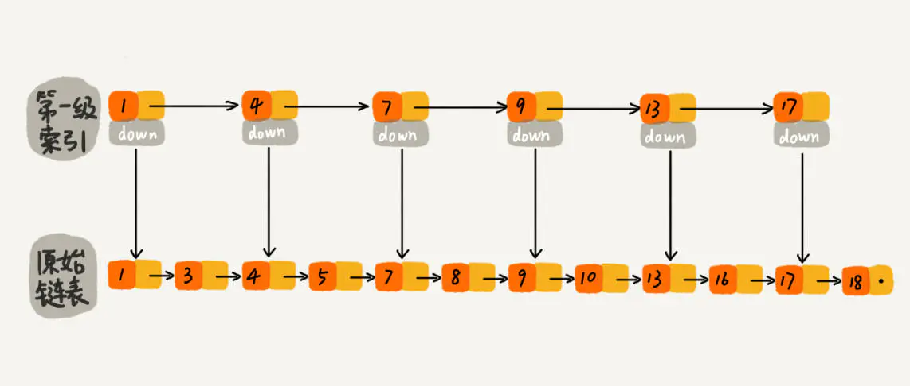
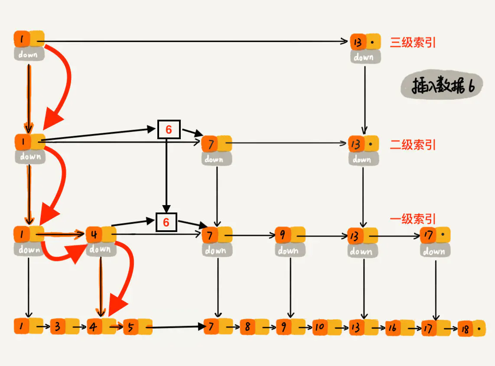

# 跳表

[Code 跳表实现源码](./SkipList.java)  
源码参考自：https://sylvanassun.github.io/2017/12/31/2017-12-31-skip_list/  

跳表是一种神奇的数据结构，因为几乎所有版本的大学本科教材上都没有跳表这种数据结构，而且神书《算法导论》、《算法第四版》这两本书中也没有介绍跳表。但是跳表插入、删除、查找元素的时间复杂度跟红黑树都是一样量级的，时间复杂度都是O(logn)，而且跳表有一个特性是红黑树无法匹敌的（具体什么特性后面会提到）。所以在工业中，跳表也会经常被用到。废话不多说了，开始今天的跳表学习。  

通过本文，你能 get 到以下知识：  

* 什么是跳表？
* 跳表的查找、插入、删除元素的流程
* 跳表查找、插入、删除元素的时间复杂度
* 跳表插入元素时，如何动态维护索引？
* 为什么Redis选择使用跳表而不是红黑树来实现有序集合？
* 工业上其他使用跳表的场景

> 友情提示：下文在跳表插入数据时，会讲述如何动态维护索引，实现比较简单，逻辑比较绕，不要放弃，加油！！！如果一遍看不懂没关系，可以选择暂时性的跳过，毕竟这块偏向于源码。但是读者必须知道跳表的查找、插入、删除的时间复杂度都是 O(logn)，而且可以按照范围区间查找元素，当工作中遇到某些场景时，需要想到可以使用跳表解决问题即可。毕竟平时的工作都是直接使用封装好的跳表，例如：java.util.concurrent 下的 ConcurrentSkipListMap()。

## 懒更新优化跳表
论文地址 https://people.csail.mit.edu/shanir/publications/LazySkipList.pdf  
该优化跳表研究使得业界对跳表的使用得到更多扩展，[比如以此为基础实现无锁的并发安全有序哈希表等等](https://github.com/bytedance/gopkg/tree/main/collection/skipmap)。  
  
## 理解跳表，从单链表开始说起
下图是一个简单的**有序单链表**，单链表的特性就是每个元素存放下一个元素的引用。即：通过第一个元素可以找到第二个元素，通过第二个元素可以找到第三个元素，依次类推，直到找到最后一个元素。  

  
跳表-原始链表  

现在我们有个场景，想快速找到上图链表中的 10 这个元素，只能从头开始遍历链表，直到找到我们需要找的元素。查找路径：1、3、4、5、7、8、9、10。这样的查找效率很低，平均时间复杂度很高O(n)。那有没有办法提高链表的查找速度呢？如下图所示，我们从链表中每两个元素抽出来，加一级索引，一级索引指向了原始链表，即：通过一级索引 7 的down指针可以找到原始链表的 7 。那现在怎么查找 10 这个元素呢？  

  
跳表-一级索引  

先在索引找 1、4、7、9，遍历到一级索引的 9 时，发现 9 的后继节点是 13，比 10 大，于是不往后找了，而是通过 9 找到原始链表的 9，然后再往后遍历找到了我们要找的 10，遍历结束。有没有发现，加了一级索引后，查找路径：1、4、7、9、10，查找节点需要遍历的元素相对少了，我们不需要对 10 之前的所有数据都遍历，查找的效率提升了。  

那如果加二级索引呢？如下图所示，查找路径：1、7、9、10。是不是找 10 的效率更高了？这就是跳表的思想，用“空间换时间”，通过给链表建立索引，提高了查找的效率。  

  
跳表-二级索引  

可能同学们会想，从上面案例来看，提升的效率并不明显，本来需要遍历8个元素，优化了半天，还需要遍历 4 个元素，其实是因为我们的数据量太少了，当数据量足够大时，效率提升会很大。如下图所示，假如有序单链表现在有1万个元素，分别是 0~9999。现在我们建了很多级索引，最高级的索引，就两个元素 0、5000，次高级索引四个元素 0、2500、5000、7500，依次类推，当我们查找 7890 这个元素时，查找路径为 0、5000、7500 ... 7890，通过最高级索引直接跳过了5000个元素，次高层索引直接跳过了2500个元素，**从而使得链表能够实现二分查找**。由此可以看出，当元素数量较多时，索引提高的效率比较大，近似于二分查找。  

  
数据量增多后，索引效果图  

到这里大家应该已经明白了什么是跳表。**跳表是可以实现二分查找的有序链表**。  
  
## 查找的时间复杂度
既然跳表可以提升链表查找元素的效率，那查找一个元素的时间复杂度到底是多少呢？查找元素的过程是从最高级索引开始，一层一层遍历最后下沉到原始链表。所以，时间复杂度 = 索引的高度 * 每层索引遍历元素的个数。  

先来求跳表的索引高度。如下图所示，假设每两个结点会抽出一个结点作为上一级索引的结点，原始的链表有n个元素，则一级索引有n/2 个元素、二级索引有 n/4 个元素、k级索引就有 n/2k个元素。最高级索引一般有2个元素，即：最高级索引 h 满足 2 = n/2h，即 h = log2n - 1，最高级索引 h 为索引层的高度加上原始数据一层，跳表的总高度 h = log2n。  

  
查找的时间复杂度证明  

我们看上图中加粗的箭头，表示查找元素 x 的路径，那查找过程中每一层索引最多遍历几个元素呢？  

图中所示，现在到达第 k 级索引，我们发现要查找的元素 x 比 y 大比 z 小，所以，我们需要从 y 处下降到 k-1 级索引继续查找，k-1级索引中比 y 大比 z 小的只有一个 w，所以在 k-1 级索引中，我们遍历的元素最多就是 y、w、z，发现 x 比 w大比 z 小之后，再下降到 k-2 级索引。所以，k-2 级索引最多遍历的元素为 w、u、z。其实每级索引都是类似的道理，每级索引中都是两个结点抽出一个结点作为上一级索引的结点。 现在我们得出结论：当每级索引都是两个结点抽出一个结点作为上一级索引的结点时，每一层最多遍历3个结点。  

跳表的索引高度 h = log2n，且每层索引最多遍历 3 个元素。所以跳表中查找一个元素的时间复杂度为 O(3*logn)，省略常数即：O(logn)。  

## 空间复杂度
跳表通过建立索引，来提高查找元素的效率，就是典型的“空间换时间”的思想，所以在空间上做了一些牺牲，那空间复杂度到底是多少呢？  

假如原始链表包含 n 个元素，则一级索引元素个数为 n/2、二级索引元素个数为 n/4、三级索引元素个数为 n/8 以此类推。所以，索引节点的总和是：n/2 + n/4 + n/8 + … + 8 + 4 + 2 = n-2，**空间复杂度是 O(n)**。  

如下图所示：如果每三个结点抽一个结点做为索引，索引总和数就是 n/3 + n/9 + n/27 + … + 9 + 3 + 1= n/2，减少了一半。所以我们可以通过较少索引数来减少空间复杂度，但是相应的肯定会造成查找效率有一定下降，我们可以根据我们的应用场景来控制这个阈值，看我们更注重时间还是空间。  

  
三个节点提取一个做索引  

But，索引结点往往只需要存储 key 和几个指针，并不需要存储完整的对象，所以当对象比索引结点大很多时，索引占用的额外空间就可以忽略了。举个例子：我们现在需要用跳表来给所有学生建索引，学生有很多属性：学号、姓名、性别、身份证号、年龄、家庭住址、身高、体重等。学生的各种属性只需要在原始链表中存储一份即可，我们只需要用学生的学号（int 类型的数据）建立索引，所以索引相对原始数据而言，占用的空间可以忽略。  

## 插入数据
插入数据看起来也很简单，跳表的原始链表需要保持有序，所以我们会向查找元素一样，找到元素应该插入的位置。如下图所示，要插入数据6，整个过程类似于查找6，整个的查找路径为 1、1、1、4、4、5。查找到第底层原始链表的元素 5 时，发现 5 小于 6 但是后继节点 7 大于 6，所以应该把 6 插入到 5 之后 7 之前。整个时间复杂度为查找元素的时间复杂度 O(logn)。  

  
插入数据图示  

如下图所示，假如一直往原始列表中添加数据，但是不更新索引，就可能出现两个索引节点之间数据非常多的情况，极端情况，跳表退化为单链表，从而使得查找效率从 O(logn) 退化为 O(n)。那这种问题该怎么解决呢？我们需要在插入数据的时候，索引节点也需要相应的增加、或者重建索引，来避免查找效率的退化。那我们该如何去维护这个索引呢？  

  
插入数据，不更新索引图示  

比较容易理解的做法就是完全重建索引，我们每次插入数据后，都把这个跳表的索引删掉全部重建，重建索引的时间复杂度是多少呢？因为索引的空间复杂度是 O(n)，即：索引节点的个数是 O(n) 级别，每次完全重新建一个 O(n) 级别的索引，时间复杂度也是 O(n) 。造成的后果是：为了维护索引，导致每次插入数据的时间复杂度变成了 O(n)。  

那有没有其他效率比较高的方式来维护索引呢？假如跳表每一层的晋升概率是 1/2，最理想的索引就是在原始链表中每隔一个元素抽取一个元素做为一级索引。换种说法，**我们在原始链表中随机的选 n/2 个元素做为一级索引是不是也能通过索引提高查找的效率呢**？ 当然可以了，因为一般随机选的元素相对来说都是比较均匀的。如下图所示，随机选择了n/2 个元素做为一级索引，虽然不是每隔一个元素抽取一个，但是对于查找效率来讲，影响不大，比如我们想找元素 16，仍然可以通过一级索引，使得遍历路径较少了将近一半。如果抽取的一级索引的元素恰好是前一半的元素 1、3、4、5、7、8，那么查找效率确实没有提升，但是这样的概率太小了。我们可以认为：当原始链表中**元素数量足够大**，且**抽取足够随机**的话，我们得到的索引是均匀的。我们要清楚设计良好的数据结构都是为了应对大数据量的场景，如果原始链表只有 5 个元素，那么依次遍历 5 个元素也没有关系，因为数据量太少了。所以，我们可以维护一个这样的索引：**随机选 n/2 个元素做为一级索引、随机选 n/4 个元素做为二级索引、随机选 n/8 个元素做为三级索引，依次类推，一直到最顶层索引**。这里每层索引的元素个数已经确定，且每层索引元素选取的足够随机，所以可以通过索引来提升跳表的查找效率。  

  
跳表-一级索引随机分布  

那代码该如何实现，才能使跳表满足上述这个样子呢？可以在每次新插入元素的时候，尽量让该元素有 1/2 的几率建立一级索引、1/4 的几率建立二级索引、1/8 的几率建立三级索引，以此类推，就能满足我们上面的条件。现在我们就需要一个概率算法帮我们把控这个 1/2、1/4、1/8 ... ，**当每次有数据要插入时，先通过概率算法告诉我们这个元素需要插入到几级索引中**，然后开始维护索引并把数据插入到原始链表中。下面开始讲解这个概率算法代码如何实现。  

我们可以实现一个 randomLevel() 方法，该方法会随机生成 1~MAX_LEVEL 之间的数（MAX_LEVEL表示索引的最高层数），且该方法**有 1/2 的概率返回 1、1/4 的概率返回 2、1/8的概率返回 3，以此类推**。

* randomLevel() 方法返回 1 表示当前插入的该元素不需要建索引，只需要存储数据到原始链表即可（概率 1/2）
* randomLevel() 方法返回 2 表示当前插入的该元素需要建一级索引（概率 1/4）
* randomLevel() 方法返回 3 表示当前插入的该元素需要建二级索引（概率 1/8）
* randomLevel() 方法返回 4 表示当前插入的该元素需要建三级索引（概率 1/16）
* 。。。以此类推

所以，通过 randomLevel() 方法，我们可以控制整个跳表各级索引中元素的个数。重点来了：randomLevel() 方法返回 2 的时候会建立一级索引，我们想要一级索引中元素个数占原始数据的 1/2，但是 randomLevel() 方法返回 2 的概率为 1/4，那是不是有矛盾呢？明明说好的 1/2，结果一级索引元素个数怎么变成了原始链表的 1/4？我们先看下图，应该就明白了。  

  
插入数据图示  

假设我们在插入元素 6 的时候，randomLevel() 方法返回 1，则我们不会为 6 建立索引。插入 7 的时候，randomLevel() 方法返回3 ，所以我们需要为元素 7 建立二级索引。这里我们发现了一个特点：当建立二级索引的时候，同时也会建立一级索引；当建立三级索引时，同时也会建立一级、二级索引。所以，一级索引中元素的个数等于 [ 原始链表元素个数 ] * [ randomLevel() 方法返回值 > 1 的概率 ]。因为 randomLevel() 方法返回值 > 1就会建索引，凡是建索引，无论几级索引必然有一级索引，**所以一级索引中元素个数占原始数据个数的比率为 randomLevel() 方法返回值 > 1 的概率**。那 randomLevel() 方法返回值 > 1 的概率是多少呢？因为 randomLevel() 方法随机生成 1~MAX_LEVEL 的数字，且 randomLevel() 方法返回值 1 的概率为 1/2，则 randomLevel() 方法返回值 > 1 的概率为 1 - 1/2 = 1/2。**即通过上述流程实现了一级索引中元素个数占原始数据个数的 1/2**。  

同理，当 randomLevel() 方法返回值 > 2 时，会建立二级或二级以上索引，都会在二级索引中增加元素，因此**二级索引中元素个数占原始数据的比率为 randomLevel() 方法返回值 > 2 的概率**。 randomLevel() 方法返回值 > 2 的概率为 1 减去 randomLevel() = 1 或 =2 的概率，即 1 - 1/2 - 1/4 = 1/4。OK，达到了我们设计的目标：二级索引中元素个数占原始数据的 1/4。  

以此类推，可以得出，遵守以下两个条件：  

* randomLevel() 方法，随机生成 1~MAX_LEVEL 之间的数（MAX_LEVEL表示索引的最高层数），且**有 1/2的概率返回 1、1/4的概率返回 2、1/8的概率返回 3** ...
* randomLevel() 方法返回 1 不建索引、返回2建一级索引、返回 3 建二级索引、返回 4 建三级索引 ...

就可以满足我们想要的结果，即：一级索引中元素个数应该占原始数据的 1/2，二级索引中元素个数占原始数据的 1/4，三级索引中元素个数占原始数据的 1/8 ，依次类推，一直到最顶层索引。  

但是问题又来了，怎么设计这么一个 randomLevel() 方法呢？直接撸代码：  
```java
// 该 randomLevel 方法会随机生成 1~MAX_LEVEL 之间的数，且 ：
//        1/2 的概率返回 1
//        1/4 的概率返回 2
//        1/8 的概率返回 3 以此类推
private int randomLevel() {
  int level = 1;
  // 当 level < MAX_LEVEL，且随机数小于设定的晋升概率时，level + 1
  while (Math.random() < SKIPLIST_P && level < MAX_LEVEL)
    level += 1;
  return level;
}
```  

上述代码可以实现我们的功能，而且，我们的案例中晋升概率 SKIPLIST_P 设置的 1/2，即：每两个结点抽出一个结点作为上一级索引的结点。如果我们想节省空间利用率，可以适当的降低代码中的 SKIPLIST_P，从而减少索引元素个数，Redis 的 zset 中 SKIPLIST_P 设定的 0.25。下图所示，是Redis [t_zset.c](https://github.com/redis/redis/blob/unstable/src/t_zset.c) 中 zslRandomLevel 函数的实现：  

  
Redis zslRandomLevel实现原理  

Redis 源码中 `(random()&0xFFFF) < (ZSKIPLIST_P * 0xFFFF)` 在功能上等价于我代码中的 `Math.random() < SKIPLIST_P` ，只不过 Redis 作者 antirez 使用位运算来提高浮点数比较的效率。  

整体思路大家应该明白了，那插入数据时维护索引的时间复杂度是多少呢？元素插入到单链表的时间复杂度为 O(1)，我们索引的高度最多为 logn，当插入一个元素 x 时，最坏的情况就是元素 x 需要插入到每层索引中，所以插入数据到各层索引中，最坏时间复杂度是 O(logn)。  

过程大概理解了，再通过一个例子描述一下跳表插入数据的全流程。现在我们要插入数据 6 到跳表中，首先 randomLevel() 返回 3，表示需要建二级索引，即：一级索引和二级索引需要增加元素 6。该跳表目前最高三级索引，首先找到三级索引的 1，发现 6 比 1大比 13小，所以，从 1 下沉到二级索引。  

  
插入数据且维护跳表图示1  

下沉到二级索引后，发现 6 比 1 大比 7 小，此时需要在二级索引中 1 和 7 之间加一个元素6 ，并从元素 1 继续下沉到一级索引。  

  
插入数据且维护跳表图示2  

下沉到一级索引后，发现 6 比 1 大比 4 大，所以往后查找，发现 6 比 4 大比 7 小，此时需要在一级索引中 4 和 7 之间加一个元素 6 ，并把二级索引的 6 指向 一级索引的 6，最后，从元素 4 继续下沉到原始链表。  

  
插入数据且维护跳表图示3  

下沉到原始链表后，就比较简单了，发现 4、5 比 6小，7比6大，所以将6插入到 5 和 7 之间即可，整个插入过程结束。  

  
插入数据且维护跳表图示4  

整个插入过程的路径与查找元素路径类似， 每层索引中插入元素的时间复杂度 O(1)，所以整个插入的时间复杂度是 O(logn)。  

## 删除数据
跳表删除数据时，要把索引中对应节点也要删掉。如下图所示，如果要删除元素 9，需要把原始链表中的 9 和第一级索引的 9 都删除掉。  

  
删除数据  

跳表中，删除元素的时间复杂度是多少呢？  

删除元素的过程跟查找元素的过程类似，只不过在查找的路径上如果发现了要删除的元素 x，则执行删除操作。跳表中，每一层索引其实都是一个有序的单链表，单链表删除元素的时间复杂度为 O(1)，索引层数为 logn 表示最多需要删除 logn 个元素，所以删除元素的总时间包含 查找元素的时间 加 删除 logn个元素的时间 为 O(logn) + O(logn) = 2 O(logn)，忽略常数部分，删除元素的时间复杂度为 O(logn)。  

## 总结
1. 跳表是可以实现二分查找的有序链表；
2. 每个元素插入时随机生成它的 level；
3. 最底层包含所有的元素；
4. 如果一个元素出现在 level(x)，那么它肯定出现在 x 以下的 level 中；
5. 每个索引节点包含两个指针，一个向下，一个向右；（笔记目前看过的各种跳表源码实现包括 Redis 的 zset 都没有向下的指针，那怎么从二级索引跳到一级索引呢？看源码吧）
6. 跳表查询、插入、删除的时间复杂度为 O(logN)，与平衡二叉树接近；
7. 扩展功能还包括查询元素在全体里的 rank，以及可以查询指定 rank 范围里的元素（并排序），具体参考 redis 的 zset 命令
   * ZADD：如果用户尚不存在，则将用户插入集合中。否则，更新用户的分数。执行时间复杂度为 O(logN)
   * ZINCRBY：将用户的分数增加指定的增量。如果用户在集合中不存在，则分数从 0 开始。执行时间复杂度为 O(logN)
   * ZRANGE/ZREVRANGE ：按分数排序获取一定范围内的用户。可以指定排序顺序（range vs. revrange）、条目数以及要从哪个位置开始。执行时间复杂度为 O(logN + m)，其中 m 是要获取的条目数（在场景中通常很小），n 是有序集中的条目数
   * ZRANK/ZREVRANK ：以对数时间复杂度获取任何用户在升序/降序排序中的位置

## 为什么Redis选择使用跳表而不是红黑树来实现有序集合？
Redis 中的有序集合(zset) 支持的操作：  

1. 插入一个元素
2. 删除一个元素
3. 查找一个元素
4. 有序输出所有元素
5. 按照范围区间查找元素（比如查找值在 [100, 356] 之间的数据）

其中，前四个操作红黑树也可以完成，且时间复杂度跟跳表是一样的。但是，按照区间来查找数据这个操作，红黑树的效率没有跳表高。按照区间查找数据时，跳表可以做到 O(logn) 的时间复杂度定位区间的起点，然后在原始链表中顺序往后遍历就可以了，非常高效。  

## 工业上其他使用跳表的场景
在博客上从来没有见过有同学讲述 HBase MemStore 的数据结构，其实 HBase MemStore 内部存储数据就使用的跳表。为什么呢？HBase 属于 LSM Tree 结构的数据库，LSM Tree 结构的数据库有个特点，实时写入的数据先写入到内存，内存达到阈值往磁盘 flush 的时候，会生成类似于 StoreFile 的有序文件，而跳表恰好就是天然有序的，所以在 flush 的时候效率很高，而且跳表查找、插入、删除性能都很高，这应该是 HBase MemStore 内部存储数据使用跳表的原因之一。HBase 使用的是 java.util.concurrent 下的 ConcurrentSkipListMap()。  

Google 开源的 key/value 存储引擎 LevelDB 以及 Facebook 基于 LevelDB 优化的 RocksDB 都是 LSM Tree 结构的数据库，他们内部的 MemTable 都是使用了跳表这种数据结构。  

后期笔者还会输出一篇深入剖析 LSM Tree 的博客，到时候再结合场景分析为什么使用跳表。  


以上转载自：https://www.jianshu.com/p/9d8296562806


## 更多阅读资料
https://www.cnblogs.com/wangbiaoneu/archive/2013/04/27/skiplist.html  
