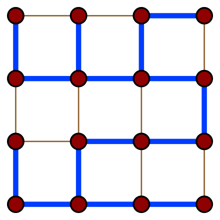

# 生成树
在图论中，无向图 G 的生成树（英语：Spanning Tree）是具有 G 的全部顶点，但边数最少的连通子图。  

  

以 V 表示顶点，E 表示边，若图 G=(V(G),E(G)) 和树 T=(V(T),E(T))，有 E(T)⊂E(G)和 V(G)=V(T)，那么 T 是 G 的生成树。  

一个图的生成树可能有多个。  

## [最小生成树](./../MinimumSpanningTree/README.md)  
