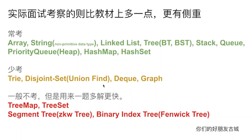

# 常用数据结构 | Data Structure
  
- 数组 | Array (索引 O(1)，遍历 O(N)，插入/删除节点 O(N))
  - [稀疏数组 | Sparse Array](https://zq99299.github.io/dsalg-tutorial/dsalg-java-hsp/03/01.html#%E7%A8%80%E7%96%8F%E6%95%B0%E7%BB%84) (在大的数组尤其是多维数组且实际数据较少的情况下，可以优化空间利用率和操作效率。使用案例如 Game of Life)
  - [树状数组 | Binary Indexed Tree](../Common%20Data%20Structure%20and%20Data%20Type/Data%20Structure%20Implementation/BinaryIndexedTree(FenwickTree)/README.md) (单点修改、区间查询均为 O(logN))
  - [稀疏表 | Sparse Table](https://oi-wiki.org/ds/sparse-table/) (解决可重复贡献问题的 RMQ，O(N*logN) 预处理，O(1) 响应每个查询，但是不支持修改操作。可被线段树替代)
  - [环形队列 | Circular Queue (Ring Buffer)](./../Leetcode%20Practices/algorithms/medium/622%20Design%20Circular%20Queue.java) (可以用数组+双指针实现，也可以用顺序表+双指针或用循环链表实现)
    - [散列与分层时序轮 | Hashed and Hierarchical Timing Wheels](../Common%20Algorithm%20and%20Theory/散列与分层时序轮.md) (索引/插入/删除皆为 `O(1)`)
- 线性表 | Linear List
  - 顺序表 | ArrayList (索引 O(1)，遍历 O(N)，添加节点 O(1)，插入/删除节点 O(N)，如果不严格要求（比如不要求保留顺序），删除可以通过对换删除节点与尾节点的值，然后删除尾节点来降低到 O(1))
  - [向量 | Vector](./Data%20Structure%20Implementation/Vector/) (索引 O(1)，遍历 O(N)，添加节点 O(1)，插入/删除节点 O(N))
  - [链表 | LinkedList](./Data%20Structure%20Implementation/LinkedList/README.md) (索引 O(N)，遍历 O(N)，插入/删除节点 O(1))
    - 单链表 | Singly Linked List
    - [双链表 | Doubly Linked List](./Data%20Structure%20Implementation/DoublyLinkedList/DoublyLinkedList.java) (注意，Java 的链表不是完整的链表，插入、删除均为 O(N)，自定义的链表因为可以给元素类添加前驱、后继字段，所以其基于元素引用的插入、删除操作可达成 O(1))
    - 循环链表 | Circular Linked List
    - [跳表 | Skip List](./Data%20Structure%20Implementation/SkipList/README.md) (有序链表，查找、插入、删除均为 O(logN))
      - [ConcurrentSkipListMap](./Data%20Structure%20Implementation/ConcurrentSkipListMap/README.md)
- 队列 | Queue
  - 顺序队列 | Sequential Queue (通常由链表 LinkedList 实现，入队/出队 O(1)，首值 O(1))
  - 优先队列 | PriorityQueue (遍历 O(N)，入队/出队 O(logN)，首值 O(1)，具体实现参考下面的二叉堆)
  - 双端队列 | Deque
    - 链表双端队列 | LinkedList (同上)
    - [数组双端队列 | ArrayDeque](./../HackerRank%20Practises/java/medium/Java%20Dequeue.java)
    - 基于链表的线程安全无界双端队列 | ConcurrentLinkedDeque
    - 基于链表的 FIFO 双端阻塞队列 | LinkedBlockingDeque
  - 基于链表的线程安全无界队列 | ConcurrentLinkedQueue
  - [阻塞队列 | BlockingQueue](./Data%20Structure%20Implementation/BlockingQueue/README.md) (注意，[非阻塞队列也可以通过 CAS 实现线程安全](./Data%20Structure%20Implementation/BlockingQueue/non-blocking-queue.PNG))
    - [基于数组的并发阻塞队列 | ArrayBlockingQueue](./Data%20Structure%20Implementation/ArrayBlockingQueue/ArrayBlockingQueue.java) (入队/出队 O(1)，首值 O(1))
    - 延期阻塞队列 | DelayQueue (入队/出队 O(logN)，首值 O(1)) ([延迟队列 Ref](https://zhuanlan.zhihu.com/p/480105174)，用于放置实现了 Delayed 接口的对象，其中的对象只能在其到期时才能从队列中取走)
    - 基于链表的 FIFO 双端阻塞队列 | LinkedBlockingDeque
    - [基于链表的 FIFO 阻塞队列 | LinkedBlockingQueue](./Data%20Structure%20Implementation/LinkedBlockingQueue/LinkedBlockingQueue.java) (入队/出队 O(1)，首值 O(1))
    - 并发同步阻塞队列 | SynchronousQueue (入队/出队 O(1)，首值 O(1))
    - 带优先级的无界阻塞队列 | PriorityBlockingQueue (入队/出队 O(logN)，首值 O(1))
    - [基于链表的 FIFO 无界阻塞队列 | LinkedTransferQueue](./Data%20Structure%20Implementation/LinkedTransferQueue/README.md)
- 栈 | Stack (入栈/出栈 O(1))
  - 双端队列 | Deque
  - [最值栈 | Extreme (Min/Max etc) Stack](../Leetcode%20Practices/algorithms/easy/155%20Min%20Stack.java)
- 映射表 | Map/Table
  - [散列表 | HashMap](./Data%20Structure%20Implementation/HashMap/README.md) (索引搜索 O(1)，插入/删除节点 O(1)；注意：最差时间复杂度为 O(N) - 即哈希值全部冲突，如果输入冲突数据为 N 则最差为 O(N^2))
  - 并发散列表 | ConcurrentHashMap (索引搜索 O(1)，插入/删除节点 O(1))
  - 链散列表 | LinkedHashMap (按插入顺序的散列表，索引搜索 O(1)，插入/删除节点 O(1)；其实可以用一个顺序表+哈希表实现)
  - 树状映射表 | TreeMap (索引搜索 O(logN)，插入/删除节点 O(logN))
  - [双向表 | BiMap](./Data%20Structure%20Implementation/BiMap/BiMap.java)
  - [枚举表 | EnumMap](./Data%20Structure%20Implementation/EnumMap/README.md) (索引搜索 O(1))
- 集合 | Set
  - 散列集 | HashSet (索引搜索 O(1)，插入/删除节点 O(1))
  - 链散列集 | LinkedHashSet (索引搜索 O(1)，插入/删除节点 O(1))
  - 树集 | TreeSet (索引搜索 O(logN)，插入/删除节点 O(logN))
  - [位集 (位向量) | BitSet](../Common%20Algorithm%20and%20Theory/集合的整数表示.md) (索引搜索 O(1)，插入/删除 O(1)，总空间复杂度总是 O(1))
    - [布隆过滤器 | Bloom Filter](./../Common%20Algorithm%20and%20Theory/布隆过滤器及其算法.md)
  - 枚举集 | EnumSet
- [树 | Tree](./Data%20Structure%20Implementation/Tree/README.md)
  - 完全二叉树 | Complete Binary Tree
    - 堆 | Heap
      - [二叉堆 | Binary Heap](./Data%20Structure%20Implementation/BinaryHeap/README.md) (构造 O(N)，遍历 O(N)，插入/删除节点 O(logN))
        - 优先队列 | PriorityQueue
      - 斐波那契堆 | Fibonacci Heap
  - 二叉搜索树 | Binary Search Tree (搜索 O(logN) - O(N)，插入/删除节点 O(1))
  - 平衡树 | Balanced Tree
    - [树堆 | Treap](https://oi-wiki.org/ds/treap/)
    - 自平衡二叉搜索树 | Self-Balanced Binary Search Tree
      - [AVL 树 | AVL Tree](./Data%20Structure%20Implementation/AVLTree/) (搜索 O(logN)，插入/删除节点 O(logN))
      - [红黑树 | Red-Black Tree](./Data%20Structure%20Implementation/RedBlackTree/README.md) (搜索 O(logN)，插入/删除节点 O(logN))
      - [替罪羊树 | Scapegoat Tree](./Data%20Structure%20Implementation/ScapegoatTree/README.md) ([Wiki](https://oi-wiki.org/ds/sgt/))
      - [T 树 | T Tree](https://en.wikipedia.org/wiki/T-tree)
      - [LCT 树 | Link-Cut Tree](https://oi-wiki.org/ds/lct/)
    - 自平衡搜索树 | Self-Balanced Search Tree
      - [B/B+ 树 | B/B+ Tree](./Data%20Structure%20Implementation/BPlusTree/README.md)
      - 2–3 树 | 2-3 Tree
    - [R 树 | R Tree](./../Common%20Algorithm%20and%20Theory/QuadTree-RTree-算法.md) (2D、3D 的空间索引，理论上不如 K-D 树通用)
    - [H 树 | H Tree](https://en.wikipedia.org/wiki/HTree)
    - [K-D 树 | K-D Tree](./Data%20Structure%20Implementation/KDTree/README.md) ([Wiki](https://zh.wikipedia.org/zh-hans/K-d%E6%A0%91)，时间复杂度：索引搜索 O(N^(1-1/d))，最坏情况下可能会退化成链表，所以其平衡性并不稳定，因此业界实际使用更高级的数据结构 - 分层可导航小世界图 / HNSW)
      - B-K-D 树 | B-K-D Tree ([Ref 1](https://medium.com/@nickgerleman/the-bkd-tree-da19cf9493fb))
    - 二叉空间分割树 | Binary Space Partitioning (BSP) Tree
  - [绳索 | Rope](https://en.wikipedia.org/wiki/Rope_%28data_structure%29) (支持 O(logN) 的时间复杂度内插入删除合并分裂等操作)
  - [线段树 | Segment Tree](./Data%20Structure%20Implementation/SegmentTree/README.md) (区间查询 O(logN + K)，更新 O(logN)，构建 O(N) - K is the number of reported segments)
  - [树套树 | Tree of Trees](https://www.cnblogs.com/Flying2018/p/13615844.html)
  - [划分树 | Dividing Tree](https://oi-wiki.org/ds/dividing/)
  - [字典树 | Trie](./Data%20Structure%20Implementation/Trie/README.md)
    - 后缀树 | Suffix Tree [Ref 1](https://www.cnblogs.com/gaochundong/p/suffix_tree.html)、[Ref 2](https://yanglei253.github.io/2020/07/26/dataStructure/dataStructure-tiretree/)
    - [基数树 | Radix Tree](https://github.com/hyponet/eventbus/blob/main/bus/exchange.go#L38) ([Ref](https://blog.ihypo.net/16506944639091.html)，在需要高效字符串匹配和前缀搜索的场景中非常有用，尤其是在处理大量具有共同前缀的数据时，在 Redis 中被引入，主要用于提高查询效率和内存使用优化，时间复杂度：查找、插入和删除操作均为 O(M)，其中 M 是键的长度)
  - [并查集 | Disjoint-Set/Union-Find Forest](./../Common%20Algorithm%20and%20Theory/并查集与联合查找算法.md)
  - [LSM 树 | Log-Structured Merge-Tree](./Data%20Structure%20Implementation/LSMTree/README.md)
  - [默克尔树 | Merkle Tree](./../Leetcode%20Practices/algorithms/easy/572%20Subtree%20of%20Another%20Tree.java)
  - [四叉树 | Quad Tree](./../Common%20Algorithm%20and%20Theory/QuadTree-RTree-算法.md)
    - [八叉树 | OcTree](./../Common%20Algorithm%20and%20Theory/QuadTree-RTree-算法.md)
  - VEB 树 | Van Emde Boas Tree ([Ref](https://www.luogu.com.cn/blog/RuntimeErrror/ni-suo-fou-zhi-dao-di-shuo-ju-jie-gou-van-emde-boas-shu)；所有操作皆为 O(loglogN)，但是该数据结构本身有一定限制)
  - [分形树 | Fractal Tree](./../Computer%20System%20Layer/数据库/README.md#分形树)
- [图 | Graph](./Data%20Structure%20Implementation/Graph/README.md) ([Ref](https://mp.weixin.qq.com/s/wnRQ_9CckAmlQaAjo7q_0w))
  - 有向图 | Directed Graph
    - [有向无环图 | Directed Acyclic Graph, DAG](./Data%20Structure%20Implementation/DirectedAcyclicGraph/DAG.java) (常用于系统级，诸如任务调度系统、编译器、网络等领域，通常实现了拓扑排序也就实现了 DAG，[Wiki](https://en.wikipedia.org/wiki/Directed_acyclic_graph)，[图示](./DAG.png))
  - 无向图 | Undirected Graph
    - [二分图 | Bipartite Graph](./Data%20Structure%20Implementation/BipartiteGraph/README.md)
  - 加权图（有向或无向）| Weighted Graph
    - 多阶段图 | Multistage Graph (通常与动态规划同时使用)
  - [状态机 | State Machine](../Common%20Algorithm%20and%20Theory/动态规划与状态机.md) (有广泛的使用场景)
  - [生成树 | Spanning Tree](./Data%20Structure%20Implementation/SpanningTree/README.md)
    - [最小生成树 | Minimum Spanning Tree](./Data%20Structure%20Implementation/MinimumSpanningTree/README.md)
  - 层次化图 | Hierarchical Graph (表示一种树状的层次结构、通常有明确的父子关系、每个层级图上的节点通常代表不同粒度的信息)
  - 多层图 | Multilayer Graph (与层次化图 Hierarchical Graph 有一些区别，它包含多个可能相互关联的图层、层与层之间可能没有严格的层次关系、每层可能代表同一组实体的不同关系或属性)
    - [分层可导航小世界图 | Hierarchical Navigable Small World Graph](../Common%20Algorithm%20and%20Theory/HNSW.md) (结构更接近 Multilayer Graph 而非典型的 Hierarchical Graph。原因：它包含多个层，每层都是一个完整的图、层与层之间不存在严格的父子关系、较高层是较低层的稀疏表示而不是更高级别的抽象)
    - 多维网络 | Multidimensional Network (或称 Multiplex Network 等等，[Wiki](https://en.wikipedia.org/wiki/Multidimensional_network))
- 简洁数据结构 | Succinct ([Ref 1](https://www.jianshu.com/p/36781efac8e9))
  - 小波树 | Wavelet Tree ([Ref 1](https://carl-zk.github.io/blog/2020/09/16/Wavelet-Tree/)、[Ref 2](https://www.modb.pro/db/162480))
- [可持久化数据结构 | Persistent Data Structure](https://oi-wiki.org/ds/persistent/) (总是可以保留每一个历史版本，并且支持操作的不可变特性 immutable)
  
以上有些数据结构可能只有 Java 提供了官方实现 [more](https://www.zhihu.com/question/325814788) ，以上总结未完待续...  
  
*术语表：索引 - get | 搜索 - search | 遍历 - traversal | 添加 - add | 插入 - insert | 删除 - remove | 入队 - offer | 出队 - poll | 首值 - peek*  
  
面试常用数据结构：  
  

### 非线程安全与线程安全数据结构对照
针对 Queue、List、Map、Set、Deque 等，java.util.concurrent 包提供了对应的并发集合类。归纳一下：  
| interface	| non-thread-safe	| thread-safe |
|---  |---  |---  |
|List	|ArrayList	|CopyOnWriteArrayList |
|Map	|HashMap	|ConcurrentHashMap  |
|Set	|HashSet / TreeSet	|CopyOnWriteArraySet  |
|Queue	|ArrayDeque / LinkedList	|ArrayBlockingQueue / LinkedBlockingQueue |
|Deque	|ArrayDeque / LinkedList	|LinkedBlockingDeque  |
  
### 常用数据结构的一些细节补充
* 在 Java，以上大部分数据结构属于 Collection / 集合类，参见[图解](./Java%20Collection.png)以及[详解](./集合.md)。以下是线程安全集合类与非线程安全集合类（《Java concurrency in practice》中定义：一个不论运行时/Runtime 如何调度线程都不需要调用方提供额外的同步和协调机制还能正确地运行的类是线程安全的；但线程安全的类/数据结构通常仅指的是其独立的方法或数据是原子化/加锁的，参考[链接](https://blog.csdn.net/a158123/article/details/84948046)，另外可参考代码[案例](../Computer%20System%20Layer/并发与并行(Java)/Jenkov/RaceConditions.java)；线程不安全就是不提供数据访问保护，有可能出现多个线程先后更改数据造成所得到的数据是混乱数据）。
  * LinkedList、ArrayList、HashSet 是非线程安全的，Vector 是线程安全的（Vector 类中的方法很多有 synchronied 进行修饰，这样就导致了 Vector 在效率上无法与 ArrayLst 相比），Java 中 ArrayList、LinkedList、Vector 的[区别](https://www.cnblogs.com/wanlipeng/archive/2010/10/21/1857791.html)。
  * HashMap 是非线程安全的，HashTable 是线程安全的，它俩的[详细区别](https://stackoverflow.com/questions/40471/differences-between-hashmap-and-hashtable)。
  * StringBuilder 是非线程安全的，StringBuffer 是线程安全的。
* 虽然 Java 没有提供内置的线程安全的 List 和 Set，但是可以通过 `Collections.synchronizedList(List<T> list)` 和 `Collections.synchronizedSet(Set<T> set)` 将非线程安全的 List 和 Set 转换为线程安全的 List 和 Set。
* Map、Dictionary、Table 的[异同](https://www.zhihu.com/question/27581780)。
* Java 的数组/array 是语言本身提供的，而 ArrayList、LinkedList、Vector(向量) 等等都是 Java Util 包基于数组实现的，参见[图解](./Java%20Util%20Collection.png)。
* Java 的 Vector、Stack 已过时（JDK 1.0）、不建议使用（性能不佳、继承了被弃用的父类、应用了不佳的旧设计和 API），相应的可以使用 ArrayList、Deque（具备 Stack 的 LIFO 功能、相关方法，但注意只调用 push()/pop()/peek() 方法，避免调用 Deque 的其他方法，具体比如 ArrayDeque）替代。同理 Java 的 Hashtable 也被弃用，原因也是性能不佳以及继承了被弃用的父类。
* List 是按索引顺序访问的长度可变的有序表，优先使用 ArrayList 而不是 LinkedList；当需要对数据进行多此访问的情况下选用 ArrayList，当要对数据进行多次增加删除修改时采用 LinkedList。LinkedList 是一个双向链表，没有初始化大小，也没有扩容的机制，就是一直在前面或者后面新增。
* 使用 Iterator 访问 List 的代码比使用索引在写法上更复杂，但是通过 Iterator 遍历 List 永远是最高效的方式，并且，由于 Iterator 遍历是如此常用，所以，Java 的 for each 循环本身就使用 Iterator 遍历。实际上，只要实现了 Iterable 接口的集合类都可以直接用 for each 循环来遍历，Java 编译器本身并不知道如何遍历集合对象，但它会自动把 for each 循环变成 Iterator 的调用，原因就在于 Iterable 接口定义了一个 `Iterator<E> iterator()` 方法，强迫集合类必须返回一个 Iterator 实例。
* 在 List 中查找元素时，List 的实现类通过元素的 equals() 方法比较两个元素是否相等，因此，放入的元素必须正确覆写 equals() 方法，Java 标准库提供的 String、Integer 等已经覆写了 equals() 方法；编写 equals() 方法可借助 Objects.equals() 判断。如果不在 List 中查找元素，就不必覆写 equals() 方法。
* Java 里，枚举（Enumeration）接口虽然它本身不属于数据结构,但它在其他数据结构的范畴里应用很广。枚举（The Enumeration）接口定义了一种从数据结构中取回连续元素的方式。
* 堆/Heap 是计算机科学中的一种特别的树状数据结构（比如堆排序/heap sort，是基于二叉堆树作为此算法的数据结构）。
* Java 中，Queue 是通过 LinkedList 实现的而不是 ArrayList，[原因](https://stackoverflow.com/questions/41665425/why-arraylist-doesnt-implements-queue)。
* LinkedList 比较全能，它即是 List，又是 Queue，还是 Deque。但是在使用的时候，总是用特定的接口来引用它（比如应该写 `Deque<String> d = new LinkedList<>();` 而不是 `LinkedList<String> d = new LinkedList<>();`。同理适用于其他实现了多个接口的数据结构/类），这是因为持有接口说明代码的抽象层次更高，而且接口本身定义的方法代表了特定的用途。面向抽象编程的一个原则就是：尽量持有接口，而不是具体的实现类。
* TreeSet 是二叉树（红黑树的树据结构）实现的，TreeSet 中的数据是自动排好序的，不允许放入 null 值；HashSet 是哈希表实现的，HashSet 中的数据是无序的可以放入 null，但只能放入一个 null，两者中的值都不重复，就如数据库中唯一约束。HashSet 是基于哈希算法实现的，其性能通常都优于 TreeSet。为快速查找而设计的 Set，通常都应该使用 HashSet，在需要排序的功能时，才使用 TreeSet。
* 使用 TreeSet 和使用 TreeMap 的要求一样，添加的元素必须正确实现 Comparable 接口，如果没有实现 Comparable 接口，那么创建 TreeSet 时必须传入一个 Comparator 对象。TreeSet 实现了 SortedSet 接口，而 SortedSet 接口继承 Set 接口，HashSet 直接实现 Set 接口，Set 接口并不保证有序，而 SortedSet 接口才保证元素是有序的。
  * TreeMap、TreeSet 只提供了一般（或按元素所属的类的默认/自定义 compareTo 逻辑或传入的 Comparator 对象的 compare 逻辑）排序功能（而且每次插入新元素后会自动触发集合按元素的类的 compareTo 排序逻辑或传入的 Comparator 对象的 compare 逻辑来重新排一次序），并不能保证集合里的元素顺序按插入顺序，能保证集合里的元素顺序按插入顺序的是 LinkedHashMap、LinkedHashSet。
* 放入 PriorityQueue 的元素，必须实现 Comparable 接口，PriorityQueue 会根据元素的排序顺序决定出队的优先级。如果要放入的元素并没有实现 Comparable 接口的话，也可以提供一个 Comparator 对象来判断两个元素的顺序。PriorityQueue 在每次插入新元素后会自动触发排序。
* Java 没有内置专门的二叉堆数据结构，因为可以使用 PriorityQueue（最小堆）来当二叉堆用。
* LinkedBlockingQueue 与 ArrayBlockingQueue 对比：1. ArrayBlockingQueue 入队出队采用一把锁，导致入队出队相互阻塞，效率低下；2. LinkedBlockingQueue 入队出队采用两把锁，入队出队互不干扰，效率较高；3. 二者都是有界队列，如果长度相等且出队速度跟不上入队速度，都会导致大量线程阻塞；4. LinkedBlockingQueue 如果初始化不传入初始容量，则使用最大 int 值，如果出队速度跟不上入队速度，会导致队列特别长，占用大量内存。
* ArrayDeque 是 Java 标准库中的一种双端队列实现，底层基于数组实现。与 LinkedList 相比，ArrayDeque 的性能更优，因为它使用连续的内存空间存储元素，可以更好地利用 CPU 缓存，在大多数情况下也更快。因为 ArrayDeque 的底层实现是数组，而 LinkedList 的底层实现是链表。数组是一段连续的内存空间，而链表是由多个节点组成的，每个节点存储数据和指向下一个节点的指针。因此，在使用 LinkedList 时，需要频繁进行内存分配和释放，而 ArrayDeque 在创建时就一次性分配了连续的内存空间，不需要频繁进行内存分配和释放，这样可以更好地利用 CPU 缓存，提高访问效率。现代计算机 CPU 对于数据的局部性有很强的依赖，如果需要访问的数据在内存中是连续存储的，那么就可以利用 CPU 的缓存机制，提高访问效率。而当数据存储在不同的内存块里时，每次访问都需要从内存中读取，效率会受到影响。使用 ArrayDeque 时，数组复制操作也是需要考虑的性能消耗之一。当 ArrayDeque 的元素数量超过了初始容量时，会触发扩容操作。扩容操作会创建一个新的数组，并将原有元素复制到新数组中。扩容操作的时间复杂度为 O(n)。不过，ArrayDeque 的扩容策略（当 ArrayDeque 中的元素数量达到数组容量时，就需要进行扩容操作，扩容时会将数组容量扩大为原来的两倍）可以在一定程度上减少数组复制的次数和时间消耗，同时保证 ArrayDeque 的性能和空间利用率。[来源](https://javabetter.cn/collection/arraydeque.html#%E5%B0%8F%E7%BB%93)
* JDK 为什么没有实现图（Graph）数据结构？因为一般更倾向于根据具体算法需求和数据的特性来自己实现图，就说最常用的两种实现 —— 邻接矩阵和邻接表（比如 A-B-C 三节点相连的图可以表示为 `vexs[] = new Vertex[3]{A, B, C}` + `edges[] = new int[3][3]` + `edges[Ai][Bi] == edges[Ai][Ci] == edges[Bi][Ci] == 1`）。通常可以简单的使用二维数组做邻接矩阵，如果图连通性很低，也可以用 HashMap 做邻接矩阵。邻接表可以用链表的数组做，也可以 TreeMap 的数组做，也可以 HashMap 里放 TreeMap 或者其他数据结构来做。这要看具体的算法需要。这也是为什么通常说图不常用，其实不是不常用，是图的通用性不值得 JDK 去做一个 build-in 的实现给它（树 Tree 同理）。而且选择第三方实现的时候也要慎重，要结合具体的算法需要和数据情况。（[摘录来源](https://www.zhihu.com/question/275694305/answer/392905791)）  
  
Java 容器图解  
  
  
## 更多性能展示

表格示

List                 | Add  | Remove | Get  | Contains | Next | Data Structure
---------------------|------|--------|------|----------|------|---------------
ArrayList            | O(1) |  O(n)  | O(1) |   O(n)   | O(1) | Array
LinkedList           | O(1) |  O(1)  | O(n) |   O(n)   | O(1) | Linked List
CopyOnWriteArrayList | O(n) |  O(n)  | O(1) |   O(n)   | O(1) | Array
  
Set                   |    Add   |  Remove  | Contains |   Next   | Size | Data Structure
----------------------|----------|----------|----------|----------|------|-------------------------
HashSet               | O(1)     | O(1)     | O(1)     | O(h/n)   | O(1) | Hash Table
LinkedHashSet         | O(1)     | O(1)     | O(1)     | O(1)     | O(1) | Hash Table + Linked List
EnumSet               | O(1)     | O(1)     | O(1)     | O(1)     | O(1) | Bit Vector
TreeSet               | O(log n) | O(log n) | O(log n) | O(log n) | O(1) | Red-black tree
CopyOnWriteArraySet   | O(n)     | O(n)     | O(n)     | O(1)     | O(1) | Array
ConcurrentSkipListSet | O(log n) | O(log n) | O(log n) | O(1)     | O(n) | Skip List
  
Queue                   |  Offer   | Peak |   Poll   | Remove | Size | Data Structure
------------------------|----------|------|----------|--------|------|---------------
PriorityQueue           | O(log n) | O(1) | O(log n) |  O(n)  | O(1) | Priority Heap
LinkedList              | O(1)     | O(1) | O(1)     |  O(1)  | O(1) | Array
ArrayDequeue            | O(1)     | O(1) | O(1)     |  O(n)  | O(1) | Linked List
ConcurrentLinkedQueue   | O(1)     | O(1) | O(1)     |  O(n)  | O(n) | Linked List
ArrayBlockingQueue      | O(1)     | O(1) | O(1)     |  O(n)  | O(1) | Array
PriorirityBlockingQueue | O(log n) | O(1) | O(log n) |  O(n)  | O(1) | Priority Heap
SynchronousQueue        | O(1)     | O(1) | O(1)     |  O(n)  | O(1) | None!
DelayQueue              | O(log n) | O(1) | O(log n) |  O(n)  | O(1) | Priority Heap
LinkedBlockingQueue     | O(1)     | O(1) | O(1)     |  O(n)  | O(1) | Linked List
  
Map                   |   Get    | ContainsKey |   Next   | Data Structure
----------------------|----------|-------------|----------|-------------------------
HashMap               | O(1)     |   O(1)      | O(h / n) | Hash Table
LinkedHashMap         | O(1)     |   O(1)      | O(1)     | Hash Table + Linked List
IdentityHashMap       | O(1)     |   O(1)      | O(h / n) | Array
WeakHashMap           | O(1)     |   O(1)      | O(h / n) | Hash Table
EnumMap               | O(1)     |   O(1)      | O(1)     | Array
TreeMap               | O(log n) |   O(log n)  | O(log n) | Red-black tree
ConcurrentHashMap     | O(1)     |   O(1)      | O(h / n) | Hash Tables
ConcurrentSkipListMap | O(log n) |   O(log n)  | O(1)     | Skip List
  
以上参考自：https://gist.github.com/psayre23/c30a821239f4818b0709  

  

图示

  
  
  
  

 
  
## 更多常用的高级数据结构（Advanced Data Structures）参考
* [MIT Course](https://courses.csail.mit.edu/6.851/fall17/)
* [Geeksforgeeks](https://www.geeksforgeeks.org/advanced-data-structures/)  
  
## 非常用的专用数据结构
* [参考阅读](https://stackoverflow.com/questions/500607/what-are-the-lesser-known-but-useful-data-structures)  
  
  
  
# 常用数据类型
- 比特、布尔型 | Bit、Boolean (注意，虽然多数情况下两者类似且占空间一样，但要注意有些系统可能允许一种可以为 NULL 而另一种不允许)
- 字节 | Byte
- 整型 | Integer
  - 有符号整型 | Signed Integer
  - 无符号整型 | Unsigned Integer
- 浮点型
  - 单精度 | Float
    - 
  - 双精度 | Double
    - 
- [字符串 | String](./Data%20Type/String/README.md)
- 字符 | Character
- 自定义的类/结构体 | Class/Struct
  
以上总结未完待续...  
  
### 常用数据类型的一些细节补充
* 有些编程语言（比如 Java 早期版本）不支持 unsigned（无符号）数据类型（如 unsigned char, unsigned short, unsigned int 和 unsigned long 等等），因此在一些与 Bitwise 或数据类型符号相关的题目中需要注意，参见[例子](./../Leetcode%20Practices/algorithms/easy/190%20Reverse%20Bits.java)。
* 虽然功能一样，但 StringBuffer 是线程安全的，而 StringBuilder 不是线程安全的，在单线程下 StringBuilder 性能比 StringBuffer 高。
  
  
  
# 数据结构组合
[重定向](./数据结构组合/README.md)  
