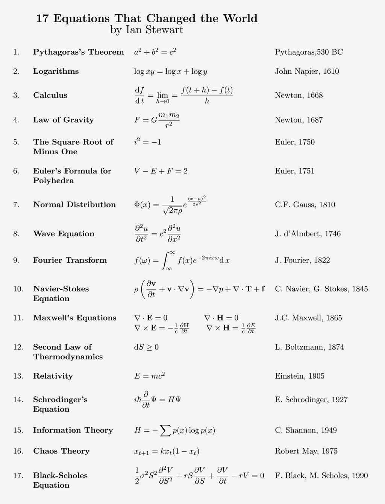

# 理论信息学
* [P/NP/NPC问题](./P%20vs%20NP%20vs%20NPC.md)  
* [可计算性理论](./可计算性理论.md)
  
# [初等数学/基础](https://zh.wikipedia.org/wiki/%E5%88%9D%E7%AD%89%E6%95%B0%E5%AD%A6)
* [数学归纳法](./Mathematical%20Induction.md)
* [排列组合](./Combinatorics.md)
  * [卡特兰数](https://oi-wiki.org/math/combinatorics/catalan/)
* [对数及运算法则](./Logarithm.md)
* 初等概率
* 集合论：关系模型、关系代数（数据库）
* [阿桥问题 / 约瑟夫斯置换](https://zh.wikipedia.org/zh-hans/%E7%BA%A6%E7%91%9F%E5%A4%AB%E6%96%AF%E9%97%AE%E9%A2%98)
* [算法常用数学工具](./../Tool%20Sets/Math.java)
  
# [高等数学](https://zh.wikipedia.org/wiki/%E9%AB%98%E7%AD%89%E6%95%B0%E5%AD%A6)
* 数学分析：微积分、泛函分析
  * [洛必达法则](https://zh.wikipedia.org/zh-hans/%E6%B4%9B%E5%BF%85%E8%BE%BE%E6%B3%95%E5%88%99)：一个在微积分中非常强大的工具，用于求解特定类型的极限。核心思想是当极限是 0/0 或 ∞/∞ 型未定式时，可以对分子分母分别求导，再求极限。公式即如果 `lim f(x) = 0` 且 `lim g(x) = 0`（或都趋于 ∞），则：`lim [f(x)/g(x)] = lim [f'(x)/g'(x)]`。对于不符合上述分数形式的未定式，可以通过运算转为分数形式，再以本法则求其值。注意：不能在数列形式下直接用洛必达法则，因为对于离散变量是无法求导数的。但此时有形式类近的[斯托尔兹－切萨罗定理](https://zh.wikipedia.org/wiki/%E6%96%AF%E6%89%98%E5%B0%94%E5%85%B9-%E5%88%87%E8%90%A8%E7%BD%97%E5%AE%9A%E7%90%86)作为替代。
* 数论
* 离散数学：组合数学、图论、博弈论
* 拓扑
* 代数：线性代数 [Ref](https://www.ruanyifeng.com/blog/2015/09/matrix-multiplication.html)
  * 从线代这门课做的其中一项工作 “线性变换” 说起，线性变换实际上指的是坐标系的拉伸，旋转之类的变换，但不包括扭曲，扭曲可就成非线性了。矩阵和矩阵相乘的本质是坐标系的线性变换，矩阵和向量相乘的本质是向量的线性变换。
  * 矩阵的本质就是线性方程式，两者是一一对应关系。如果从线性方程式的角度，理解矩阵乘法就毫无难度。
* 统计学：数理统计、概率论
* 计算数学/应用数学：最优化、数值分析、信息论

## ACM 数论
1. 整除的性质
2. 常见定理
3. 模与余
    1. 模运算
    2. 同余的性质
    3. 快速幂
4. 数论重要定理及应用
    1. 欧几里得定理
    2. 扩展欧几里得
    3. 线性同余方程(模线性方程)
    4. 中国剩余定理(模线性方程组)
    5. 乘法逆元
    6. 二次同余方程
    7. 唯一分解定理
5. 素数及其相关定理
    1. 反素数
    2. 素数筛
    3. 素性测试
    4. 欧拉函数
    5. 欧拉降幂公式
    6. 积性函数
6. 莫比乌斯相关
    1. 莫比乌斯函数
    2. 莫比乌斯反演
7. 逆序数
8. 原根
9. 离散对数
  
原文链接：https://blog.csdn.net/weixin_43093481/article/details/82229718  

其他参考：https://www.desgard.com/algo/  

# 重要数学公式
  
  
[Guest Editors Introduction to the top 10 algorithms:](https://ieeexplore.ieee.org/document/814652)
* Metropolis Algorithm for Monte Carlo
* Simplex Method for Linear Programming
* Krylov Subspace Iteration Methods
* The Decompositional Approach to Matrix Computations
* The Fortran Optimizing Compiler
* QR Algorithm for Computing Eigenvalues
* Quicksort Algorithm for Sorting
* Fast Fourier Transform
* Integer Relation Detection
* Fast Multipole Method
