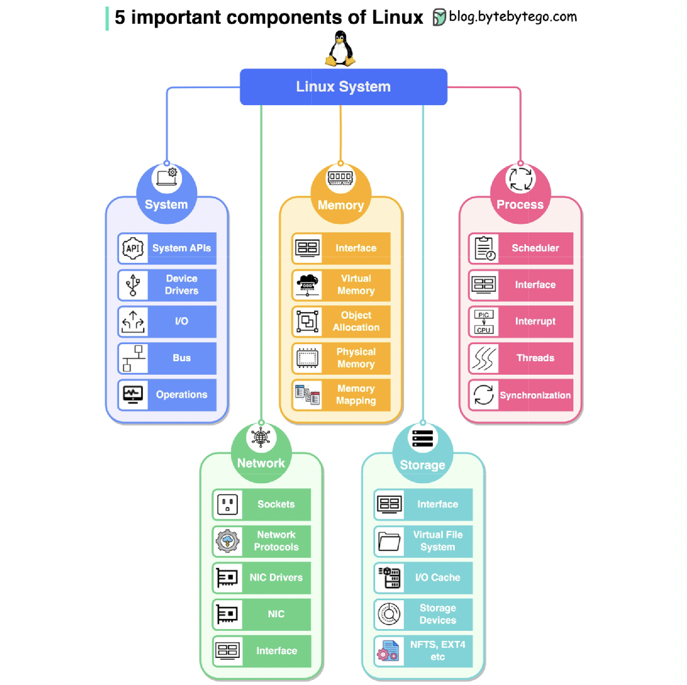
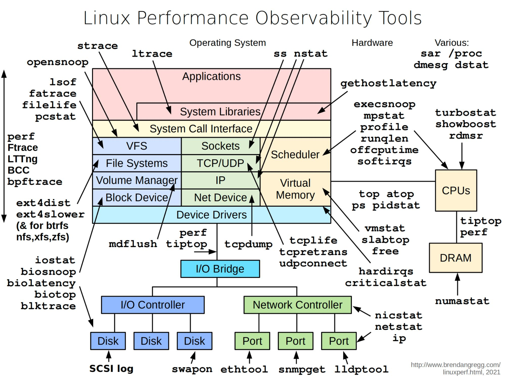
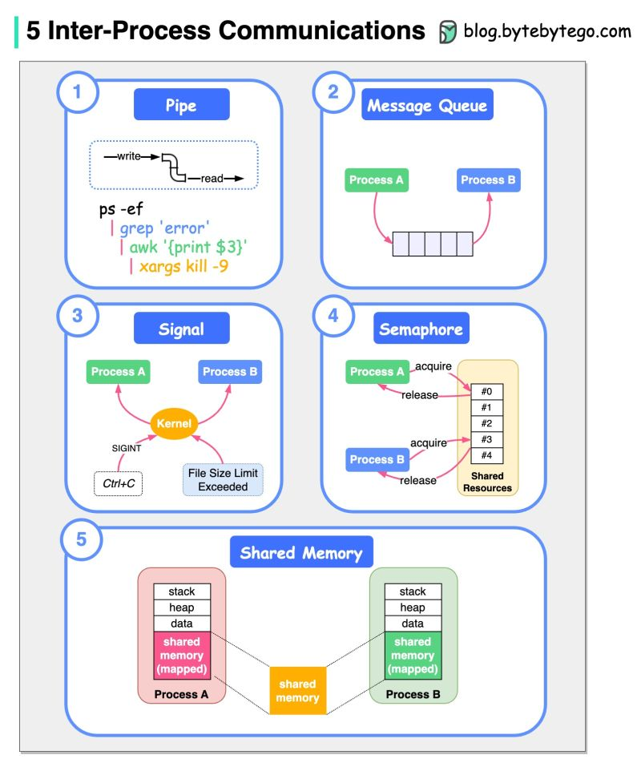

## 小章目录

- [内存与程序](./内存与程序.md)
- [进程与线程](./进程与线程.md)
- [并发与并行](./并发与并行.md)
  - [Java 实现以及 CAS](./并发与并行(Java)/)
- [异步与同步](./异步与同步.md)
- [编译](./编译.md)
  - [JVM](./JVM/)
- [I/O](./IO/README.md)
  - [Java I/O](./IO/IO(Java).md)
- [缓存与缓冲](./缓存与缓冲.md)
- [数据库](./数据库/)
- [文件系统](./文件系统.md)
- 操作系统
  - [阻塞与中断](./阻塞与中断.md)
  - 
  - 
  - 

