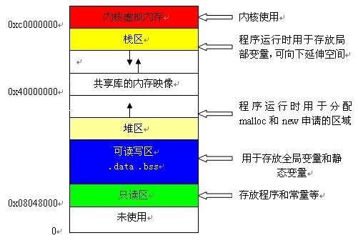

内存中的堆栈和数据结构堆栈不是一个概念，可以说内存中的堆栈是真实存在的物理区，数据结构中的堆栈是抽象的数据存储结构。  
  
## 内存中的堆栈
内存空间在逻辑上分为三部分：代码区、静态数据区和动态数据区，动态数据区又分为栈区和堆区。  
  
* 代码区：存储方法体的二进制代码。高级调度（作业调度）、中级调度（内存调度）、低级调度（进程调度）控制代码区执行代码的切换。
* 静态数据区：存储全局变量、静态变量、常量，常量包括 final 修饰的常量和 String 常量。系统自动分配和回收。
* 动态数据区：
  * 栈区：存储运行方法的形参、局部变量、返回值。由系统自动分配和回收。栈是一个后进先出 (LIFO) 结构。当把数据放入栈时，把数据 push 进入；当从栈取出数据时，把数据 pop 出来。
      * 例如 int method(int a){int b;} 栈中存储参数 a、局部变量 b、返回值 temp。
      * 例如函数调用的上下文环境（如递归）。
  * 堆区：动态存储器分配，比如 new 一个对象的引用或地址存储在栈区，指向该对象存储在堆区中的真实数据。由程序员分配和回收（Java 中由 JVM 虚拟机的垃圾回收机制自动回收），否则会发生内存泄漏错误。
      * 例如 Class Student{int num; int age;} main 方法中 Student stu = new Student()；分配堆区空间中存储的该对象的 num、age，变量 stu 存储在栈中，里面的值是对应堆区空间的引用或地址。  
  
另：内存的栈还分系统栈（或称内核栈）和用户栈（用户进程空间的栈），系统栈为操作系统等底层进程程序服务，用户栈为用户进程程序服务。系统栈与用户栈功能类似，系统栈还有一些特殊功能如：中断/优先级处理机制等等。  
为什么要有堆和栈的区分呢：  
因为结构化语言里函数（子程序）调用最方便的实现方式就是用栈，以至于现在绝大部分芯片都对栈提供芯片级的硬件支持，一条指令即可搞定栈的 pop 操作。栈的好处是：方便、快、有效避免内存碎片化。栈的问题是：不利于管理大内存（尤其在 16 位和 32 位时代）、数据的生命周期难于控制（栈内的有效数据通常是连续存储的，所以 pop 时后申请的内存必须早于先申请的内存失效），所以栈不利于动态地管理并且有效地利用宝贵的内存资源，于是就有了堆，相应的，堆需要一套分配策略以防止出现大量小碎片，栈的分配是编译期决定的，堆的话需要运行时去申请（比如 C 的 malloc），所以堆在调用时没有栈方便，堆在清理时因语言而异，比如 C 没有自动回收则需要手动回收。性能上，现今 CPU 的处理模型就是栈，栈上的变量命中率比堆高很多。[参考](https://www.zhihu.com/question/49927441)  
  

  
更多详细可看：https://www.jianshu.com/p/52b5a1879aa1, https://blog.csdn.net/gettogetto/article/details/56487342  
以上参考：https://www.jianshu.com/p/b42fd8293b4f
