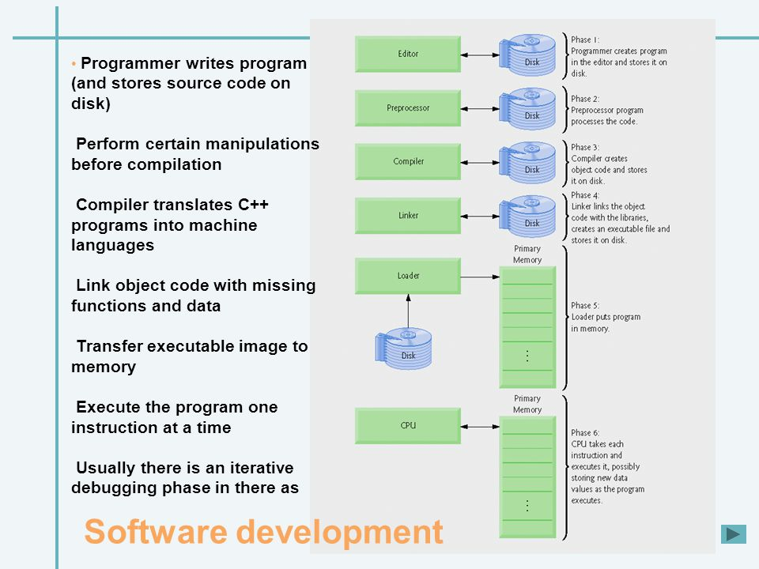

内存中的堆栈和数据结构堆栈不是一个概念，可以说内存中的堆栈是真实存在的物理区，数据结构中的堆栈是抽象的数据存储结构。  
  
## 内存中的堆栈
内存空间在逻辑上分为三部分：代码区、静态数据区和动态数据区，动态数据区又分为栈区和堆区。  
  
* 代码区：存储方法体的二进制代码。高级调度（作业调度）、中级调度（内存调度）、低级调度（进程调度）控制代码区执行代码的切换。关于代码程序从编写编译到被执行的过程请参考[程序生命周期](./内存与程序.md#程序生命周期)。
* 静态数据区：存储全局变量、静态变量、常量，常量包括 final 修饰的常量和 String 常量。系统自动分配和回收。
* 动态数据区：
  * 栈区：存储运行方法的形参、局部变量、返回值。由系统自动分配和回收。栈是一个后进先出 (LIFO) 结构。当把数据放入栈时，把数据 push 进入；当从栈取出数据时，把数据 pop 出来。
      * 例如 int method(int a){int b;} 栈中存储参数 a、局部变量 b、返回值 temp。
      * 例如函数调用的上下文环境（如递归）。
  * 堆区：动态存储器分配，比如 new 一个对象的引用或地址存储在栈区，指向该对象存储在堆区中的真实数据。由程序员分配和回收（Java 中由 JVM 虚拟机的垃圾回收机制自动回收），否则会发生内存泄漏错误。
      * 例如 Class Student{int num; int age;} main 方法中 Student stu = new Student()；分配堆区空间中存储的该对象的 num、age，变量 stu 存储在栈中，里面的值是对应堆区空间的引用或地址。  
  
另：内存的栈还分系统栈（或称内核栈）和用户栈（用户进程空间的栈），系统栈为操作系统等底层进程程序服务，用户栈为用户进程程序服务。系统栈与用户栈功能类似，系统栈还有一些特殊功能如：中断/优先级处理机制等等。  
  
### 为什么要有堆和栈的区分呢
> 因为结构化语言里函数（子程序）调用最方便的实现方式就是用栈，以至于现在绝大部分芯片都对栈提供芯片级的硬件支持，一条指令即可搞定栈的 pop 操作。栈的好处是：方便、快、有效避免内存碎片化。栈的问题是：不利于管理大内存（尤其在 16 位和 32 位时代）、数据的生命周期难于控制（栈内的有效数据通常是连续存储的，所以 pop 时后申请的内存必须早于先申请的内存失效），所以栈不利于动态地管理并且有效地利用宝贵的内存资源，于是就有了堆，相应的，堆需要一套分配策略以防止出现大量小碎片，栈的分配是编译期决定的，堆的话需要运行时去申请（比如 C 的 malloc），所以堆在调用时没有栈方便，堆在清理时因语言而异，比如 C 没有自动回收则需要手动回收。栈通常是连续的，堆通常是不连续的。性能上，现今 CPU 的处理模型就是栈，栈上的变量命中率比堆高很多。[参考](https://www.zhihu.com/question/49927441)  
  
### 内存分配管理
  
  
### 程序生命周期
  
  
更多详细可看：  
https://www.jianshu.com/p/52b5a1879aa1  
https://blog.csdn.net/gettogetto/article/details/56487342  
https://blog.csdn.net/yOung_One/article/details/41682167  
  
以上参考：https://www.jianshu.com/p/b42fd8293b4f  
  
## 关于爆栈
> 在写一个算法中，由于递归调用次数过多，堆栈溢出。  
> 堆栈的大小是系统控制的，无法改变。  
> 如果递归调用出现问题，可以考虑采取循环的方式来解决，将需要的数据在关键的调用点保存下来使用。简单的说，就是用自己的数据保存方法来代替系统递归调用产生的堆栈数据。  

> 溢出的意思就是越界，操作系统会给每个进程分配一个最大上限的堆栈空间，如果超过了这个内存空间大小程序就会 coredump，就像你创建一个太大的数组会崩溃一样，因为这里堆溢出了。操作系统分配给一个进程的栈空间是 2M，堆空间在 32 位机器上是 4G。如果你的进程的栈空间使用超过了 2M 就会栈溢出，堆使用超过 4G 就会堆溢出。  

> 那么递归为什么会导致栈溢出呢？相信大家知道栈的出入规则，就像一个瓶子，方法压栈运行，先进后出，递归的话那么先入的不能出栈，会存在栈空间中，这样就容易导致栈满而溢出。  

> 每当你调用一个方法，在这个方法执行前都会将之前的内存地址（也就是调用点）入栈，等被调用的方法执行完将地址出栈，程序根据这个数据返回调用点。  
> 若递归调用次数太多，就会只入栈不出栈，于是堆栈就被压爆了，此为栈溢出。  

> 递归函数调用的太深，需要太多的内存，递归里用到的局部变量存储在堆栈中，堆栈的访问效率高，速度快，但空间有限，递归太多变量需要一直入栈而不出栈，导致需要的内存空间大于堆栈的空间。  

原文链接：https://blog.csdn.net/qq_42370146/article/details/82356792  

## 内存溢出与内存泄漏
* 内存溢出 out of memory，是指程序在申请内存时，没有足够的内存空间供其使用，出现 out of memory；比如申请了一个 integer，但给它存了 long 才能存下的数，那就是内存溢出。
* 内存泄露 memory leak，是指程序在申请内存后，无法释放已申请的内存空间，一次内存泄露危害可以忽略，但内存泄露堆积后果很严重，无论多少内存,迟早会被占光。
  * 内存泄漏是指你向系统申请分配内存进行使用 (new)，可是使用完了以后却不归还 (delete)，结果你申请到的那块内存你自己也不能再访问（也许你把它的地址给弄丢了），而系统也不能再次将它分配给需要的程序。一个盘子用尽各种方法只能装 4 个果子，你装了 5 个，结果掉倒地上不能吃了。这就是溢出！比方说栈，栈满时再做进栈必定产生空间溢出，叫上溢，栈空时再做退栈也产生空间溢出，称为下溢。就是分配的内存不足以放下数据项序列，称为内存溢出。

原本链接：https://zhuanlan.zhihu.com/p/69151763  
  
### 内存逃逸
* [基准测试示例](./escape_benchmark_test.go)
* [GC 测试](./escape.go)

golang 的内存分配之堆和栈 - Go 的垃圾回收，让程序员可以专注于业务，“高效” 地完成代码编写。把那些内存管理的复杂机制交给编译器。  
栈：可以简单得理解成一次函数调用内部申请到的内存，它们会随着函数的返回把内存还给系统。下面来看看一个例子：  
```go
func F() {
	temp := make([]int, 0, 20)
	// ...
}
```  
上面的例子，内函数内部申请的临时变量，即使是用 make 申请到的内存，如果发现在退出函数后没有用了，那么就把丢到栈上，毕竟栈上的内存分配比堆上快很多。  

下面是一个堆的例子：  
```go
func F() []int{ // 或者返回指针、map 等
	a := make([]int, 0, 20)
	return a
}
```  
而上面这段代码，申请的代码和上面的一模一样，但是申请后作为返回值返回了，编译器会认为在退出函数之后还有其他地方在引用，当函数返回之后并不会将其内存归还。那么就申请到堆里，即内存逃逸。  
内存逃逸的危害：变量在堆上的分配和回收都比在栈上开销大的多。对于 go 这种带 GC 的语言来说，会增加 GC 压力（如果变量都分配到堆上，堆不像栈可以自动清理。它会引起 Go 频繁地进行垃圾回收，而垃圾回收会占用比较大的系统开销），同时也容易造成内存碎片。  

逃逸分析  
逃逸分析是一种确定指针动态范围的方法。简单来说就是分析在程序的哪些地方可以访问到该指针。简单来说，编译器会根据变量是否被外部引用来决定是否逃逸：  
1. 如果函数外部没有引用，则优先放到栈中；
2. 如果函数外部存在引用，则必定放到堆中；

注意：go 在编译阶段确立逃逸，并不是在运行时。  

原本链接：  
https://zhuanlan.zhihu.com/p/113643434  
https://segmentfault.com/a/1190000039843497  
