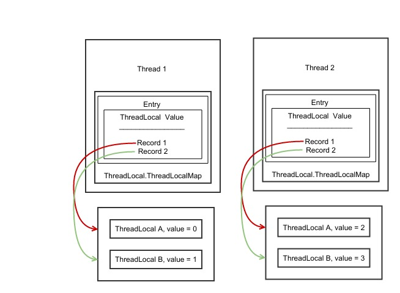
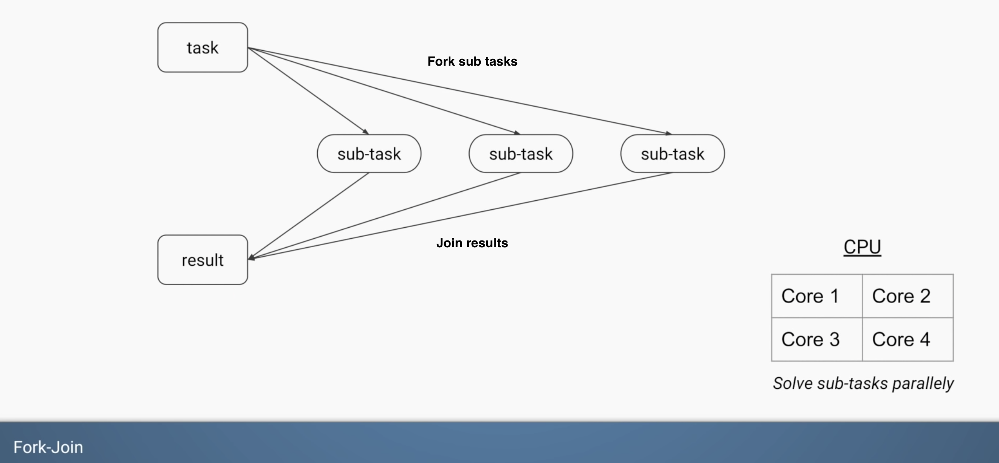
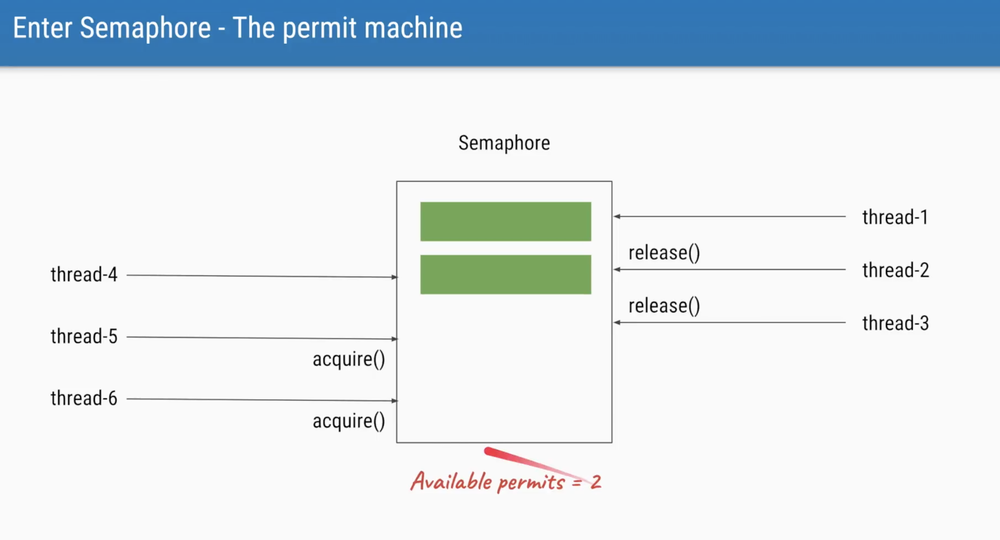

Java 并发  
  
  
熟悉 Java 并发编程的都知道，JMM(Java 内存模型) 中的 happen-before(简称 hb)规则，该规则定义了 Java 多线程操作的有序性和可见性，防止了编译器重排序对程序结果的影响。按照官方的说法：  
当一个变量被多个线程读取并且至少被一个线程写入时，如果读操作和写操作没有 HB 关系，则会产生数据竞争问题。要想保证操作 B 的线程看到操作 A 的结果（无论 A 和 B 是否在一个线程），那么在 A 和 B 之间必须满足 HB 原则，如果没有，将有可能导致重排序。当缺少 HB 关系时，就可能出现重排序问题（重排序 Instruction Reordering 是对程序执行效率的优化 - 除了 CPU 会对指令重排序来优化性能之外，Java JIT 也会对指令进行重排序。重排序也会发生在单线程程序，而只是单线程程序的重排显然不会出问题但多线程程序会出问题）。  
  
  
### HB 有哪些规则
这个大家都非常熟悉了应该，大部分书籍和文章都会介绍，这里稍微回顾一下：  
1. 程序次序规则：一个线程内，按照代码顺序，书写在前面的操作先行发生于书写在后面的操作；
2. 锁定规则：在监视器锁上的解锁操作必须在同一个监视器上的加锁操作之前执行。
3. volatile变量规则：对一个变量的写操作先行发生于后面对这个变量的读操作；
4. 传递规则：如果操作A先行发生于操作B，而操作B又先行发生于操作C，则可以得出操作A先行发生于操作C；
5. 线程启动规则：Thread对象的start()方法先行发生于此线程的每一个动作；
6. 线程中断规则：对线程interrupt()方法的调用先行发生于被中断线程的代码检测到中断事件的发生；
7. 线程终结规则：线程中所有的操作都先行发生于线程的终止检测，我们可以通过Thread.join()方法结束、Thread.isAlive()的返回值手段检测到线程已经终止执行；
8. 对象终结规则：一个对象的初始化完成先行发生于他的finalize()方法的开始；  
  
以上参考自[链接](https://ifeve.com/java-%E4%BD%BF%E7%94%A8-happen-before-%E8%A7%84%E5%88%99%E5%AE%9E%E7%8E%B0%E5%85%B1%E4%BA%AB%E5%8F%98%E9%87%8F%E7%9A%84%E5%90%8C%E6%AD%A5%E6%93%8D%E4%BD%9C/)  
  
**另外，虽然同一个线程的同一个代码块内的语句虽然均可能重排序，但写好的volatile变量读操作语句之后的普通或volatile变量读操作语句均不会被排序到volatile变量读操作语句之前（参考下图的 Thread 2 中的 takeFrame 方法/代码块的 while(!hasNewFrame) 检测），而类似的，volatile变量写操作语句之前的普通或volatile变量操作语句均不会被排序到该volatile变量写操作语句之后（参考下图的 Thread 1 中的 storeFrame 方法/代码块，this.frame 和 this.framesStoredCount 的操作语句顺序虽然可能会被重排序但必然皆在 this.hasNewFrame 的操作语句之前）。另外值得一提的是每次程序读取volatile变量都是会直接从主内存/Heap中读取数据，而不是如读取普通变量一般（多数时候）从工作存储/Thread Stack中读取，且当线程正在读取volatile变量时，该线程对之后（严格的 HB 关系的之后关系）其他变量（无论volatile与否）的读取也会直接从主内存读取（比如下图线程2的 while(!hasNewFrame){...} 块中或之后的任意变量读取，但是 while 块之前的则不一定。这是因为线程会在那一刻才对其visible的所有变量从主内存/Heap中刷新读取，但之前执行的读取操作可能只是从工作存储/Thread Stack中读取所以那时读到的可能是过时的数据）；同理，当线程正在写入volatile变量时，该线程对之前（严格的 HB 关系的之前关系）其他变量（无论volatile与否）的写入也会保证同时写入主内存，但之后的则不一定 - 可能只是暂时先写入工作存储/Thread Stack而已。**  
  
**以上规则同样适用于synchronized代码块，比如synchronized代码块结尾之前的任意内存变量（无论主内存/Heap还是工作存储/Thread Stack）的写操作语句都不会被重排序到synchronized代码块结尾之后（且保证在结尾时也都会被写入Heap），而synchronized代码块开头之后任意内存变量的读操作语句皆不会被重排序到synchronized代码块开头之前。另外值得一提的是每次程序进入synchronized代码块开头时都会从Heap而不是Thread Stack中读取变量，且在synchronized代码块结尾时都会保证把任何变量的写操作写入Heap而不是只是写入Thread Stack（但是synchronized代码块之外的变量写操作不保证能同时写入Heap，因此当另一个Thread即使从Heap读取相关共享变量时很有可能读到的也是未更新的数据）。以上规则参考下图。**  
  
根据上一段落的描述，因此在synchronized代码块开头及结尾处都会带来一些额外的性能开销，同理volatile关键字使用同样有额外性能开销，所以应该在真正需要时才使用它们。  
  
其他 HB 规则：  
  
  
## Happens-Before 详解
happens-before 偏序关系。  
  
  
<details>
<summary>通俗解释</summary>
synchronized、大部分锁，众所周知的一个功能就是使多个线程互斥/串行的（共享锁允许多个线程同时访问，如读锁）访问临界区，但他们的第二个功能 —— 保证变量的可见性 —— 常被遗忘。  
  
为什么存在可见性问题？简单介绍下。相对于内存，CPU的速度是极高的，如果CPU需要存取数据时都直接与内存打交道，在存取过程中，CPU将一直空闲，这是一种极大的浪费，所以，现代的CPU里都有很多寄存器，多级cache，他们比内存的存取速度高多了。某个线程执行时，内存中的一份数据，会存在于该线程的工作存储中（working memory，是cache和寄存器的一个抽象，这个解释源于《Concurrent Programming in Java: Design Principles and Patterns, Second Edition》§2.2.7，原文：Every thread is defined to have a working memory (an abstraction of caches and registers) in which to store values. 有不少人觉得working memory是内存的某个部分，这可能是有些译作将working memory译为工作内存的缘故，为避免混淆，这里称其为工作存储，每个线程都有自己的工作存储），并在某个特定时候回写到内存。单线程时，这没有问题，如果是多线程要同时访问同一个变量呢？内存中一个变量会存在于多个工作存储中，线程1修改了变量a的值什么时候对线程2可见？此外，编译器或运行时为了效率可以在允许的时候对指令进行重排序，重排序后的执行顺序就与代码不一致了，这样线程2读取某个变量的时候线程1可能还没有进行写入操作呢，虽然代码顺序上写操作是在前面的。这就是可见性问题的由来。  
  
我们无法枚举所有的场景来规定某个线程修改的变量何时对另一个线程可见。但可以制定一些通用的规则，这就是happens-before。它是一个偏序关系，Java内存模型中定义了许多Action，有些Action之间存在happens-before关系（并不是所有Action两两之间都有happens-before关系）。“ActionA happens-before ActionB”这样的描述很扰乱视线，是不是？OK，换个描述，如果ActionA happens-before ActionB，可以记作hb(ActionA,ActionB)或者记作ActionA < ActionB，这在这里已经不是小于号了，它是偏序关系，类似离散数学，下面都用hb(ActionA,ActionB)这种方式来表述。  
  
从Java内存模型中取两条happens-before关系来看：  
* An unlock on a monitor happens-before every subsequent lock on that monitor.  
* A write to a volatile field happens-before every subsequent read of that volatile.  
  
“对一个monitor的解锁操作happens-before后续对同一个monitor的加锁操作”、“对某个volatile字段的写操作happens-before后续对同一个volatile字段的读操作”……不知所云……就是这个心情。是不是说解锁操作要先于锁定操作发生？这有违常规啊。确实不是这么理解的。happens-before规则不是描述实际操作的先后顺序，它是用来描述可见性的一种规则，下面我给上述两条规则换个说法：  
* 如果线程1解锁了monitor a，接着线程2锁定了a，那么，线程1解锁a之前的写操作都对线程2可见（线程1和线程2可以是同一个线程）。  
* 如果线程1写入了volatile变量v（这里和后续的“变量”都指的是对象的字段、类字段和数组元素），接着线程2读取了v，那么，线程1写入v及之前的写操作都对线程2可见（线程1和线程2可以是同一个线程）。  
  
其实就是在说“如果hb(a,b)，那么a及之前的写操作在另一个线程t1进行了b操作时都对t1可见（同一个线程就不会有可见性问题，下面不再重复了）”。再看两条happens-before规则：  
* All actions in a thread happen-before any other thread successfully returns from a join() on that thread.  
* Each action in a thread happens-before every subsequent action in that thread.  

通俗版：  
* 线程t1写入的所有变量（所有action都与那个join有hb关系，当然也包括线程t1终止前的最后一个action了，最后一个action及之前的所有写入操作，所以是所有变量），在任意其它线程t2调用t1.join()成功返回后，都对t2可见。
* 线程中上一个动作及之前的所有写操作在该线程执行下一个动作时对该线程可见（也就是说，同一个线程中前面的所有写操作对后面的操作可见）  
  
  
happens-before关系有个很重要的性质，就是传递性，即，如果hb(a,b),hb(b,c)，则有hb(a,c)。  
Java内存模型中只是列出了几种比较基本的hb规则，在Java语言层面，又衍生了许多其他happens-before规则，如ReentrantLock的unlock与lock操作，又如AbstractQueuedSynchronizer的release与acquire，setState与getState等等。  
  
以上参考：[链接](http://ifeve.com/easy-happens-before/)  
</details>
<br>
  
## synchronized 关键字
synchronized 同一个 monitor object 代码块/方法一次只能由一个线程执行。如果有多个线程想访问/执行 synchronized 同一个 monitor object 的代码块/方法，哪一个等待中的线程将获得下一个访问/执行的顺序是无法保证、是不确定的（因此很有可能出现内同一个线程连续重复多次获得访问/执行机会，但其他线程都尚未有机会的情况；另外要注意不存在哪个线程先等待就在下一轮先执行的逻辑，若想保证绝对的等待公平的话可以使用 java.util.concurrent 包里的某些 API）。  
另外多个 JVM 上运行的各自线程当然一定不会互相 block 对方访问/执行 synchronized 代码块/方法（如果想实现这种跨 JVM 的锁，则可能需要通过数据库等其他工具实现）。   
  
## volatile 关键字
volatile 关键字确保变量的写操作总是立刻保存到主内存/Heap 上，从而保证了多线程间不会发生线程A对共享变量的写操作只保存到自己的工作存储/Thread Stack 上而线程B从主内存（甚至自己的工作存储）中读取的仍是未更新的数据。  
  
## synchronized 与 volatile 区别
1. volatile本质是在告诉jvm当前变量在寄存器（工作存储）中的值是不确定的，需要从主存中读取； synchronized则是锁定当前变量，只有当前线程可以访问该变量，其他线程被阻塞住。
2. volatile仅能使用在变量级别；synchronized则可以使用在变量、方法、和类级别的
3. volatile仅能实现变量的修改可见性，不能保证原子性；而synchronized则可以保证变量的修改可见性和原子性
4. volatile不会造成线程的阻塞；synchronized可能会造成线程的阻塞。
5. volatile标记的变量不会被编译器优化；synchronized标记的变量可以被编译器优化  
  
```java
// volatile 错误案例（多线程场景）
public class Counter {
  private volatile int count = 0;
    
  public boolean inc() {
    if (this.count == 10) { // 虽然使用了 volatile，但因为 volatile 并没有锁/阻塞功能，很可能多个线程同时到达这里并读取到 9 然后均继续执行该 if 块的后文
        return false;
    }
    this.count++; // volatile 仅能实现变量的修改可见性，不能保证原子性，所以可能多个线程均在此同时读到 9 然后在工作存储增至 10 并在这之后写入主内存，导致最后结果是 10 而不是正确的数字（正确的应该更高，取决于线程数量）。这里除了使用 synchronized，也可以通过使用 java.util.concurrent.atomic 来解决问题
    return true;
  } 
}
```  
以上 Java volatile 错误案例可通过使用 synchronized 来避免问题。  
  
## 原子性 有序性 可见性
  
### 原子性
原子性操作是指一个操作是不可中断的，要么全部执行成功要么全部执行失败，有着“同生共死”的感觉，就是一个或某几个操作只能在一个线程执行完之后，另一个线程才能开始执行该操作，也就是说这些操作是不可分割的，线程不能在这些操作上交替执行（一个操作一旦开始，就不会被其他线程所干扰）。  
java.util.concurrent.atomic 的 Atomic 类是通过无锁（lock-free）的方式实现的线程安全（thread-safe）访问。它的主要原理是利用了 CAS：Compare and Set。  
JMM 中定义了 8 种操作都是原子的，不可再分的：  
* lock（锁定）：作用于主内存中的变量，它把一个变量标识为一个线程独占的状态；
* unlock（解锁）：作用于主内存中的变量，它把一个处于锁定状态的变量释放出来，释放后的变量才可以被其他线程锁定
* read（读取）：作用于主内存的变量，它把一个变量的值从主内存传输到线程的工作存储中，以便后面的load动作使用；
* load（载入）：作用于工作存储中的变量，它把 read 操作从主内存中得到的变量值放入工作存储中的变量副本
* use（使用）：作用于工作存储中的变量，它把工作存储中一个变量的值传递给执行引擎，每当虚拟机遇到一个需要使用到变量的值的字节码指令时将会执行这个操作；
* assign（赋值）：作用于工作存储中的变量，它把一个从执行引擎接收到的值赋给工作存储的变量，每当虚拟机遇到一个给变量赋值的字节码指令时执行这个操作；
* store（存储）：作用于工作存储的变量，它把工作存储中一个变量的值传送给主内存中以便随后的 write 操作使用；
* write（操作）：作用于主内存的变量，它把 store 操作从工作存储中得到的变量的值放入主内存的变量中。  
  
### 有序性
为了性能优化，编译器和处理器会进行指令重排序；也就是说 Java 程序天然的有序性可以总结为：如果在本线程内观察，所有的操作都是有序的；如果在一个线程观察另一个线程，所有的操作都是无序的。比如，synchronized 语义就要求线程在访问读写共享变量时只能“串行”执行，因此 synchronized 具有有序性。  
  
### 可见性
可见性是指当一个线程修改了共享变量后，其他线程能够立即得知这个修改。  
  
### 实例
synchronized：具有原子性，有序性和可见性。  
volatile：具有有序性和可见性。  
  
以上参考：[链接](https://www.jianshu.com/p/cf57726e77f2)  
  
# Thread/线程
  
## Runnable vs Callable
runnable 是通过 run 方法实现多线程操作而 callable 是通过 call 方法实现多线程操作实体有返回值的任务必须通过 callable，另外 runnable 不可以抛出异常但是 callable 可以。  
  
## ThreadLocal
在一个线程中，横跨若干方法调用，需要传递的对象，我们通常称之为上下文（Context），它是一种状态，可以是用户身份、任务信息等。  
给每个方法增加一个 context 参数非常麻烦，而且有些时候，如果调用链有无法修改源码的第三方库，需要传递的对象就传不进去了。  
Java 标准库提供了一个特殊的 ThreadLocal，它可以在一个线程中传递同一个对象。  
  
[示例代码](./Jenkov/ThreadLocalExamples.java)  
  
需要注意的是在有些情况下，比如多任务使用线程池时要小心任务之间可能因为共用一个线程所以其实共用了 ThreadLocal 的变量/数据，从而有可能发生任务之间的写入覆盖。  
  
  
## Thread 切换
前面已介绍了 JMM 机制，因此已知每个线程有自己的工作内存、Context 等资源，所以当创建的线程数多于 CPU 核数时，后台其实就在不停地轮流切换这些线程进入 CPU 核心以达到貌似同时都在执行的假象，这样就会不停地创建、保存、擦除、复原线程的工作内存、Context 等资源，造成了消耗，称之为 data locality 和 context switches。因此当出现此情况时，多线程非但不能再提高性能反而可能会降低性能，则程序优化的选择应考虑异步编程（Asynchronous）。  
  
## Thread Pool
线程池，由阻塞队列（BlockingQueue）和 HashSet 集合构成，通常与 ExecutorService 配合使用。  
  
## ExecutorService
ExecutorService 是 Java java.util.concurrent 包的组成部分，用于简化异步模式下任务的执行，且有利于改善性能（创建线程总是需要额外消耗，所以通过 ExecutorService 预置/复用线程会更高效）。ExecutorService 会自动提供一个线程池和相关 API，用于为其分配任务。  
  
<details>
<summary>ExecutorService 使用</summary>
实例化 ExecutorService 的方式有两种：一种是工厂方法，另一种是直接创建。  

### 工厂方法创建 ExecutorService 实例（[不推荐使用](https://zhuanlan.zhihu.com/p/80407132)）
创建 ExecutorService 实例的最简单方法是使用 Executors 类的提供的工厂方法。比如  
```java
ExecutorService executor = Executors.newFixedThreadPool(10);
```
当然还有其它很多工厂方法，每种工厂方法都可以创建满足特定用例的预定义 ExecutorService 实例。编程时所需要做的就是找到合适的方法。  
  
该方法在实际生产环境中不推荐甚至不允许，而是应通过 ThreadPoolExecutor 的方式，因为后者的处理方式让写的开发者更加明确线程池的运行规则，规避资源耗尽的风险。  
Executor 提供的 4 个静态方法创建线程池，但是阿里规约却并不建议使用它。  
Executors 各个方法的弊端（[具体导致原因](https://zhuanlan.zhihu.com/p/80407132)）：  
1. newFixedThreadPool 和 newSingleThreadExecutor: 主要问题是堆积的请求处理队列可能会耗费非常大的内存，甚至 OOM。  
2. newCachedThreadPool 和 newScheduledThreadPool: 主要问题是线程数最大数是 Integer.MAX_VALUE，可能会创建数量非常多的线程，甚至 OOM。  
  
  
### 直接创建 ExecutorService 的实例（[推荐使用](https://zhuanlan.zhihu.com/p/80407132)）
因为 ExecutorService 是只是一个接口，因此可以使用其任何实现类的实例。java.util.concurrent 包已经预定义了几种实现可供选择，或者也可以创建自己的实现。  
例如，ThreadPoolExecutor 类实现了 ExecutorService 接口并提供了一些构造函数用于配置执行程序服务及其内部池。  
```java
ExecutorService executorService = 
  new ThreadPoolExecutor(1, 1, 0L, TimeUnit.MILLISECONDS,   
  new LinkedBlockingQueue<Runnable>()
);
```
上面的代码与工厂方法 newSingleThreadExecutor() 的源代码非常相似。对于大多数情况，不需要详细的手动配置。  
  
### 分配任务给 ExecutorService
ExecutorService 可以执行 Runnable 和 Callable 任务。这里将使用两个两个原始任务，如下面的代码所示。  
```java
Runnable runnableTask = () -> {
    try {
        TimeUnit.MILLISECONDS.sleep(300);
    } catch (InterruptedException e) {
        e.printStackTrace();
    }
};

Callable<String> callableTask = () -> {
    TimeUnit.MILLISECONDS.sleep(300);
    return "Task's execution";
};

List<Callable<String>> callableTasks = new ArrayList<>();
callableTasks.add(callableTask);
callableTasks.add(callableTask);
callableTasks.add(callableTask);
```
*注意: 上面的代码使用了 lambda 表达式而不是匿名内部类。*  
  
创建完了任务之后，就可以使用多种方法将任务分配给 ExecutorService ，比如 execute() 方法，还有 submit()、invokeAny() 和 invokeAll() 等方法。这些方法都继承自 Executor 接口。  
首先来看看 execute() 方法。该方法返回值为空 ( void )。因此使用该方法没有任何可能获得任务执行结果或检查任务的状态（ 是正在运行 ( running ) 还是执行完毕 ( executed ) ）。  
```java
executorService.execute(runnableTask);
```  
  
其次看看 submit() 方法。submit() 方法会将一个 Callable 或 Runnable 任务提交给 ExecutorService 并返回 Future 类型的结果。  
```java
Future<String> future = executorService.submit(callableTask);
```  
  
然后是 invokeAny() 方法。invokeAny() 方法将一组任务分配给 ExecutorService，使每个任务执行，并返回任意一个成功执行的任务的结果 ( 如果成功执行 )  
```java
String result = executorService.invokeAny(callableTasks);
```  
  
最后是 invokeAll() 方法。invokeAll() 方法将一组任务分配给 ExecutorService ，使每个任务执行，并以 Future 类型的对象列表的形式返回所有任务执行的结果。  
```java
List<Future<String>> futures = executorService.invokeAll(callableTasks);
```  
</details>
<br>
  
### 应用场景下如何使用 ExecutorService
* 如果是 CPU 密集型的场景下，最好把线程池的 size 设置为与 CPU 核心数相等（在假设该计算机只有这一个程序运行没有其他程序的线程也占用 CPU 核心的情况下），因为如果多于核心数的话，多出来的线程不能享有自己独占的核心而只能与其他线程共享核心，导致所有线程以类似多进程单核心的纯并发方式被轮番切换执行，而切换会带来额外的开销，压低了程序的性能。
* 如果是 I/O 密集型的场景下（比如数据库操作、HTTP操作、文件操作等等），可以把线程池的 size 扩大些大于 CPU 的核数（具体取决于 submit task 的速度多快以及 task 的平均等待时间），因为否则可能出现多个线程都在因为等待 I/O 响应而进入 waiting 状态导致 CPU 的核们部分未用甚至全部未用。  
  
参考[示例代码](./Defog/ExecutorServiceThreadPool.java)里的第 2、3 个 main。  
  
### ExecutorService 内部原理（Thread Pool 相关）
[示例代码](./Defog/ExecutorServiceThreadPool.java)  
以上面代码里的第一个 main 为例，当调用 `newFixedThreadPool(10)` 时，其实是在 ExecutorService 内部创建了一个 size 为 10 的 Thread Pool，而在 `for (int i=0; i<100; i++) { service.execute(new Task()); }` 这里其实是在 ExecutorService 创建了一个长度为 100 的 BlockingQueue（非一次性创建长度 100，而是每次循环往 Queue 里添加 Task 元素），当 ExecutorService 开始运行起来后，其实是线程池中的空闲线程会被调用执行阻塞队列里的 Task（因此阻塞队列必须线程安全）。  
另外 BlockingQueue 分有界无界两种，对于有界阻塞队列，超过其界限时进行 put 操作会被阻塞、take 方法在队列为空的时也会阻塞，有界阻塞队列的例子有 ArrayBlockingQueue（基于数组实现的阻塞队列）、LinkedBlockingQueue（初始化设置了大小的话就是有界队列，但是不设置大小时默认长度为 Integer.MAX_VALUE - 21 亿多因此使用体验上相当于“无界”，内部是基于链表实现）；而无界队列则 put 操作永远都不会阻塞、take 方法在队列为空时还是会阻塞，空间限制来源于系统资源的限制。[更多参考](https://blog.csdn.net/u012240455/article/details/81844007)  
不同的 ExecutorService（比如 Executors.newCachedThreadPool、Executors.newScheduledThreadPool）由不同的 BlockingQueue 构建（比如 SynchronousQueue、DelayQueue 等等），参考[示例代码](./Defog/ExecutorServiceThreadPool.java)里的第 4、5 个 main。更多参考下图：  
  
CachedThreadPool、ScheduledThreadPool 的 keepAliveTime 默认是 60 秒，意味着如果有线程 idle 超过 60 秒就会被回收（减少资源消耗并提高性能），参考下面两图：  
  
  
  
如果 task 被 reject 了怎么办？比方说 BlockingQueue 是有界的且已满且所有线程也都满负荷时，再执行 `service.execute(new Task())` 时线程池会 reject task：  
  
  
Rejection Handler [示例代码](./Defog/RejectionHandler.java)  
  
## ReentrantLock
顾名思义，ReentrantLock 即意为可多次对同一个对象/资源来调用锁（当调用了 N 次锁，则解锁次数也应为对应的 N 次）。参考[示例代码](./Defog/ReentrantLock.java)里的 reEnterTheLock。  
  
ReentrantLock 可以替代 synchronized 进行同步；ReentrantLock 获取锁更安全；必须先获取到锁，再进入 `try {...}` 代码块，最后使用 `finally` 保证释放锁；可以使用 `tryLock()` 尝试获取锁。  
[示例代码](./Defog/ReentrantLock.java)  
  
若 `new ReentrantLock(true)` 即 fair lock 时，ReentrantLock 的 waiting 执行线程队列是 FIFO 的，即最先排队等待锁的线程最先下一个执行。若 `new ReentrantLock(false)` 即 unfair lock 时，则选择执行最快的那个线程，因此性能比 fair lock 好但是却可能造成一些线程 starvation/一直等待得不到执行。  
  
## Fork-Join
Fork-Join 与 ExecutorService 基本一样，不同点是：  
1. Fork-Join 可以 fork/split 子任务 sub tasks，然后待子任务们完成后再合并/join 子任务们的结果得出最终结果。  
  
示例：[计算斐波那契](./Defog/ForkJoin.java)  
另外，子任务各自还可以再 fork/split 出各自的子任务  
  
因此 Fork-Join 在此逻辑上有点类似算法里的递归。  
  
2. 除了与 ExecutorService 一样有一个主 BlockingQueue，Fork-Join Pool 里每个线程有自己的一个 Deque（双端队列），即存放主任务 fork/split 出来的子任务，而且这些子任务不会存放在主 BlockingQueue 上；这除了利于 fork join 任务外（比如不用担心 synchronization），也避免了阻塞（除非发生了 work stealing，即线程1自己的双端队列还有许多子任务待完成，而此时线程2自己的双端队列已空且 Fork-Join Pool 主队列也已空时，线程2会从线程1的队列里抢子任务干活），且更容易安排任务。  
  
  
Fork-Join [代码示例](./Defog/ForkJoin.java)  
尽管相比 ExecutorService，Fork-Join 使用起来更加简单且频繁使用时更带来更快的性能（也因此在 Java 7 发布 Fork-Join 之后，许多开发人员都将 ExecutorService 框架替换为 Fork/Join 框架），但开发人员对并发执行的控制量也有所减少。  
  
### Fork-Join 最佳实现原则
  
  
### Fork-Join 使用场景
* 排序
* 矩阵相乘
* 游戏里最佳路径寻找
* 树遍历  
  
等等  
  
## Semaphore
Semaphore（信号量）是用来控制同时访问特定资源的线程数量，它通过协调各个线程，以保证合理的使用公共资源。  
Semaphore 可以用于做流量控制，特别公用资源有限的应用场景，比如数据库连接。假如有一个需求，要读取几万个文件的数据，因为都是IO密集型任务，我们可以启动几十个线程并发的读取，但是如果读到内存后，还需要存储到数据库中，而数据库的连接数只有10个，这时我们必须控制只有十个线程同时获取数据库连接保存数据，否则会报错无法获取数据库连接。  
  
[示例代码](./Defog/Semaphore.java)  
  
## CountDownLatch
CountDownLatch 允许一个或多个线程等待其他线程完成操作，即利用它可以实现类似计数器的功能：比如有一个任务A，它要等待其他4个任务执行完毕之后才能执行。  
[代码示例](./Defog/CountDownLatch.java)  
  
## 并行流
[On Java 8 示例](./OnJava8/)  
[On Java 8 详解](https://github.com/yihaoye/stem-notes/tree/master/t-programming-languages/java/Thinking%20in%20Java/On%20Java%208#%E5%B9%B6%E8%A1%8C%E6%B5%81)  
