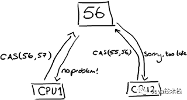

Java 并发  
  
  
熟悉 Java 并发编程的都知道，JMM(Java 内存模型) 中的 happen-before(简称 hb)规则，该规则定义了 Java 多线程操作的有序性和可见性，防止了编译器重排序对程序结果的影响。按照官方的说法：  
当一个变量被多个线程读取并且至少被一个线程写入时，如果读操作和写操作没有 HB 关系，则会产生数据竞争问题。要想保证操作 B 的线程看到操作 A 的结果（无论 A 和 B 是否在一个线程），那么在 A 和 B 之间必须满足 HB 原则，如果没有，将有可能导致重排序。当缺少 HB 关系时，就可能出现重排序问题（重排序 Instruction Reordering 是对程序执行效率的优化 - 除了 CPU 会对指令重排序来优化性能之外，Java JIT 也会对指令进行重排序。重排序也会发生在单线程程序，而只是单线程程序的重排显然不会出问题但多线程程序会出问题）。  
  
  
### HB 有哪些规则
这个大家都非常熟悉了应该，大部分书籍和文章都会介绍，这里稍微回顾一下：  
1. 程序次序规则：一个线程内，按照代码顺序，书写在前面的操作先行发生于书写在后面的操作；
2. 锁定规则：在监视器锁上的解锁操作必须在同一个监视器上的加锁操作之前执行。
3. volatile变量规则：对一个变量的写操作先行发生于后面对这个变量的读操作；
4. 传递规则：如果操作A先行发生于操作B，而操作B又先行发生于操作C，则可以得出操作A先行发生于操作C；
5. 线程启动规则：Thread对象的start()方法先行发生于此线程的每一个动作；
6. 线程中断规则：对线程interrupt()方法的调用先行发生于被中断线程的代码检测到中断事件的发生；
7. 线程终结规则：线程中所有的操作都先行发生于线程的终止检测，我们可以通过Thread.join()方法结束、Thread.isAlive()的返回值手段检测到线程已经终止执行；
8. 对象终结规则：一个对象的初始化完成先行发生于他的finalize()方法的开始；  
  
以上参考自[链接](https://ifeve.com/java-%E4%BD%BF%E7%94%A8-happen-before-%E8%A7%84%E5%88%99%E5%AE%9E%E7%8E%B0%E5%85%B1%E4%BA%AB%E5%8F%98%E9%87%8F%E7%9A%84%E5%90%8C%E6%AD%A5%E6%93%8D%E4%BD%9C/)  
  
**另外，虽然同一个线程的同一个代码块内的语句虽然均可能重排序，但写好的volatile变量读操作语句之后的普通或volatile变量读操作语句均不会被排序到volatile变量读操作语句之前（参考下图的 Thread 2 中的 takeFrame 方法/代码块的 while(!hasNewFrame) 检测），而类似的，volatile变量写操作语句之前的普通或volatile变量操作语句均不会被排序到该volatile变量写操作语句之后（参考下图的 Thread 1 中的 storeFrame 方法/代码块，this.frame 和 this.framesStoredCount 的操作语句顺序虽然可能会被重排序但必然皆在 this.hasNewFrame 的操作语句之前）。另外值得一提的是每次程序读取volatile变量都是会直接从主内存/Heap中读取数据，而不是如读取普通变量一般（多数时候）从工作存储/Thread Stack中读取，且当线程正在读取volatile变量时，该线程对之后（严格的 HB 关系的之后关系）其他变量（无论volatile与否）的读取也会直接从主内存读取（比如下图线程2的 while(!hasNewFrame){...} 块中或之后的任意变量读取，但是 while 块之前的则不一定。这是因为线程会在那一刻才对其visible的所有变量从主内存/Heap中刷新读取，但之前执行的读取操作可能只是从工作存储/Thread Stack中读取所以那时读到的可能是过时的数据）；同理，当线程正在写入volatile变量时，该线程对之前（严格的 HB 关系的之前关系）其他变量（无论volatile与否）的写入也会保证同时写入主内存，但之后的则不一定 - 可能只是暂时先写入工作存储/Thread Stack而已。**  
  
**以上规则同样适用于synchronized代码块，比如synchronized代码块结尾之前的任意内存变量（无论主内存/Heap还是工作存储/Thread Stack）的写操作语句都不会被重排序到synchronized代码块结尾之后（且保证在结尾时也都会被写入Heap），而synchronized代码块开头之后任意内存变量的读操作语句皆不会被重排序到synchronized代码块开头之前。另外值得一提的是每次程序进入synchronized代码块开头时都会从Heap而不是Thread Stack中读取变量，且在synchronized代码块结尾时都会保证把任何变量的写操作写入Heap而不是只是写入Thread Stack（但是synchronized代码块之外的变量写操作不保证能同时写入Heap，因此当另一个Thread即使从Heap读取相关共享变量时很有可能读到的也是未更新的数据）。以上规则参考下图。**  
  
根据上一段落的描述，因此在synchronized代码块开头及结尾处都会带来一些额外的性能开销，同理volatile关键字使用同样有额外性能开销，所以应该在真正需要时才使用它们。  
  
其他 HB 规则：  
  
  
## Happens-Before 详解
happens-before 偏序关系。  
  
  
<details>
<summary>通俗解释</summary>
synchronized、大部分锁，众所周知的一个功能就是使多个线程互斥/串行的（共享锁允许多个线程同时访问，如读锁）访问临界区，但他们的第二个功能 —— 保证变量的可见性 —— 常被遗忘。  
  
为什么存在可见性问题？简单介绍下。相对于内存，CPU的速度是极高的，如果CPU需要存取数据时都直接与内存打交道，在存取过程中，CPU将一直空闲，这是一种极大的浪费，所以，现代的CPU里都有很多寄存器，多级cache，他们比内存的存取速度高多了。某个线程执行时，内存中的一份数据，会存在于该线程的工作存储中（working memory，是cache和寄存器的一个抽象，这个解释源于《Concurrent Programming in Java: Design Principles and Patterns, Second Edition》§2.2.7，原文：Every thread is defined to have a working memory (an abstraction of caches and registers) in which to store values. 有不少人觉得working memory是内存的某个部分，这可能是有些译作将working memory译为工作内存的缘故，为避免混淆，这里称其为工作存储，每个线程都有自己的工作存储），并在某个特定时候回写到内存。单线程时，这没有问题，如果是多线程要同时访问同一个变量呢？内存中一个变量会存在于多个工作存储中，线程1修改了变量a的值什么时候对线程2可见？此外，编译器或运行时为了效率可以在允许的时候对指令进行重排序，重排序后的执行顺序就与代码不一致了，这样线程2读取某个变量的时候线程1可能还没有进行写入操作呢，虽然代码顺序上写操作是在前面的。这就是可见性问题的由来。  
  
我们无法枚举所有的场景来规定某个线程修改的变量何时对另一个线程可见。但可以制定一些通用的规则，这就是happens-before。它是一个偏序关系，Java内存模型中定义了许多Action，有些Action之间存在happens-before关系（并不是所有Action两两之间都有happens-before关系）。“ActionA happens-before ActionB”这样的描述很扰乱视线，是不是？OK，换个描述，如果ActionA happens-before ActionB，可以记作hb(ActionA,ActionB)或者记作ActionA < ActionB，这在这里已经不是小于号了，它是偏序关系，类似离散数学，下面都用hb(ActionA,ActionB)这种方式来表述。  
  
从Java内存模型中取两条happens-before关系来看：  
* An unlock on a monitor happens-before every subsequent lock on that monitor.  
* A write to a volatile field happens-before every subsequent read of that volatile.  
  
“对一个monitor的解锁操作happens-before后续对同一个monitor的加锁操作”、“对某个volatile字段的写操作happens-before后续对同一个volatile字段的读操作”……不知所云……就是这个心情。是不是说解锁操作要先于锁定操作发生？这有违常规啊。确实不是这么理解的。happens-before规则不是描述实际操作的先后顺序，它是用来描述可见性的一种规则，下面我给上述两条规则换个说法：  
* 如果线程1解锁了monitor a，接着线程2锁定了a，那么，线程1解锁a之前的写操作都对线程2可见（线程1和线程2可以是同一个线程）。  
* 如果线程1写入了volatile变量v（这里和后续的“变量”都指的是对象的字段、类字段和数组元素），接着线程2读取了v，那么，线程1写入v及之前的写操作都对线程2可见（线程1和线程2可以是同一个线程）。  
  
其实就是在说“如果hb(a,b)，那么a及之前的写操作在另一个线程t1进行了b操作时都对t1可见（同一个线程就不会有可见性问题，下面不再重复了）”。再看两条happens-before规则：  
* All actions in a thread happen-before any other thread successfully returns from a join() on that thread.  
* Each action in a thread happens-before every subsequent action in that thread.  

通俗版：  
* 线程t1写入的所有变量（所有action都与那个join有hb关系，当然也包括线程t1终止前的最后一个action了，最后一个action及之前的所有写入操作，所以是所有变量），在任意其它线程t2调用t1.join()成功返回后，都对t2可见。
* 线程中上一个动作及之前的所有写操作在该线程执行下一个动作时对该线程可见（也就是说，同一个线程中前面的所有写操作对后面的操作可见）  
  
  
happens-before关系有个很重要的性质，就是传递性，即，如果hb(a,b),hb(b,c)，则有hb(a,c)。  
Java内存模型中只是列出了几种比较基本的hb规则，在Java语言层面，又衍生了许多其他happens-before规则，如ReentrantLock的unlock与lock操作，又如AbstractQueuedSynchronizer的release与acquire，setState与getState等等。  
  
以上参考：[链接](http://ifeve.com/easy-happens-before/)  
</details>
<br>
  
## synchronized 与 volatile 关键字
### synchronized 关键字
synchronized 同一个 monitor object 代码块/方法一次只能由一个线程执行。如果有多个线程想访问/执行 synchronized 同一个 monitor object 的代码块/方法，哪一个等待中的线程将获得下一个访问/执行的顺序是无法保证、是不确定的（因此很有可能出现内同一个线程连续重复多次获得访问/执行机会，但其他线程都尚未有机会的情况；另外要注意不存在哪个线程先等待就在下一轮先执行的逻辑，若想保证绝对的等待公平的话可以使用 java.util.concurrent 包里的某些 API）。  
另外多个 JVM 上运行的各自线程当然一定不会互相 block 对方访问/执行 synchronized 代码块/方法（如果想实现这种跨 JVM 的锁，则可能需要通过数据库等其他工具实现）。   
  
### volatile 关键字
volatile 关键字确保变量的写操作总是立刻保存到主内存/Heap 上，从而保证了多线程间不会发生线程A对共享变量的写操作只保存到自己的工作存储/Thread Stack 上而线程B从主内存（甚至自己的工作存储）中读取的仍是未更新的数据。  
  
### synchronized 与 volatile 区别
1. volatile本质是在告诉jvm当前变量在寄存器（工作存储）中的值是不确定的，需要从主存中读取； synchronized则是锁定当前变量，只有当前线程可以访问该变量，其他线程被阻塞住。
2. volatile仅能使用在变量级别；synchronized则可以使用在变量、方法、和类级别的
3. volatile仅能实现变量的修改可见性，不能保证原子性；而synchronized则可以保证变量的修改可见性和原子性
4. volatile不会造成线程的阻塞；synchronized可能会造成线程的阻塞。
5. volatile标记的变量不会被编译器优化；synchronized标记的变量可以被编译器优化  
  
```java
// volatile 错误案例（多线程场景）
public class Counter {
  private volatile int count = 0;
    
  public boolean inc() {
    if (this.count == 10) { // 虽然使用了 volatile，但因为 volatile 并没有锁/阻塞功能，很可能多个线程同时到达这里并读取到 9 然后均继续执行该 if 块的后文
        return false;
    }
    this.count++; // volatile 仅能实现变量的修改可见性，不能保证原子性，所以可能多个线程均在此同时读到 9 然后在工作存储增至 10 并在这之后写入主内存，导致最后结果是 10 而不是正确的数字（正确的应该更高，取决于线程数量）。这里除了使用 synchronized，也可以通过使用 java.util.concurrent.atomic 来解决问题
    return true;
  } 
}
```  
以上 Java volatile 错误案例可通过使用 synchronized 来避免问题。  
  
### synchronized 与 volatile 合用
如果一个线程使用 synchronized 锁住了一个 volatile 变量进行修改，那么其他线程在读取这个变量时会看到最新的值。这是因为 synchronized 锁的释放和获取会触发内存屏障，使得在锁释放时，所有的写操作都能立即刷新到主内存，而在锁获取时，所有的读操作都能从主内存中获取最新值。  
如果第二个线程在读取该 volatile 变量时没有使用 synchronized，那么虽然它能看到最新的值，但不能保证其他线程修改该变量的操作是原子的。  
以上 by ChatGPT  
  
## 原子性 有序性 可见性
  
### 原子性
原子性操作是指一个操作是不可中断的，要么全部执行成功要么全部执行失败，有着“同生共死”的感觉，就是一个或某几个操作只能在一个线程执行完之后，另一个线程才能开始执行该操作，也就是说这些操作是不可分割的，线程不能在这些操作上交替执行（一个操作一旦开始，就不会被其他线程所干扰）。  
java.util.concurrent.atomic 的 Atomic 类是通过无锁（lock-free）的方式实现的线程安全（thread-safe）访问。它的主要原理是利用了 CAS：Compare and Set。  
JMM 中定义了 8 种操作都是原子的，不可再分的：  
* lock（锁定）：作用于主内存中的变量，它把一个变量标识为一个线程独占的状态；
* unlock（解锁）：作用于主内存中的变量，它把一个处于锁定状态的变量释放出来，释放后的变量才可以被其他线程锁定
* read（读取）：作用于主内存的变量，它把一个变量的值从主内存传输到线程的工作存储中，以便后面的load动作使用；
* load（载入）：作用于工作存储中的变量，它把 read 操作从主内存中得到的变量值放入工作存储中的变量副本
* use（使用）：作用于工作存储中的变量，它把工作存储中一个变量的值传递给执行引擎，每当虚拟机遇到一个需要使用到变量的值的字节码指令时将会执行这个操作；
* assign（赋值）：作用于工作存储中的变量，它把一个从执行引擎接收到的值赋给工作存储的变量，每当虚拟机遇到一个给变量赋值的字节码指令时执行这个操作；
* store（存储）：作用于工作存储的变量，它把工作存储中一个变量的值传送给主内存中以便随后的 write 操作使用；
* write（操作）：作用于主内存的变量，它把 store 操作从工作存储中得到的变量的值放入主内存的变量中。  
  
### 有序性
为了性能优化，编译器和处理器会进行指令重排序；也就是说 Java 程序天然的有序性可以总结为：如果在本线程内观察，所有的操作都是有序的；如果在一个线程观察另一个线程，所有的操作都是无序的。比如，synchronized 语义就要求线程在访问读写共享变量时只能“串行”执行，因此 synchronized 具有有序性。  
  
### 可见性
可见性是指当一个线程修改了共享变量后，其他线程能够立即得知这个修改。  
  
### 实例
synchronized：具有原子性，有序性和可见性。  
volatile：具有有序性和可见性。  
  
以上参考：[链接](https://www.jianshu.com/p/cf57726e77f2)  
  
# JUC 框架
JUC 指的是 JDK 5 引入的 java.util.concurrent 并发包。  
  
## Thread/线程的 Runnable vs Callable
runnable 是通过 run 方法实现多线程操作而 callable 是通过 call 方法实现多线程操作实体有返回值的任务必须通过 callable，另外 runnable 不可以抛出异常但是 callable 可以。  
  
## ThreadLocal
在一个线程中，横跨若干方法调用，需要传递的对象，我们通常称之为上下文（Context），它是一种状态，可以是用户身份、任务信息等。  
给每个方法增加一个 context 参数非常麻烦，而且有些时候，如果调用链有无法修改源码的第三方库，需要传递的对象就传不进去了。  
Java 标准库提供了一个特殊的 ThreadLocal，它可以在一个线程中传递同一个对象。  
  
[示例代码](./Jenkov/ThreadLocalExamples.java)  
  
需要注意的是在有些情况下，比如多任务使用线程池时要小心任务之间可能因为共用一个线程所以其实共用了 ThreadLocal 的变量/数据，从而有可能发生任务之间的写入覆盖。  
  
  
## Thread 切换
前面已介绍了 JMM 机制，因此已知每个线程有自己的工作内存、Context 等资源，所以当创建的线程数多于 CPU 核数时，后台其实就在不停地轮流切换这些线程进入 CPU 核心以达到貌似同时都在执行的假象，这样就会不停地创建、保存、擦除、复原线程的工作内存、Context 等资源，造成了消耗，称之为 data locality 和 context switches。因此当出现此情况时，多线程非但不能再提高性能反而可能会降低性能，则程序优化的选择应考虑异步编程（Asynchronous）。  
  
## Thread Pool
线程池，由阻塞队列（BlockingQueue）和 HashSet 集合构成，通常与 ExecutorService 配合使用。  
  
## ExecutorService
ExecutorService 是 Java java.util.concurrent 包的组成部分，用于简化异步模式下任务的执行，且有利于改善性能（创建线程总是需要额外消耗，所以通过 ExecutorService 预置/复用线程会更高效）。ExecutorService 会自动提供一个线程池和相关 API，用于为其分配任务。  
  
<details>
<summary>ExecutorService 使用</summary>
实例化 ExecutorService 的方式有两种：一种是工厂方法，另一种是直接创建。  

### 工厂方法创建 ExecutorService 实例（[不推荐使用](https://zhuanlan.zhihu.com/p/80407132)）
创建 ExecutorService 实例的最简单方法是使用 Executors 类的提供的工厂方法。比如  
```java
ExecutorService executor = Executors.newFixedThreadPool(10);
```
当然还有其它很多工厂方法，每种工厂方法都可以创建满足特定用例的预定义 ExecutorService 实例。编程时所需要做的就是找到合适的方法。  
  
该方法在实际生产环境中不推荐甚至不允许，而是应通过 ThreadPoolExecutor 的方式，因为后者的处理方式让写的开发者更加明确线程池的运行规则，规避资源耗尽的风险。  
Executor 提供的 4 个静态方法创建线程池，但是阿里规约却并不建议使用它。  
Executors 各个方法的弊端（[具体导致原因](https://zhuanlan.zhihu.com/p/80407132)）：  
1. newFixedThreadPool 和 newSingleThreadExecutor: 主要问题是堆积的请求处理队列可能会耗费非常大的内存，甚至 OOM。  
2. newCachedThreadPool 和 newScheduledThreadPool: 主要问题是线程数最大数是 Integer.MAX_VALUE，可能会创建数量非常多的线程，甚至 OOM。  
  
  
### 直接创建 ExecutorService 的实例（[推荐使用](https://zhuanlan.zhihu.com/p/80407132)）
因为 ExecutorService 是只是一个接口，因此可以使用其任何实现类的实例。java.util.concurrent 包已经预定义了几种实现可供选择，或者也可以创建自己的实现。  
例如，ThreadPoolExecutor 类实现了 ExecutorService 接口并提供了一些构造函数用于配置执行程序服务及其内部池。  
```java
ExecutorService executorService = 
  new ThreadPoolExecutor(1, 1, 0L, TimeUnit.MILLISECONDS,   
  new LinkedBlockingQueue<Runnable>()
);
```
上面的代码与工厂方法 newSingleThreadExecutor() 的源代码非常相似。对于大多数情况，不需要详细的手动配置。  
  
### 分配任务给 ExecutorService
ExecutorService 可以执行 Runnable 和 Callable 任务。这里将使用两个两个原始任务，如下面的代码所示。  
```java
Runnable runnableTask = () -> {
    try {
        TimeUnit.MILLISECONDS.sleep(300);
    } catch (InterruptedException e) {
        e.printStackTrace();
    }
};

Callable<String> callableTask = () -> {
    TimeUnit.MILLISECONDS.sleep(300);
    return "Task's execution";
};

List<Callable<String>> callableTasks = new ArrayList<>();
callableTasks.add(callableTask);
callableTasks.add(callableTask);
callableTasks.add(callableTask);
```
*注意: 上面的代码使用了 lambda 表达式而不是匿名内部类。*  
  
创建完了任务之后，就可以使用多种方法将任务分配给 ExecutorService ，比如 execute() 方法，还有 submit()、invokeAny() 和 invokeAll() 等方法。这些方法都继承自 Executor 接口。  
首先来看看 execute() 方法。该方法返回值为空 ( void )。因此使用该方法没有任何可能获得任务执行结果或检查任务的状态（ 是正在运行 ( running ) 还是执行完毕 ( executed ) ）。  
```java
executorService.execute(runnableTask);
```  
  
其次看看 submit() 方法。submit() 方法会将一个 Callable 或 Runnable 任务提交给 ExecutorService 并返回 Future 类型的结果。  
```java
Future<String> future = executorService.submit(callableTask);
```  
  
然后是 invokeAny() 方法。invokeAny() 方法将一组任务分配给 ExecutorService，使每个任务执行，并返回任意一个成功执行的任务的结果 ( 如果成功执行 )  
```java
String result = executorService.invokeAny(callableTasks);
```  
  
最后是 invokeAll() 方法。invokeAll() 方法将一组任务分配给 ExecutorService ，使每个任务执行，并以 Future 类型的对象列表的形式返回所有任务执行的结果。  
```java
List<Future<String>> futures = executorService.invokeAll(callableTasks);
```  
</details>
<br>
  
### 应用场景下如何使用 ExecutorService
* 如果是 CPU 密集型的场景下，最好把线程池的 size 设置为与 CPU 核心数相等（在假设该计算机只有这一个程序运行没有其他程序的线程也占用 CPU 核心的情况下），因为如果多于核心数的话，多出来的线程不能享有自己独占的核心而只能与其他线程共享核心，导致所有线程以类似多进程单核心的纯并发方式被轮番切换执行，而切换会带来额外的开销，压低了程序的性能。
* 如果是 I/O 密集型的场景下（比如数据库操作、HTTP操作、文件操作等等），可以把线程池的 size 扩大些大于 CPU 的核数（具体取决于 submit task 的速度多快以及 task 的平均等待时间），因为否则可能出现多个线程都在因为等待 I/O 响应而进入 waiting 状态导致 CPU 的核们部分未用甚至全部未用。  
  
参考[示例代码](./Defog/ExecutorServiceThreadPool.java)里的第 2、3 个 main。  
  
### ExecutorService 内部原理（Thread Pool 相关）
[示例代码](./Defog/ExecutorServiceThreadPool.java)  
以上面代码里的第一个 main 为例，当调用 `newFixedThreadPool(10)` 时，其实是在 ExecutorService 内部创建了一个 size 为 10 的 Thread Pool，而在 `for (int i=0; i<100; i++) { service.execute(new Task()); }` 这里其实是在 ExecutorService 创建了一个长度为 100 的 BlockingQueue（非一次性创建长度 100，而是每次循环往 Queue 里添加 Task 元素），当 ExecutorService 开始运行起来后，其实是线程池中的空闲线程会被调用执行阻塞队列里的 Task（因此阻塞队列必须线程安全）。  
另外 BlockingQueue 分有界无界两种，对于有界阻塞队列，超过其界限时进行 put 操作会被阻塞、take 方法在队列为空的时也会阻塞，有界阻塞队列的例子有 ArrayBlockingQueue（基于数组实现的阻塞队列）、LinkedBlockingQueue（初始化设置了大小的话就是有界队列，但是不设置大小时默认长度为 Integer.MAX_VALUE - 21 亿多因此使用体验上相当于“无界”，内部是基于链表实现）；而无界队列则 put 操作永远都不会阻塞、take 方法在队列为空时还是会阻塞，空间限制来源于系统资源的限制。[更多参考](https://blog.csdn.net/u012240455/article/details/81844007)  
不同的 ExecutorService（比如 Executors.newCachedThreadPool、Executors.newScheduledThreadPool）由不同的 BlockingQueue 构建（比如 SynchronousQueue、DelayQueue 等等），参考[示例代码](./Defog/ExecutorServiceThreadPool.java)里的第 4、5 个 main。更多参考下图：  
  
CachedThreadPool、ScheduledThreadPool 的 keepAliveTime 默认是 60 秒，意味着如果有线程 idle 超过 60 秒就会被回收（减少资源消耗并提高性能），参考下面两图：  
  
  
  
如果 task 被 reject 了怎么办？比方说 BlockingQueue 是有界的且已满且所有线程也都满负荷时，再执行 `service.execute(new Task())` 时线程池会 reject task：  
  
  
Rejection Handler [示例代码](./Defog/RejectionHandler.java)  
  
## ReentrantLock  
ReentrantLock 可以替代 synchronized 进行同步；ReentrantLock 获取锁更安全；必须先获取到锁，再进入 `try {...}` 代码块，最后使用 `finally` 保证释放锁；可以使用 `tryLock()` 尝试获取锁。其本质是悲观锁。  
[示例代码 1（包括子模块 Condition）](./Liaoxuefeng/ReentrantLock.java)  
[示例代码 2](./Defog/ReentrantLock.java)  
  
顾名思义，ReentrantLock 即意为可多次对同一个对象/资源来调用锁（当调用了 N 次锁，则解锁次数也应为对应的 N 次）。参考[示例代码](./Defog/ReentrantLock.java)里的 reEnterTheLock。  
  
ReentranLock 还分为公平锁和非公平锁，二者的区别就在获取锁机会是否和排队顺序相关。若 `new ReentrantLock(true)` 即 fair lock 时，ReentrantLock 的 waiting 执行线程队列是 FIFO 的，即最先排队等待锁的线程最先下一个执行。若 `new ReentrantLock(false)` 即 unfair lock 时，则选择执行最快的那个线程，因此性能比 fair lock 好但是却可能造成一些线程 starvation/一直等待得不到执行。  
  
## ReadWriteLock
比 ReentrantLock 更高效，其本质仍是悲观锁。  
[代码示例](./Liaoxuefeng/ReadWriteLock.java)  
  
## StampedLock
乐观锁，使用得当可比 ReadWriteLock 更高效。  
[代码示例](./Liaoxuefeng/StampedLock.java)  
  
## Fork-Join
Fork-Join 与 ExecutorService 基本一样，不同点是：  
1. Fork-Join 可以 fork/split 子任务 sub tasks，然后待子任务们完成后再合并/join 子任务们的结果得出最终结果。  
  
示例：[计算斐波那契](./Defog/ForkJoin.java)  
另外，子任务各自还可以再 fork/split 出各自的子任务  
  
因此 Fork-Join 在此逻辑上有点类似算法里的递归。  
  
2. 除了与 ExecutorService 一样有一个主 BlockingQueue，Fork-Join Pool 里每个线程有自己的一个 Deque（双端队列），即存放主任务 fork/split 出来的子任务，而且这些子任务不会存放在主 BlockingQueue 上；这除了利于 fork join 任务外（比如不用担心 synchronization），也避免了阻塞（除非发生了 work stealing，即线程1自己的双端队列还有许多子任务待完成，而此时线程2自己的双端队列已空且 Fork-Join Pool 主队列也已空时，线程2会从线程1的队列里抢子任务干活），且更容易安排任务。  
  
  
Fork-Join [代码示例](./Defog/ForkJoin.java)  
尽管相比 ExecutorService，Fork-Join 使用起来更加简单且频繁使用时更带来更快的性能（也因此在 Java 7 发布 Fork-Join 之后，许多开发人员都将 ExecutorService 框架替换为 Fork/Join 框架），但开发人员对并发执行的控制量也有所减少。  
  
### Fork-Join 最佳实现原则
  
  
### Fork-Join 使用场景
* 排序
* 矩阵相乘
* 游戏里最佳路径寻找
* 树遍历  
  
等等  
  
## Semaphore
Semaphore（信号量）是用来控制同时访问特定资源的线程数量，它通过协调各个线程，以保证合理的使用公共资源。  
Semaphore 可以用于做流量控制，特别公用资源有限的应用场景，比如数据库连接。假如有一个需求，要读取几万个文件的数据，因为都是IO密集型任务，我们可以启动几十个线程并发的读取，但是如果读到内存后，还需要存储到数据库中，而数据库的连接数只有10个，这时我们必须控制只有十个线程同时获取数据库连接保存数据，否则会报错无法获取数据库连接。  
  
[示例代码](./Defog/Semaphore.java)  
  
## CountDownLatch
CountDownLatch 允许一个或多个线程等待其他线程完成操作，即利用它可以实现类似计数器的功能：比如有一个任务 A，它要等待其他 N 个任务执行完毕之后才能执行。  
[代码示例](./Defog/CountDownLatch.java)  

## AbstractQueuedSynchronizer
当谈到 Java 并发编程中的底层同步机制时，`AbstractQueuedSynchronizer` (AQS) 是一个非常重要的组件。AQS 是用于实现锁和同步器的基础框架，它是一个抽象类，提供了一种用于构建同步器的模板。在 Java 的高级并发工具和类，如 `ReentrantLock`、`CountDownLatch`、`Semaphore` 等，都是基于 AQS 实现的。

AQS 的核心思想是使用一个双向链表来维护等待线程，并使用一个整型变量来表示同步状态。AQS 提供了一套丰富的方法来管理同步状态、线程的入队和出队、以及线程的阻塞与唤醒。具体来说，AQS 提供了以下几个重要的方法：
1. `getState()`：获取当前同步状态的方法。
2. `setState(int newState)`：设置同步状态的方法。
3. `tryAcquire(int arg)`：尝试获取同步状态，成功则返回 true，否则返回 false。
4. `tryRelease(int arg)`：尝试释放同步状态，成功则返回 true，否则返回 false。
5. `acquire(int arg)`：获取同步状态，若未成功则线程会被阻塞，直到成功获取同步状态。
6. `release(int arg)`：释放同步状态，并唤醒等待的线程。
7. `acquireShared(int arg)`：获取共享同步状态，若未成功则线程会被阻塞，直到成功获取共享同步状态。
8. `releaseShared(int arg)`：释放共享同步状态，并唤醒等待的线程。

通过继承 AQS 并实现其抽象方法，可以自定义锁或同步器，例如 `ReentrantLock` 和 `CountDownLatch` 的实现就是通过继承 AQS 来实现的。开发者可以根据自己的需求，重写 AQS 中的相关方法，实现适合特定场景的线程同步控制。  
AQS 的设计使得开发者可以更方便地实现复杂的同步器和锁，避免了编写底层线程同步和调度代码的复杂性。同时，AQS 也提供了高效的线程阻塞和唤醒机制，有助于实现高性能的并发应用程序。  
总体而言，AbstractQueuedSynchronizer 是 Java 并发编程中的一个重要组件，它为实现复杂的同步器和锁提供了基础框架，并通过双向链表和同步状态的管理，提供了高效的线程阻塞和唤醒机制，为并发编程提供了强大的工具。  

参考：  
* ChatGPT
* https://www.cnblogs.com/zhangxinhua/p/13274886.html
  
## 并行流
[On Java 8 示例](./OnJava8/)  
[On Java 8 详解](https://github.com/yihaoye/stem-notes/tree/master/t-programming-languages/java/Thinking%20in%20Java/On%20Java%208#%E5%B9%B6%E8%A1%8C%E6%B5%81)  

## CAS 算法
参考资料：  
https://segmentfault.com/a/1190000021653471  
https://www.modb.pro/db/156185  
https://www.cnblogs.com/javastack/p/14120047.html  
  
### 什么是 CAS？
CAS 全称 Compare and Swap，顾名思义，即比较再交换。该算法是一种无锁算法，可以在不加锁的前提下保证线程安全，即在没有线程被阻塞的情况下实现变量同步，因此属于非阻塞同步的范畴。  
jdk5 增加了并发包 `java.util.concurrent.*`，其下面的类使用 CAS 算法实现了区别于 synchronouse 同步锁的一种乐观锁。JDK 5 之前 Java 语言是靠 synchronized 关键字保证同步的，这是一种独占锁，也是悲观锁。（ReentrantLock 也是悲观锁）  
悲观锁，悲观，为了防止出现线程安全问题提前加锁同步；乐观锁，乐观，先假设不会出现线程安全问题，真出现问题之后再作处理。CAS 算法是乐观的态度，因此属于乐观锁。  
  
### CAS 算法理解
对 CAS 的理解，CAS 是一种无锁算法，CAS 有 3 个操作数，内存值 V，旧的预期值（比较值）A，要修改的新值（交换值）B。当且仅当预期值 A 和内存值 V 相同时，将内存值 V 修改为 B，否则不执行任何操作。一般情况下，CAS 算法是一个自旋操作，即不断的重试直到成功为止。  
  

CAS 比较与交换的伪代码可以表示为：  
```
do {
       备份旧数据；
       基于旧数据构造新数据；
} while (!CAS( 内存地址，备份的旧数据，新数据 ))
```
  
  
注：t1，t2 线程是同时更新同一变量 56 的值  
因为 t1 和 t2 线程都同时去访问同一变量 56，所以他们会把主内存的值完全拷贝一份到自己的工作内存空间，所以 t1 和 t2 线程的预期值都为 56。  

假设 t1 在与 t2 线程竞争中线程 t1 能去更新变量的值，而其他线程都失败。（失败的线程并不会被挂起，而是被告知这次竞争中失败，并可以再次发起尝试）。t1 线程去更新变量值改为 57，然后写到内存中。此时对于 t2 来说，内存值变为了 57，与预期值 56 不一致，就操作失败了（想改的值不再是原来的值）。  
（上图通俗的解释是：CPU 去更新一个值，但如果想改的值不再是原来的值，操作就失败，因为很明显，有其它操作先改变了这个值。）  
就是指当两者进行比较时，如果相等，则证明共享数据没有被修改，替换成新值，然后继续往下运行；如果不相等，说明共享数据已经被修改，放弃已经所做的操作，然后重新执行刚才的操作。容易看出 CAS 操作是基于共享数据不会被修改的假设，采用了类似于数据库的 commit-retry 的模式。当同步冲突出现的机会很少时，这种假设能带来较大的性能提升。  
  
### CAS 缺点
CAS 虽然很高效的解决原子操作，但是 CAS 仍然存在三大问题。ABA 问题，循环时间长开销大和只能保证一个共享变量的原子操作。  
#### 缺点 1：ABA 问题
因为 CAS 需要在操作值的时候检查下值有没有发生变化，如果没有发生变化则更新，但是如果一个值原来是 A，变成了 B，又变成了 A，那么使用 CAS 进行检查时会发现它的值没有发生变化，但是实际上却变化了。ABA 问题的解决思路就是使用版本号。在变量前面追加上版本号，每次变量更新的时候把版本号加一，那么 A－B－A 就会变成 1A-2B－3A。  
从 Java1.5 开始 JDK 的 atomic 包里提供了一个类 AtomicStampedReference 来解决 ABA 问题。这个类的 compareAndSet 方法作用是首先检查当前引用是否等于预期引用，并且当前标志是否等于预期标志，如果全部相等，则以原子方式将该引用和该标志的值设置为给定的更新值。  

解决方案  
CAS 类似于乐观锁，即每次去拿数据的时候都认为别人不会修改，所以不会上锁，但是在更新的时候会判断一下在此期间别人有没有去更新这个数据。因此解决方案也可以跟乐观锁一样：  
* 使用版本号机制，如手动增加版本号字段
* Java 1.5 开始，JDK 的 Atomic 包里提供了一个类 AtomicStampedReference 来解决 ABA 问题。这个类的 compareAndSet 方法的作用是首先检查当前引用是否等于预期引用，并且检查当前的标志是否等于预期标志，如果全部相等，则以原子方式将该应用和该标志的值设置为给定的更新值。

#### 缺点 2：循环时间长开销大
存在自旋开销。在概述中已经提到了，CAS 算法是一个自旋操作，拥有不撞南墙不回头的精神，在失败时会不断重试直到成功为止。但这种自旋如果长时间存在，将会对 CPU 造成很大的负担。这也就是所谓的自旋开销。  
自旋 CAS 如果长时间不成功，会给 CPU 带来非常大的执行开销。如果 JVM 能支持处理器提供的 pause 指令那么效率会有一定的提升，pause 指令有两个作用，第一它可以延迟流水线执行指令（de-pipeline），使 CPU 不会消耗过多的执行资源，延迟的时间取决于具体实现的版本，在一些处理器上延迟时间是零。第二它可以避免在退出循环的时候因内存顺序冲突（memory order violation）而引起 CPU 流水线被清空（CPU pipeline flush），从而提高 CPU 的执行效率。  

解决方案  
* 破坏掉 for 死循环，当超过一定时间或者一定次数时，return 退出。JDK8 新增的 LongAddr，和 ConcurrentHashMap 类似的方法。当多个线程竞争时，将粒度变小，将一个变量拆分为多个变量，达到多个线程访问多个资源的效果，最后再调用 sum 把它合起来。
* 如果 JVM 能支持处理器提供的 pause 指令，那么效率会有一定的提升。pause 指令有两个作用：第一，它可以延迟流水线执行指令（de-pipeline），使 CPU 不会消耗过多的执行资源，延迟的时间取决于具体实现的版本，在一些处理器上延迟时间是零；第二，它可以避免在循环的时候因内存顺序冲突（Memory Order Violation）而引起 CPU 流水线被清空，从而提高 CPU 的实行效率。

#### 缺点 3：只能保证一个共享变量的原子操作
当对一个共享变量执行操作时，可以使用循环 CAS 的方式来保证原子操作，但是对多个共享变量操作时，循环 CAS 就无法保证操作的原子性，这个时候就可以用锁，或者有一个取巧的办法，就是把多个共享变量合并成一个共享变量来操作。比如有两个共享变量 i＝2,j=a，合并一下 ij=2a，然后用 CAS 来操作 ij。从 Java1.5 开始 JDK 提供了 AtomicReference 类来保证引用对象之间的原子性，可以把多个变量放在一个对象里来进行 CAS 操作。  

解决方案  
* 用锁
* 把多个共享变量合并成一个共享变量来操作。比如，有两个共享变量 i=2,j=a，合并一下 ji=2a，然后用 CAS 来操作 ij。
* 封装成对象 - 将这些共享变量封装为一个对象之后再使用 CAS 算法进行处理。注：从 Java 1.5 开始，JDK 提供了 AtomicReference 类来保证引用对象之前的原子性，可以把多个变量放在一个对象里来进行 CAS 操作。

#### 缺点 4：比较花费 CPU 资源，即使没有任何争用也会做一些无用功

#### 缺点 5：会增加程序测试的复杂度，稍不注意就会出现问题

### CAS 开销
前面说过了，CAS（比较并交换）是 CPU 指令级的操作，只有一步原子操作，所以非常快。而且 CAS 避免了请求操作系统来裁定锁的问题，不用麻烦操作系统，直接在 CPU 内部就搞定了。但 CAS 就没有开销了吗？不！有 cache miss 的情况。这个问题比较复杂，首先需要了解 CPU 的硬件体系结构：  
  

上图可以看到一个 8 核 CPU 计算机系统，每个 CPU 有 cache（CPU 内部的高速缓存，寄存器），管芯内还带有一个互联模块，使管芯内的两个核可以互相通信。在图中央的系统互联模块可以让四个管芯相互通信，并且将管芯与主存连接起来。数据以“缓存线”为单位在系统中传输，“缓存线”对应于内存中一个 2 的幂大小的字节块，大小通常为 32 到 256 字节之间。当 CPU 从内存中读取一个变量到它的寄存器中时，必须首先将包含了该变量的缓存线读取到 CPU 高速缓存。同样地，CPU 将寄存器中的一个值存储到内存时，不仅必须将包含了该值的缓存线读到 CPU 高速缓存，还必须确保没有其他 CPU 拥有该缓存线的拷贝。  
比如，如果 CPU0 在对一个变量执行“比较并交换”（CAS）操作，而该变量所在的缓存线在 CPU7 的高速缓存中，就会发生以下经过简化的事件序列：  
* CPU0 检查本地高速缓存，没有找到缓存线。
* 请求被转发到 CPU0 和 CPU1 的互联模块，检查 CPU1 的本地高速缓存，没有找到缓存线。
* 请求被转发到系统互联模块，检查其他三个管芯，得知缓存线被 CPU6和 CPU7 所在的管芯持有。
* 请求被转发到 CPU6 和 CPU7 的互联模块，检查这两个 CPU 的高速缓存，在 CPU7 的高速缓存中找到缓存线。
* CPU7 将缓存线发送给所属的互联模块，并且刷新自己高速缓存中的缓存线。
* CPU6 和 CPU7 的互联模块将缓存线发送给系统互联模块。
* 系统互联模块将缓存线发送给 CPU0 和 CPU1 的互联模块。
* CPU0 和 CPU1 的互联模块将缓存线发送给 CPU0 的高速缓存。
* CPU0 现在可以对高速缓存中的变量执行 CAS 操作了  
  
以上是刷新不同 CPU 缓存的开销。最好情况下的 CAS 操作消耗大概 40 纳秒，超过 60 个时钟周期。这里的“最好情况”是指对某一个变量执行 CAS 操作的 CPU 正好是最后一个操作该变量的 CPU，所以对应的缓存线已经在 CPU 的高速缓存中了，类似地，最好情况下的锁操作（一个“round trip 对”包括获取锁和随后的释放锁）消耗超过 60 纳秒，超过 100 个时钟周期。这里的“最好情况”意味着用于表示锁的数据结构已经在获取和释放锁的 CPU 所属的高速缓存中了。锁操作比 CAS 操作更加耗时，是因深入理解并行编程  
为锁操作的数据结构中需要两个原子操作。缓存未命中消耗大概 140 纳秒，超过 200 个时钟周期。需要在存储新值时查询变量的旧值的 CAS 操作，消耗大概 300 纳秒，超过 500 个时钟周期。想想这个，在执行一次 CAS 操作的时间里，CPU 可以执行 500 条普通指令。这表明了细粒度锁的局限性。  

以下是 cache miss cas 和 lock 的性能对比：  
  

### CAS 算法在 JDK 中的应用
在原子类变量中，如 java.util.concurrent.atomic 中的 AtomicXXX，都使用了这些底层的 JVM 支持为数字类型的引用类型提供一种高效的 CAS 操作，而在 java.util.concurrent 中的大多数类在实现时都直接或间接的使用了这些原子变量类。

Java 1.7 中 AtomicInteger.incrementAndGet() 的实现源码为：  
```java
/**
  * Atomically increments by one the current value.
  *
  * @return the updated value
  */
public final int incrementAndGet() {
    for (;;) {
        int current = get();
        int next = current + 1;
        if (compareAndSet(current, next))
            return next;
    }
}
```
  
```java
/**
  * Atomically sets the value to the given updated value
  * if the current value {@code ==} the expected value.
  *
  * @param expect the expected value
  * @param update the new value
  * @return true if successful. False return indicates that
  * the actual value was not equal to the expected value.
  */
public final boolean compareAndSet(int expect, int update) {
    return unsafe.compareAndSwapInt(this, valueOffset, expect, update);
}
```

以上来自参考链接：https://github.com/openjdk-mirror/jdk7u-jdk/blob/master/src/share/classes/java/util/concurrent/atomic/AtomicInteger.java  
由此可见，AtomicInteger.incrementAndGet 的实现用了乐观锁技术，调用了类 sun.misc.Unsafe 库里面的 CAS 算法，用 CPU 指令来实现无锁自增。所以，AtomicInteger.incrementAndGet 的自增比用 synchronized 的锁效率倍增。  

### CAS 与加锁方法的对比
基于 CAS 算法的上述特点，可以总结其使用场景与 synchronized 关键字的对比区别。  
* CAS 算法适用于读多写少的场景。这种场景下，线程间的冲突较少，自旋带来的性能损失较小，此时采用 CAS 算法，可以避免采用 synchronized 关键字而带来的线程阻塞与唤醒的开销，从而提高效率。
* synchronized 关键字适用于写多读少的场景。这种场景下，线程间的冲突较多，CAS 算法自旋带来的性能损耗严重，此时宜采用 synchronized 关键字进行同步。
* 读多写少是乐观的资本，写多读少是悲观的源头。


## 使用 wait 和 notify
转载自：https://www.liaoxuefeng.com/wiki/1252599548343744/1306580911915042  

在 Java 程序中，synchronized 解决了多线程竞争的问题。例如，对于一个任务管理器，多个线程同时往队列中添加任务，可以用 synchronized 加锁：  
```java
class TaskQueue {
    Queue<String> queue = new LinkedList<>();

    public synchronized void addTask(String s) {
        this.queue.add(s);
    }
}
```  
但是 synchronized 并没有解决多线程协调的问题。  

仍然以上面的 TaskQueue 为例，再编写一个 getTask() 方法取出队列的第一个任务：  
```java
class TaskQueue {
    Queue<String> queue = new LinkedList<>();

    public synchronized void addTask(String s) {
        this.queue.add(s);
    }

    public synchronized String getTask() {
        while (queue.isEmpty()) {
        }
        return queue.remove();
    }
}
```  
上述代码看上去没有问题：getTask() 内部先判断队列是否为空，如果为空，就循环等待，直到另一个线程往队列中放入了一个任务，while() 循环退出，就可以返回队列的元素了。  

但实际上 while() 循环永远不会退出。因为线程在执行 while() 循环时，已经在 getTask() 入口获取了 this 锁，其他线程根本无法调用 addTask()，因为 addTask() 执行条件也是获取 this 锁。  

因此，执行上述代码，线程会在 getTask() 中因为死循环而 100% 占用 CPU 资源。  

如果深入思考一下，想要的执行效果是：  
* 线程 1 可以调用 addTask() 不断往队列中添加任务；
* 线程 2 可以调用 getTask() 从队列中获取任务。如果队列为空，则 getTask() 应该等待，直到队列中至少有一个任务时再返回。

因此，多线程协调运行的原则就是：当条件不满足时，线程进入等待状态；当条件满足时，线程被唤醒，继续执行任务。  

对于上述 TaskQueue，先改造 getTask() 方法，在条件不满足时，线程进入等待状态：  
```java
public synchronized String getTask() {
    while (queue.isEmpty()) {
        this.wait();
    }
    return queue.remove();
}
```  
当一个线程执行到 getTask() 方法内部的 while 循环时，它必定已经获取到了 this 锁，此时，线程执行 while 条件判断，如果条件成立（队列为空），线程将执行 this.wait()，进入等待状态。  

这里的关键是：wait() 方法必须在当前获取的锁对象上调用，这里获取的是 this 锁，因此调用 this.wait()。  

调用 wait() 方法后，线程进入等待状态，wait() 方法不会返回，直到将来某个时刻，线程从等待状态被其他线程唤醒后，wait() 方法才会返回，然后，继续执行下一条语句。  

有些仔细的开发者会指出：即使线程在 getTask() 内部等待，其他线程如果拿不到 this 锁，照样无法执行 addTask()，怎么办？  

这个问题的关键就在于 wait() 方法的执行机制非常复杂。首先，它不是一个普通的 Java 方法，而是定义在 Object 类的一个 native 方法，也就是由 JVM 的 C 代码实现的。其次，必须在 synchronized 块中才能调用 wait() 方法，因为 wait() 方法调用时，会释放线程获得的锁，wait() 方法返回后，线程又会重新试图获得锁。  

因此，只能在锁对象上调用 wait() 方法。因为在 getTask() 中，获得了 this 锁，因此，只能在 this 对象上调用 wait() 方法：  
```java
public synchronized String getTask() {
    while (queue.isEmpty()) {
        // 释放this锁:
        this.wait();
        // 重新获取this锁
    }
    return queue.remove();
}
```  
当一个线程在 this.wait() 等待时，它就会释放 this 锁，从而使得其他线程能够在 addTask() 方法获得 this 锁。  

现在面临第二个问题：如何让等待的线程被重新唤醒，然后从 wait() 方法返回？答案是在相同的锁对象上调用 notify() 方法。修改 addTask() 如下：  
```java
public synchronized void addTask(String s) {
    this.queue.add(s);
    this.notify(); // 唤醒在this锁等待的线程
}
```  
注意到在往队列中添加了任务后，线程立刻对 this 锁对象调用 notify() 方法，这个方法会唤醒一个正在 this 锁等待的线程（就是在 getTask() 中位于 this.wait() 的线程），从而使得等待线程从 this.wait() 方法返回。  

来看一个完整的例子：  
```java
import java.util.*;
public class Main {
    public static void main(String[] args) throws InterruptedException {
        var q = new TaskQueue();
        var ts = new ArrayList<Thread>();
        for (int i=0; i<5; i++) {
            var t = new Thread() {
                public void run() {
                    // 执行task:
                    while (true) {
                        try {
                            String s = q.getTask();
                            System.out.println("execute task: " + s);
                        } catch (InterruptedException e) {
                            return;
                        }
                    }
                }
            };
            t.start();
            ts.add(t);
        }
        var add = new Thread(() -> {
            for (int i=0; i<10; i++) {
                // 放入task:
                String s = "t-" + Math.random();
                System.out.println("add task: " + s);
                q.addTask(s);
                try { Thread.sleep(100); } catch(InterruptedException e) {}
            }
        });
        add.start();
        add.join();
        Thread.sleep(100);
        for (var t : ts) {
            t.interrupt();
        }
    }
}

class TaskQueue {
    Queue<String> queue = new LinkedList<>();

    public synchronized void addTask(String s) {
        this.queue.add(s);
        this.notifyAll();
    }

    public synchronized String getTask() throws InterruptedException {
        while (queue.isEmpty()) {
            this.wait();
        }
        return queue.remove();
    }
}
```  

这个例子中，重点关注 addTask() 方法，内部调用了 this.notifyAll() 而不是 this.notify()，使用 notifyAll() 将唤醒所有当前正在 this 锁等待的线程，而 notify() 只会唤醒其中一个（具体哪个依赖操作系统，有一定的随机性）。这是因为可能有多个线程正在 getTask() 方法内部的 wait() 中等待，使用 notifyAll() 将一次性全部唤醒。通常来说，notifyAll() 更安全。有些时候，如果代码逻辑考虑不周，用 notify() 会导致只唤醒了一个线程，而其他线程可能永远等待下去醒不过来了。  

但是，注意到 wait() 方法返回时需要重新获得 this 锁。假设当前有 3 个线程被唤醒，唤醒后，首先要等待执行 addTask() 的线程结束此方法后，才能释放 this 锁，随后，这 3 个线程中只能有一个获取到 this 锁，剩下两个将继续等待。  

再注意到在 while() 循环中调用 wait()，而不是 if 语句：  
```java
public synchronized String getTask() throws InterruptedException {
    if (queue.isEmpty()) {
        this.wait();
    }
    return queue.remove();
}
```  
这种写法实际上是错误的，因为线程被唤醒时，需要再次获取 this 锁。多个线程被唤醒后，只有一个线程能获取 this 锁，此刻，该线程执行 queue.remove() 可以获取到队列的元素，然而，剩下的线程如果获取 this 锁后执行 queue.remove()，此刻队列可能已经没有任何元素了，所以，要始终在 while 循环中 wait()，并且每次被唤醒后拿到 this 锁就必须再次判断：  
```java
while (queue.isEmpty()) {
    this.wait();
}
```  
所以，正确编写多线程代码是非常困难的，需要仔细考虑的条件非常多，任何一个地方考虑不周，都会导致多线程运行时不正常。  

### 小结
* wait 和 notify 用于多线程协调运行
* 在 synchronized 内部可以调用 wait() 使线程进入等待状态；
* 必须在已获得的锁对象上调用 wait() 方法；
* 在 synchronized 内部可以调用 notify() 或 notifyAll() 唤醒其他等待线程；
* 必须在已获得的锁对象上调用 notify() 或 notifyAll() 方法；
* 已唤醒的线程还需要重新获得锁后才能继续执行。

### 例题
* [Leetcode Q1195]()

## [Java 内置线程安全数据结构](../../Common%20Data%20Structure%20and%20Data%20Type/README.md#非线程安全与线程安全数据结构对照)

## 虚拟线程
[参考](https://www.liaoxuefeng.com/wiki/1252599548343744/1501390373388322)  
对于需要处理大量 IO 请求的任务来说，使用线程是低效的，因为一旦读写 IO，线程就必须进入等待状态，直到 IO 数据返回。  

为了能高效执行 IO 密集型任务，Java 从 19 开始引入了虚拟线程。虚拟线程的接口和普通线程是一样的，但是执行方式不一样。虚拟线程不是由操作系统调度，而是由普通线程调度，即成百上千个虚拟线程可以由一个普通线程调度。任何时刻，只能执行一个虚拟线程，但是，一旦该虚拟线程执行一个 IO 操作进入等待时，它会被立刻“挂起”，然后执行下一个虚拟线程。什么时候 IO 数据返回了，这个挂起的虚拟线程才会被再次调度。因此，若干个虚拟线程可以在一个普通线程中交替运行。  

### 使用虚拟线程
虚拟线程的接口和普通线程一样，唯一区别在于创建虚拟线程只能通过特定方法。  
方法一：直接创建虚拟线程并运行：  
```java
// 传入 Runnable 实例并立刻运行:
Thread vt = Thread.startVirtualThread(() -> {
    System.out.println("Start virtual thread...");
    Thread.sleep(10);
    System.out.println("End virtual thread.");
});
```  

方法二：创建虚拟线程但不自动运行，而是手动调用 start() 开始运行：
```java
// 创建 VirtualThread:
Thread.ofVirtual().unstarted(() -> {
    System.out.println("Start virtual thread...");
    Thread.sleep(1000);
    System.out.println("End virtual thread.");
});
// 运行:
vt.start();
```  

方法三：通过虚拟线程的 ThreadFactory 创建虚拟线程，然后手动调用 start() 开始运行：
```java
// 创建 ThreadFactory:
ThreadFactory tf = Thread.ofVirtual().factory();
// 创建 VirtualThread:
Thread vt = tf.newThread(() -> {
    System.out.println("Start virtual thread...");
    Thread.sleep(1000);
    System.out.println("End virtual thread.");
});
// 运行:
vt.start();
```  

直接调用 start() 实际上是由 ForkJoinPool 的线程来调度的。开发者也可以自己创建调度线程，然后运行虚拟线程。  

由于虚拟线程属于非常轻量级的资源，因此，用时创建，用完就扔，不要池化虚拟线程。  
但虚拟线程在 Java 19 中是预览功能，默认关闭，需要添加参数 --enable-preview 启用：  
```java --source 19 --enable-preview Main.java```  
