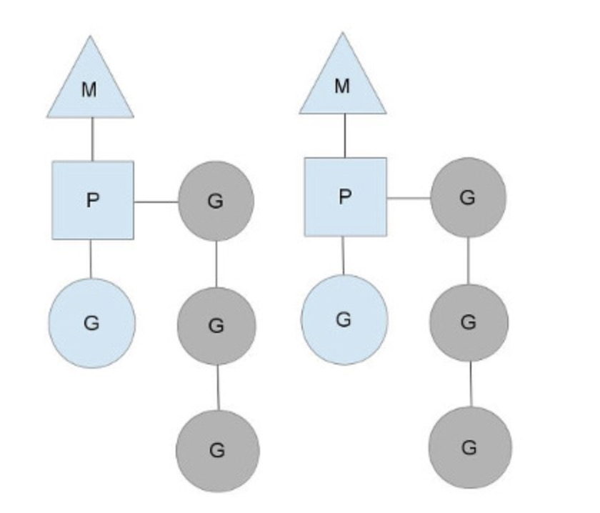
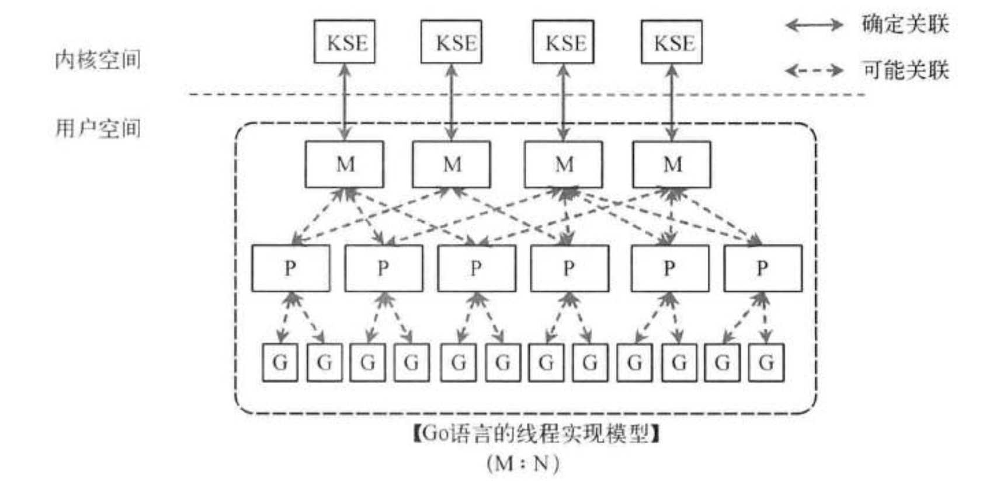

# 并发编程模型
参考：《七周七并发模型》  
并行编程模型（Parallel programming model）是并行计算机架构的抽象化，通过它可方便的表达算法和它们在程序中的合成。  

并行编程模型的分类可以宽泛的在两个领域主题下进行：进程交互和问题分解
* 进程交互
  * 共享内存
  * 消息传递
  * 分区全局地址空间（[PGAS](https://en.wikipedia.org/wiki/Partitioned_global_address_space)）
  * 隐式交互
* 问题分解
  * 数据并行
  * 任务并行
  * 流并行
  * 隐式并行

|Name	|Class of interaction	|Class of decomposition	|Example implementations
|--     |--                     |--                     |--
|Actor Model	|Asynchronous message passing	|Task	|D, Erlang, Scala, SALSA
|Bulk Synchronous Parallel	|Shared memory	|Task	|Apache Giraph, Apache Hama, BSPlib
|Communicating Sequential Processes (CSP 模型)	|Synchronous message passing	|Task	|Ada, Occam, VerilogCSP, Go
|Circuits	|Message passing	|Task	|Verilog, VHDL
|Dataflow	|Message passing	|Task	|Lustre, TensorFlow, Apache Flink
|Functional	|Message passing	|Task	|Concurrent Haskell, Concurrent ML
|LogP Machine	|Synchronous message passing	|Not specified	|None
|Parallel Random Access Machine	|Shared memory	|Data	|Cilk, CUDA, OpenMP, Threading Building Blocks, XMTC
|SPMD PGAS	|Partitioned global address space	|Data	|Fortran 2008, Unified Parallel C, UPC++, SHMEM
|Global-view Task Parallelism	|Partitioned global address space	|Task	|Chapel, X10

## 常用模型
### 线程与锁（共享内存模型）
大部分编程语言如 C/C++、Java、Go 等都有实现对该模型的支持。  
具体例子如 Go 的 sync 包（Mutex etc）或 Java 的 JMM、多线程以及锁等。  

### CSP 模型（消息传递模型之一）
> Do not communicate by sharing memory; instead, share memory by communicating.  
> 不要通过共享内存来通信，而要通过通信来实现内存共享。  

CSP（Communicating Sequential Processes）强调通过通信来实现并发处理，而不是通过共享内存来实现。CSP 模型的核心思想是将并发系统看作一组相互通信的顺序进程，每个进程都是独立的，并通过消息传递进行通信。模型的设计目标是简化并发编程，降低程序员编写并发代码时的复杂性和难度。  

以下是 CSP 模型的一些关键概念和特点：
1. 进程（Process）：在 CSP 模型中，每个并发执行的单位被称为进程，它们是独立的、不共享状态的。每个进程都可以执行自己的计算和操作。
2. 通信（Communication）：进程之间通过消息传递来进行通信。进程可以发送消息给其他进程，也可以接收来自其他进程的消息。消息传递是 CSP 模型的核心机制。
3. 顺序执行（Sequential Execution）：每个进程内部的操作是顺序执行的，不会出现并发竞争。进程之间的并发是通过消息传递实现的。
4. 同步和异步通信：进程可以进行同步通信（等待消息的到达）和异步通信（发送消息后继续执行），这取决于具体的场景和需求。
5. 并行性和并发性：CSP 模型强调并发性，即进程之间的交互。并行性指的是同时执行多个进程，CSP 模型并不涉及控制如何并行执行进程，而是关注如何进行进程间的通信。

死锁和活锁：CSP 模型可以有效地避免死锁和活锁问题，因为进程之间的通信是明确的，不涉及资源争夺。  
CSP 模型的一个经典实现是 Go 语言中的 goroutine 和 channel，其中 goroutine 类似于进程，channel 类似于进程间的通信通道。CSP 模型可以帮助开发者更容易地编写并发代码，避免一些多线程编程中常见的问题，如竞态条件和死锁。  

Go 语言的 CSP 代码示例：  
```go
func main() {
	ch1 := make(chan int)
	ch2 := make(chan int)

	go func() {
		time.Sleep(2 * time.Second)
		ch1 <- 1
	}()

	go func() {
		time.Sleep(3 * time.Second)
		ch2 <- 2
	}()

	select {
	case <-ch1:
		fmt.Println("Received from ch1")
	case <-ch2:
		fmt.Println("Received from ch2")
	}
}
```  

另外注意，Go 语言的线程模型/运行时调度器（Scheduler）模型是一种特殊的两级线程模型：GMP 模型  
M 指的是 Machine，一个 M 直接关联了一个内核线程。P 指的是 ”processor”，代表了 M 所需的上下文环境，也是处理用户级代码逻辑的处理器。G 指的是 Goroutine，其实本质上也是一种轻量级的线程。  
  
一个 M 会对应一个内核线程，一个M也会连接一个上下文 P，一个上下文 P 相当于一个“处理器”，一个上下文连接一个或者多个 Goroutine。P(Processor) 的数量是在启动时被设置为环境变量 GOMAXPROCS 的值，或者通过运行时调用函数 runtime.GOMAXPROCS() 进行设置。Processor 数量固定意味着任意时刻只有固定数量的线程在运行 go 代码。Goroutine 中就是要执行并发的代码。图中 P 正在执行的 Goroutine 为蓝色的；处于待执行状态的 Goroutine 为灰色的，灰色的 Goroutine 形成了一个队列 runqueues。  
上下文 P 的存在意义是当 M 上的 goroutine 进行系统调用被阻塞时，可以将 P 交由其他的 M 继续进行 goroutine 的执行，即不阻塞业务代码。  
  

参考：https://hanamichi.wiki/posts/%E5%B9%B6%E5%8F%91%E6%A8%A1%E5%9E%8B/  

另外 Java 的 Virtual Thread + Blobking Queue 其实也可以类似 Go 的 Goroutines 和 Channels 达成 CSP 模型。  
不同的是，Go 的 Channels 相对于 Java 的 BlockingQueue 的一些优势：  
* 语法简洁：Go 的 Channel 在语法上更加简洁，创建和使用都非常直观。Channel 可以像普通变量一样声明，而不需要使用额外的类或接口。
* 选择语句（select）：Go 的 Channel 配合 select 语句可以轻松实现多路复用，监听多个 Channel 的事件，一次处理多个通信操作。这对于实现复杂的同步和事件处理非常有用。
* 关闭通知：在 Go 中，关闭一个 Channel 可以用于发送关闭的通知。接收方可以通过通道的返回值来判断是否还有更多的数据。这种机制非常适用于在 Goroutines 之间进行协作和同步。
* 更紧密的集成：在 Go 中，Goroutines 和 Channels 是 Go 核心语言特性的一部分，而 Java 的 BlockingQueue 是标准库的一部分。这意味着 Goroutines 和 Channels 可以更紧密地集成到 Go 语言中，使并发编程更加自然和便捷。
* 轻量级：Go 的 Goroutines 和 Channels 非常轻量级，创建和销毁的开销很小，使得创建大量并发任务变得非常容易。

### Actor 模型（消息传递模型之一）
[Actor 模型](https://zh.wikipedia.org/wiki/%E6%BC%94%E5%91%98%E6%A8%A1%E5%9E%8B)是单个进程中并发的编程模型。逻辑被封装在 actor 中，而不是直接处理线程（以及竞争条件、锁定和死锁的相关问题）。一个 actor 指的是一个最基本的计算单元。它能接收一个消息并且基于其执行计算，这个理念很像面向对象语言，一个对象接收一条消息（方法调用），然后根据接收的消息做事（调用了哪个方法），它通过发送和接收异步消息与其他 actor 通信。Actor 不保证消息传送：在某些错误情况下，消息将丢失。由于每个 actor 一次只能处理一条消息，因此不需要担心线程，每个 actor 可以由框架独立调度。  
光有一个 actor 是不够的，多个 actors 才能组成系统。在 actor 模型里每个 actor 都有地址，所以它们才能够相互发送消息。  
Actors 有邮箱 - 只得指明的一点是，尽管许多 actors 同时运行，但是一个 actor 只能顺序地处理消息。也就是说其它 actors 发送了三条消息给一个 actor，这个 actor 只能一次处理一条。所以如果要并行处理 3 条消息，需要把这条消息发给 3 个 actors。Actors 使用消息模型，每个 Actors 在同一时间处理最多一个消息，可以发送消息给其他 Actors，保证了单独写原则。从而巧妙避免了多线程写争夺。
Actor 模型特点：
* 隔离计算实体
* Share nothing
* 没有任何地方同步
* 异步消息传递
* 不可变的消息 消息模型类似 mailbox / queue

消息异步地传送到 actor，所以当 actor 正在处理消息时，新来的消息应该存储到别的地方。Mailbox 就是这些消息存储的地方。

参考链接：https://www.jianshu.com/p/449850aa8e82  

Actor 消息内容，一般包括几个主要属性：
* source：发送方
* subject：主题，表明消息类型。
* data：消息内容。
 
Actor 收到消息之后，可以做的处理：
* 创建其他 Actor
* 向其他 Actor 发送消息
* 指定下一条消息到来的行为，例如修改自己的状态
 
基于 Actor 构建一个分布式应用程序，一般有一个 Root Actor，然后多个 Worker Actor。例如：
* 有 10 个文件要处理；先创建一个 Root Actor，然后 Root Actor 创建 10 个 Worker Actor，每个 Worker Actor 处理 1 个文件。
* Root Actor 要给 Worker Actor 发送一个消息，消息中包含分配给它的文件编号。
* Worker Actor 计算完成之后，返回结果给 Root Actor，由 Root Actor 汇总和输出。
* Root Actor 要监控 Worker Actor 的状态，并进行处理，例如重新拉起一个新的 Worker Actor。

参考链接：https://www.cnblogs.com/ruanchao/p/14855177.html  

### 函数式编程
通过无变量的函数式编程实现并发，是无锁并发的一种模型。  
Lambda 架构 - MapReduce、批处理层、加速层。  

### Dataflow
事件/数据驱动，Future/Promise 回调模型。  
