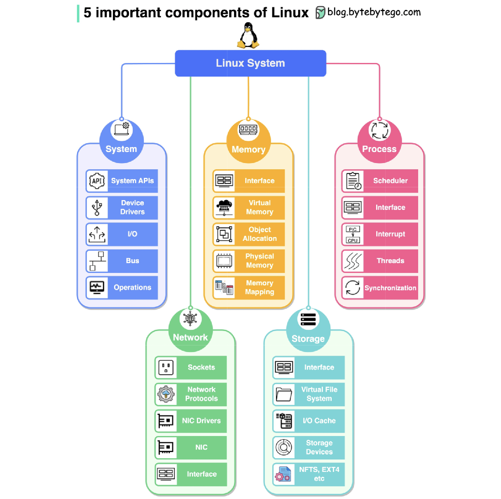
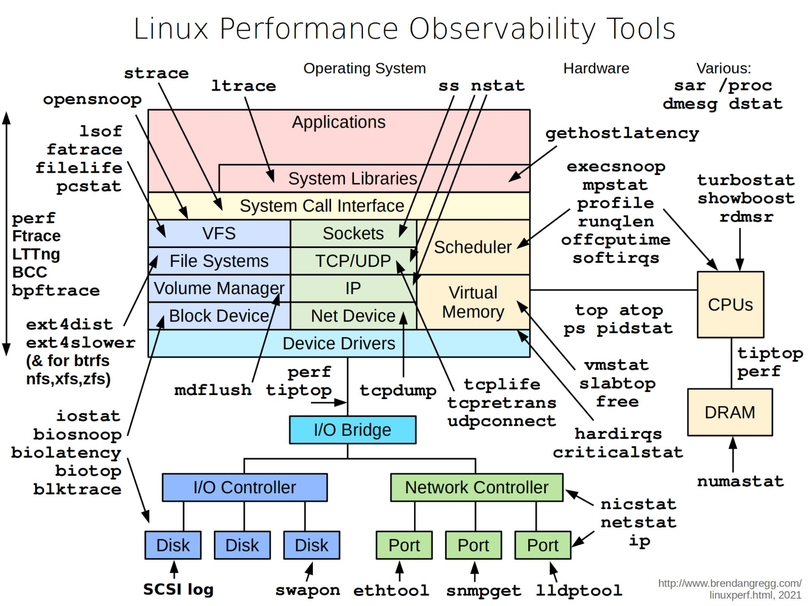

# 操作系统
* 进程管理：
  * 进程的概念，进程调度算法，进程状态和状态转换。
  * 多道程序设计，进程同步和通信。
* 内存管理：
  * 内存分配、虚拟内存、页面置换算法、内存保护和地址转换。
  * 管理物理内存和虚拟内存。
* 文件系统：
  * 文件系统的层次结构、文件访问方法、文件操作和目录结构。
* 输入/输出管理：
  * I/O 设备管理、I/O 缓冲、I/O 控制和中断处理。
  * I/O 子系统如何与进程进行交互。
* 处理器 CPU 管理和调度：
  * 处理器调度算法，如 FCFS、SJF、优先级调度、时间片轮转等。
  * 多处理器系统和多核处理器管理。
* 并发和同步：
  * 临界区、信号量、互斥锁和条件变量等同步机制。
* 安全性和权限：
  * 安全性问题，包括身份验证、授权、访问控制和漏洞。

## [Linux 完整架构图](./linux_architecture.md)

## 其他
- 
- 
- 
- 

