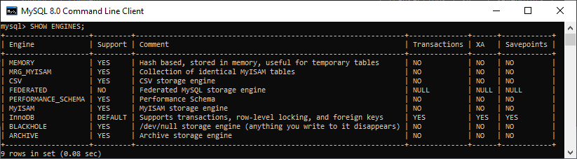
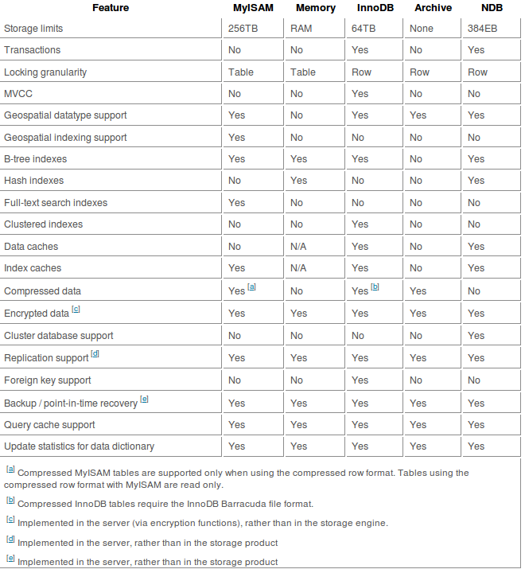

# 数据库基础

* SQL
  * [关系数据库物理原理、SQL 及其优化](./SQL/README.md)
  * [InnoDB 原理](./InnoDB/README.md)
  * [重要：数据库相关系统设计、分库分表](../../Leetcode%20Practices/system%20design/数据库数据建模分库分表.md)
* [NoSQL](./../../Leetcode%20Practices/system%20design/NoSQL.md)
  * [DynamoDB](./Dynamo/README.md)
  * [Redis 基本功](./Redis/README.md)
* [SQL vs NoSQL](./../../Leetcode%20Practices/system%20design/SQL%20vs%20NoSQL.md)
* [数据模型与查询语言](./../../Leetcode%20Practices/system%20design/README.md#数据模型与查询语言)
* 向量数据库

## 数据库相关的数据结构
  

## 数据库引擎
  

  

> Different storage engines available, there are few reasons not to use either the MyISAM or InnoDB engine types. MyISAM will do in most situations, but if you have a high number of updates or inserts compared to your searches and selects then you will get better performance out of the InnoDB engine. To get the best performance out of InnoDB you need to tweak the parameters for your server, otherwise there is no reason not to use it.  
> The MERGE engine is an exceedingly effective way of querying data from multiple, identically defined, tables. The MEMORY engine is the best way to perform a large number of complex queries on data that would be inefficient to search on a disk based engine. The CSV engine is a great way to export data that could be used in other applications. BDB is excellent for data that has a unique key that is frequently accessed.  

更多参考：https://stackoverflow.com/a/28669163/6481829  

## 数据库应用相关
* [Apache Doris 在美团外卖数仓中的应用实践](https://tech.meituan.com/2020/04/09/doris-in-meituan-waimai.html)
* 设计数据库架构（谷歌）
  * [关于架构](https://cloud.google.com/spanner/docs/schema-and-data-model)
  * [架构设计最佳做法](https://cloud.google.com/spanner/docs/schema-design)
