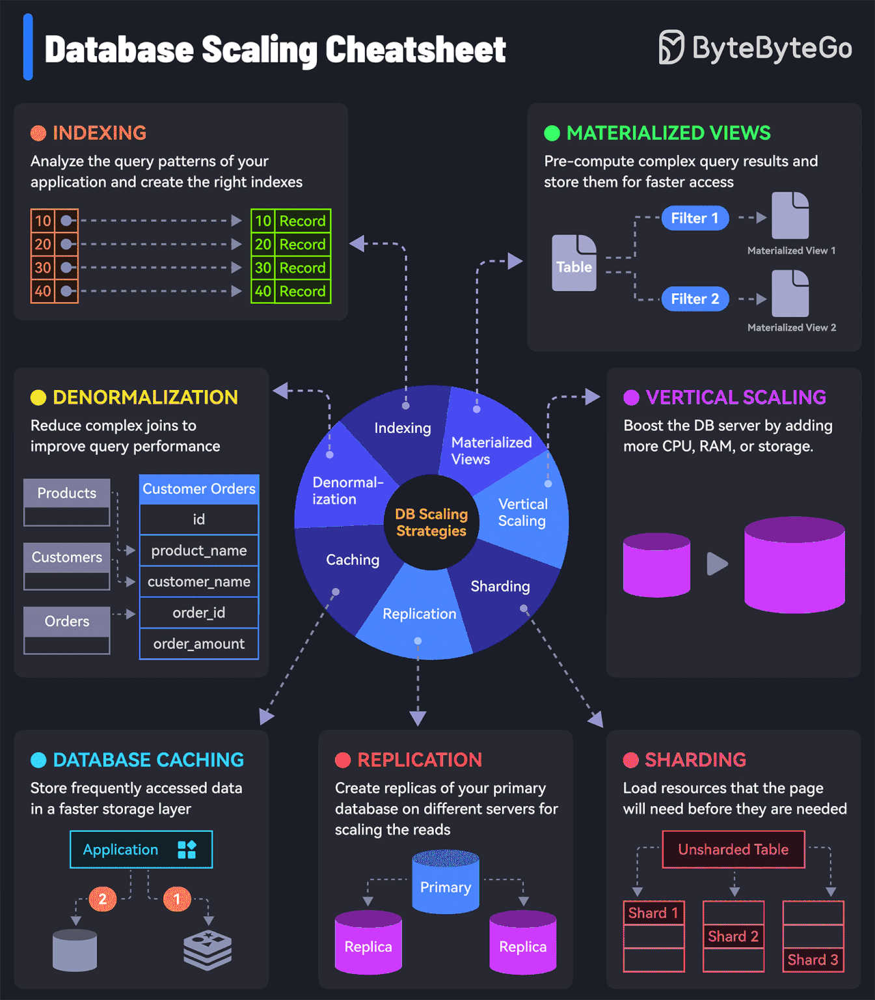

# 数据库基础

* SQL（关系数据库）
  * [关系数据库物理原理、SQL 及其优化](./SQL/README.md)
  * [InnoDB 原理](./InnoDB/README.md)
  * [重要：数据库相关系统设计、分库分表](../../Leetcode%20Practices/system%20design/数据库数据建模分库分表.md)
* [NoSQL](./../../Leetcode%20Practices/system%20design/NoSQL.md)
  * 键值数据库 | KV 数据库
    * [文档数据库](./../../Leetcode%20Practices/system%20design/NoSQL.md#文档数据库)
      * [Dynamo](./Dynamo/README.md)
      * [MongoDB](./../../Leetcode%20Practices/system%20design/NoSQL.md#MongoDB)
    * [Redis 基本功](./Redis/README.md)
    * RocksDB
    * Cassandra
    * HBase
  * 全文搜索数据库
    * [ElasticSearch](./ElasticSearch/README.md)
  * [列式数据库](./../../Leetcode%20Practices/system%20design/NoSQL.md#列数据库)
    * Cassandra
    * ClickHouse
    * Google BigQuery
    * AWS Redshift
  * [图数据库](./../../Leetcode%20Practices/system%20design/NoSQL.md#图数据库)
    * Neo4j
  * [时序数据库](./../../Leetcode%20Practices/system%20design/NoSQL.md#时序数据库)
    * InfluxDB
  * [向量数据库](./../../Leetcode%20Practices/system%20design/NoSQL.md#向量数据库)
    * Pinecone
    * ElasticSearch
* [SQL vs NoSQL](./../../Leetcode%20Practices/system%20design/SQL%20vs%20NoSQL.md)
  * PostgreSQL - 比较特别，因为它在关系型数据库功能之外还支持了：Vectors、Metadata、Time-Series、Analytics、Geo-Spatial
* [数据模型与查询语言](./../../Leetcode%20Practices/system%20design/README.md#数据模型与查询语言)
  * 关系模型、文档模型（树模型/KV模型）、图模型（网络模型）
* [数据库设计模式](./数据库设计模式.md)
* 数据库常见组件：Parser、Binder、Planner、Optimizer、Execution、Storage

## 数据库扩展
  

## 数据库相关的数据结构
  

## three-schema 架构
三模式（three-schema）架构的目标是把用户应用程序从物理数据库分离出来。
1. 外部 schema - 描述了指定用户对所在数据库感兴趣的部分（数据）。它向用户隐藏了数据库的不相关细节，例如从数据库中检索或存储数据的确切过程。一个数据库的每个用户都有不同的外部视图。外部视图是指定用户会看到的数据库内容，例如销售部门的用户只会看到销售相关数据。
2. 概念 schema - 描述了用户社区的所有数据库的数据库结构。该架构隐藏了物理存储的有关信息并侧重于描述数据类型、实体、关系等。通常，基于记录的逻辑数据模型用于描述实现数据库系统时的概念 schema。
3. 内部 schema - 描述了数据库如何将数据存储在物理存储上如硬盘等设备。内部 schema 使用物理数据模型并描述了数据存储和访问路径的完整细节。

## 数据库引擎
  

  

> Different storage engines available, there are few reasons not to use either the MyISAM or InnoDB engine types. MyISAM will do in most situations, but if you have a high number of updates or inserts compared to your searches and selects then you will get better performance out of the InnoDB engine. To get the best performance out of InnoDB you need to tweak the parameters for your server, otherwise there is no reason not to use it.  
> The MERGE engine is an exceedingly effective way of querying data from multiple, identically defined, tables. The MEMORY engine is the best way to perform a large number of complex queries on data that would be inefficient to search on a disk based engine. The CSV engine is a great way to export data that could be used in other applications. BDB is excellent for data that has a unique key that is frequently accessed.  

更多参考：https://stackoverflow.com/a/28669163/6481829  

## 数据库应用相关
* [Apache Doris 在美团外卖数仓中的应用实践](https://tech.meituan.com/2020/04/09/doris-in-meituan-waimai.html)
* 设计数据库架构
  * [关于架构](https://cloud.google.com/spanner/docs/schema-and-data-model)
  * [架构设计最佳做法](https://cloud.google.com/spanner/docs/schema-design)
  * [数据库体系结构设计](https://learn.microsoft.com/zh-cn/azure/architecture/data-guide/databases-architecture-design)

## 其他
### 分形树
简介：https://wanghenshui.github.io/2017/01/05/ft-index.html  
* [Bash 画分形树](./../../HackerRank%20Practises/bash/hard/functions-and-fractals-recursive-trees.sh)
