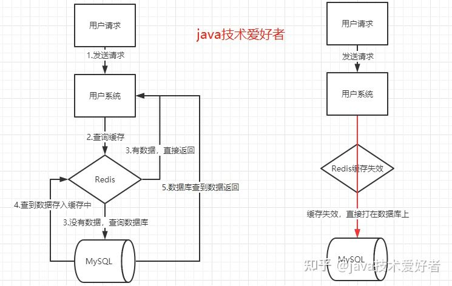

# Redis
参考：https://leetcode-cn.com/leetbook/detail/database-handbook/  
  
## Redis 缓存的特点
作为一个高性能的 Key-Value 数据库，Redis 与其他 Key-Value 缓存产品相比，有以下三个特点：  
* Redis 运行在内存中但是可以持久化到磁盘，重启的时候可以再次加载进行使用。
* Redis 不仅仅支持简单的 Key-Value 类型的数据，同时还提供 String，List，Set，Sorted Set，Hash 等数据结构的存储，Redis 还有更高级得数据结构比如：HyperLogLog、Geo、BloomFilter 这几个数据结构。
* Redis 还支持数据的备份，即 Master-Slave 主从模式的数据备份。  

另外要注意 redis 的数据是 flat 的，比如不能 set 里又嵌套一个 set。  
如果需要存储复杂的嵌套结构，通常需要将嵌套的数据展开为单层结构，然后使用合适的数据类型来存储。  

## Redis 和 MySQL 的区别
* 类型上的不同。MySQL 是关系型数据库，采用表格的存储方式，数据以行列组织，并遵守了传统的数据库的 ACID 原则。Redis 是 NoSQL（非关系型数据库），不严格遵守 ACID 原则，其采用 key-value 存储组织数据，大量使用缓存来读写数据，周期性地把更新数据写入磁盘或在追加文件中写入修改操作，以及同步分布数据库等。这些特点为大大提高了 Redis 在极大并发量下的读写性能。由于不以表格方式组织数据，Redis 的数据扩展十分灵活方便。
* 功能不同。 MySQL 主要用于持久化的存储数据到硬盘，功能强大，但是读取速度较慢。而 Redis 将使用频繁的数据存储在缓存中，缓存的读取速度快，能够大大的提高运行效率，但是一般在使用中，Redis 缓存的数据保存时间是有限的。
* 运行机制不同。MySQL 作为典型的关系型数据库，为了严格遵守 ACID 规则必须采取保守的缓存策略，特别是为了保证数据的一致性，在保证数据可靠性的同时，牺牲了许多（特别是多并发情形下的）读写性能。而现在互联网许多应用场景往往面临了海量用户的访问请求，对数据库并不需要非常强的一致性 。如 Redis 等非关系型数据库（NoSQL），往往以不再满足 ACID 为代价求得更高的吞吐容量。NoSQL 通常采用极大的缓存、分布式服务来提高读写性能。  
  
## Redis 和 MongoDB 的区别
MongoDB 和 Redis 都是 NoSQL，采用结构型数据存储，二者之间的主要区别如下所示：  
* 性能方面，二者都很高，总体而言，TPS 方面 Redis 要大于 MongoDB；
* 可操作性上，MongoDB 支持丰富的数据表达、索引，最类似于关系数据库，支持丰富的查询语言，操作比 Redis 更为便利；
* 内存及存储方面，MongoDB 适合大数据量存储，依赖操作系统虚拟做内存管理，采用镜像文件存储，内存占有率比较高，Redis 2.0 后增加虚拟内存特性，突破物理内存限制，数据可以设置时效性；
* 对于数据持久化和数据恢复，MongoDB 1.8 后，采用 binlog 方式（同 MySQL）支持持久化，增加了可靠性，而 Redis 依赖快照进行持久化、AOF 增强可靠性，但是增强可靠性的同时，也会影响访问性能；
* 在数据一致性上，MongoDB 不支持事务，靠客户端自身保证，而 Redis 支持事务，能保证事务中的操作按顺序执行；
* 数据分析上，MongoDB 内置数据分析功能（mapreduce），而 Redis 不支持数据分析；
* 应用场景不同，MongoDB 适合海量数据，侧重于访问效率的提升，而 Redis 适合于较小数据量，侧重于性能。
  
## Redis 常用数据类型
* String（字符串），是 Redis 最基本的数据类型，二进制安全的，可以包含任何数据，比如 JPG 图片或者序列化的对象，最大能存储 512 MB。
* Hash（哈希），是一个键值对（key => value）集合，特别适合用于存储对象。
* List（列表），Redis 列表是简单的字符串列表，按照插入顺序排序，可以添加一个元素到列表的头部（左边）或者尾部（右边）。
* Set（集合），是 String 类型的无序集合，通过哈希表实现，添删查找操作的复杂度都是 O(1)。
* Sorted Set（有序集合），和 Set 一样也是 String 类型元素的集合，且不允许元素重复，不同的是每个元素都会关联一个 Double 类型的分数（可重复），通过此分数来为集合中的成员进行从小到大的排序。  
  
## 如何实现 Redis 的定时机制
Redis 服务器是一个`事件驱动程序`，服务器需要处理以下两类事件：文件事件（服务器对套接字操作的抽象）和时间事件（服务器对定时操作的抽象）。Redis 的定时机制就是借助时间事件实现的。  
一个时间事件主要由以下三个属性组成：id，时间事件标识号；when，记录时间事件的到达时间；timeProc，时间事件处理器，当时间事件到达时，服务器就会调用相应的处理器来处理时间。一个时间事件根据时间事件处理器的返回值来判断是定时事件还是周期性事件。  
  
## TTL
在 Redis 中，TTL（Time To Live）是用来设置键（key）的生存时间的属性。通过设置 TTL，可以指定一个键在一定时间内保持有效，过了这个时间后，Redis 会自动将该键从数据库中删除。  
TTL 的工作方式如下：
1. 设置 TTL：当在 Redis 中创建一个键时，可以为该键设置一个 TTL。这个 TTL 可以是一个固定的时间（以秒为单位）或者一个 Unix 时间戳，表示该键的过期时间。
2. 定期检查：Redis 会定期检查所有键的 TTL，查看哪些键已经过期。这个检查是基于惰性删除（Lazy Expiration）的，即键只有在被访问时才会检查是否过期。过期的键不会立即被删除，而是在被访问时检查并删除。
3. 自动删除：当一个键的 TTL 过期后，Redis 会自动将该键从数据库中删除。删除操作是在键被访问时执行的，所以过期后的键可能会在访问时被删除，但在过期前仍然存在。

TTL 的应用场景包括：
- 缓存过期：在缓存中存储数据时，可以为数据设置 TTL，确保缓存中的数据不会长时间无效，从而避免过期数据的使用。
- 临时数据存储：有些数据只需要在一段时间内保持有效，例如验证码、临时会话等，可以使用 TTL 来管理这些临时数据。
- 统计数据：当需要定期更新统计数据时，可以使用  TTL来自动清除旧的统计数据，确保数据的及时更新。

需要注意的是，TTL 是一种近似的机制，不保证键会在 TTL 过期后立即被删除。此外，过多使用 TTL 可能会增加 Redis 的内存压力，因为过期键可能会一直存在于内存中，直到被访问并删除。  

## 单线程 Redis 高效原理
虽然 Redis 文件事件处理器以单线程方式运行，但是通过使用 I/O 多路复用程序来监听多个套接字，文件事件处理器既实现了高性能的网络通信模型，又可以很好地与 Redis 服务器中其他同样以单线程运行的模块进行对接，这保持了 Redis 内部单线程设计的简单性。  
  
## Redis 数据淘汰策略
Redis 内存数据量达到一定限制的时候，就会实行数据淘汰策略（回收策略）。Redis 会根据 maxmemory-policy 配置策略，来决定具体的行为：  
* no-eviction：不删除策略，达到最大内存限制时刻，如果需要更多内存，直接返回错误信息；
* allkey-lru：从所有 Key 的哈希表（`server.db[i].dict`）中随机挑选多个 Key，然后在选到的 Key 中利用 lru 算法淘汰最近最少使用的数据；
* volatile-lru：从已设置过期时间的哈希表（`server.db[i].expires`）中随机挑选多个 Key，然后在选到的 Key 中用 lru 算法淘汰最近最少使用的数据；
* volatile-random：从已设置过期时间的哈希表（`server.db[i].expires`）中随机挑选 Key淘汰掉；
* allkey-random：从所有的 Key 的哈希表（`server.db[i].dict`）中随机挑选数据淘汰；
* volatile-ttl：从已设置过期时间的哈希表（`server.db[i].expires`）中随机挑选多个 Key，然后在选到的 Key 中选择剩余时间最短的数据淘汰掉。  
  
## 对 Redis 的理解
Redis，全称为 Remote Dictionary Server，本质上是一个 Key-Value 类型的内存数据库，整个数据库统统加载在内存当中进行操作，定期通过异步操作把数据库数据写入磁盘或把修改操作写入追加的记录文件，并且在此基础上实现 Master-Slave（主从）同步。它支持存储的 Value 类型多样，包括 String（字符串）、List（链表）、Set（集合）、zset（sorted set —— 有序集合）和 Hash（哈希类型），这些数据类型都支持 push/pop、add/remove 及取交集并集和差集及更丰富的操作，而且这些操作都是原子性的。  
Redis 的主要缺点是数据库容量受到物理内存的限制，不能用作海量数据的高性能读写，因此 Redis 适合的场景主要局限在较小数据量的高性能操作和运算上。  

## 批量加载
使用 Redis 协议批量写入数据。批量加载是将大量预先存在的数据加载到 Redis 的过程。  

## 原子操作
Redis 提供了一系列原子操作（Atomic Operations），这些操作是在单个命令中执行的，能够保证操作的原子性，即操作要么全部执行，要么全部不执行，不存在部分执行的情况。下面是一些常见的 Redis 原子操作：
1. **SETNX（SET if Not eXists）：** 将键设置为指定的值，但只有在键不存在时才执行操作。如果键已经存在，操作不执行。这是一个用于实现分布式锁的基本操作。
2. **INCR（Increment）和 DECR（Decrement）：** 对存储在键中的整数值进行增加或减少操作。这些操作是原子的，适用于计数器等场景。
3. **HSET（Hash Set）：** 设置哈希表中指定字段的值。如果字段不存在，创建一个新的字段。如果字段已经存在，值会被更新。
4. **HSETNX（Hash Set if Not eXists）：** 类似于 HSET，但只有在字段不存在时才执行操作。
5. **LPUSH（List Push）和 RPUSH（List Push）：** 在列表的头部或尾部插入一个或多个元素。这些操作可以用来构建队列或栈。
6. **LPOP（List Pop）和 RPOP（List Pop）：** 从列表的头部或尾部弹出一个元素并返回。这些操作可以用来处理队列或栈。
7. **SETBIT：** 在字符串值的指定偏移量上设置或清除位的值。这对于处理位图等数据结构非常有用。
8. **GETSET：** 获取键的旧值，并将键设置为新值。这可以在获取旧值的同时进行原子更新。
9. **MSET（Multi SET）和 MSETNX（Multi SET if Not eXists）：** 设置多个键值对。MSET 是原子的，而 MSETNX 只在所有键都不存在时才执行。
10. **INCRBY（Increment BY）和 DECRBY（Decrement BY）：** 类似于 INCR 和 DECR，但可以指定增加或减少的量。

这些原子操作允许在多个线程或客户端之间执行并发操作，同时保证数据的一致性和完整性。在编写具有高并发性要求的应用程序时，Redis 的原子操作能够帮助避免竞态条件和数据不一致的问题。  

# 什么是缓存雪崩、缓存击穿、缓存穿透？

转载自：https://zhuanlan.zhihu.com/p/346651831  

Redis 作为目前使用最广泛的缓存，相信大家都不陌生。但是使用缓存并没有这么简单，还要考虑缓存雪崩，缓存击穿，缓存穿透的问题，什么是缓存雪崩，击穿，穿透呢，出现这些问题又怎么解决呢？  

## 缓存雪崩（Cache Avalanche）
什么是缓存雪崩？  
当某一个时刻出现大规模的缓存失效的情况，那么就会导致大量的请求直接打在数据库上面，导致数据库压力巨大，如果在高并发的情况下，可能瞬间就会导致数据库宕机。这时候如果运维马上又重启数据库，马上又会有新的流量把数据库打死。这就是缓存雪崩。  
  

分析：  
造成缓存雪崩的关键在于在同一时间大规模的 key 失效。为什么会出现这个问题呢，有几种可能，第一种可能是 Redis 宕机，第二种可能是采用了相同的过期时间。搞清楚原因之后，那么有什么解决方案呢？  

解决方案：  
1、在原有的失效时间上加上一个随机值，比如1-5分钟随机。这样就避免了因为采用相同的过期时间导致的缓存雪崩。  
  
如果真的发生了缓存雪崩，有没有什么兜底的措施？  
2、使用熔断机制。当流量到达一定的阈值时，就直接返回“系统拥挤”之类的提示，防止过多的请求打在数据库上。至少能保证一部分用户是可以正常使用，其他用户多刷新几次也能得到结果。  
3、提高数据库的容灾能力，可以使用分库分表，读写分离的策略。  
4、为了防止Redis宕机导致缓存雪崩的问题，可以搭建 Redis 集群，提高 Redis 的容灾性。  

## 缓存击穿（Cache Miss）
什么是缓存击穿？  

其实跟缓存雪崩有点类似，缓存雪崩是大规模的 key 失效，而缓存击穿是一个热点的 Key，有大并发集中对其进行访问，突然间这个 Key 失效了，导致大并发全部打在数据库上，导致数据库压力剧增。这种现象就叫做缓存击穿。  

分析：  
关键在于某个热点的 key 失效了，导致大并发集中打在数据库上。所以要从两个方面解决，第一是否可以考虑热点 key 不设置过期时间，第二是否可以考虑降低打在数据库上的请求数量。  

解决方案：  
1、上面说过了，如果业务允许的话，对于热点的 key 可以设置永不过期的 key。  
2、使用互斥锁。如果缓存失效的情况，只有拿到锁才可以查询数据库，降低了在同一时刻打在数据库上的请求，防止数据库打死。当然这样会导致系统的性能变差。  

## 缓存穿透（Cache Penetration）
什么是缓存穿透？  
使用 Redis 大部分情况都是通过 Key 查询对应的值，假如发送的请求传进来的 key 是不存在 Redis 中的，那么就查不到缓存，查不到缓存就会去数据库查询。假如有大量这样的请求，这些请求像“穿透”了缓存一样直接打在数据库上，这种现象就叫做缓存穿透。  

分析：  
关键在于在 Redis 查不到 key 值，这和缓存击穿有根本的区别，区别在于缓存穿透的情况是传进来的 key 在 Redis 中是不存在的。假如有黑客传进大量的不存在的 key，那么大量的请求打在数据库上是很致命的问题，所以在日常开发中要对参数做好校验，一些非法的参数，不可能存在的 key 就直接返回错误提示，要对调用方保持这种“不信任”的心态。  
  

解决方案：  
1、把无效的 Key 存进 Redis 中。如果 Redis 查不到数据，数据库也查不到，我们把这个 Key 值保存进 Redis，设置 value="null"，当下次再通过这个 Key 查询时就不需要再查询数据库。这种处理方式肯定是有问题的，假如传进来的这个不存在的 Key 值每次都是随机的，那存进 Redis 也没有意义。  
2、使用布隆过滤器。布隆过滤器的作用是某个 key 不存在，那么就一定不存在，它说某个 key 存在，那么很大可能是存在(存在一定的误判率)。于是我们可以在缓存之前再加一层布隆过滤器，在查询的时候先去布隆过滤器查询 key 是否存在，如果不存在就直接返回。  
  

## 总结
这三个问题在使用 Redis 的时候是肯定会遇到的，而且是非常致命性的问题，所以在日常开发中一定要注意，每次使用 Redis 时，都要对其保持严谨的态度。还有一个需要注意的是要做好熔断，一旦出现缓存雪崩，击穿，穿透这种情况，至少还有熔断机制保护数据库不会被打死。  

# 使用 Redis 集群进行扩展
## 使用 Redis 集群进行横向扩展  
Redis 使用称为 Redis 集群的部署拓扑进行水平扩展。本主题将教如何在生产环境中设置、测试和操作 Redis 集群。将从最终用户的角度了解 Redis 集群的可用性和一致性特征。  
如果计划运行生产 Redis 集群部署或想要更好地了解 Redis 集群的内部工作原理，请参阅Redis 集群规范。要了解 Redis Enterprise 如何处理缩放，请参阅使用 Redis Enterprise 进行线性缩放。  

## Redis 集群 101
Redis Cluster 提供了一种运行 Redis 安装的方法，其中数据会自动跨多个 Redis 节点进行分片。Redis 集群还在分区期间提供一定程度的可用性——实际上，是在某些节点出现故障或无法通信时继续运行的能力。但是，如果发生较大的故障（例如，当大多数主节点不可用时），集群将变得不可用。  
因此，借助 Redis 集群，可以：  
* 在多个节点之间自动拆分数据集。
* 当节点的子集出现故障或无法与集群的其余部分通信时继续操作。

**Redis 集群 TCP 端口**  
每个 Redis 集群节点都需要两个打开的 TCP 连接：一个用于为客户端提供服务的 Redis TCP 端口，例如 6379，以及称为集群总线端口的第二个端口。默认情况下，集群总线端口设置为数据端口加 10000（如16379）；但是，可以在 cluster-port 配置中覆盖它。  
集群总线是一种使用二进制协议的节点到节点的通信通道，由于带宽和处理时间小，更适合节点之间交换信息。节点使用集群总线进行故障检测、配置更新、故障转移授权等。客户端不应该尝试与集群总线端口通信，而是使用 Redis 命令端口。但是，请确保在防火墙中打开这两个端口，否则 Redis 集群节点将不会无法通信。  
为了让 Redis 集群正常工作，需要为每个节点：  
1. 客户端通信端口（通常为 6379）用于与客户端通信，并向所有需要访问集群的客户端以及使用该客户端端口进行密钥迁移的所有其他集群节点开放。
2. 集群总线端口必须可以从所有其他集群节点访问。

如果不打开两个 TCP 端口，集群将不会按预期工作。  

**Redis 集群和 Docker**  
目前，Redis Cluster 不支持 NATted 环境和 IP 地址或 TCP 端口重新映射的一般环境。  
Docker 使用一种称为端口映射的技术：与程序认为使用的端口相比，在 Docker 容器内运行的程序可能会暴露出不同的端口。这对于在同一服务器上同时使用相同端口运行多个容器很有用。  
要使 Docker 兼容 Redis Cluster，需要使用 Docker 的主机网络模式。有关详细信息，请参阅 Docker 文档 --net=host 中的选项。  

**Redis 集群数据分片**  
Redis 集群不使用一致性哈希，而是使用一种不同形式的分片，其中每个键在概念上都是哈希槽的一部分。  
Redis 集群中有 16384 个哈希槽，要计算给定键的哈希槽，只需对键的 CRC16 取模 16384。  
Redis 集群中的每个节点都负责哈希槽的一个子集，因此，例如，可能有一个包含 3 个节点的集群，其中：  
* 节点 A 包含从 0 到 5500 的哈希槽。
* 节点 B 包含从 5501 到 11000 的哈希槽。
* 节点 C 包含从 11001 到 16383 的哈希槽。

这使得添加和删除集群节点变得容易。例如，如果想添加一个新的节点 D，需要将节点 A、B、C 的一些哈希槽移动到 D。同样，如果想从集群中删除节点 A，可以移动哈希槽由 A 提供给 B 和 C。一旦节点 A 为空，就可以将其从集群中完全移除。  
将哈希槽从一个节点移动到另一个节点不需要停止任何操作；因此，添加和删除节点，或更改节点持有的哈希槽的百分比，不需要停机。  
Redis Cluster 支持多键操作，只要单个命令执行（或整个事务，或 Lua 脚本执行）涉及的所有键都属于同一个哈希槽。用户可以使用称为散列标签的功能强制多个键成为同一散列槽的一部分。  
哈希标签记录在 Redis 集群规范中，但要点是如果键中 `{}` 括号之间有子字符串，则仅对字符串内部的内容进行哈希处理。例如，键 `user:{123}:profile` 和 `user:{123}:account` 保证在同一个散列槽中，因为它们共享相同的散列标签。因此，可以在同一个多键操作中对这两个键进行操作。  

**Redis 集群主从模型**  
为了在主节点子集出现故障或无法与大多数节点通信时保持可用，Redis 集群使用主副本模型，其中每个哈希槽都有 1 个（主节点本身）到 N 个副本（N-1 额外的副本节点）。  
在包含节点 A、B、C 的示例集群中，如果节点 B 发生故障，集群将无法继续，因为无法再提供 5501-11000 范围内的哈希槽。  
但是，在创建集群的时候（或者以后），我们给每个master添加一个replica节点，这样最终的集群就是由A、B、C为主节点，A1、B1、C1为master节点组成的。副本节点。这样，如果节点 B 发生故障，系统可以继续运行。  
节点 B1 复制 B，B 发生故障，集群将节点 B1 提升为新的主节点，并继续正常运行。  
但是需要注意的是，如果节点 B 和 B1 同时发生故障，Redis Cluster 将无法继续运行。  

**Redis 集群一致性保证**  
Redis Cluster 不保证强一致性。实际上，这意味着在某些情况下，Redis 集群可能会丢失系统向客户端确认的写入。  
Redis Cluster 会丢失写入的第一个原因是因为它使用异步复制。这意味着在写入期间会发生以下情况：  
* 客户发送消息给主节点 B。
* 主 B 回复 OK 给客户。
* 主节点 B 将写入传播到其副本 B1、B2 和 B3。

因此，B 在回复客户端之前不会等待 B1、B2、B3 的确认，因为这对 Redis 来说是一个令人望而却步的延迟惩罚，所以如果客户端写了一些东西，B 会确认写入，但在此之前崩溃能够将写入发送到它的副本，其中一个副本（没有收到写入）可以提升为主，永远失去写入。  
这与大多数配置为每秒将数据刷新到磁盘的数据库所发生的情况非常相似，因此根据过去不涉及分布式系统的传统数据库系统的经验，已经能够推断出这种情况。同样，可以通过强制数据库在回复客户端之前将数据刷新到磁盘来提高一致性，但这通常会导致性能极低。这相当于 Redis 集群中的同步复制。  
基本上，需要在性能和一致性之间进行权衡。  
Redis Cluster 在绝对需要时支持同步写入，通过 WAIT 命令实现。这使得丢失写入的可能性大大降低。但是，请注意，即使使用同步复制，Redis Cluster 也没有实现强一致性：在更复杂的故障场景下，总是有可能无法接收到写入的副本将被选为 master。  

还有另一个值得注意的场景，Redis 集群将丢失写入，这发生在网络分区期间，其中客户端与少数实例隔离，至少包括一个主实例。  
以 6 节点集群为例，由 A、B、C、A1、B1、C1 组成，有 3 个主节点和 3 个副本节点。还有一个客户端，称之为 Z1。  
发生分区后，有可能分区的一侧有 A、C、A1、B1、C1，另一侧有 B、Z1。  
Z1 仍然能够写入 B，B 将接受其写入。如果分区在很短的时间内恢复正常，集群将继续正常运行。但是，如果分区持续足够长的时间让 B1 在分区的多数端被提升为主节点，则 Z1 在此期间发送给 B 的写入将丢失。  

Note  
Z1 可以发送到 B 的写入量有一个最大窗口：如果经过足够的时间分区的多数方选择一个副本作为主节点，则少数方的每个主节点都将停止接受写入.  

这个时间量是 Redis Cluster 的一个非常重要的配置指令，称为节点超时时间。  
节点超时结束后，主节点被认为发生故障，可以由其副本之一替换。类似地，在节点超时过去但主节点无法感知大多数其他主节点的情况下，它会进入错误状态并停止接受写入。  

参考：https://redis.io/docs/management/scaling/  

# Redis 使用案例
转载自：https://twitter.com/alexxubyte/status/1610678713087295490/photo/1  
  

Redis 不仅仅是缓存，还应用于以下场景：  
* Session - 可以使用 Redis 在不同的服务之间共享用户会话（Session）数据。
* Cache - 可以使用 Redis 来缓存对象或页面，尤其是热点数据。
* [Distributed lock](../../../Leetcode%20Practices/system%20design/分布式锁.md) - 可以使用 Redis 字符串来获取分布式服务之间的锁。
* Counter - 可以计算文章的点赞数或阅读数。
* Rate limiter - 可以对特定用户 IP 应用速率限制。
* Global ID generator - 可以使用 Redis Int 作为全局 ID。
* Shopping cart - 可以使用 Redis Hash 来表示购物车中的键值对。
* Calculate user retention - 可以用 Bitmap 来表示每天的用户登录，计算用户留存。
* Message queue - 可以将 List 用于消息队列。
* Ranking - 可以使用 ZSet（跳表实现）对文章进行排序。
