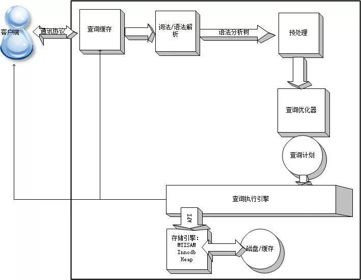
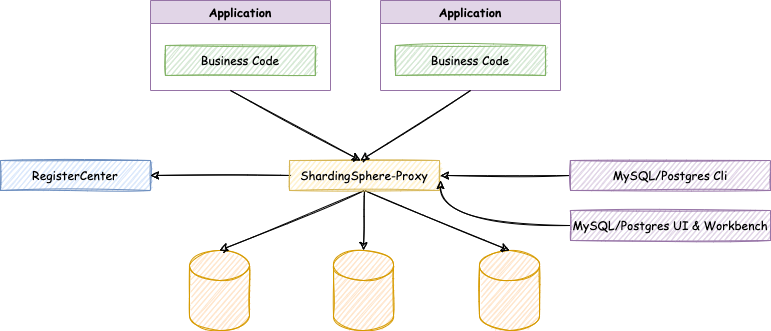

# 物理相关
  
## 索引
在关系数据库中，如果有上万甚至上亿条记录，在查找记录的时候，想要获得非常快的速度，就需要使用索引（Index）。  
索引是关系数据库中对某一列或多个列的值进行预排序的数据结构。通过使用索引，可以让数据库系统不必扫描整个表，而是直接定位到符合条件的记录，这样就大大加快了查询速度。  
索引问题就是一个查找问题。数据库索引，是数据库管理系统中一个排序的数据结构，以协助快速查询、更新数据库表中数据。索引的实现通常使用 B 树及其变种 B+ 树。在数据之外，数据库系统还维护着满足特定查找算法的数据结构，这些数据结构以某种方式引用（指向）数据，这样就可以在这些数据结构上实现高级查找算法。这种数据结构，就是索引。为表设置索引要付出代价的：一是增加了数据库的存储空间，二是在插入、删除和修改数据时要花费较多的时间（因为索引也要随之变动）。  
原理上索引应该使用自平衡二叉搜索树，使用 B+ 树而不是单纯 B 树的原因是 B+ 树所有数据都在叶子节点、非叶子节点只进行数据索引，因为叶子节点都在同一层、最后一层，因此搜索的时间是稳定的，而使用 B 树类而不是红黑树的原因是，B 树类的度数更大（每个节点的最大子节点数），因此树可以更矮，而且 B+ 树的每个叶子节点都存有相邻叶子节点的指针、对范围查找性能十分重要。  
  
  
### 索引实现
* B-Tree 索引 O(logN)：具体比如 B+ 树，可以参考 `MySQL 索引背后的数据结构及算法原理`
* Hash 索引：1. 仅仅能满足 "="，"IN" 和 "<=>" 查询，不能使用范围查询；2. 其检索效率非常高，索引的检索可以一次定位，不像 B-Tree 索引需要从根节点到枝节点，最后才能访问到页节点这样多次的 IO 访问，所以 Hash 索引的查询效率要远高于 B-Tree 索引；3. 只有 Memory 存储引擎显示支持 Hash 索引
* Full-Text 索引：现在 MyISAM 和 InnoDB 引擎都支持
* 位图索引：Bitmap Index
* 空间索引：具体比如 R-Tree 索引用于对 GIS 数据类型创建 SPATIAL 索引  
  
B-Tree 索引应该是 MySQL 里最广泛应用的索引实现。  
MySQL 默认存储引擎 InnoDB 默认使用 B-Tree（实际是 B+ Tree）索引。Innodb 存储引擎会监控对表上二级索引（即非主键索引）的查找，如果发现某二级索引被频繁访问，二级索引成为热数据，建立哈希索引可以带来速度的提升，经常访问的二级索引数据会自动被生成到 Hash 索引里面去（最近连续被访问三次的数据），自适应 Hash 索引通过缓冲池的 B+ 树构造而来，因此建立的速度很快。  
  
### 索引类型
* 主键索引：数据库表经常有一列或列组合，其值唯一标识表中的每一行。该列称为表的主键。在数据库关系图中为表定义主键将自动创建主键索引，主键索引是唯一索引的特定类型。当在查询中使用主键索引时，它还允许对数据的快速访问。使用主键索引的效率是最高的，因为主键会要求、保证绝对唯一。
* 唯一索引：索引列的值必须唯一，但允许有空值。
* 非唯一索引：索引列的值不是必须唯一。
* 普通索引：即一个索引只包含单个列，一个表可以有多个单列索引。
* 复合索引或称联合索引：即一个索引包含多个列。通常有效提高非聚集索引的性能（若所求列皆在索引可避免回表，但是包含过多列会影响插入性能 - 自平衡树的平衡操作）。
* 聚集索引或称聚簇索引（物理）：并不是一种单独的索引类型，而是一种数据存储方式。表中行的物理顺序与键值的逻辑（索引）顺序相同。一个表只能包含一个聚集索引。与非聚集索引相比，聚集索引通常提供更快的数据访问速度，这是因为聚集索引的 B+ 树结构的叶子节点 data 就是数据本身，而非聚集索引的 B+ 树叶子节点 data 是数据存放的地址、即聚集索引的映射（所以会再调用一次聚集索引以读取数据，简称回表。如果在一棵索引树上就可以获取 SQL 所需要的所有列，就不需要回表查询，这样查询速度可以更快，实现这种索引覆盖的最简单的方式是将要查询的字段全部建立到联合索引当中）。通常表的主键即聚集索引。另外需要注意，这篇 README 大部分知识讨论都是基于 InnoDB 数据库引擎，包括索引，因为 MyISAM 的索引都是使用非聚集索引。  
* 非聚集索引或称非聚簇索引（物理）：不是聚集索引的索引，表中行的物理顺序与键值的逻辑顺序不匹配。非聚簇索引也是 B 树结构，与聚簇索引的存储结构不同之处在于，非聚簇索引中不存储真正的数据行，只包含一个指向数据行的指针。就简单的 SQL 查询来看，分为 SELECT 和 WHERE 两个部分，索引的创建也是以此为根据的，分为 复合索引 和 覆盖索引。  
  
添加索引的示例代码：  
```sql
ALTER TABLE table_a
ADD INDEX idx_col1 (col1);
```  
  
### 存储引擎
主要引擎：  
* MyISAM：不支持事务型查询，在 OLTP 类型业务场景中不建议使用。
* InnoDB：支持事务型查询，支持行级锁，对并发业务支持较好。  
  
更多：  
  
  
<details>
<summary>MySQL 体系结构</summary>
  
  
  
* Connectors：用来与客户端应用程序建立连接的数据库接口。
* Management Services & Utilities：系统管理和服务控制相关的辅助工具。
* Connection Pool：负责处理与用户访问有关的各种用户登录、线程处理、内存和进程缓存需求。
* Sql Interface：提供从用户接受命令并把结果返回给用户的机制。
* Parser：对 SQL 语句进行语法分析和解析，构造一个月来执行查询的数据结构。
* Optimizer：优化查询语句，以保证数据检索动作的效率达到或者非常接近最最优。使用一种 “选取-投影-联结” 策略来处理查询，即先根据有关的限制条件进行选取(Select 操作)以减少将要处理的元组个数，再进行投影以减少被选取元组力的属性字段的个数，最后根据连接条件生产最终的查询结果。
* Caches & Buffers：保证使用频率最高的数据或结构能够以最有效率的方式被访问，缓存的类型有：表缓存、记录缓存、键缓存、权限缓存、主机名缓存等。  
  
MySQL 的架构又可以简述分为应用层，逻辑层，数据库引擎层，物理层。
* 应用层：负责和客户端，响应客户端请求，建立连接，返回数据。
* 逻辑层：包括 SQK 接口，解析器，优化器，Cache 与 Buffer。
* 数据库引擎层：有常见的 MyISAM、InnoDB 等等。
* 物理层：负责文件存储，日志等等。

参考链接：https://zhuanlan.zhihu.com/p/366840427  

</details>
<br>
  
<details>
<summary>结构化查询语言简介</summary>
  
SQL 是`结构化查询语言`的缩写  
SQL 已经被 ANSI 组织定义为标准，但是各个不同的数据库对标准的 SQL 支持不太一致。并且，大部分数据库都在标准的 SQL 上做了扩展。也就是说，如果只使用标准 SQL，理论上所有数据库都可以支持，但如果使用某个特定数据库的扩展 SQL，换一个数据库就不能执行了。例如，Oracle 把自己扩展的 SQL 称为 PL/SQL，Microsoft 把自己扩展的 SQL 称为 T-SQL。现实情况是，如果只使用标准 SQL 的核心功能，那么所有数据库通常都可以执行。不常用的 SQL 功能，不同的数据库支持的程度都不一样。而各个数据库支持的各自扩展的功能，通常称之为方言。  
  
SQL 语言定义了这么几种操作数据库的能力  
* DDL（Data Definition Language）：数据定义语言，DDL 允许用户定义数据，对逻辑结构等有操作的，其中包括表结构，视图和索引，也包括创建表、删除表、修改表结构这些操作，例如 CREATE，DROP，ALTER 等。通常，DDL 由数据库管理员执行。
* DML（Data Manipulation Language）：数据操纵语言，DML 为用户提供添加、删除、更新数据的能力，例如 INSERT，UPDATE，DELETE 等，这些是应用程序对数据库的日常操作，DQL 与 DML 共同构建了多数初级程序员常用的`增删改查`操作，而查询是较为特殊的一种，被划分到 DQL 中。
* DQL（Data Query Language）：数据查询语言，DQL 允许用户查询数据，这也是通常最频繁的数据库日常操作，以 SELECT 关键字为主，各种简单查询、连接查询等都属于 DQL。
* DCL（Data Control Language）：数据控制功能，例如 GRANT，REVOKE，COMMIT，ROLLBACK 等，对数据库安全性、完整性等有操作的，可以简单的理解为权限控制等。  
  
</details>
<br>
  
<details>
<summary>Query 流程</summary>
  
  
1. 查询缓存 - 检查查询缓存是否打开，检查是否命中缓存中的数据（通过对大小写敏感的 HASH 查找实现的），若不命中则进行下一阶段的处理。若命中查询缓存，检查用户权限，若权限没问题，则直接把缓存数据返回给客户端。
2. 语法解析器和预处理器 - 词法/语法解析器：将会进行语法规则的验证和解析查询（对语法解析），生成语法分析树。预处理器：根据MySQL规则进一步检查语法分析树是否合法。例如检查表或列是否存在，解析名字和别名有没有歧义。下一步预处理器会验证权限。
3. 查询优化器 - 优化器的作用就是找到最好的执行计划。MySQL 使用 CBO 优化器。MySQL 使用很多优化策略生成最优的执行计划，可以分为两类：静态优化（编译时优化）、动态优化（运行时优化）。
4. 查询执行引擎 - MySQL 只是简单的根据执行计划给出的指令逐步执行。调用存储引擎实现的接口来完成执行计划。优化器根据接口可以获取表的相关信息，包括表的所有列名、索引统计信息等。将结果返回给客户端，或者返回这个查询的一些信息，如查询影响到的行数。如果查询可以被缓存，那么 MySQL 会将结果存放到查询缓存中。  
</details>
<br>
  
## 建议阅读
https://blog.csdn.net/dong19891210/article/details/106969644  
https://tech.meituan.com/2018/05/20/sql-parser-used-in-mtdp.html  
  
  
  
# SQL 语法（进阶相关）
  
## SQL GROUP BY 语句
GROUP BY 作用的[直观图示](./README.md#在-select-中嵌套)  
GROUP BY 语句可结合一些聚合函数来使用  
  
GROUP BY 语句  
GROUP BY 语句用于结合聚合函数（包括：AVG、COUNT、MIN、MAX 和 SUM），根据一个或多个列对结果集进行分组。  
按列名分组，搭配聚合函数十分实用。  
例，统计每个班的人数:  
```SELECT student_class,COUNT(ALL student_name) AS 总人数 FROM t_student GROUP BY (student_class);```  
AS为定义别名，别名的使用在组合及联接查询时会有很好的效果。 
分组中也可以加入筛选条件WHERE，不过这里一定要注意的是，执行顺序为：WHERE过滤→分组→聚合函数。  
  
SQL GROUP BY 语法  
```sql
SELECT column_name, aggregate_function(column_name)
FROM table_name
WHERE column_name operator value
GROUP BY column_name;
```  
  
另外还有一些函数也可以与 GROUP BY 配合使用，比如 GROUP_CONCAT 等等。  
  
## SQL HAVING 子句
在 SQL 中增加 HAVING 子句原因是，WHERE 关键字无法与聚合函数一起使用。  
HAVING 子句可以让我们筛选分组后的各组数据。  
  
SQL HAVING 语法  
```sql
SELECT column_name, aggregate_function(column_name)
FROM table_name
WHERE column_name operator value
GROUP BY column_name
HAVING aggregate_function(column_name) operator value;
```  
  
## 子查询
为什么要子查询？  
现有一数据表如下：  
  
根据之前的知识我们可以查出每门科目的最高分，但是要想查出取得最高分的学生信息就做不到了。这时就需要用到子查询来取得完整的信息。  
  
什么是子查询？子查询就是嵌套在主查询中的查询。  
子查询可以嵌套在主查询中所有位置，包括 SELECT、FROM、WHERE、GROUP BY、HAVING、ORDER BY、SELECT...INTO 语句、INSERT...INTO 语句、DELETE 语句、UPDATE 语句或嵌套在另一子查询中。  
但并不是每个位置嵌套子查询都是有意义并实用的。  
子查询是多表查询的一个重要组成部分，常常和`连接查询（关联查询）`一起使用，是多表查询的基础。  
  
### 在 SELECT 中嵌套
现有表两张：一张学生表、一张班表。id 相关联  
  
  
  
学生信息和班级名称位于不同的表中，要在同一张表中查出学生的学号、姓名、班级名称：  
```sql
SELECT s.student_id,s.student_name,(SELECT class_name FROM t_class c WHERE c.class_id=s.class_id) FROM t_student s GROUP BY s.student_id;
```  
子查询中查出的是，班级表中的班级 id 与学生表中的班级 id 相同的行，注意 `WHERE c.class_id=s.class_id` 这里就是别名用法的一个很好的体现，区分开了两张表中同样列名的列。
结果：  
  
最后的 GROUP BY 可以理解为对重复行的去重，如果不加：  
  
  
### 在 WHERE 中嵌套
查出 C 语言成绩最高的学生的信息：  
```sql
SELECT * FROM t_student WHERE student_subject='C语言' AND student_score>=ALL (SELECT student_score FROM t_student WHERE student_subject='C语言');
```  
查出每门课最高成绩的学生的信息：  
```sql
SELECT * FROM t_student s1 WHERE s1.student_score >= ALL(SELECT s2.student_score FROM t_student s2 WHERE s1.`student_subject`=s2.student_subject);
```  
这里别名的用法情况就是在子查询或联接查询时，主查询及子查询均为对同一张表进行操作，为主、子查询中的表加上不同的别名能够很好的区分哪些列的操作是在主查询中进行的，哪些列的操作是在子查询中进行的，即主、子查询对同一张表操作，区分开位于内外表中相同的列名。  
  
### 子查询运算符分类
* ALL 运算符 - 和子查询的结果逐一比较，必须全部满足时表达式的值才为真。
* ANY 运算符 - 和子查询的结果逐一比较，其中一条记录满足条件则表达式的值就为真。
* EXISTS/NOT EXISTS 运算符 - EXISTS 判断子查询是否存在数据，如果存在则表达式为真，反之为假。NOT EXISTS 相反。  
  
在子查询或相关查询中，要求出某个列的最大值，通常都是用 ALL 来比较，大意为比其他行都要大的值即为最大值。  
  
### 子查询的分类
* 相关子查询
    * 执行依赖于外部查询的数据。
    * 外部查询返回一行，子查询就执行一次。
* 非相关子查询
    * 独立于外部查询的子查询。
    * 子查询总共执行一次，执行完毕后后将值传递给外部查询。  
  
相关子查询不推荐使用，因为相关子查询主查询执行一回，子查询就执行一回，十分耗费时间，尤其是当数据多的时候（前面第一个例子 SELECT 嵌套求学生对应班级名的即为相关子查询）。  
  
子查询还可以分为以下 4 类：  
* 标量子查询 - 查询返回单一值的标量，如一个数字或一个字符串，是子查询中最简单的形式。
* 列子查询 - 子查询返回的结果集是 N 行一列，该结果通常来自对表的某个字段查询返回。
* 行子查询 - 子查询返回的结果集是一行 N 列，该结果通常是对表的某行数据进行查询而返回的结果集。
* 表子查询 - 子查询返回的结果集是 N 行 N 列的一个表数据。  
  
## 组合查询
UNION 操作符用于合并两个或多个 SELECT 语句的结果集。  
请注意，UNION 内部的每个 SELECT 语句必须拥有相同数量的列。列也必须拥有相似的数据类型。同时，每个 SELECT 语句中的列的顺序必须相同。  

  
  
通过 UNION 运算符来将两张表纵向联接，基本方式为：  
```
SELECT 列1 , 列2 FROM 表1
UNION
SELECT 列3 , 列4 FROM 表2;
```  
UNION ALL 为保留重复行：  
```
SELECT 列1 , 列2 FROM 表1
UNION ALL
SELECT 列3 , 列4 FROM 表2;
```  
组合查询并不是太实用，用的少之又少。  
组合（联合）查询就是把多个结果集集中在一起，UNION 前的结果为基准，需要注意的是联合查询的列数要相等，相同的记录行会合并；  
如果使用 UNION ALL，不会合并重复的记录行，所以效率更高。  
  
## 表联接与联接查询
相关子查询效率低下，那怎么能将不同表的信息一起查询出来呢？这就需要用到表联接。  
和之前的 UNION 组合查询不同，UNION 是将不同的表组合起来，也就是纵向联接，说白了就是竖着拼起来。  
而表联接是通过笛卡尔乘积将表进行横向联接，所谓的通过笛卡尔乘积简单说就是两表的行依次相联再相加。  
  
Union VS Join:  
  
  
通过外键的匹配就得到了一张完美的联接之后的表，它可以看做一张新表，想要任何数据均可以从此表中查询，这就是表联接的强大之处。  
  
### 表联接的分类
#### 总结
  
  
#### 详细
现在有如下两张表：  
  
  

**内联接**：  
内联接是指两个表中某一行相关的列值匹配时，这一行才会出现在表中。比如 t_student._fk 与 t_class._infor 相同时才会出行该行，其他的行剔除。  
```sql
SELECT * FROM t_student INNER JOIN t_class ON t_class._infor = t_student._fk;
```
语法为 INNER JOIN 其中 INNER 可以省略。  
内联接的简写：  
```sql
SELECT * FROM t_student s,t_class c WHERE c._infor = s._fk 
```
此写法也是用的最多的。  
  
**外联接**：  
分为左外联接与右处联接。  
外联接是指不管有没有匹配，被定义了外联接的表数据都要出现在结果中。比如左外联接，那么在 JOIN 左边的表就被定义为外联接，那么此表中所有数据都会出现在查询结果中。  
注意班级表中的四班是没有学生的，所以在内联接之后理所当然的被剔除了。现在以外联接做示例：  
```sql
SELECT * FROM t_student s RIGHT JOIN t_class c ON s._fk=c._infor;
```
上面 SQL 中表 t_class 在写在 JOIN 的右边，所以用 RIGHT JOIN 来进行外联接。  
  
这就是外联接的用法，通常用在想要的数据匹配不上时。  
  
**自联接**：  
自联接属于内联接或外联接的一种特例，自联接所联接的表均是来自同一张。  
  
上表中，6个人均属于某公司的员工。区别是李四为张三和王五的领导，张八为赵六和孙七的领导。leader_id与work_id相关联。  
现在可以通过自联接巧妙的将一张表分为员工部分和领导部分：  
```sql
SELECT w.work_name,l.work_name 领导姓名 FROM t_emp w,t_emp l WHERE w.leader_id=l.work_id;
```  
结果：  
  
  
**交叉连接（CROSS JOIN）**：  
除了在 FROM 子句中使用`逗号间隔连接的表`外，SQL 还支持另一种被称为交叉连接的操作，它们都返回被连接的两个表所有数据行的[笛卡尔积 / Cartesian Product](https://zh.wikipedia.org/wiki/%E7%AC%9B%E5%8D%A1%E5%84%BF%E7%A7%AF)，返回到的数据行数等于第一个表中符合查询条件的数据行数`乘以`第二个表中符合查询条件的数据行数。惟一的不同在于，交叉连接分开列名时，使用 CROSS JOIN 关键字而不是逗号，即以下两个表达式等价：  
```sql
SELECT  *  FROM  A, B
SELECT  *  FROM  A  CROSS JOIN  B
```  

https://www.liaoxuefeng.com/wiki/1177760294764384/1179664013849760  
多表查询：SELECT 查询不但可以从一张表查询数据，还可以从多张表同时查询数据。查询多张表的语法是：SELECT * FROM <表1> <表2>。

例如，同时从 students 表和 classes 表的“乘积”，即查询数据，可以这么写：
```sql
FROM students, classes:
SELECT * FROM students, classes;
```  
这种一次查询两个表的数据，查询的结果也是一个二维表，它是 students 表和 classes 表的“乘积”，即 students 表的每一行与 classes 表的每一行都两两拼在一起返回。结果集的列数是 students 表和 classes 表的列数之和，行数是 students 表和 classes 表的行数之积。  
这种多表查询又称笛卡尔查询，使用笛卡尔查询时要非常小心，由于结果集是目标表的行数乘积，对两个各自有 100 行记录的表进行笛卡尔查询将返回 1 万条记录，对两个各自有 1 万行记录的表进行笛卡尔查询将返回 1 亿条记录。  
上述查询的结果集有两列 id 和两列 name，两列 id 是因为其中一列是 students 表的 id，而另一列是 classes 表的 id，但是在结果集中，不好区分。两列 name 同理  
要解决这个问题，仍然可以利用投影查询的“设置列的别名”来给两个表各自的 id 和 name 列起别名：  
注意，多表查询时，要使用 表名.列名 这样的方式来引用列和设置别名，这样就避免了结果集的列名重复问题。但是，用 表名.列名 这种方式列举两个表的所有列实在是很麻烦，所以 SQL 还允许给表设置一个别名：  
```sql
SELECT
    s.id sid,
    s.name,
    s.gender,
    s.score,
    c.id cid,
    c.name cname
FROM students s, classes c;
```  
注意到 FROM 子句给表设置别名的语法是 FROM <表名1> <别名1>, <表名2> <别名2>。这样用别名 s 和 c 分别表示 students 表和 classes 表。  
多表查询也是可以添加 WHERE 条件的。  
使用多表查询可以获取 M x N 行记录；多表查询的结果集可能非常巨大，要小心使用。  
  
**全连接（FULL JOIN）**：  
MySQL 本身不支持全连接，但可以通过联合使用 LEFT JOIN、UNION 和 RIGHT JOIN 来实现 - 全连接，即左连接的结果+右连接的结果。  
```sql
SELECT * FROM A LEFT JOIN B ON A.id = B.id UNION SELECT * FROM A RIGHT JOIN B ON A.id = B.id
```  
  
在项目开发过程中，使用数据库查询语句时，有很多需求都是要涉及到较为复杂或者多表的连接查询，需要关联查询实现。以上总结的是 MySQL 的 5 种关联查询（包括 UNION）。  
  
  
## 窗口函数（Windows Function）
以下摘抄自：https://zhuanlan.zhihu.com/p/92654574  

### 窗口函数有什么用？
在日常工作中，经常会遇到需要在每组内排名，比如下面的业务需求：  
> 排名问题：每个部门按业绩来排名
> topN 问题：找出每个部门排名前 N 的员工进行奖励

面对这类需求，就需要使用 sql 的高级功能窗口函数了。  

### 什么是窗口函数？
窗口函数，也叫 OLAP 函数（Online Anallytical Processing，联机分析处理），可以对数据库数据进行实时分析处理。  

窗口函数的基本语法如下：  
```sql
<窗口函数> over (partition by <用于分组的列名> order by <用于排序的列名>)
```

那么语法中的<窗口函数>都有哪些呢？  
<窗口函数>的位置，可以放以下两种函数：  
1. 专用窗口函数，包括后面要讲到的 rank, dense_rank, row_number 等专用窗口函数。
2. 聚合函数，如 sum. avg, count, max, min 等

因为窗口函数是对 where 或者 group by 子句处理后的结果进行操作，所以窗口函数原则上只能写在 select 子句中。  

### 如何使用？
接下来，就结合实例，给大家介绍几种窗口函数的用法。  

#### 专用窗口函数 rank
如果想在每个班级内按成绩排名，得到下面的结果。  
  

以班级“1”为例，这个班级的成绩“95”排在第1位，这个班级的“83”排在第4位。上面这个结果确实按要求在每个班级内，按成绩排名了。  

得到上面结果的 sql 语句代码如下：  
```sql
select *, rank() over (partition by 班级 order by 成绩 desc) as ranking
from 班级表
```
来解释下这个 sql 语句里的 select 子句。rank 是排序的函数。要求是“每个班级内按成绩排名”，这句话可以分为两部分：  
1. 每个班级内：按班级分组 - partition by用来对表分组。在这个例子中，所以我们指定了按“班级”分组（partition by 班级）
2. 按成绩排名 - order by子句的功能是对分组后的结果进行排序，默认是按照升序（asc）排列。在本例中（order by 成绩 desc）是按成绩这一列排序，加了 desc 关键词表示降序排列。

通过下图，就可以理解 partiition by（分组）和 order by（在组内排序）的作用了。  
  

窗口函数具备了之前学过的 group by 子句分组的功能和 order by 子句排序的功能。那么，为什么还要用窗口函数呢？  
**这是因为，group by 分组汇总后改变了表的行数，一行只有一个类别。而 partiition by 和 rank 函数不会减少原表中的行数。**  
  

为什么叫“窗口”函数呢？这是因为 partition by 分组后的结果称为“窗口”，这里的窗口不是家里的门窗，而是表示“范围”的意思。  
简单来说，窗口函数有以下功能：  
1. 同时具有分组和排序的功能
2. 不减少原表的行数
3. 语法：```<窗口函数> over (partition by <用于分组的列名> order by <用于排序的列名>)```

#### 其他专用窗口函数
专用窗口函数 rank, dense_rank, row_number 有什么区别呢？可以看以下例子：  
```sql
select *,
  rank() over (order by 成绩 desc) as ranking,
  dense_rank() over (order by 成绩 desc) as dese_rank,
  row_number() over (order by 成绩 desc) as row_num
from 班级表
```  
得到结果：  
  

最后，需要强调的一点是：在上述的这三个专用窗口函数中，函数后面的括号不需要任何参数，保持 () 空着就可以。另外 partition 子句可是省略，省略就是不指定分组。  

### 聚合函数作为窗口函数
聚和窗口函数和上面提到的专用窗口函数用法完全相同，只需要把聚合函数写在窗口函数的位置即可，但是函数后面括号里面不能为空，需要指定聚合的列名。  
来看一下窗口函数是聚合函数时，会出来什么结果：  
```sql
select *,
  sum(成绩) over (order by 学号) as current_sum,
  avg(成绩) over (order by 学号) as current_avg,
  count(成绩) over (order by 学号) as current_count,
  max(成绩) over (order by 学号) as current_max,
  min(成绩) over (order by 学号) as current_min
from 班级表
```  
得到结果：  
  

如上图，聚合函数 sum 在窗口函数中，是对自身记录、及位于自身记录以上的数据进行求和的结果。比如 0004 号，在使用 sum 窗口函数后的结果，是对 0001，0002，0003，0004 号的成绩求和，若是 0005 号，则结果是 0001号~0005 号成绩的求和，以此类推。  
不仅是 sum 求和，平均、计数、最大最小值，也是同理，都是针对自身记录、以及自身记录之上的所有数据进行计算，现在再结合刚才得到的结果。  
  
  
## 其他实用 SQL 函数
select 查询数据时，同时动态地在结果里添加自增字段（table 里没有的）的方法  
```sql
SELECT ROW_NUMBER() OVER(ORDER BY field1 ASC, field2 DESC) AS customized_id, field1, field2 FROM table1;
```
  
  
## SQL 的执行顺序
第一步：执行 FROM  
第二步：WHERE 条件过滤  
第三步：GROUP BY 分组  
第四步：执行 SELECT 投影列  
第五步：HAVING 条件过滤  
第六步：执行 ORDER BY 排序  
  
### SQL 中 AND 与 OR 优先级
例:  
```sql
select from test where condition1 or condition2 and condition3;
```  
其执行效果与下面的 sql 等价：  
```sql
select from test where condition1 or (condition2 and condition3);
```  

故可以得出结论：AND 级别高于 OR

多个 AND 和 OR 混用也是这个道理，相当于把 AND 看成乘号 (*), 把 OR 看成加号 (+)，这样 SQL 的执行顺序就一目了然了。

最后还是建议严格按照业务逻辑写 SQL，必要的时候毫不吝啬使用括号，就像上面的情况，如果逻辑是：condition1 且 condition2 或者 condition3，那么请写成：  
```sql
select * from test where (condition1 and condition2) or condition3
```  
这样既不会出错，也方便以后查看代码。  
  
参考链接：  
https://www.cnblogs.com/ghost-xyx/p/3811036.html  
https://www.cnblogs.com/ghost-xyx/p/3813688.html  
http://jellybins.github.io/2014/06/14/SQL%E4%B8%ADand%E4%B8%8Eor%E4%BC%98%E5%85%88%E7%BA%A7%E6%AF%94%E8%BE%83/  
  
  
## 什么是事务
在执行 SQL 语句的时候，某些业务要求，一系列操作必须全部执行，而不能仅执行一部分。这两条（或多条）SQL 语句必须全部执行，或者，由于某些原因，如果第一条语句成功，第二条语句失败，就必须全部撤销。  
这种把多条语句作为一个整体进行操作的功能，被称为**数据库事务**。数据库事务可以确保该事务范围内的所有操作都可以全部成功或者全部失败。如果事务失败，那么效果就和没有执行这些 SQL 一样，不会对数据库数据有任何改动。  
因此，事务是保持`逻辑数据一致性`和`可恢复性`的重要利器。而锁是实现事务的关键，可以保证事务的完整性和并发性。  
  
数据库几乎是所有系统的核心模块，它将数据有条理地保存在储存介质（磁盘）中，支持数据的增、删、改、查，并在过程中保障数据的正确且可靠。  
但是这并非易事，常见的例子就是银行转账，A 账户给 B 账户转账一个亿（T1），买一块地盖房子。在这种交易的过程中，有几个问题值得思考：  
* 如何同时保证上述交易中，A 账户总金额减少一个亿，B 账户总金额增加一个亿？（原子性 Atomicity）
* A 账户如果同时在和 C 账户交易（T2），如何让这两笔交易互不影响？（隔离性 Isolation）
* 如果交易完成时数据库突然崩溃，如何保证交易数据成功保存在数据库中？（持久性 Durability）
* 如何在支持大量交易的同时，保证数据的合法性（没有钱凭空产生或消失）？（一致性 Consistency）  
  
要保证交易正常可靠地进行，数据库就得解决上面的四个问题，这也就是事务诞生的背景，它能解决上面的四个问题，对应地，它拥有四大特性：  
* 原子性（Atomicity）: 事务要么全部完成，要么全部取消。 如果事务崩溃，状态回到事务之前（事务回滚）。
* 隔离性（Isolation）: 如果 2 个事务 T1 和 T2 同时运行，事务 T1 和 T2 最终的结果是相同的，不管 T1 和 T2 谁先结束。并发访问数据库时，一个用户的事务不被其他事务所干扰，各个事务不干涉内部的数据。修改数据的事务可以在另一个使用相同数据的事务开始之前访问这些数据，或者在另一个使用相同数据的事务结束之后访问这些数据。
* 持久性（Durability）: 一旦事务提交，它对数据库中数据的改变是持久的，即使数据库不管发生什么（崩溃或者出错）也不应该对其有任何影响，数据要保存在数据库中。
* 一致性（Consistency）: 当事务完成时，数据必须处于一致状态，多个事务对同一个数据读取的结果是相同的。比如在事务开始之前，某对象或相关多个对象的所有数据处于一致状态，在事务进行的过程中，一部分数据改变了，而另一部分对应数据尚未修改，因此，所有数据处于不一致状态，但是当事务完成以后，所有数据再次恢复到一致状态。只有合法的数据（依照关系约束和函数约束）才能写入数据库。  
  
事务的 ACID 特性是由关系数据库管理系统来实现的。  
DBMS 采用`日志`来保证事务的原子性、一致性和持久性。日志记录了事务对数据库所做的更新，如果某个事务在执行过程中发生错误，就可以根据日志，撤销事务对数据库已做的更新，使数据库退回到执行事务前的初始状态。  
DBMS 采用锁机制来实现事务的隔离性。当多个事务同时更新数据库中相同的数据时，只允许持有锁的事务能更新该数据，其他事务必须等待，直到前一个事务释放了锁，其他事务才有机会更新该数据。  
  
  
### 保证原子性
```sql
begin; -- 开始一个事务
update table set A = A - 1亿; -- 伪 sql，仅作示意
update table set B = B + 1亿;
-- 其他读写操作
commit; -- 提交事务
```  
要保证上面操作的原子性，就得等 begin 和 commit 之间的操作全部成功完成后，才将结果统一提交给数据库保存，如果途中任意一个操作失败，就撤销前面的操作，且操作不会提交数据库保存，这样就保证了原子性。  
  
### 保证隔离性
数据的隔离机制，同时只能有一个事务在修改 A，一个修改完了，另一个才来修改，这通过对数据 A 加上互斥锁来实现。  
* 先获得了锁，然后才能修改对应的数据 A
* 事务完成后释放锁，给下一个要修改数据 A 的事务
* 同一时间，只能有一个事务持有数据 A 的互斥锁
* 没有获取到锁的事务，需要等待锁释放  
  
以原子性的示例代码为例，当 A 更新完毕后，正在更新 B 时（T1 还没有提交），有另外一个事务 T2 想要更新 A，它不能获取到 A 的互斥锁。在事务中更新某条数据获得的互斥锁，只有在事务提交或失败之后才会释放，在此之前，其他事务是只能读，不能写这条数据的。针对隔离性的强度，有以下四的级别：  
* 串行化（Serializabl）
* 可重复读（Repeatable read）
* 读取已提交（Read committed）
* 读取未提交（Read uncommitted）- 最低级别，可能会发生脏读  
  
### 事务之间的相互影响
[脏读、不可重复读、幻读和 MVCC](https://cloud.tencent.com/developer/article/1450773)  
* 脏读（读取未提交数据）- Dirty Read
  * A 事务读取 B 事务尚未提交的数据，此时如果 B 事务发生错误并执行回滚操作，那么 A 事务读取到的数据就是脏数据。就好像原本的数据比较干净、纯粹，此时由于 B 事务更改了它，这个数据变得不再纯粹。这个时候 A 事务立即读取了这个脏数据，但事务 B 良心发现，又用回滚把数据恢复成原来干净、纯粹的样子，而事务 A 却什么都不知道，最终结果就是事务 A 读取了此次的脏数据，称为脏读。
* 不可重复读（前后多次读取，数据内容不一致）- Non-repeatable Read
  * 事务 A 在执行读取操作，由整个事务 A 比较大，前后读取同一条数据需要经历很长的时间 。而在事务 A 第一次读取数据，比如此时读取了小明的年龄为 20 岁，事务 B 执行更改操作，将小明的年龄更改为 30 岁，此时事务 A 第二次读取到小明的年龄时，发现其年龄是 30 岁，和之前的数据不一样了，也就是数据不重复了，系统不可以读取到重复的数据，成为不可重复读。
* 幻读（前后多次读取，数据总量不一致）- Phantom Read
  * 事务 A 在执行读取操作，需要两次统计数据的总量，前一次查询数据总量后，此时事务 B 执行了新增数据的操作并提交后，这个时候事务 A 读取的数据总量和之前统计的不一样，就像产生了幻觉一样，平白无故的多了几条数据，成为幻读。
* 丢失更新 - Lost Update
  * 两个事务同时读取同一条记录，事务 A 先修改记录，事务 B 也修改记录（B 是不知道 A 修改过），当 B 提交数据后，其修改结果覆盖了 A 的修改结果，导致事务 A 更新丢失。  
  
不可重复读和幻读到底有什么区别呢？  
(1) 不可重复读是读取了其他事务更改的数据，针对update操作  
解决：使用行级锁，锁定该行，事务A多次读取操作完成后才释放该锁，这个时候才允许其他事务更改刚才的数据。  
(2) 幻读是读取了其他事务新增的数据，针对insert和delete操作  
解决：使用表级锁，锁定整张表，事务A多次读取数据总量之后才释放该锁，这个时候才允许其他事务新增数据。  
这时候再理解事务隔离级别就简单多了呢。  
  
SQL 标准定义了 4 种不同的数据库事务隔离级别，由低到高依次为 Read uncommitted、Read committed、Repeatable read、Serializable，这四个级别可以逐个解决脏读、不可重复读、幻读这几类问题。  

  
  
MySQL 的默认隔离级别就是 Repeatable read。  
不可重复读和脏读的区别是：脏读是某一事务读取了另一个事务未提交的脏数据，而不可重复读则是读取了前一事务提交的数据。  
幻读和不可重复读都是读取了另一条已经提交的事务（这点就脏读不同），所不同的是不可重复读查询的都是同一个数据项，而幻读针对的是一批数据整体（比如数据的个数）。  
Serializable 序列化（串行化）是最高的事务隔离级别，同时代价也花费最高，性能很低，一般很少使用，在该级别下，事务顺序执行，不仅可以避免脏读、不可重复读，还避免了幻读。  
  
### 悲观锁、乐观锁与 MVCC
DBMS 中的并发控制的任务是确保在多个事务同时存取数据库中同一数据时不破坏事务的隔离性和统一性以及数据库的统一性。乐观并发控制（乐观锁）和悲观并发控制（悲观锁）是并发控制主要采用的技术手段。  
  
**悲观锁**  
正如其名，它指的是对数据被外界（包括本系统当前的其他事务，以及来自外部系统的事务处理）修改持保守态度，因此，在整个数据处理过程中，将数据处 于锁定状态。  
悲观锁的实现，往往依靠数据库提供的锁机制（也只有数据库层提供的锁机制才能真正保证数据访问的排他性，否则，即使在本系统中实现了加锁机制，也无法保证外部系统不会修改数据）。  
在悲观锁的情况下，为了保证事务的隔离性，就需要一致性锁定读。读取数据时给加锁，其它事务无法修改这些数据。修改删除数据时也要加锁，其它事务无法读取这些数据。  
  
**乐观锁**  
相对悲观锁而言，乐观锁机制采取了更加宽松的加锁机制。悲观锁大多数情况下依靠数据库的锁机制实现，以保证操作最大程度的独占性。但随之而来的就是数据库性能的大量开销，特别是对长事务而言，这样的开销往往无法承受。  
而乐观锁机制在一定程度上解决了这个问题。乐观锁假设不会发生并发冲突，只在提交操作时检查是否违反数据完整性。乐观锁适用于读多写少的应用场景，这样可以提高吞吐量。实现方式：一般会使用版本记录机制或 CAS 算法实现 - 大多是基于数据版本（Version）记录机制实现。  
何谓数据版本？即为数据增加一个版本标识，在基于数据库表的版本解决方案中，一般是通过为数据库表增加一个 “version” 字段来实现。读取出数据时，将此版本号一同读出，之后更新时，对此版本号加一。  
此时，将提交数据的版本数据与数据库表对应记录的当前版本信息进行比对，如果提交的数据版本号大于数据库表当前版本号，则予以更新，否则认为是过期数据。  
  
**MVCC（多版本并发控制）**  
英文全称为 Multi-Version Concurrency Control，乐观锁为理论基础的 MVCC（多版本并发控制），MVCC 的实现没有固定的规范。每个数据库都会有不同的实现方式。  
  
MySQL 中，默认的事务隔离级别是可重复读（repeatable-read），为了解决不可重复读，InnoDB 采用了 MVCC（多版本并发控制）来解决这一问题。  
MVCC 是利用在每条数据后面加了隐藏的两列（创建版本号和删除版本号），每个事务在开始的时候都会有一个递增的版本号。更新操作：采用 delete + add 的方式来实现，首先将当前数据标志为删除，然后新增一条新的数据。删除：删除操作是直接将数据的删除版本号更新为当前事务的版本号。查询操作：为了避免查询到旧数据或已经被其他事务更改过的数据，需要满足如下条件：1、查询时当前事务的版本号需要大于或等于创建版本号，2、查询时当前事务的版本号需要小于删除的版本号，即：create_version <=  current_version  <  delete_version。  
补充：MVCC 手段只适用于 MySQL 隔离级别中的读已提交（Read committed）和可重复读（Repeatable Read）。Read uncimmitted 由于存在脏读，即能读到未提交事务的数据行，所以不适用 MVCC。原因是 MVCC 的创建版本和删除版本只要在事务提交后才会产生。串行化由于是会对所涉及到的表加锁，并非行锁，自然也就不存在行的版本控制问题。通过以上总结，可知，MVCC 主要作用于事务性的，有行锁控制的数据库模型。  

### 保证持久性
如果在事务提交后，事务的数据还没有真正落到磁盘上，此时数据库奔溃了，事务对应的数据会不会丢？事务会保证数据不会丢，当数据库因不可抗拒的原因奔溃后重启，它会保证：1. 成功提交的事务，数据会保存到磁盘；2. 未提交的事务，相应的数据会回滚。数据库通过事务日志来达到这个目标。  
  
### 保证一致性
内部一致性：在事务开始之前和事务结束以后，数据库的完整性没有被破坏。这表示写入的资料必须完全符合所有的预设约束、触发器、级联回滚等。  
外部一致性：CAP 理论（强一致性、弱一致性、最终一致性）。  
  
  
以上参考链接：https://zhuanlan.zhihu.com/p/43493165  
  
  
## 数据库的锁
### 锁的分类
从数据库系统的角度，锁模式可分为以下 6 种类型：  
* 共享锁（S）：可以并发读取数据，但不能修改数据。
* 排它锁（X）：又叫独占锁、写锁。对数据资源进行增删改操作时，不允许其它事务操作这块资源，直到排它锁被释放，从而防止同时对同一资源进行多重操作。
* 更新锁（U）：防止出现死锁的锁模式，两个事务对一个数据资源进行先读取再修改的情况下，使用共享锁和排它锁有时会出现死锁现象，而使用更新锁就可以避免死锁的出现。资源的更新锁一次只能分配给一个事务，如果需要对资源进行修改，更新锁会变成排它锁，否则变为共享锁。
* 意向锁：表示 SQL Server 需要在`层次结构中的某些底层资源上`获取共享锁或排它锁。例如，放置在表级的共享意向锁表示事务打算在表中的页或行上放置共享锁。在表级设置意向锁可防止另一个事务随后在包含那一页的表上获取排它锁。意向锁可以提高性能，因为 SQL Server 仅在表级检查意向锁来确定事务是否可以安全地获取该表上的锁，而无须检查表中的每行或每页上的锁以确定事务是否可以锁定整个表。意向锁包括意向共享 (IS)、意向排它 (IX) 以及与意向排它共享 (SIX)。
* 架构锁：在执行`依赖于表架构的操作`时使用。架构锁的类型为：架构修改 (Sch-M) 和架构稳定性 (Sch-S)，执行表的数据定义语言（DDL）操作（例如添加列或除去表）时使用架构修改锁，当编译查询时，使用架构稳定性锁。
* 大容量更新锁（BU）：向表中大容量复制数据并指定了 TABLOCK 提示时使用。大容量更新锁允许进程将数据并发地大容量复制到同一表，同时防止其它不进行大容量复制数据的进程访问该表。  
  
### 事务隔离级别与锁的关系
在`读取未提交`隔离级别下，读取数据不需要加共享锁，这样就不会跟被修改的数据上的排他锁冲突；  
在`读取已提交`隔离级别下，读操作需要加共享锁，但是在语句执行完以后释放共享锁；  
在`可重复读`隔离级别下，读操作需要加共享锁，但是在事务提交之前并不释放共享锁，也就是必须等待事务执行完毕以后才释放共享锁；  
`可串行化`是限制性最强的隔离级别，因为该级别锁定整个范围的键，并一直持有锁，直到事务完成。  
  
### 常见的解决死锁的方法
如果不同程序并发存取多个表，尽量约定以相同的顺序访问表，可以大大降低死锁机会；  
在同一个事务中，尽可能做到一次锁定所需要的所有资源，减少死锁产生概率；  
对于非常容易产生死锁的业务部分，可以尝试使用升级锁定颗粒度，通过表级锁定来减少死锁产生的概率。  

### 锁语法
* [史上最全 MySQL 各种锁详解](https://juejin.cn/post/6931752749545553933)
* [MySQL 中的锁机制](https://www.cnblogs.com/jojop/p/13982679.html)
* [MySQL 数据库的锁 --- 六种分类 - 14 种锁详细介绍](https://blog.csdn.net/Dhaihaihai/article/details/110454553)
* [SELECT FOR UPDATE 1](https://zhuanlan.zhihu.com/p/143866444)
* [SELECT FOR UPDATE 2](https://www.cnblogs.com/goloving/p/13590955.html)
* [SELECT FOR UPDATE 3](https://stackoverflow.com/a/16425603/6481829)
* [Difference between LOCK IN SHARE MODE and FOR UPDATE](https://www.youtube.com/watch?v=d6LsfSqj8U0)

https://www.javatpoint.com/mysql-table-locking  
```sql
LOCK TABLES table_name [READ | WRITE];

LOCK TABLE info_table READ;

LOCK TABLES tab_name1 [READ | WRITE],   
            tab_name2 [READ | WRITE], ...... ;
```

```sql
UNLOCK TABLES;
```
  
  
## 数据库的键
* 主键（Primary Key）：对数据库表中的每一行数据进行唯一标识。一个数据列只能有一个主键，且主键的取值不能缺失，即不能为空值（NULL）。
* 次要键（Alternate/Secondary Key）：非主键的任意候选键。
* 超键（Super Key）：在关系中能唯一标识元组的属性集称为关系模式的超键，一个属性可以作为一个超键，多个属性组合在一起也可以作为一个超键。超键包含候选键和主键。（比如一张学生信息表，学生表中含有学号或者身份证号的任意组合都为此表的超键）
* 候选键（Candidate Key）：不含有多余属性的超键称为候选键，也称为最小超键（候选键属于超键，它是最小的超键，就是说如果再去掉候选键中的任何一个属性它就不再是超键了）。
* 外键（Foreign Key）：是表中的一列，其值必须在另一个表的主键中，被用来指向到其他表格主键的关联键。在一个表中存在的另一个表的主键称此表的外键，外键可以有重复的，可以是空值。外键是用来和其他表建立联系用的。  
  
### SQL 约束
约束是一种简单地强加于表中一列或多列的限制，从而保证表中数据一致性（准确和可靠）。以下为 6 大约束：  
* 非空约束（NOT NULL）：保证该字段值一定不为空；
* 默认约束（DEFAULT）：保证字段有默认值；
* 主键约束（PRIMARY KEY）：标志一列或者多列，并保证其值在表内的唯一性；
* 外键约束（FOREIGN KEY）：限制一列或多列中的值必须被包含在另一表的外键列中，并且在级联更新或级联删除规则建立后也可以限制其他表中的可用值；
* 唯一约束（UNIQUE）： 限制一列或多列的值，保证字段值在表内的唯一性，可以为空（主键约束是一种特殊类型的唯一约束）；
* 检查约束（CHECK）：限制一列的可用值范围。  
  
<details>
<summary>外键与级联</summary>
  
### 外键
由于外键约束会降低数据库的性能，大部分互联网应用程序为了追求速度，并不设置外键约束，而是仅靠应用程序自身来保证逻辑的正确性。  
  
### 级联
当有了外键约束的时候，必须先修改或删除副表中的所有关联数据，才能修改或删除主表。如果希望直接修改或删除主表数据，从而影响副表数据，可以使用级联操作实现。  
级联操作要谨慎使用，因为级联操作会将数据改变或者删除。实际应用中不推荐使用级联（性能与复杂性的原因），比如阿里的 MySQL 规范里就明令禁止使用外键与级联。 
级联更新与删除：  
```
在删除父表中的数据的时候，级联删除子表中的数据 on delete cascade;  
在更新父表中的数据时候，级联更新子表中的数据 on update cascade;  
级联操作在外键约束后面添加  
```  
示例：  
```sql
alter table t_student add
constraint t_student_classno_fk
foreign key(classno) references t_class(cno) on delete cascade;

alter table t_student add
constraint t_student_classno_fk
foreign key(classno) references t_class(cno) on update cascade;
```
  
参考链接：  
[MySQL 约束和级联操作](https://www.jianshu.com/p/4517c3e13657)  
[为什么不推荐使用外键约束](https://zhuanlan.zhihu.com/p/62020571)  
</details>
<br>
  
  
## SQL 数据类型
* String Data Types
  * CHAR(size)
  * VARCHAR(size)
  * BINARY(size)
  * VARBINARY(size)
  * TEXT(size) - (其实还有 TINYTEXT、MEDIUMTEXT、LONGTEXT)
  * BLOB(size) - (其实还有 TINYBLOB、MEDIUMBLOB、LONGBLOB)
  * ENUM(val1, val2, val3, ...)
  * SET(val1, val2, val3, ...)
* Numeric Data Types
  * BIT(size)
  * INT(size) / INTEGER(size) - (其实还有 TINYINT(size)、SMALLINT(size)、MEDIUMINT(size)、BIGINT(size))
  * BOOL / BOOLEAN
  * FLOAT(size, d)
  * DOUBLE(size, d)
  * DECIMAL(size, d)
* Date and Time Data Types
  * DATE
  * DATETIME(fsp)
  * TIMESTAMP(fsp)
  * TIME(fsp)	
  * YEAR
  
**CHAR 与 VARCHAR 的区别**  
* CHAR 表示定长字符串，长度是固定的，最多能存放的字符个数为 255，和编码无关；而 VARCHAR 表示可变长字符串，长度是可变的，最多能存放的字符个数为 65532；
* 使用 CHAR 时，如果插入数据的长度小于 CHAR 的固定长度时，则用空格填充；
* 因为固定长度，CHAR 的存取速度比 VARCHAR 快很多，同时缺点是会占用多余空间，属于空间换时间；  
  
  
# 优化
根据现网环境优化执行的难易度，在优化顺序可以按照：SQL 语句 -> 数据库表设计（比如范式、关系映射、索引、分表、数据类型等等）-> 数据库参数配置 -> 数据库存储引擎 -> 服务器硬件。通过编写高效的 SQL 语句，并以合适的方式创建表和索引，使系统始终保持良好的性能。  
务必学好树，特别是 B+ Tree，就会明白索引何时生效或失效。  
  
## 范式
数据库规范化，又称正规化、标准化，是数据库设计的一系列原理和技术，以减少数据库中数据冗余、消除异常、增进数据的一致性。  
* 第一范式：要求数据库的表的字段（列）必须是原子值（即不可再分割的原子数据项，不能是集合，数组，记录等非原子数据项，否则必须拆分为不同的字段）。
* 第二范式：满足第一范式，表中的字段必须完全依赖于全部主键而非部分主键。如果有哪些字段只和一个键的一部分有关的话，就得把它们独立出来变成另一个表。
* 第三范式：满足第二范式，非主键外的所有字段必须互不依赖、独立无关的。
* 巴斯-科德范式：即 BCNF，任何非主属性不能对主键子集依赖。BCNF 是第三范式的修正改进，消除主属性对码的部分函数依赖和传递函数依赖。
  
任何级别的范式必须先满足其低一级的范式。另外虽然还有更多范式，但一般考虑到 BCNF 即可。  
术语注解：码 - 即关系中的某个属性或者某几个属性的组合，用于区分每个元组（可以把元组理解为一张表中的每条记录，也就是每一行）。  
  
以上参考[链接](https://www.zhihu.com/question/24696366/answer/29189700)  
  
### 函数依赖的定义
> 设 R(U) 是一个属性集 U 上的一个关系模式，X 和 Y 是 U 的子集。若对于 R(U) 的任意两个可能的具体关系 r1、r2，若 r1[x] 等于 r2[x] 则 r1[y] 等于 r2[y]，或者若 r1[x] != r2[x] 则 r1[y] != r2[y]，称 X 决定 Y，或者 Y 函数依赖于 X，记作 X->Y。即像函数一样，给一个确定的输入（属性集 X），有一个确定的输出（属性集 Y）。  
> * 如果 X->Y，但 Y 为 X 的子集, 则称 X->Y 是平凡函数依赖。  
> * 如果 X->Y，但 Y 不为 X 的子集，则称 X->Y 是非平凡的函数依赖。  

以上参考[链接](https://zgcr.gitlab.io/2019/06/23/shu-ju-ku-liu-chong-fan-shi-xiang-jie-1nf-2nf-3nf-bcnf-4nf-5nf/)  
  
其他概念：  
* 完全依赖
* 部分依赖
* 传递依赖
  
### 反范式
反范式化（空间换时间），反范式的过程就是通过冗余数据来提高查询性能，但冗余数据会牺牲数据一致性。  
  
更多参考[链接](https://blog.csdn.net/zbuger/article/details/51026791)  
  
  
## 数据库优化
系统的吞吐量瓶颈往往出现在数据库的访问速度上，随着应用程序的运行，数据库的中的数据会越来越多，处理时间会相应变慢，因为其数据是存放在磁盘上的，读写速度无法和内存相比，所以使用数据库时，十分有必要了解数据库优化问题。其优化原则为：减少系统瓶颈，减少资源占用，增加系统的反应速度。  
在数据库设计中，需要考虑数据冗余、查询和更新的速度、字段的数据类型是否合理等多方面的内容。可通过以下方式进行数据库结构的优化：  
* 将字段很多的表分解成多个表 - 对于字段较多的表，如果有些字段的使用频率很低，可以将这些字段分离出来形成新表。
* 增加中间表 - 对于需要经常联合查询的表，通过建立中间表以提高查询效率，具体地，将需要通过联合查询的数据插入到中间表中，然后将原来的联合查询改为对中间表的查询。
* 增加冗余字段 - 众所皆知，设计数据表时应尽量遵循范式理论的规约，尽可能的减少冗余字段，让数据库设计看起来精致、优雅。但是，表的规范化程度越高，表和表之间的关系越多，需要连接查询的情况也就越多，性能也就越差，所以合理的加入冗余字段可以提高查询速度。  
  
### MySQL 数据库 CPU 使用率飙升到 500% 的话，如何处理？
当 CPU 飙升到 500% 时，先用操作系统命令 top 命令观察是不是 mysqld 占用导致的，如果不是，找出占用高的进程，并进行相关处理。  
如果是 mysqld 造成的，通过 SHOW PROCESSLIST 查看正在运行的线程，是不是有消耗资源的 SQL 在运行，找出其中消耗高的 SQL，看看执行计划是否准确，index 是否缺失，或者是数据量太大造成。  
然后 kill 掉这些线程（同时观察 CPU 使用率是否下降），等进行相应的调整（比如说加索引、改 SQL、改内存参数）之后，再重新跑这些 SQL。  
若每个 SQL 消耗资源都不多，只是同一时间大量的 session 连进来导致 CPU 飙升，这种情况就需要分析为何连接数会激增，再做出相应的调整，比如说限制连接数等。  

  
## 表设计优化
* 表体量过大：字段过多或者记录数过多的`大表`，在查询中会消耗大量资源，且执行效率低；建议根据业务类型拆分大表（分区表）。
* 外键：无论是 MySQL 还是 Oracle，都不建议采用外键进行表关联。
* 缺少主键：无论对于主从同步还是查询性能，主键发挥的作用都非常重要；建议所有业务表都添加主键。  
  
### 分库分表
数据分片方式有垂直分片和水平分片。垂直分片就是从业务角度将不同的表拆分到不同的库中，能够解决数据库数据文件过大的问题，但不能从根本上解决查询问题。水平分片就是从数据角度将一个表拆分到不同的库或表中，这样可以从根本上解决数据量过大导致的查询效率低的问题。  
阿里开发手册建议：一个表的数据量超过 500 万或数据文件超过 2 G，就要考虑分库分表了。  

#### Sharding（分片）与 Partition（分区）的区别
分片（横向、水平）和分区（纵向、垂直）都是关于将大型数据集分解为较小的子集。不同之处在于，分片意味着数据分布在多台计算机上，而分区则不然。分区是关于在单个数据库实例中对数据子集进行分组（group）。在许多情况下，分片和分区这两个术语甚至是同义词，尤其是当前面有术语 `水平` 和 `垂直` 时。因此，`水平分片` 和 `水平分区` 可能意味着同一件事，所以关键是看该处理是 `水平` 还是 `垂直`。  
  
[更多参考](https://hazelcast.com/glossary/sharding/)  
  
分片是可扩展数据库架构中的一个常见概念。通过对更大的表进行分片，可以跨多个节点存储新的数据块（称为逻辑分片），以实现水平可扩展性并提高性能。一旦逻辑分片存储在另一个节点上，它就被称为物理分片。  
在单台机器上运行数据库时，最终将超出可以应用于任何查询的计算资源量的限制，并会触及可有效处理的最大数据量瓶颈。通过横向扩展，可以启用灵活的数据库设计，以两种关键方式提高性能：  
* 通过大规模并行处理，可以在每个查询过程有效利用集群中的所有计算资源。
* 因为单个分片比整个逻辑表小，所以每台机器在响应查询时会扫描更少的行。  
  
#### 何时采用水平分片还是垂直分区
当查询倾向于返回的是通常 group 在一起的行数据的集时，水平分片是更有效的。例如，基于短日期范围过滤数据的查询非常适合水平分片，因为日期范围必然会将查询限制到服务器的某一个（或子集）。  
当查询倾向于只返回的是几个列数据时，垂直分区是更有效的。例如，如果某些查询只请求名称，而另一些只请求地址，则可以将名称和地址分区到不同的服务器上。  
此外，分片（水平）数据库可以提供更高级别的可用性。如果非分片数据库发生故障，整个应用程序将无法使用。使用分片数据库，只有依赖于丢失数据块的应用程序部分不可用。在实践中，分片数据库通常通过在其他节点上复制备份分片来进一步减轻此类中断的影响。  
在复杂的业务场景中，也可能会选择两者结合的方式。  
  
|切分方式	|定义	|优点	|缺点	|应用场景 |
|---|---|---|---|---|
|垂直切分	|数据表`列`的拆分，把一张列比较多的表拆分为多张表，具体地，根据数据库里面数据表的相关性进行拆分	|可以使行数据变小，在查询时减少读取的 Block 数，减少 I/O 次数；简化表结构，更易于维护 |	主键会出现冗余，需要管理冗余列；会引起 JOIN 操作；加大事务管理的难度	|适合表多且各项业务逻辑划分清晰、低耦合情景 |
|水平切分	|数据表`行`的拆分，是一种横向按业务维度切分的方式，保持数据表结构不变，通过某种策略存储数据分片	|可支持非常大的数据量存储；应用端改造少	分 |片事务难以解决；会增加逻辑、部署、应用和运维的各种复杂度	|水平拆分更适合进行分库或者单表数据量大且表中的数据本身就有独立性 |  
  
#### MySQL 读写分离的实现方案
MySQL 读写分离的实现方式主要基于主从复制，通过`路由的方式`使应用对数据库的写请求只在 Master 上进行，读请求在 Slave 上进行。  
具体地，有以下 4 种实现方案：  
1. 基于 MySQL proxy 代理 - 在应用和数据库之间增加代理层，代理层接收应用对数据库的请求，根据不同请求类型（即是读 read 还是写 write）转发到不同的实例，在实现读写分离的同时可以实现负载均衡。MySQL 的代理最常见的是 mysql-proxy、cobar、mycat、Atlas 等。
2. 基于应用内路由 - 基于应用内路由的方式即为在应用程序中实现，针对不同的请求类型去不同的实例执行 SQL。具体实现可基于 spring 的 aop：用 aop 来拦截 spring 项目的 dao 层方法，根据方法名称就可以判断要执行的类型，进而动态切换主从数据源。
3. 基于 MySQL-Connector-Java 的 JDBC 驱动方式 - Java 程序通过在连接 MySQL 的 JDBC 中配置主库与从库等地址，JDBC 会自动将读请求发送给从库，将写请求发送给主库，此外，MySQL 的 JDBC 驱动还能够实现多个从库的负载均衡。
4. 基于 sharding-jdbc 的方式 - sharding-sphere 是强大的读写分离、分表分库中间件，sharding-jdbc 是 sharding-sphere 的核心模块。  
  
**分库分表组件：ShardingSphere**  
ShardingSphere 是一套开源的分布式数据库中间件解决方案组成的生态圈，它由 Sharding-JDBC、Sharding-Proxy 和 Sharding-Sidecar（计划中）这 3 款相互独立的产品组成。他们均提供标准化的数据分片、分布式事务和数据库治理功能，可适用于如Java同构、异构语言、云原生等各种多样化的应用场景。  
ShardingSphere 定位为关系型数据库中间件，旨在充分合理地在分布式的场景下利用关系型数据库的计算和存储能力，而并非实现一个全新的关系型数据库。  
https://shardingsphere.apache.org/document/current/cn/overview/  
https://shardingsphere.apache.org/index_zh.html  

  

  

  

  
  
#### 更多分库分表细节
[数据库相关系统设计、分库分表](./../../../Leetcode%20Practices/system%20design/数据库数据建模分库分表.md)  
  
  
## 阿里巴巴 MySQL 规范
* 表名不使用复数名词。
* 表名、字段名必须使用小写字母或数字；禁止出现数字开头，禁止两个下划线中间只出现数字。数据库字段名的修改代价很大，因为无法进行预发布，所以字段名称需要慎重考虑。
* 建表禁用保留字，如 desc、range、match、delayed 等，请参考 MySQL 官方保留字。
* 唯一索引名为 uk_字段名；普通索引名则为 idx_字段名。
* 小数类型为 decimal，禁止使用 float 和 double。
* 如果存储的字符串长度几乎相等，使用 char 定长字符串类型。
* varchar 是可变长字符串，不预先分配存储空间，长度不要超过 5000，如果存储长度大于此值，定义字段类型为 text，独立出来一张表，用主键来对应，避免影响其它字段索引效率。
* 表必备三字段：id、gmt_create、gmt_modified（其中 id 必为主键，类型为 unsigned bigint、单表时自增、步长为 1；gmt_create、gmt_modified 的类型均为 date_time 类型）。
* 超过三个表禁止 join。需要 join 的字段，数据类型保持绝对一致；多表关联查询时，保证被关联的字段需要有索引。
* 使用 ISNULL() 来判断是否为 NULL 值。
* 不得使用外键与级联，一切外键概念必须在应用层解决。
* 禁止使用存储过程，存储过程难以调试和扩展，更没有移植性。
* 在表查询中，一律不要使用 * 作为查询的字段列表，需要哪些字段必须明确写明。
* 更新数据表记录时，必须同时更新记录对应的 gmt_modified 字段值为当前时间。  
  
  
## 表字段规范
* 尽量使用 TINYINT、SMALLINT、MEDIUM_INT 作为整数类型而非 INT，如果非负则加上 UNSIGNED；
* VARCHAR 的长度只分配真正需要的空间；
* 使用枚举或整数代替字符串类型；
* 尽量使用 TIMESTAMP 而非 DATETIME；
* 单表不要有太多字段，建议在 20 以内；
* 避免使用 NULL 字段，很难查询优化且占用额外索引空间；
* 用整型来存 IP。
* 主键不可修改。
* 业务字段不可用于主键。
* 相比整型，更推荐使用字符串类型（UUID）作为主键类型。  
  
  
## 服务器硬件性能影响的常见因素
* CPU：一般情况下 CPU 资源不会是性能瓶颈的直接原因；MySQL 不支持多 CPU 对同一 SQL 并发处理。
* 内存：直接影响 MySQL 缓冲池的大小及 MySQL 数据库的整体运行稳定性；如内存资源不足，容易造成 MySQL 的会话拥堵甚至实例重启。
* 存储 IO：直接影响 MySQL 的处理性能；在大量数据变更的业务场景下，对存储的 IO 性能要求往往较高。  
  
  
## SQL 注入防御
参考：https://www.cnblogs.com/digdeep/p/4715245.html  
* 尽量避免 SQL 拼接。
* 采用正则表达式检查。
* 采用 **PreparedStatement**，就会将 sql 语句："select id, no from user where id=?" `预先编译好，也就是 SQL 引擎会预先进行语法分析，产生语法树，生成执行计划`，也就是说，`后面输入的参数，无论输入的是什么，都不会影响该 sql 语句的 语法结构了`，因为语法分析已经完成了，而语法分析主要是分析 sql 命令，比如 select, from, where, and, or, order by 等等。所以即使后面输入了这些 sql 命令，也不会被当成 sql 命令来执行了，因为这些 sql 命令的执行，必须先的通过语法分析，生成执行计划，既然语法分析已经完成，已经预编译过了，那么后面输入的参数，是绝对不可能作为 sql 命令来执行的，只会被当做字符串字面值参数。所以 sql 语句预编译可以防御 sql 注入。  
  
  
## 删除操作
### DROP、DELETE 与 TRUNCATE 的区别
三种都可以表示删除，其中的细微区别之处如下：  
|   |DROP	|DELETE	|TRUNCATE |
|---|---|---|---|
|SQL 语句类型	|DDL	|DML	|DDL |
|回滚	|不可回滚	|可回滚	|不可回滚 |
|删除内容	|从数据库中`删除表`，所有的数据行，索引和权限也会被删除	|表结构还在，删除表的`全部或者一部分数据行`	|表结构还在，删除表中的`所有数据` |
|删除速度	|删除速度最快	|删除速度慢，需要逐行删除	|删除速度快 |

因此，在不再需要一张表的时候，采用 DROP；在想删除部分数据行时候，用 DELETE；在保留表而删除所有数据的时候用 TRUNCATE。  
  
  
## Control Flow Function
### CASE WHEN
```sql
CASE
    WHEN condition1 THEN result1
    WHEN condition2 THEN result2
    WHEN conditionN THEN resultN
    ELSE result
END;
```  
ToDo...


## Regular Expressions
```sql
SELECT column_lists FROM table_name WHERE field_name REGEXP 'pattern';
```  
ToDo...  


## 其他 (Misc)
### MySQL Common Table Expression (CTE)
https://www.cnblogs.com/careyson/archive/2011/12/12/2284740.html  
对于 SELECT 查询语句来说，通常情况下，为了使 SQL 代码更加简洁和可读，在一个查询中引用另外的结果集都是通过视图而不是子查询来进行分解的。但是，视图是作为系统对象存在数据库中，那对于结果集仅仅需要在存储过程或是用户自定义函数中使用一次的时候，使用视图就显得有些奢侈了。  
公用表表达式（Common Table Expression) 是许多数据库有的版本特性。CTE 可以看作是一个临时的结果集，可以在接下来的一个 SELECT、INSERT、UPDATE、DELETE、MERGE 语句中被多次引用。使用公用表达式可以让语句更加清晰简练。  

公用表达式的定义非常简单，只包含三部分：  
* 公用表表达式的名字（在 WITH 之后）
* 所涉及的列名（可选）
* 一个 SELECT 语句(紧跟 AS 之后)

```sql
WITH expression_name [ ( column_name [,...n] ) ] 
AS 
( CTE_query_definition ) 
```
  
按照是否递归，可以将公用表（CTE）表达式分为递归公用表表达式和非递归公用表表达式。  

https://www.javatpoint.com/mysql-common-table-expression  
```sql
WITH cte_name (column_names) AS (query)   
SELECT * FROM cte_name;

WITH RECURSIVE cte_name (column_names) AS (subquery)   
SELECT * FROM cte_name;
```  

Some of the essential points related to the recursive CTE are:  
* It is defined by using the WITH RECURSIVE clause.
* A recursive CTE must contain a terminating condition.
* We will use the recursive CTE for series generation and traversal of hierarchical or tree-structured data.

Benefits of using CTE:  
* It provides better readability of the query. (可以在一个语句中多次引用公用表表达式 CTE)
* It increases the performance of the query.
* The CTE allows us to use it as an alternative to the VIEW concept (当不需要将结果集作为视图被多个地方引用时，CTE可以使其更加简洁)
* It can also be used as chaining of CTE for simplifying the query.
* It can also be used to implement recursive queries easily. (可以定义递归公用表表达式 CTE)
* GROUP BY 语句可以直接作用于子查询所得的标量列

例题：  
* [Leetcode Q1384](./../../../Leetcode%20Practices/database/hard/1384%20Total%20Sales%20Amount%20by%20Year.sql)

ToDo...  

### 使用 EXPLAIN 分析 SQL 性能  
参考：  
* [MySQL 性能优化神器 Explain 使用分析](https://segmentfault.com/a/1190000008131735)
* [MySQL Explain 使用详解](https://www.jianshu.com/p/22f7824e4235)
  
> MySQL 提供了一个 EXPLAIN 命令, 它可以对 SELECT 语句进行分析, 并输出 SELECT 执行的详细信息, 以供开发人员针对性优化.
EXPLAIN 命令用法十分简单, 在 SELECT 语句前加上 Explain 就可以了, 例如:  
```sql
EXPLAIN SELECT * from user_info WHERE id < 300;
```
EXPLAIN result 中会出现的比较重要的几个字段:  
* select_type 表示了查询的类型
* type 字段比较重要，它提供了判断查询是否高效的重要依据依据。通过 type 字段判断此次查询是全表扫描还是索引扫描等
* possible_keys 表示 MySQL 在查询时，能够使用到的索引
* key 是 MySQL 在当前查询时所真正使用到的索引
* rows 是一个重要的字段。MySQL 查询优化器根据统计信息，估算 SQL 要查找到结果集需要扫描读取的数据行数。这个值非常直观显示 SQL 的效率好坏，原则上 rows 越少越好
* Extra - EXPLAIN 中的很多额外的信息会在 Extra 字段显示，这里可以看到的坏的例子是 Using temporary 和 Using filesort，意思 MySQL 根本不能使用索引，结果是检索会很慢，也有一些信息是表示性能被有效优化了
  
### 视图
参考资料：  
https://www.developerastrid.com/sql/introduction-to-sql-views/  
https://blog.csdn.net/aiku_de_yu/article/details/71159446  
https://www.cnblogs.com/ZkbFighting/p/8099141.html  
  
视图的作用：  
* 简化了操作，把经常使用的数据定义为视图。
* 安全性，用户只能查询和修改能看到的数据。
* 逻辑上的独立性，屏蔽了真实表的结构带来的影响。

使用视图的场景：  
1. 使用视图，可以定制用户数据，聚焦特定的数据 - 在实际过程中，公司有不同角色的工作人员，以销售公司为例的话，采购人员，可以需要一些与其有关的数据，而与他无关的数据，对他没有任何意义，可以根据这一实际情况，专门为采购人员创建一个视图，以后他在查询数据时，只需 `select * from view_caigou` 就可以了。 
2. 使用视图，可以简化数据操作 - 在使用查询时，在很多时候要使用聚合函数，同时还要显示其它字段的信息，可能还会需要关联到其它表，这时写的语句可能会很长，如果这个动作频繁发生的话，可以创建视图，这以后，只需要 `select * from view1` 就可以了，比较方便。
3. 使用视图，基表中的数据就有了一定的安全性 - 因为视图是虚拟的，物理上是不存在的，只是存储了数据的集合，可以将基表中重要的字段信息，可以不通过视图给用户，视图是动态的数据的集合，数据是随着基表的更新而更新。同时，用户对视图，不可以随意的更改和删除，可以保证数据的安全性。逻辑数据独立性。视图可以使应用程序和数据库表在一定程度上独立。如果没有视图，应用一定是建立在表上的。有了视图之后，程序可以建立在视图之上，从而程序与数据库表被视图分割开来。
4. 可以合并分离的数据，创建分区视图 - 随着社会的发展，公司的业务量的不断的扩大，一个大公司，下属都设有很多的分公司，为了管理方便，需要统一表的结构，定期查看各公司业务情况，而分别看各个公司的数据很不方便，没有很好的可比性，如果将这些数据合并为一个表格里，就方便多，这时就可以使用 union 关键字，将各分公司的数据合并为一个视图。  

总结：视图是可以重用的，避免同样的联合查询分布在应用的各个地方。隐藏复杂性，有些查询会比较复杂，比如用 case when 判断各种条件。这时候架构师可以用视图封装好，其他人可以直接拿来用。还有视图如果性能有问题，可以交给 DBA 优化。  
  
视图与表的区别：  
* 从 SQL 的角度来看，视图和表是相同的，两者的区别在于表中保存的是实际的数据，而视图中保存的是 SELECT 语句（视图本身并不存储数据）。
* 使用视图，可以轻松完成跨多表查询数据等复杂操作。
* 可以将常用的 SELECT 语句做成视图来使用。
* 创建视图需要使用 CREATE VIEW 语句。
* 视图包含 “不能使用 ORDER BY” 和 “可对其进行有限制的更新” 两项限制。
* 删除视图需要使用 DROP VIEW 语句。

从 SQL 的角度来看视图就是一张表。实际上，在 SQL 语句中并不需要区分哪些是表，哪些是视图，只需要知道在更新时它们之间存在一些不同就可以了。  
视图和表到底有什么不同呢？区别只有一个，那就是“是否保存了实际的数据”。使用视图时并不会将数据保存到存储设备之中，而且也不会将数据保存到其他任何地方。实际上视图保存的是 SELECT 语句。从视图中读取数据时，视图会在内部执行该 SELECT 语句并创建出一张临时表。  
  

视图的两大优点：  
* 第一点是由于视图无需保存数据，因此可以节省存储设备的容量。
  * 法则 1，表中存储的是实际数据，而视图中保存的是从表中取出数据所使用的 SELECT 语句。
* 第二点就是可以将频繁使用的 SELECT 语句保存成视图，这样就不用每次都重新书写了。创建好视图之后，只需在 SELECT 语句中进行调用，就可以方便地得到想要的结果了。特别是在进行汇总以及复杂的查询条件导致 SELECT 语句非常庞大时，使用视图可以大大提高效率。而且，视图中的数据会随着原表的变化自动更新。
  * 法则 2，应该将经常使用的 SELECT 语句做成视图。

视图的缺点：  
* 性能差
* 修改限制

#### 创建视图的方法
```sql
CREATE VIEW 视图名称(<视图列名1>, <视图列名2>, ......)
AS
<SELECT语句>
```
还可以以视图为基础创建视图的多重视图。  
  
#### 视图的限制
* 定义视图时不能使用 ORDER BY 子句
* 对视图进行更新 - 这其中有很严格的限制，标准 SQL 中有这样的规定：如果定义视图的 SELECT 语句能够满足某些条件，那么这个视图就可以被更新。
  * SELECT 子句中未使用 DISTINCT
  * FROM 子句中只有一张表
  * 未使用 GROUP BY 子句
  * 未使用 HAVING 子句
  
#### 删除视图
```sql
DROP VIEW 视图名称(<视图列名1>, <视图列名2>, ......)
```

