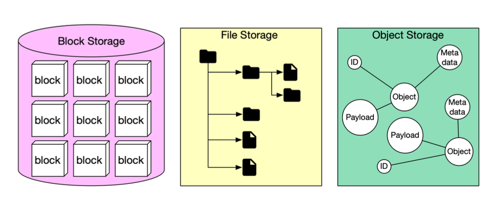
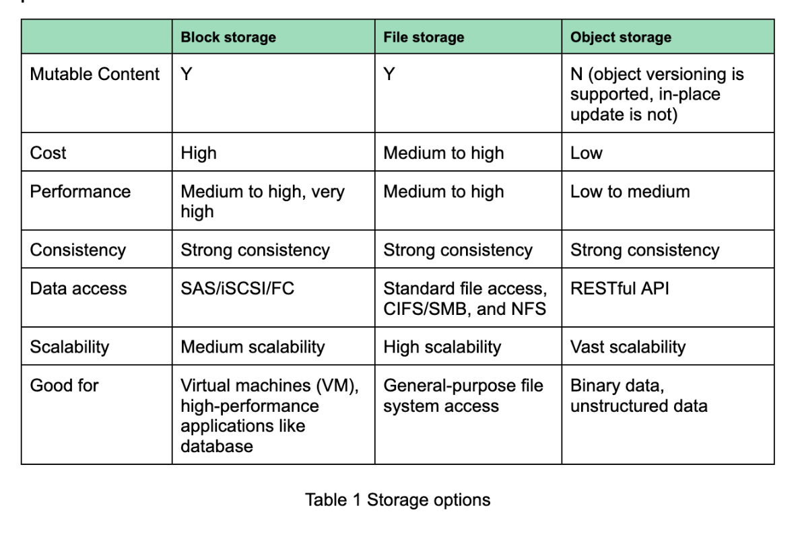
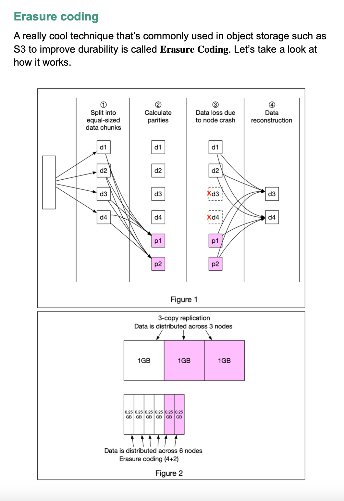
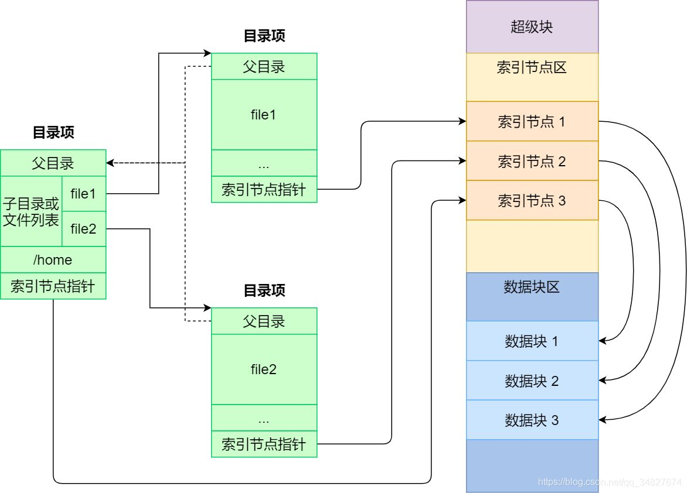

# 文件系统
## 文件系统分类
  
  

[纠删码](https://en.wikipedia.org/wiki/Erasure_code)：  
  

## 文件系统和数据库系统的区别，哪个效率更高，为什么
### 文件系统和数据库系统之间的区别
1. 文件系统用文件将数据长期保存在外存上，数据库系统用数据库统一存储数据。
2. 文件系统中的程序和数据有一定的联系，数据库系统中的程序和数据分离。
3. 文件系统用操作系统中的存取方法对数据进行管理，数据库系统用 DBMS 统一管理和控制数据。
4. 文件系统实现以文件为单位的数据共享，数据库系统实现以记录和字段为单位的数据共享。
  
早期的数据库管理都是采用文件系统。在文件系统中，数据按其内容、结构和用途组成若干命名的文件。文件一般为某个用户或用户组所有，但可供其他用户共享。用户可以通过操作系统对文件进行打开、读、写和关闭等操作。  
文件系统有明显的缺点：  
* 编写应用程序很不方便 - 应用程序的设计者必须对所用的文件的逻辑及物理结构有清楚的了解。操作系统只能打开、关闭、读、写等几个低级的文件操作命令，对文件的查询修改等处理都须在应用程序内解决。应用程序还不可避免地在功能上有所重复。在文件系统上编写应用程序的效率不高。
* 文件的设计很难满足多种应用程序的不同要求，数据冗余经常是不可避免的 - 为了兼顾各种应用程序的要求，在设计文件系统时，往往不得不增加冗余的数据。数据冗余不仅浪费空间，而且会带来数据的不一致性（inconsistency)。在文件系统中没有维护数据一致性的监控机制，数据的一致性完全有用户负责维护。在简单的系统中勉强能应付，但在大型复杂的系统中几乎是不可能完成的。
* 文件结构的修改将导致应用程序的修改，应用程序的维护量将很大。
* 文件系统不支持对文件的并发访问（concurrent access）。
* 数据缺少统一管理，在数据的结构、编码、表示格式、命名以及输出格式等方面不容易做到规范化、标准化；数据安全和保密方面，也难以采取有效的办法。

针对文件系统的缺点，人们发展了以统一管理和共享数据为主要特征的数据库系统。在数据库系统中，数据不再仅仅服务于某个程序或用户，而是看成一个单位的共享资源，由一个叫数据库管理系统（Data Management System，简称 DBMS）的软件统一管理。由于有 DBMS 的统一管理，应用程序不必直接介入诸如打开、关闭、读写文件等低级的操作，而由 DBMS 代办。用户也不必关系数据存储和其他实现的细节，可在更高的抽象级别上观察和访问数据。文件结构的一些修改也可以由 DBMS 屏蔽，使用户看不到这些修改，从而减少应用程序的维护工作量，提高数据的独立性。由于数据的统一管理，人们可以从全单位着眼，合理组织数据，减少数据冗余；还可以更好地贯彻规范化和标准化，从而有利于数据的转移和更大范围的共享。由于 DBMS 不是为某个应用程序服务，而是为整个单位服务的，DBMS 做得复杂一些也是可以接受的。许多在文件系统中难以实现的动能，在 DBMS 中都一一实现了。  
例如：适合不同类型用户的多种用户界面，保证并发访问时的数据一致性的并发控制（concurrent control），增进数据安全性（security）的访问控制（access control），在故障的情况下保证数据一致性的恢复（recovery）功能，保证数据在语义上的一致性的完整性约束（integrity constraints）检查功能等。随着计算机应用的发展，DBMS 的功能愈来愈强，规模愈来愈大，复杂性和开销也随之增加。目前，在一些功能非常明确且无数据共享的简单应用系统中，为减少开销，提高性能，有时仍采用文件系统；不过在数据密集型应用系统中，基本上都使用数据库系统。  

现代的数据库管理系统应该具备的 7 个功能：  
* 提供高级的用户接口
* 查询处理和优化 - 这里的查询（query）泛指用户对数据库所提的访问要求，不但包含数据检索，也包括修改、定义新数据等
* 数据目录管理
* 并发控制
* 恢复功能
* 完整性约束检查
* 访问控制

数据管理和数据处理一样，都是计算机系统的最基本的支撑技术。尽管计算机科学技术经历了飞速的发展，但数据管理的这一地位没有变化。数据管理将作为计算机科学技术的一个重要分支一直发展下去，社会信息化，对数据管理的要求也愈高。  
  
### 文件系统和数据库系统之间的联系
1. 均为数据组织的管理技术。
2. 均由数据管理软件管理数据，程序与数据之间用存取方法进行转换。
3. 数据库系统是在文件系统的基础上发展而来的，数据库系统的组织和存储是通过操作系统中的文件系统来实现的。
  
## 文件系统的基本组成
文件系统是操作系统中负责管理持久数据的子系统，说简单点，就是负责把用户的文件存到磁盘硬件中，因为即使计算机断电了，磁盘里的数据并不会丢失，所以可以持久化的保存文件。  
文件系统的基本数据单位是文件，它的目的是对磁盘上的文件进行组织管理，那组织的方式不同，就会形成不同的文件系统。  
Linux 最经典的一句话是：「一切皆文件」，不仅普通的文件和目录，就连块设备、管道、socket 等，也都是统一交给文件系统管理的。  
Linux 文件系统会为每个文件分配两个数据结构：索引节点（index node）和目录项（directory entry），它们主要用来记录文件的元信息和目录层次结构。  
* 索引节点，也就是 inode，用来记录文件的元信息，比如 inode 编号、文件大小、访问权限、创建时间、修改时间、数据在磁盘的位置等等。索引节点是文件的唯一标识，它们之间一一对应，也同样都会被存储在硬盘中，所以索引节点同样占用磁盘空间。
* 目录项，也就是 dentry，用来记录文件的名字、索引节点指针以及与其他目录项的层级关联关系。多个目录项关联起来，就会形成目录结构，但它与索引节点不同的是，目录项是由内核维护的一个数据结构，不存放于磁盘，而是缓存在内存。

由于索引节点唯一标识一个文件，而目录项记录着文件的名，所以目录项和索引节点的关系是多对一，也就是说，一个文件可以有多个别字。比如，硬链接的实现就是多个目录项中的索引节点指向同一个文件。  
注意，目录也是文件，也是用索引节点唯一标识，和普通文件不同的是，普通文件在磁盘里面保存的是文件数据，而目录文件在磁盘里面保存子目录或文件。  
目录项和目录是一个东西吗？  
虽然名字很相近，但是它们不是一个东西，目录是个文件，持久化存储在磁盘，而目录项是内核一个数据结构，缓存在内存。  
如果查询目录频繁从磁盘读，效率会很低，所以内核会把已经读过的目录用目录项这个数据结构缓存在内存，下次再次读到相同的目录时，只需从内存读就可以，大大提高了文件系统的效率。  
注意，目录项这个数据结构不只是表示目录，也是可以表示文件的。  

那文件数据是如何存储在磁盘的呢？  
磁盘读写的最小单位是扇区，扇区的大小只有 512B 大小，很明显，如果每次读写都以这么小为单位，那这读写的效率会非常低。  
所以，文件系统把多个扇区组成了一个逻辑块，每次读写的最小单位就是逻辑块（数据块），Linux 中的逻辑块大小为 4KB，也就是一次性读写 8 个扇区，这将大大提高了磁盘的读写的效率。  
以上就是索引节点、目录项以及文件数据的关系。如下图所示：  
  
索引节点是存储在硬盘上的数据，那么为了加速文件的访问，通常会把索引节点加载到内存中。  
另外，磁盘进行格式化的时候，会被分成三个存储区域，分别是超级块、索引节点区和数据块区。 
* 超级块，用来存储文件系统的详细信息，比如块个数、块大小、空闲块等等。 
* 索引节点区，用来存储索引节点； 
* 数据块区，用来存储文件或目录数据；

不可能把超级块和索引节点区全部加载到内存，这样内存肯定撑不住，所以只有当需要使用的时候，才将其加载进内存，它们加载进内存的时机是不同的：  
* 超级块：当文件系统挂载时进入内存；
* 索引节点区：当文件被访问时进入内存；

  
原文链接：
https://blog.csdn.net/weixin_40760678/article/details/100057460  
https://blog.51cto.com/wangziyin/1304212  
https://zhuanlan.zhihu.com/p/183238194  
https://zhuanlan.zhihu.com/p/351675403  
