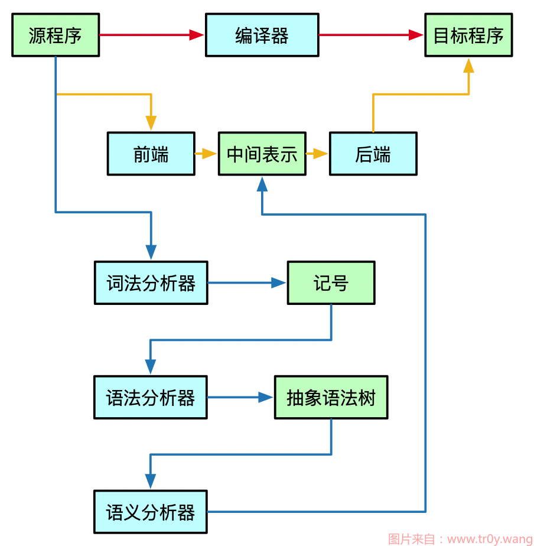

## 编译器
编译器（compiler）是一种计算机程序，它会将某种编程语言写成的源代码（原始语言）转换成另一种编程语言（目标语言）。  
它主要的目的是将便于人编写、阅读、维护的高级计算机语言所写作的源代码程序，翻译为计算机能解读、运行的低阶机器语言的程序，也就是可执行文件。编译器将原始程序（source program）作为输入，翻译产生使用目标语言（target language）的等价程序。源代码一般为高级语言（High-level language），如 C、C++、Java 等，而目标语言则是汇编语言或目标机器的目标代码（Object code），有时也称作机器代码（Machine code）。  
  
一个现代编译器的主要工作流程如下：  
源代码（source code）→ 预处理器（preprocessor）→ 编译器（compiler）→ 汇编程序（assembler）→ 目标代码（object code）→ 链接器（linker）→ 可执行文件（executables），最后打包好的文件就可以给电脑去判读运行了。  

https://www.tr0y.wang/2021/04/04/%E7%BC%96%E8%AF%91%E5%8E%9F%E7%90%86%EF%BC%88%E5%9B%9B%EF%BC%89%EF%BC%9A%E8%AF%AD%E4%B9%89%E5%88%86%E6%9E%90/  
  
