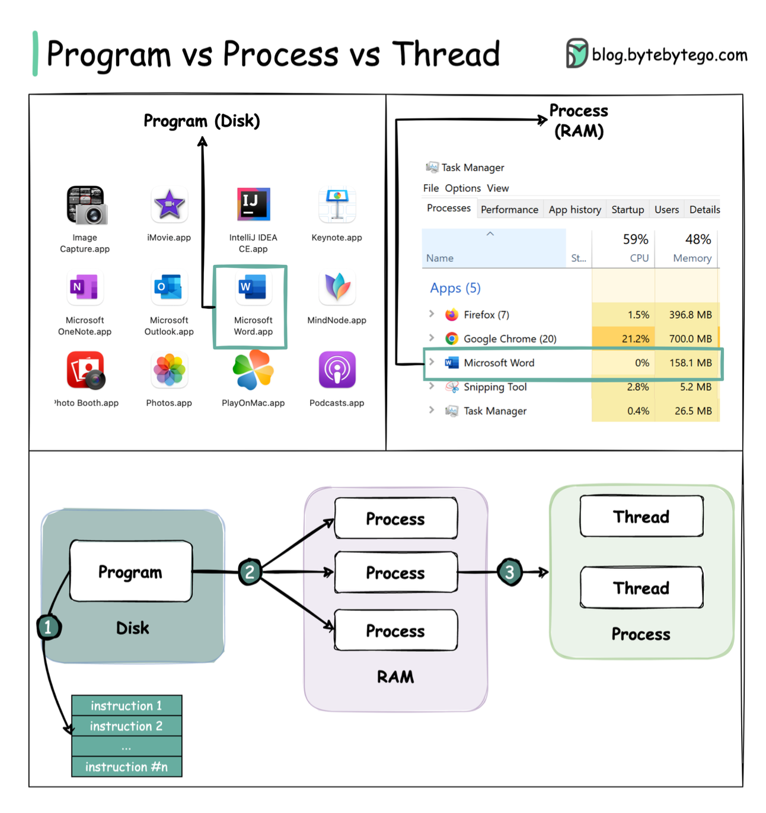
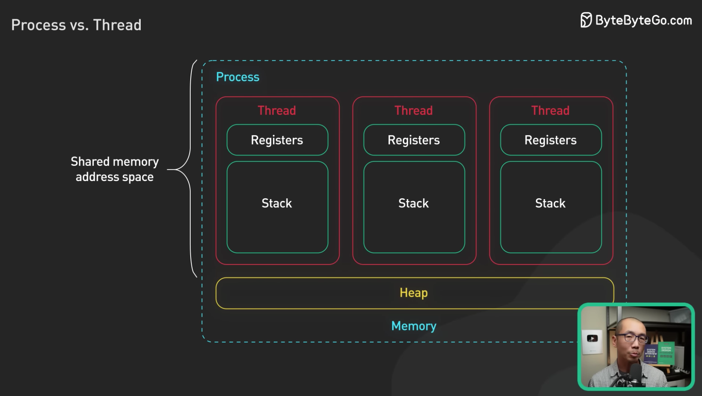
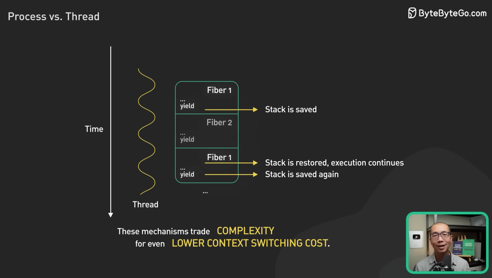
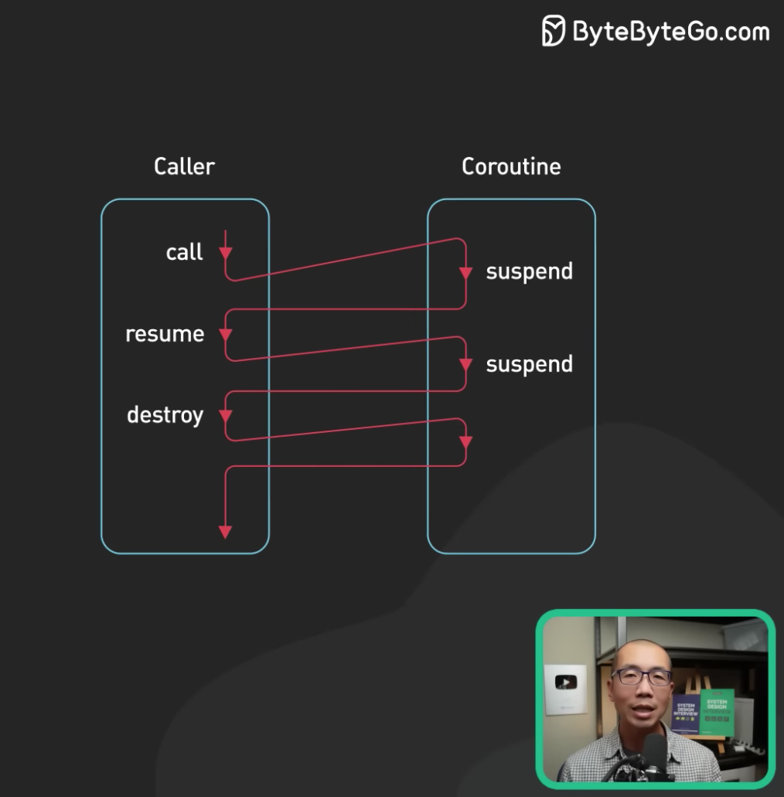

## 进程 vs 线程
https://www.youtube.com/watch?v=4rLW7zg21gI  

  

进程和线程是包含关系，但是多任务既可以由多进程实现，也可以由单进程内的多线程实现，还可以混合多进程＋多线程。  
具体采用哪种方式，要考虑到进程和线程的特点。  
和多线程相比，多进程的缺点在于：  
* 创建进程比创建线程开销大，尤其是在 Windows 系统上；
* 进程间通信比线程间通信要慢，因为线程间通信就是读写同一个变量（同一个进程的线程共享内存空间，而不同的进程各自有内存空间互不干扰），速度很快。
  
而多进程的优点在于：  
* 多进程稳定性比多线程高，因为在多进程的情况下，一个进程崩溃不会影响其他进程，而在多线程的情况下，任何一个线程崩溃会直接导致整个进程崩溃。  
  
## 多线程
作者：pansz  
来源链接：https://www.zhihu.com/question/19901763/answer/13299543  
  
> 这么解释问题吧：  
    1. 单进程单线程：一个人在一个桌子上吃菜。  
    2. 单进程多线程：多个人在同一个桌子上一起吃菜。  
    3. 多进程单线程：多个人每个人在自己的桌子上吃菜。  
> 多线程的问题是多个人同时吃一道菜的时候容易发生争抢，例如两个人同时夹一个菜，一个人刚伸出筷子，结果伸到的时候已经被夹走菜了。。。此时就必须等一个人夹一口之后，在还给另外一个人夹菜，也就是说资源共享就会发生冲突争抢。  
    1. 对于 Windows 系统来说，【开桌子】的开销很大，因此 Windows 鼓励大家在一个桌子上吃菜。因此 Windows 多线程学习重点是要大量面对资源争抢与同步方面的问题。  
    2. 对于 Linux 系统来说，【开桌子】的开销很小，因此 Linux 鼓励大家尽量每个人都开自己的桌子吃菜。这带来新的问题是：坐在两张不同的桌子上，说话不方便。因此，Linux 下的学习重点大家要学习进程间通讯的方法。  
  
--  
> 补充：有人对这个开桌子的开销很有兴趣。我把这个问题推广说开一下。  
开桌子的意思是指创建进程。开销这里主要指的是时间开销。  
可以做个实验：创建一个进程，在进程中往内存写若干数据，然后读出该数据，然后退出。此过程重复 1000 次，相当于创建/销毁进程 1000 次。在我机器上的测试结果是：  
UbuntuLinux：耗时 0.8 秒  
Windows7：耗时 79.8 秒  
两者开销大约相差一百倍。  
这意味着，在 Windows 中，进程创建的开销不容忽视。换句话说就是，Windows 编程中不建议你创建进程，如果你的程序架构需要大量创建进程，那么最好是切换到 Linux 系统。  
大量创建进程的典型例子有两个，一个是 gnu autotools 工具链，用于编译很多开源代码的，他们在 Windows 下编译速度会很慢，因此软件开发人员最好是避免使用 Windows。  
另一个是服务器，某些服务器框架依靠大量创建进程来干活，甚至是对每个用户请求就创建一个进程，这些服务器在 Windows 下运行的效率就会很差。这"可能"也是放眼全世界范围，Linux 服务器远远多于 Windows 服务器的原因。  
  
--  
> 再次补充：如果你是写服务器端应用的，其实在现在的网络服务模型下，开桌子的开销是可以忽略不计的，因为现在一般流行的是按照 CPU 核心数量开进程或者线程，开完之后在数量上一直保持，进程与线程内部使用协程或者异步通信来处理多个并发连接，因而开进程与开线程的开销可以忽略了。  
另外一种新的开销被提上日程：核心切换开销。  
现代的体系，一般 CPU 会有多个核心，而多个核心可以同时运行多个不同的线程或者进程。  
当每个 CPU 核心运行一个进程的时候，由于每个进程的资源都独立，所以 CPU 核心之间切换的时候无需考虑上下文。  
当每个 CPU 核心运行一个线程的时候，由于每个线程需要共享资源，所以这些资源必须从 CPU 的一个核心被复制到另外一个核心，才能继续运算，这占用了额外的开销。换句话说，在 CPU 为多核的情况下，多线程在性能上不如多进程。  
因而，当前面向多核的服务器端编程中，需要习惯多进程而非多线程。  

## 协程/虚拟线程
Coroutine - 协程不是系统级线程，很多时候协程被称为“轻量级线程”、“微线程”、“纤程(fiber)”等。简单来说可以认为协程是线程里不同的函数，这些函数之间可以相互快速切换。协程和用户态线程非常接近，用户态线程之间的切换不需要陷入内核，但部分操作系统中用户态线程的切换需要内核态线程的辅助。协程是编程语言（或者 lib）提供的特性（协程之间的切换方式与过程可以由编程人员确定），是用户态操作。协程适用于 IO 密集型的任务。常见提供原生协程支持的语言有：c++20、golang、python 等，其他语言以库的形式提供协程功能。  

操作系统在线程等待 IO 的时候，会阻塞当前线程，切换到其它线程，这样在当前线程等待 IO 的过程中，其它线程可以继续执行。当系统线程较少的时候没有什么问题，但是当线程数量非常多的时候，却产生了问题。一是系统线程会占用非常多的内存空间，二是过多的线程切换会占用大量的系统时间。  
协程刚好可以解决上述 2 个问题。协程运行在线程之上，当一个协程执行完成后，可以选择主动让出，让另一个协程运行在当前线程之上。协程并没有增加线程数量，只是在线程的基础之上通过分时复用的方式运行多个协程，而且协程的切换在用户态完成，切换的代价比线程从用户态到内核态的代价小很多。  
在有大量 IO 操作业务的情况下，采用协程替换线程，可以到达很好的效果，一是降低了系统内存，二是减少了系统切换开销，因此系统的性能也会提升。  
在协程中尽量不要调用阻塞 IO 的方法，比如打印，读取文件，Socket 接口等，除非改为异步调用的方式，并且协程只有在 IO 密集型的任务中才会发挥作用。  
协程对计算密集型的任务也没有太大的好处，计算密集型的任务本身不需要大量的线程切换，因此协程的作用也十分有限，反而还增加了协程切换的开销。协程只有和异步 IO 结合起来才能发挥出最大的威力。  

  
  

### Goroutine
Goroutine 和线程的区别？  
* 一个线程可以有多个协程
* 线程、进程都是同步机制，而协程是异步
* 协程可以保留上一次调用时的状态，当过程重入时，相当于进入了上一次的调用状态
* 协程是需要线程来承载运行的，所以协程并不能取代线程，「线程是被分割的CPU资源，协程是组织好的代码流程」

### 虚拟线程
Java 19 提供与协程类似的虚拟线程，可参考[具体教程](./并发与并行(Java)/README.md#虚拟线程)。  

参考：  
https://yearn.xyz/posts/techs/%E5%8D%8F%E7%A8%8B/  
https://zhuanlan.zhihu.com/p/172471249  
https://juejin.cn/post/7029704699435548679  
