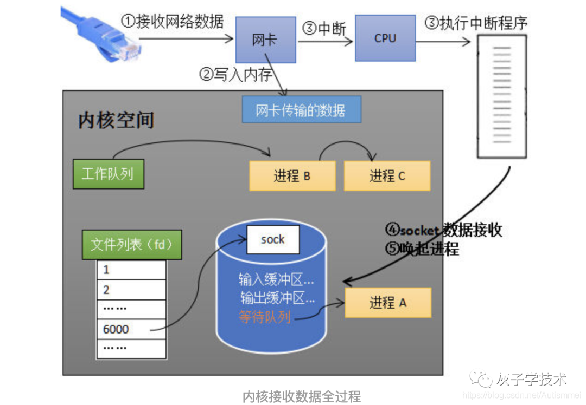
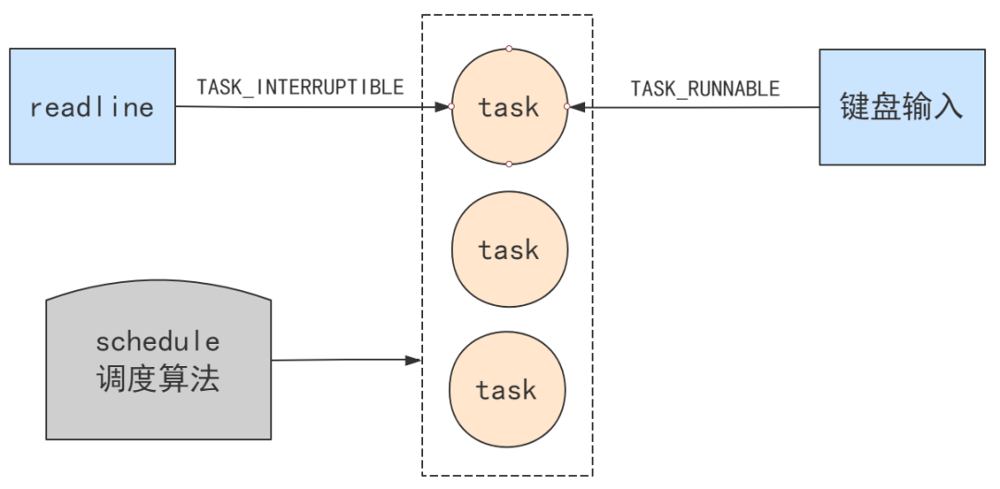

参考：  
https://zhuanlan.zhihu.com/p/479368043  
https://blog.csdn.net/zhghost/article/details/109019955  
https://blog.csdn.net/qq_16320025/article/details/105407527  

  

## 阻塞
阻塞的本质  
阻塞的本质，是将进程挂起，不再参与进程调度。

而挂起的本质，其实就是将进程的 state 赋值为非 RUNNABLE，这样调度机制的代码中，就不会把它作为下一个获得 CPU 运行机会的可选项了。

进程调度机制在选择下一个要调度的进程时，会跳过不是 RUNNABLE 状态的进程。

如果将当前任务设置为 TASK_INTERRUPTIBLE，就是告诉进程调度算法，下次不要调度该任务，相当于放弃了 CPU 的执行权，相当于将当前进程挂起。

而底层的这一个操作，直接导致上层看来，像是停在了那一行不走一样，就是这一行。

### 唤醒
有阻塞就有唤醒，当按下键盘时，会触发键盘中断，会进入键盘中断处理函数，keyboard_interrupt。

这个函数是提前注册在中断向量表里的。将进程的状态改为 RUNNABLE，一会进程调度时，就可以参与了。这就是阻塞后，唤醒的本质。

### 总结
所以，比如 Java 代码中的一行 readline 会导致阻塞，实际上就是运行到了这段代码。
```
interruptible_sleep_on (&tty->secondary->proc_list);
```

而键盘输入后会将其唤醒，实际上就是运行到了这段代码。
```
wake_up(&tty->secondary.proc_list);
```

这两段代码里，其实就是通过改写 state 值去玩的，剩下的交给调度算法。
```
// 阻塞
current->state = TASK_INTERRUPTIBLE;
// 唤醒
(**p).state = TASK_RUNNABLE;
```




## 中断
什么是中断  
整个操作系统就是一个中断驱动的死循环，操作系统原理如果用一行代码解释，下面这样再合适不过了。
```java
while(true) {
    doNothing();
}
```

其他所有事情都是由操作系统提前注册的中断机制和其对应的中断处理函数完成，点击一下鼠标，敲击一下键盘，执行一个程序，都是用中断的方式来通知操作系统帮我们处理这些事件，当没有任何需要操作系统处理的事件时，它就乖乖停在死循环里不出来。

理解的一个中断就相当于一个条件，就会触发操作系统的一个执行程序。

中断的分类
CPU 提供了两种中断程序执行的机制，中断和异常
* 先说第一个机制中断（interrupt），中断是一个异步事件，通常由 IO 设备触发。比如点击一下鼠标、敲击一下键盘等。
* 再说第二个机制异常（exception），异常是一个同步事件，是 CPU 在执行指令时检测到的反常条件。比如除法异常、错误指令异常，缺页异常等。

这两个机制，殊途同归，都是让 CPU 收到一个中断号。

CPU 在找到一个中断描述符后，如何跳过去执行？

中断程序的执行过程  
简单说，实际上做的事情就是压栈，并跳转到入口地址处执行代码。而压栈的目的，就是保护现场（原来的程序地址、原来的程序堆栈、原来的标志位）和传递信息（错误码）。

中断是如何切到中断处理程序的？就是靠中断描述符表中记录的地址。那中断又如何回到原来的代码继续执行呢？是通过 CPU 帮我们把中断发生前的地址压入了栈中，然后我们程序自己利用他们去返回，当然也可以不返回。
