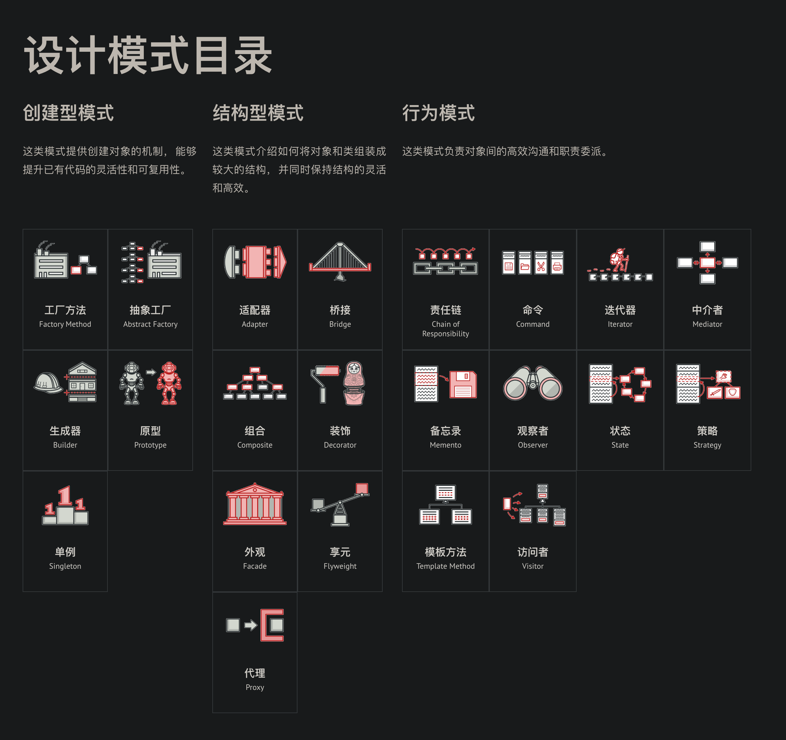

这里只列举比较重要的常用的设计模式。  

推荐阅读材料：  
* https://refactoringguru.cn/design-patterns/catalog
* [设计模式二三事](https://tech.meituan.com/2022/03/10/interesting-talk-about-design-patterns.html)

  

# 常用模式

## 创建型模式
创建型模式关注点是如何创建对象，其核心思想是要把对象的创建和使用相分离，这样使得两者能相对独立地变换。  
* [工厂方法 | Factory](./Factory.java)
* [建造者 | Builder](./Builder.java)
* [单例 | Singleton](./Singleton.java)
* [原型 | Prototype](./Prototype.java)  
  
## 结构型模式
结构型模式主要涉及如何组合各种对象以便获得更好、更灵活的结构。虽然面向对象的继承机制提供了最基本的子类扩展父类的功能，但结构型模式不仅仅简单地使用继承，而更多地通过组合与运行期的动态组合来实现更灵活的功能。  
* [适配器 | Adapter](./Adapter.java)
* [桥接 | Bridge](./Bridge.java)
* [组合 | Composite](./Composite.java)
* [代理 | Proxy](./Proxy.java)
* [信号量模式 | Semaphore](./Semaphore.java)
* [装饰器 | Decorator](./Decorator.java)  
  
## 行为型模式
行为型模式主要涉及算法和对象间的职责分配。通过使用对象组合，行为型模式可以描述一组对象应该如何协作来完成一个整体任务。  
* [迭代器 | Iterator](./Iterator.java)
* [观察者 | Observer(Listener)](./Observer.java)
* [状态 | State](./State.java)
* [策略 | Strategy](./Strategy.java)
* [模板 | Template](./Template.java)
* [访问者 | Visitor](./Visitor.java)
* [责任链 | Chain of Responsibility](./CoR.java)  
  
以上引用自[来源](https://www.liaoxuefeng.com/wiki/1252599548343744/1264742167474528)  
  
## 更多
### 单例模式与工厂模式的区别
参考：https://stackoverflow.com/a/2094231/6481829  
> **A singleton pattern ensures that you always get back the same instance of whatever type you are retrieving, whereas the factory pattern generally gives you a different instance of each type.**  
> The purpose of the singleton is where you want all calls to go through the same instance. An example of this might be a class that manages a disk cache, or gets data from a static dictionary; wherever it is important only one known instance interacts with the resource. This does make it less scalable.  
> The purpose of the factory is to create and return new instances. Often, these won't actually be the same type at all, but they will be implementations of the same base class. However, there may be many instances of each type.  
